Online Advertising Analysis
===========================

Problem Definition
------------------

-   Identify which individuals are most likely to click on the ads.

Context
-------

A Kenyan entrepreneur has created an online cryptography course and
would want to advertise it on her blog. She currently targets audiences
originating from various countries. In the past, she ran ads to
advertise a related course on the same blog and collected data in the
process. She would now like to employ your services as a Data Science
Consultant to help her identify which individuals are most likely to
click on her ads.

Metric of Success
-----------------

The research will have achieved its objective when:

-   individuals who have a high likelihood of clicking the ads are
    correctly identified.

Details of the data
-------------------

The data set has 1000 rows and 10 columns. The attributes in the data
are as follows:

-   Daily Time Spent on Site
-   Age
-   Area Income
-   Daily Internet Usage
-   Ad Topic Line
-   City
-   Male
-   Country
-   Time stamp
-   Clicked on Ad

The target variable being Clicked on Ad.

Data appropriateness
--------------------

The information gathered on the individuals was sufficient enough in
making basic conclusion on the which individual is more likely to click
an ad.

Experimental Design
-------------------

-   Sourcing and checking the data.

-   Data Cleaning; checking for anomalies in the data(find and deal with
    them):

    -   Missing values.
    -   Outliers.
    -   Duplicates. Exploratory data analysis
    -   Univariate Graphical Exploratory Data Analysis
    -   Bivariate Graphical Exploratory Data Analysis
    -   Multivariate Graphical Exploratory Data Analysis *Implement the
        solution *Challenge the solution

-   Conclusion

-   Follow up questions.

Sourcing & checking the data
----------------------------

``` r
library(tidyverse)# exploring and visualizing your data
```

    ## -- Attaching packages --------------------------------------- tidyverse 1.3.0 --

    ## v ggplot2 3.3.2     v purrr   0.3.4
    ## v tibble  3.0.4     v dplyr   1.0.2
    ## v tidyr   1.1.2     v stringr 1.4.0
    ## v readr   1.4.0     v forcats 0.5.0

    ## -- Conflicts ------------------------------------------ tidyverse_conflicts() --
    ## x dplyr::filter() masks stats::filter()
    ## x dplyr::lag()    masks stats::lag()

``` r
library(lubridate)
```

    ## 
    ## Attaching package: 'lubridate'

    ## The following objects are masked from 'package:base':
    ## 
    ##     date, intersect, setdiff, union

``` r
adverts <- read.csv("advertising.csv", stringsAsFactors =FALSE)
adverts
```

    ##      Daily.Time.Spent.on.Site Age Area.Income Daily.Internet.Usage
    ## 1                       68.95  35    61833.90               256.09
    ## 2                       80.23  31    68441.85               193.77
    ## 3                       69.47  26    59785.94               236.50
    ## 4                       74.15  29    54806.18               245.89
    ## 5                       68.37  35    73889.99               225.58
    ## 6                       59.99  23    59761.56               226.74
    ## 7                       88.91  33    53852.85               208.36
    ## 8                       66.00  48    24593.33               131.76
    ## 9                       74.53  30    68862.00               221.51
    ## 10                      69.88  20    55642.32               183.82
    ## 11                      47.64  49    45632.51               122.02
    ## 12                      83.07  37    62491.01               230.87
    ## 13                      69.57  48    51636.92               113.12
    ## 14                      79.52  24    51739.63               214.23
    ## 15                      42.95  33    30976.00               143.56
    ## 16                      63.45  23    52182.23               140.64
    ## 17                      55.39  37    23936.86               129.41
    ## 18                      82.03  41    71511.08               187.53
    ## 19                      54.70  36    31087.54               118.39
    ## 20                      74.58  40    23821.72               135.51
    ## 21                      77.22  30    64802.33               224.44
    ## 22                      84.59  35    60015.57               226.54
    ## 23                      41.49  52    32635.70               164.83
    ## 24                      87.29  36    61628.72               209.93
    ## 25                      41.39  41    68962.32               167.22
    ## 26                      78.74  28    64828.00               204.79
    ## 27                      48.53  28    38067.08               134.14
    ## 28                      51.95  52    58295.82               129.23
    ## 29                      70.20  34    32708.94               119.20
    ## 30                      76.02  22    46179.97               209.82
    ## 31                      67.64  35    51473.28               267.01
    ## 32                      86.41  28    45593.93               207.48
    ## 33                      59.05  57    25583.29               169.23
    ## 34                      55.60  23    30227.98               212.58
    ## 35                      57.64  57    45580.92               133.81
    ## 36                      84.37  30    61389.50               201.58
    ## 37                      62.26  53    56770.79               125.45
    ## 38                      65.82  39    76435.30               221.94
    ## 39                      50.43  46    57425.87               119.32
    ## 40                      38.93  39    27508.41               162.08
    ## 41                      84.98  29    57691.95               202.61
    ## 42                      64.24  30    59784.18               252.36
    ## 43                      82.52  32    66572.39               198.11
    ## 44                      81.38  31    64929.61               212.30
    ## 45                      80.47  25    57519.64               204.86
    ## 46                      37.68  52    53575.48               172.83
    ## 47                      69.62  20    50983.75               202.25
    ## 48                      85.40  43    67058.72               198.72
    ## 49                      44.33  37    52723.34               123.72
    ## 50                      48.01  46    54286.10               119.93
    ## 51                      73.18  23    61526.25               196.71
    ## 52                      79.94  28    58526.04               225.29
    ## 53                      33.33  45    53350.11               193.58
    ## 54                      50.33  50    62657.53               133.20
    ## 55                      62.31  47    62722.57               119.30
    ## 56                      80.60  31    67479.62               177.55
    ## 57                      65.19  36    75254.88               150.61
    ## 58                      44.98  49    52336.64               129.31
    ## 59                      77.63  29    56113.37               239.22
    ## 60                      41.82  41    24852.90               156.36
    ## 61                      85.61  27    47708.42               183.43
    ## 62                      85.84  34    64654.66               192.93
    ## 63                      72.08  29    71228.44               169.50
    ## 64                      86.06  32    61601.05               178.92
    ## 65                      45.96  45    66281.46               141.22
    ## 66                      62.42  29    73910.90               198.50
    ## 67                      63.89  40    51317.33               105.22
    ## 68                      35.33  32    51510.18               200.22
    ## 69                      75.74  25    61005.87               215.25
    ## 70                      78.53  34    32536.98               131.72
    ## 71                      46.13  31    60248.97               139.01
    ## 72                      69.01  46    74543.81               222.63
    ## 73                      55.35  39    75509.61               153.17
    ## 74                      33.21  43    42650.32               167.07
    ## 75                      38.46  42    58183.04               145.98
    ## 76                      64.10  22    60465.72               215.93
    ## 77                      49.81  35    57009.76               120.06
    ## 78                      82.73  33    54541.56               238.99
    ## 79                      56.14  38    32689.04               113.53
    ## 80                      55.13  45    55605.92               111.71
    ## 81                      78.11  27    63296.87               209.25
    ## 82                      73.46  28    65653.47               222.75
    ## 83                      56.64  38    61652.53               115.91
    ## 84                      68.94  54    30726.26               138.71
    ## 85                      70.79  31    74535.94               184.10
    ## 86                      57.76  41    47861.93               105.15
    ## 87                      77.51  36    73600.28               200.55
    ## 88                      52.70  34    58543.94               118.60
    ## 89                      57.70  34    42696.67               109.07
    ## 90                      56.89  37    37334.78               109.29
    ## 91                      69.90  43    71392.53               138.35
    ## 92                      55.79  24    59550.05               149.67
    ## 93                      70.03  26    64264.25               227.72
    ## 94                      50.08  40    64147.86               125.85
    ## 95                      43.67  31    25686.34               166.29
    ## 96                      72.84  26    52968.22               238.63
    ## 97                      45.72  36    22473.08               154.02
    ## 98                      39.94  41    64927.19               156.30
    ## 99                      35.61  46    51868.85               158.22
    ## 100                     79.71  34    69456.83               211.65
    ## 101                     41.49  53    31947.65               169.18
    ## 102                     63.60  23    51864.77               235.28
    ## 103                     89.91  40    59593.56               194.23
    ## 104                     68.18  21    48376.14               218.17
    ## 105                     66.49  20    56884.74               202.16
    ## 106                     80.49  40    67186.54               229.12
    ## 107                     72.23  25    46557.92               241.03
    ## 108                     42.39  42    66541.05               150.99
    ## 109                     47.53  30    33258.09               135.18
    ## 110                     74.02  32    72272.90               210.54
    ## 111                     66.63  60    60333.38               176.98
    ## 112                     63.24  53    65229.13               235.78
    ## 113                     71.00  22    56067.38               211.87
    ## 114                     46.13  46    37838.72               123.64
    ## 115                     69.00  32    72683.35               221.21
    ## 116                     76.99  31    56729.78               244.34
    ## 117                     72.60  55    66815.54               162.95
    ## 118                     61.88  42    60223.52               112.19
    ## 119                     84.45  50    29727.79               207.18
    ## 120                     88.97  45    49269.98               152.49
    ## 121                     86.19  31    57669.41               210.26
    ## 122                     49.58  26    56791.75               231.94
    ## 123                     77.65  27    63274.88               212.79
    ## 124                     37.75  36    35466.80               225.24
    ## 125                     62.33  43    68787.09               127.11
    ## 126                     79.57  31    61227.59               230.93
    ## 127                     80.31  44    56366.88               127.07
    ## 128                     89.05  45    57868.44               206.98
    ## 129                     70.41  27    66618.21               223.03
    ## 130                     67.36  37    73104.47               233.56
    ## 131                     46.98  50    21644.91               175.37
    ## 132                     41.67  36    53817.02               132.55
    ## 133                     51.24  36    76368.31               176.73
    ## 134                     75.70  29    67633.44               215.44
    ## 135                     43.49  47    50335.46               127.83
    ## 136                     49.89  39    17709.98               160.03
    ## 137                     38.37  36    41229.16               140.46
    ## 138                     38.52  38    42581.23               137.28
    ## 139                     71.89  23    61617.98               172.81
    ## 140                     75.80  38    70575.60               146.19
    ## 141                     83.86  31    64122.36               190.25
    ## 142                     37.51  30    52097.32               163.00
    ## 143                     55.60  44    65953.76               124.38
    ## 144                     83.67  44    60192.72               234.26
    ## 145                     69.08  41    77460.07               210.60
    ## 146                     37.47  44    45716.48               141.89
    ## 147                     56.04  49    65120.86               128.95
    ## 148                     70.92  41    49995.63               108.16
    ## 149                     49.78  46    71718.51               152.24
    ## 150                     68.61  57    61770.34               150.29
    ## 151                     58.18  25    69112.84               176.28
    ## 152                     78.54  35    72524.86               172.10
    ## 153                     37.00  48    36782.38               158.22
    ## 154                     65.40  33    66699.12               247.31
    ## 155                     79.52  27    64287.78               183.48
    ## 156                     87.98  38    56637.59               222.11
    ## 157                     44.64  36    55787.58               127.01
    ## 158                     41.73  28    61142.33               202.18
    ## 159                     80.46  27    61625.87               207.96
    ## 160                     75.55  36    73234.87               159.24
    ## 161                     76.32  35    74166.24               195.31
    ## 162                     82.68  33    62669.59               222.77
    ## 163                     72.01  31    57756.89               251.00
    ## 164                     75.83  24    58019.64               162.44
    ## 165                     41.28  50    50960.08               140.39
    ## 166                     34.66  32    48246.60               194.83
    ## 167                     66.18  55    28271.84               143.42
    ## 168                     86.06  31    53767.12               219.72
    ## 169                     59.59  42    43662.10               104.78
    ## 170                     86.69  34    62238.58               198.56
    ## 171                     43.77  52    49030.03               138.55
    ## 172                     71.84  47    76003.47               199.79
    ## 173                     80.23  31    68094.85               196.23
    ## 174                     74.41  26    64395.85               163.05
    ## 175                     63.36  48    70053.27               137.43
    ## 176                     71.74  35    72423.97               227.56
    ## 177                     60.72  44    42995.80               105.69
    ## 178                     72.04  22    60309.58               199.43
    ## 179                     44.57  31    38349.78               133.17
    ## 180                     85.86  34    63115.34               208.23
    ## 181                     39.85  38    31343.39               145.96
    ## 182                     84.53  27    40763.13               168.34
    ## 183                     62.95  60    36752.24               157.04
    ## 184                     67.58  41    65044.59               255.61
    ## 185                     85.56  29    53673.08               210.46
    ## 186                     46.88  54    43444.86               136.64
    ## 187                     46.31  57    44248.52               153.98
    ## 188                     77.95  31    62572.88               233.65
    ## 189                     84.73  30    39840.55               153.76
    ## 190                     39.86  36    32593.59               145.85
    ## 191                     50.08  30    41629.86               123.91
    ## 192                     60.23  35    43313.73               106.86
    ## 193                     60.70  49    42993.48               110.57
    ## 194                     43.67  53    46004.31               143.79
    ## 195                     77.20  33    49325.48               254.05
    ## 196                     71.86  32    51633.34               116.53
    ## 197                     44.78  45    63363.04               137.24
    ## 198                     78.57  36    64045.93               239.32
    ## 199                     73.41  31    73049.30               201.26
    ## 200                     77.05  27    66624.60               191.14
    ## 201                     66.40  40    77567.85               214.42
    ## 202                     69.35  29    53431.35               252.77
    ## 203                     35.65  40    31265.75               172.58
    ## 204                     70.04  31    74780.74               183.85
    ## 205                     69.78  29    70410.11               218.79
    ## 206                     58.22  29    37345.24               120.90
    ## 207                     76.90  28    66107.84               212.67
    ## 208                     84.08  30    62336.39               187.36
    ## 209                     59.51  58    39132.64               140.83
    ## 210                     40.15  38    38745.29               134.88
    ## 211                     76.81  28    65172.22               217.85
    ## 212                     41.89  38    68519.96               163.38
    ## 213                     76.87  27    54774.77               235.35
    ## 214                     67.28  43    76246.96               155.80
    ## 215                     81.98  40    65461.92               229.22
    ## 216                     66.01  23    34127.21               151.95
    ## 217                     61.57  53    35253.98               125.94
    ## 218                     53.30  34    44893.71               111.94
    ## 219                     34.87  40    59621.02               200.23
    ## 220                     43.60  38    20856.54               170.49
    ## 221                     77.88  37    55353.41               254.57
    ## 222                     75.83  27    67516.07               200.59
    ## 223                     49.95  39    68737.75               136.59
    ## 224                     60.94  41    76893.84               154.97
    ## 225                     89.15  42    59886.58               171.07
    ## 226                     78.70  30    53441.69               133.99
    ## 227                     57.35  29    41356.31               119.84
    ## 228                     34.86  38    49942.66               154.75
    ## 229                     70.68  31    74430.08               199.08
    ## 230                     76.06  23    58633.63               201.04
    ## 231                     66.67  33    72707.87               228.03
    ## 232                     46.77  32    31092.93               136.40
    ## 233                     62.42  38    74445.18               143.94
    ## 234                     78.32  28    49309.14               239.52
    ## 235                     37.32  50    56735.14               199.25
    ## 236                     40.42  45    40183.75               133.90
    ## 237                     76.77  36    58348.41               123.51
    ## 238                     65.65  30    72209.99               158.05
    ## 239                     74.32  33    62060.11               128.17
    ## 240                     73.27  32    67113.46               234.75
    ## 241                     80.03  44    24030.06               150.84
    ## 242                     53.68  47    56180.93               115.26
    ## 243                     85.84  32    62204.93               192.85
    ## 244                     85.03  30    60372.64               204.52
    ## 245                     70.44  24    65280.16               178.75
    ## 246                     81.22  53    34309.24               223.09
    ## 247                     39.96  45    59610.81               146.13
    ## 248                     57.05  41    50278.89               269.96
    ## 249                     42.44  56    43450.11               168.27
    ## 250                     62.20  25    25408.21               161.16
    ## 251                     76.70  36    71136.49               222.25
    ## 252                     61.22  45    63883.81               119.03
    ## 253                     84.54  33    64902.47               204.02
    ## 254                     46.08  30    66784.81               164.63
    ## 255                     56.70  48    62784.85               123.13
    ## 256                     81.03  28    63727.50               201.15
    ## 257                     80.91  32    61608.23               231.42
    ## 258                     40.06  38    56782.18               138.68
    ## 259                     83.47  39    64447.77               226.11
    ## 260                     73.84  31    42042.95               121.05
    ## 261                     74.65  28    67669.06               212.56
    ## 262                     60.25  35    54875.95               109.77
    ## 263                     59.21  35    73347.67               144.62
    ## 264                     43.02  44    50199.77               125.22
    ## 265                     84.04  38    50723.67               244.55
    ## 266                     70.66  43    63450.96               120.95
    ## 267                     70.58  26    56694.12               136.94
    ## 268                     72.44  34    70547.16               230.14
    ## 269                     40.17  26    47391.95               171.31
    ## 270                     79.15  26    62312.23               203.23
    ## 271                     44.49  53    63100.13               168.00
    ## 272                     73.04  37    73687.50               221.79
    ## 273                     76.28  33    52686.47               254.34
    ## 274                     68.88  37    78119.50               179.58
    ## 275                     73.10  28    57014.84               242.37
    ## 276                     47.66  29    27086.40               156.54
    ## 277                     87.30  35    58337.18               216.87
    ## 278                     89.34  32    50216.01               177.78
    ## 279                     81.37  26    53049.44               156.48
    ## 280                     81.67  28    62927.96               196.76
    ## 281                     46.37  52    32847.53               144.27
    ## 282                     54.88  24    32006.82               148.61
    ## 283                     40.67  35    48913.07               133.18
    ## 284                     71.76  35    69285.69               237.39
    ## 285                     47.51  51    53700.57               130.41
    ## 286                     75.15  22    52011.00               212.87
    ## 287                     56.01  26    46339.25               127.26
    ## 288                     82.87  37    67938.77               213.36
    ## 289                     45.05  42    66348.95               141.36
    ## 290                     60.53  24    66873.90               167.22
    ## 291                     50.52  31    72270.88               171.62
    ## 292                     84.71  32    61610.05               210.23
    ## 293                     55.20  39    76560.59               159.46
    ## 294                     81.61  33    62667.51               228.76
    ## 295                     71.55  36    75687.46               163.99
    ## 296                     82.40  36    66744.65               218.97
    ## 297                     73.95  35    67714.82               238.58
    ## 298                     72.07  31    69710.51               226.45
    ## 299                     80.39  31    66269.49               214.74
    ## 300                     65.80  25    60843.32               231.49
    ## 301                     69.97  28    55041.60               250.00
    ## 302                     52.62  50    73863.25               176.52
    ## 303                     39.25  39    62378.05               152.36
    ## 304                     77.56  38    63336.85               130.83
    ## 305                     33.52  43    42191.61               165.56
    ## 306                     79.81  24    56194.56               178.85
    ## 307                     84.79  33    61771.90               214.53
    ## 308                     82.70  35    61383.79               231.07
    ## 309                     84.88  32    63924.82               186.48
    ## 310                     54.92  54    23975.35               161.16
    ## 311                     76.56  34    70179.11               221.53
    ## 312                     69.74  49    66524.80               243.37
    ## 313                     75.55  22    41851.38               169.40
    ## 314                     72.19  33    61275.18               250.35
    ## 315                     84.29  41    60638.38               232.54
    ## 316                     73.89  39    47160.53               110.68
    ## 317                     75.84  21    48537.18               186.98
    ## 318                     73.38  25    53058.91               236.19
    ## 319                     80.72  31    68614.98               186.37
    ## 320                     62.06  44    44174.25               105.00
    ## 321                     51.50  34    67050.16               135.31
    ## 322                     90.97  37    54520.14               180.77
    ## 323                     86.78  30    54952.42               170.13
    ## 324                     66.18  35    69476.42               243.61
    ## 325                     84.33  41    54989.93               240.95
    ## 326                     36.87  36    29398.61               195.91
    ## 327                     34.78  48    42861.42               208.21
    ## 328                     76.84  32    65883.39               231.59
    ## 329                     67.05  25    65421.39               220.92
    ## 330                     41.47  31    60953.93               219.79
    ## 331                     80.71  26    58476.57               200.58
    ## 332                     80.09  31    66636.84               214.08
    ## 333                     56.30  49    67430.96               135.24
    ## 334                     79.36  34    57260.41               245.78
    ## 335                     86.38  40    66359.32               188.27
    ## 336                     38.94  41    57587.00               142.67
    ## 337                     87.26  35    63060.55               184.03
    ## 338                     75.32  28    59998.50               233.60
    ## 339                     74.38  40    74024.61               220.05
    ## 340                     65.90  22    60550.66               211.39
    ## 341                     36.31  47    57983.30               168.92
    ## 342                     72.23  48    52736.33               115.35
    ## 343                     88.12  38    46653.75               230.91
    ## 344                     83.97  28    56986.73               205.50
    ## 345                     61.09  26    55336.18               131.68
    ## 346                     65.77  21    42162.90               218.61
    ## 347                     81.58  25    39699.13               199.39
    ## 348                     37.87  52    56394.82               188.56
    ## 349                     76.20  37    75044.35               178.51
    ## 350                     60.91  19    53309.61               184.94
    ## 351                     74.49  28    58996.12               237.34
    ## 352                     73.71  23    56605.12               211.38
    ## 353                     78.19  30    62475.99               228.81
    ## 354                     79.54  44    70492.60               217.68
    ## 355                     74.87  52    43698.53               126.97
    ## 356                     87.09  36    57737.51               221.98
    ## 357                     37.45  47    31281.01               167.86
    ## 358                     49.84  39    45800.48               111.59
    ## 359                     51.38  59    42362.49               158.56
    ## 360                     83.40  34    66691.23               207.87
    ## 361                     38.91  33    56369.74               150.80
    ## 362                     62.14  41    59397.89               110.93
    ## 363                     79.72  28    66025.11               193.80
    ## 364                     73.30  36    68211.35               135.72
    ## 365                     69.11  42    73608.99               231.48
    ## 366                     71.90  54    61228.96               140.15
    ## 367                     72.45  29    72325.91               195.36
    ## 368                     77.07  40    44559.43               261.02
    ## 369                     74.62  36    73207.15               217.79
    ## 370                     82.07  25    46722.07               205.38
    ## 371                     58.60  50    45400.50               113.70
    ## 372                     36.08  45    41417.27               151.47
    ## 373                     79.44  26    60845.55               206.79
    ## 374                     41.73  47    60812.77               144.71
    ## 375                     73.19  25    64267.88               203.74
    ## 376                     77.60  24    58151.87               197.33
    ## 377                     89.00  37    52079.18               222.26
    ## 378                     69.20  42    26023.99               123.80
    ## 379                     67.56  31    62318.38               125.45
    ## 380                     81.11  39    56216.57               248.19
    ## 381                     80.22  30    61806.31               224.58
    ## 382                     43.63  41    51662.24               123.25
    ## 383                     77.66  29    67080.94               168.15
    ## 384                     74.63  26    51975.41               235.99
    ## 385                     49.67  27    28019.09               153.69
    ## 386                     80.59  37    67744.56               224.23
    ## 387                     83.49  33    66574.00               190.75
    ## 388                     44.46  42    30487.48               132.66
    ## 389                     68.10  40    74903.41               227.73
    ## 390                     63.88  38    19991.72               136.85
    ## 391                     78.83  36    66050.63               234.64
    ## 392                     79.97  44    70449.04               216.00
    ## 393                     80.51  28    64008.55               200.28
    ## 394                     62.26  26    70203.74               202.77
    ## 395                     66.99  47    27262.51               124.44
    ## 396                     71.05  20    49544.41               204.22
    ## 397                     42.05  51    28357.27               174.55
    ## 398                     50.52  28    66929.03               219.69
    ## 399                     76.24  40    75524.78               198.32
    ## 400                     77.29  27    66265.34               201.24
    ## 401                     35.98  47    55993.68               165.52
    ## 402                     84.95  34    56379.30               230.36
    ## 403                     39.34  43    31215.88               148.93
    ## 404                     87.23  29    51015.11               202.12
    ## 405                     57.24  52    46473.14               117.35
    ## 406                     81.58  41    55479.62               248.16
    ## 407                     56.34  50    68713.70               139.02
    ## 408                     48.73  27    34191.23               142.04
    ## 409                     51.68  49    51067.54               258.62
    ## 410                     35.34  45    46693.76               152.86
    ## 411                     48.09  33    19345.36               180.42
    ## 412                     78.68  29    66225.72               208.05
    ## 413                     68.82  20    38609.20               205.64
    ## 414                     56.99  40    37713.23               108.15
    ## 415                     86.63  39    63764.28               209.64
    ## 416                     41.18  43    41866.55               129.25
    ## 417                     71.03  32    57846.68               120.85
    ## 418                     72.92  29    69428.73               217.10
    ## 419                     77.14  24    60283.98               184.88
    ## 420                     60.70  43    79332.33               192.60
    ## 421                     34.30  41    53167.68               160.74
    ## 422                     83.71  45    64564.07               220.48
    ## 423                     53.38  35    60803.37               120.06
    ## 424                     58.03  31    28387.42               129.33
    ## 425                     43.59  36    58849.77               132.31
    ## 426                     60.07  42    65963.37               120.75
    ## 427                     54.43  37    75180.20               154.74
    ## 428                     81.99  33    61270.14               230.90
    ## 429                     60.53  29    56759.48               123.28
    ## 430                     84.69  31    46160.63               231.85
    ## 431                     88.72  32    43870.51               211.87
    ## 432                     88.89  35    50439.49               218.80
    ## 433                     69.58  43    28028.74               255.07
    ## 434                     85.23  36    64238.71               212.92
    ## 435                     83.55  39    65816.38               221.18
    ## 436                     56.66  42    72684.44               139.42
    ## 437                     56.39  27    38817.40               248.12
    ## 438                     76.24  27    63976.44               214.42
    ## 439                     57.64  36    37212.54               110.25
    ## 440                     78.18  23    52691.79               167.67
    ## 441                     46.04  32    65499.93               147.92
    ## 442                     79.40  35    63966.72               236.87
    ## 443                     36.44  39    52400.88               147.64
    ## 444                     53.14  38    49111.47               109.00
    ## 445                     32.84  40    41232.89               171.72
    ## 446                     73.72  32    52140.04               256.40
    ## 447                     38.10  34    60641.09               214.38
    ## 448                     73.93  44    74180.05               218.22
    ## 449                     51.87  50    51869.87               119.65
    ## 450                     77.69  22    48852.58               169.88
    ## 451                     43.41  28    59144.02               160.73
    ## 452                     55.92  24    33951.63               145.08
    ## 453                     80.67  34    58909.36               239.76
    ## 454                     83.42  25    49850.52               183.42
    ## 455                     82.12  52    28679.93               201.15
    ## 456                     66.17  33    69869.66               238.45
    ## 457                     43.01  35    48347.64               127.37
    ## 458                     80.05  25    45959.86               219.94
    ## 459                     64.88  42    70005.51               129.80
    ## 460                     79.82  26    51512.66               223.28
    ## 461                     48.03  40    25598.75               134.60
    ## 462                     32.99  45    49282.87               177.46
    ## 463                     74.88  27    67240.25               175.17
    ## 464                     36.49  52    42136.33               196.61
    ## 465                     88.04  45    62589.84               191.17
    ## 466                     45.70  33    67384.31               151.12
    ## 467                     82.38  35    25603.93               159.60
    ## 468                     52.68  23    39616.00               149.20
    ## 469                     65.59  47    28265.81               121.81
    ## 470                     65.65  25    63879.72               224.92
    ## 471                     43.84  36    70592.81               167.42
    ## 472                     67.69  37    76408.19               216.57
    ## 473                     78.37  24    55015.08               207.27
    ## 474                     81.46  29    51636.12               231.54
    ## 475                     47.48  31    29359.20               141.34
    ## 476                     75.15  33    71296.67               219.49
    ## 477                     78.76  24    46422.76               219.98
    ## 478                     44.96  50    52802.00               132.71
    ## 479                     39.56  41    59243.46               143.13
    ## 480                     39.76  28    35350.55               196.83
    ## 481                     57.11  22    59677.64               207.17
    ## 482                     83.26  40    70225.60               187.76
    ## 483                     69.42  25    65791.17               213.38
    ## 484                     50.60  30    34191.13               129.88
    ## 485                     46.20  37    51315.38               119.30
    ## 486                     66.88  35    62790.96               119.47
    ## 487                     83.97  40    66291.67               158.42
    ## 488                     76.56  30    68030.18               213.75
    ## 489                     35.49  48    43974.49               159.77
    ## 490                     80.29  31    49457.48               244.87
    ## 491                     50.19  40    33987.27               117.30
    ## 492                     59.12  33    28210.03               124.54
    ## 493                     59.88  30    75535.14               193.63
    ## 494                     59.70  28    49158.50               120.25
    ## 495                     67.80  30    39809.69               117.75
    ## 496                     81.59  35    65826.53               223.16
    ## 497                     81.10  29    61172.07               216.49
    ## 498                     41.70  39    42898.21               126.95
    ## 499                     73.94  27    68333.01               173.49
    ## 500                     58.35  37    70232.95               132.63
    ## 501                     51.56  46    63102.19               124.85
    ## 502                     79.81  37    51847.26               253.17
    ## 503                     66.17  26    63580.22               228.70
    ## 504                     58.21  37    47575.44               105.94
    ## 505                     66.12  49    39031.89               113.80
    ## 506                     80.47  42    70505.06               215.18
    ## 507                     77.05  31    62161.26               236.64
    ## 508                     49.99  41    61068.26               121.07
    ## 509                     80.30  58    49090.51               173.43
    ## 510                     79.36  33    62330.75               234.72
    ## 511                     57.86  30    18819.34               166.86
    ## 512                     70.29  26    62053.37               231.37
    ## 513                     84.53  33    61922.06               215.18
    ## 514                     59.13  44    49525.37               106.04
    ## 515                     81.51  41    53412.32               250.03
    ## 516                     42.94  37    56681.65               130.40
    ## 517                     84.81  32    43299.63               233.93
    ## 518                     82.79  34    47997.75               132.08
    ## 519                     59.22  55    39131.53               126.39
    ## 520                     35.00  40    46033.73               151.25
    ## 521                     46.61  42    65856.74               136.18
    ## 522                     63.26  29    54787.37               120.46
    ## 523                     79.16  32    69562.46               202.90
    ## 524                     67.94  43    68447.17               128.16
    ## 525                     79.91  32    62772.42               230.18
    ## 526                     66.14  41    78092.95               165.27
    ## 527                     43.65  39    63649.04               138.87
    ## 528                     59.61  21    60637.62               198.45
    ## 529                     46.61  52    27241.11               156.99
    ## 530                     89.37  34    42760.22               162.03
    ## 531                     65.10  49    59457.52               118.10
    ## 532                     53.44  42    42907.89               108.17
    ## 533                     79.53  51    46132.18               244.91
    ## 534                     91.43  39    46964.11               209.91
    ## 535                     73.57  30    70377.23               212.38
    ## 536                     78.76  32    70012.83               208.02
    ## 537                     76.49  23    56457.01               181.11
    ## 538                     61.72  26    67279.06               218.49
    ## 539                     84.53  35    54773.99               236.29
    ## 540                     72.03  34    70783.94               230.95
    ## 541                     77.47  36    70510.59               222.91
    ## 542                     75.65  39    64021.55               247.90
    ## 543                     78.15  33    72042.85               194.37
    ## 544                     63.80  38    36037.33               108.70
    ## 545                     76.59  29    67526.92               211.64
    ## 546                     42.60  55    55121.65               168.29
    ## 547                     78.77  28    63497.62               211.83
    ## 548                     83.40  39    60879.48               235.01
    ## 549                     79.53  33    61467.33               236.72
    ## 550                     73.89  35    70495.64               229.99
    ## 551                     75.80  36    71222.40               224.90
    ## 552                     81.95  31    64698.58               208.76
    ## 553                     56.39  58    32252.38               154.23
    ## 554                     44.73  35    55316.97               127.56
    ## 555                     38.35  33    47447.89               145.48
    ## 556                     72.53  37    73474.82               223.93
    ## 557                     56.20  49    53549.94               114.85
    ## 558                     79.67  28    58576.12               226.79
    ## 559                     75.42  26    63373.70               164.25
    ## 560                     78.64  31    60283.47               235.28
    ## 561                     67.69  44    37345.34               109.22
    ## 562                     38.35  41    34886.01               144.69
    ## 563                     59.52  44    67511.86               251.08
    ## 564                     62.26  37    77988.71               166.19
    ## 565                     64.75  36    63001.03               117.66
    ## 566                     79.97  26    61747.98               185.45
    ## 567                     47.90  42    48467.68               114.53
    ## 568                     80.38  30    55130.96               238.06
    ## 569                     64.51  42    79484.80               190.71
    ## 570                     71.28  37    67307.43               246.72
    ## 571                     50.32  40    27964.60               125.65
    ## 572                     72.76  33    66431.87               240.63
    ## 573                     72.80  35    63551.67               249.54
    ## 574                     74.59  23    40135.06               158.35
    ## 575                     46.66  45    49101.67               118.16
    ## 576                     48.86  54    53188.69               134.46
    ## 577                     37.05  39    49742.83               142.81
    ## 578                     81.21  36    63394.41               233.04
    ## 579                     66.89  23    64433.99               208.24
    ## 580                     68.11  38    73884.48               231.21
    ## 581                     69.15  46    36424.94               112.72
    ## 582                     65.72  36    28275.48               120.12
    ## 583                     40.04  27    48098.86               161.58
    ## 584                     68.60  33    68448.94               135.08
    ## 585                     56.16  25    66429.84               164.25
    ## 586                     78.60  46    41768.13               254.59
    ## 587                     78.29  38    57844.96               252.07
    ## 588                     43.83  45    35684.82               129.01
    ## 589                     77.31  32    62792.43               238.10
    ## 590                     39.86  28    51171.23               161.24
    ## 591                     66.77  25    58847.07               141.13
    ## 592                     57.20  42    57739.03               110.66
    ## 593                     73.15  25    64631.22               211.12
    ## 594                     82.07  24    50337.93               193.97
    ## 595                     49.84  38    67781.31               135.24
    ## 596                     43.97  36    68863.95               156.97
    ## 597                     77.25  27    55901.12               231.38
    ## 598                     74.84  37    64775.10               246.44
    ## 599                     83.53  36    67686.16               204.56
    ## 600                     38.63  48    57777.11               222.11
    ## 601                     84.00  48    46868.53               136.21
    ## 602                     52.13  50    40926.93               118.27
    ## 603                     71.83  40    22205.74               135.48
    ## 604                     78.36  24    58920.44               196.77
    ## 605                     50.18  35    63006.14               127.82
    ## 606                     64.67  51    24316.61               138.35
    ## 607                     69.50  26    68348.99               203.84
    ## 608                     65.22  30    66263.37               240.09
    ## 609                     62.06  40    63493.60               116.27
    ## 610                     84.29  30    56984.09               160.33
    ## 611                     32.91  37    51691.55               181.02
    ## 612                     39.50  31    49911.25               148.19
    ## 613                     75.19  31    33502.57               245.76
    ## 614                     76.21  31    65834.97               228.94
    ## 615                     67.76  31    66176.97               242.59
    ## 616                     40.01  53    51463.17               161.77
    ## 617                     52.70  41    41059.64               109.34
    ## 618                     68.41  38    61428.18               259.76
    ## 619                     35.55  39    51593.46               151.18
    ## 620                     74.54  24    57518.73               219.75
    ## 621                     81.75  24    52656.13               190.08
    ## 622                     87.85  31    52178.98               210.27
    ## 623                     60.23  60    46239.14               151.54
    ## 624                     87.97  35    48918.55               149.25
    ## 625                     78.17  27    65227.79               192.27
    ## 626                     67.91  23    55002.05               146.80
    ## 627                     85.77  27    52261.73               191.78
    ## 628                     41.16  49    59448.44               150.83
    ## 629                     53.54  39    47314.45               108.03
    ## 630                     73.94  26    55411.06               236.15
    ## 631                     63.43  29    66504.16               236.75
    ## 632                     84.59  36    47169.14               241.80
    ## 633                     70.13  31    70889.68               224.98
    ## 634                     40.19  37    55358.88               136.99
    ## 635                     58.95  55    56242.70               131.29
    ## 636                     35.76  51    45522.44               195.07
    ## 637                     59.36  49    46931.03               110.84
    ## 638                     91.10  40    55499.69               198.13
    ## 639                     61.04  41    75805.12               149.21
    ## 640                     74.06  23    40345.49               225.99
    ## 641                     64.63  45    15598.29               158.80
    ## 642                     81.29  28    33239.20               219.72
    ## 643                     76.07  36    68033.54               235.56
    ## 644                     75.92  22    38427.66               182.65
    ## 645                     78.35  46    53185.34               253.48
    ## 646                     46.14  28    39723.97               137.97
    ## 647                     44.33  41    43386.07               120.63
    ## 648                     46.43  28    53922.43               137.20
    ## 649                     66.04  27    71881.84               199.76
    ## 650                     84.31  29    47139.21               225.87
    ## 651                     83.66  38    68877.02               175.14
    ## 652                     81.25  33    65186.58               222.35
    ## 653                     85.26  32    55424.24               224.07
    ## 654                     86.53  46    46500.11               233.36
    ## 655                     76.44  26    58820.16               224.20
    ## 656                     52.84  43    28495.21               122.31
    ## 657                     85.24  31    61840.26               182.84
    ## 658                     74.71  46    37908.29               258.06
    ## 659                     82.95  39    69805.70               201.29
    ## 660                     76.42  26    60315.19               223.16
    ## 661                     42.04  49    67323.00               182.11
    ## 662                     46.28  26    50055.33               228.78
    ## 663                     48.26  50    43573.66               122.45
    ## 664                     71.03  55    28186.65               150.77
    ## 665                     81.37  33    66412.04               215.04
    ## 666                     58.05  32    15879.10               195.54
    ## 667                     75.00  29    63965.16               230.36
    ## 668                     79.61  31    58342.63               235.97
    ## 669                     52.56  31    33147.19               250.36
    ## 670                     62.18  33    65899.68               126.44
    ## 671                     77.89  26    64188.50               201.54
    ## 672                     66.08  61    58966.22               184.23
    ## 673                     89.21  33    44078.24               210.53
    ## 674                     49.96  55    60968.62               151.94
    ## 675                     77.44  28    65620.25               210.39
    ## 676                     82.58  38    65496.78               225.23
    ## 677                     39.36  29    52462.04               161.79
    ## 678                     47.23  38    70582.55               149.80
    ## 679                     87.85  34    51816.27               153.01
    ## 680                     65.57  46    23410.75               130.86
    ## 681                     78.01  26    62729.40               200.71
    ## 682                     44.15  28    48867.67               141.96
    ## 683                     43.57  36    50971.73               125.20
    ## 684                     76.83  28    67990.84               192.81
    ## 685                     42.06  34    43241.19               131.55
    ## 686                     76.27  27    60082.66               226.69
    ## 687                     74.27  37    65180.97               247.05
    ## 688                     73.27  28    67301.39               216.24
    ## 689                     74.58  36    70701.31               230.52
    ## 690                     77.50  28    60997.84               225.34
    ## 691                     87.16  33    60805.93               197.15
    ## 692                     87.16  37    50711.68               231.95
    ## 693                     66.26  47    14548.06               179.04
    ## 694                     65.15  29    41335.84               117.30
    ## 695                     68.25  33    76480.16               198.86
    ## 696                     73.49  38    67132.46               244.23
    ## 697                     39.19  54    52581.16               173.05
    ## 698                     80.15  25    55195.61               214.49
    ## 699                     86.76  28    48679.54               189.91
    ## 700                     73.88  29    63109.74               233.61
    ## 701                     58.60  19    44490.09               197.93
    ## 702                     69.77  54    57667.99               132.27
    ## 703                     87.27  30    51824.01               204.27
    ## 704                     77.65  28    66198.66               208.01
    ## 705                     76.02  40    73174.19               219.55
    ## 706                     78.84  26    56593.80               217.66
    ## 707                     71.33  23    31072.44               169.40
    ## 708                     81.90  41    66773.83               225.47
    ## 709                     46.89  48    72553.94               176.78
    ## 710                     77.80  57    43708.88               152.94
    ## 711                     45.44  43    48453.55               119.27
    ## 712                     69.96  31    73413.87               214.06
    ## 713                     87.35  35    58114.30               158.29
    ## 714                     49.42  53    45465.25               128.00
    ## 715                     71.27  21    50147.72               216.03
    ## 716                     49.19  38    61004.51               123.08
    ## 717                     39.96  35    53898.89               138.52
    ## 718                     85.01  29    59797.64               192.50
    ## 719                     68.95  51    74623.27               185.85
    ## 720                     67.59  45    58677.69               113.69
    ## 721                     75.71  34    62109.80               246.06
    ## 722                     43.07  36    60583.02               137.63
    ## 723                     39.47  43    65576.05               163.48
    ## 724                     48.22  40    73882.91               214.33
    ## 725                     76.76  25    50468.36               230.77
    ## 726                     78.74  27    51409.45               234.75
    ## 727                     67.47  24    60514.05               225.05
    ## 728                     81.17  30    57195.96               231.91
    ## 729                     89.66  34    52802.58               171.23
    ## 730                     79.60  28    56570.06               227.37
    ## 731                     65.53  19    51049.47               190.17
    ## 732                     61.87  35    66629.61               250.20
    ## 733                     83.16  41    70185.06               194.95
    ## 734                     44.11  41    43111.41               121.24
    ## 735                     56.57  26    56435.60               131.98
    ## 736                     83.91  29    53223.58               222.87
    ## 737                     79.80  28    57179.91               229.88
    ## 738                     71.23  52    41521.28               122.59
    ## 739                     47.23  43    73538.09               210.87
    ## 740                     82.37  30    63664.32               207.44
    ## 741                     43.63  38    61757.12               135.25
    ## 742                     70.90  28    71727.51               190.95
    ## 743                     71.90  29    72203.96               193.29
    ## 744                     62.12  37    50671.60               105.86
    ## 745                     67.35  29    47510.42               118.69
    ## 746                     57.99  50    62466.10               124.58
    ## 747                     66.80  29    59683.16               248.51
    ## 748                     49.13  32    41097.17               120.49
    ## 749                     45.11  58    39799.73               195.69
    ## 750                     54.35  42    76984.21               164.02
    ## 751                     61.82  59    57877.15               151.93
    ## 752                     77.75  31    59047.91               240.64
    ## 753                     70.61  28    72154.68               190.12
    ## 754                     82.72  31    65704.79               179.82
    ## 755                     76.87  36    72948.76               212.59
    ## 756                     65.07  34    73941.91               227.53
    ## 757                     56.93  37    57887.64               111.80
    ## 758                     48.86  35    62463.70               128.37
    ## 759                     36.56  29    42838.29               195.89
    ## 760                     85.73  32    43778.88               147.75
    ## 761                     75.81  40    71157.05               229.19
    ## 762                     72.94  31    74159.69               190.84
    ## 763                     53.63  54    50333.72               126.29
    ## 764                     52.35  25    33293.78               147.61
    ## 765                     52.84  51    38641.20               121.57
    ## 766                     51.58  33    49822.78               115.91
    ## 767                     42.32  29    63891.29               187.09
    ## 768                     55.04  42    43881.73               106.96
    ## 769                     68.58  41    13996.50               171.54
    ## 770                     85.54  27    48761.14               175.43
    ## 771                     71.14  30    69758.31               224.82
    ## 772                     64.38  19    52530.10               180.47
    ## 773                     88.85  40    58363.12               213.96
    ## 774                     66.79  60    60575.99               198.30
    ## 775                     32.60  45    48206.04               185.47
    ## 776                     43.88  54    31523.09               166.85
    ## 777                     56.46  26    66187.58               151.63
    ## 778                     72.18  30    69438.04               225.02
    ## 779                     52.67  44    14775.50               191.26
    ## 780                     80.55  35    68016.90               219.91
    ## 781                     67.85  41    78520.99               202.70
    ## 782                     75.55  36    31998.72               123.71
    ## 783                     80.46  29    56909.30               230.78
    ## 784                     82.69  29    61161.29               167.41
    ## 785                     35.21  39    52340.10               154.00
    ## 786                     36.37  40    47338.94               144.53
    ## 787                     74.07  22    50950.24               165.43
    ## 788                     59.96  33    77143.61               197.66
    ## 789                     85.62  29    57032.36               195.68
    ## 790                     40.88  33    48554.45               136.18
    ## 791                     36.98  31    39552.49               167.87
    ## 792                     35.49  47    36884.23               170.04
    ## 793                     56.56  26    68783.45               204.47
    ## 794                     36.62  32    51119.93               162.44
    ## 795                     49.35  49    44304.13               119.86
    ## 796                     75.64  29    69718.19               204.82
    ## 797                     79.22  27    63429.18               198.79
    ## 798                     77.05  34    65756.36               236.08
    ## 799                     66.83  46    77871.75               196.17
    ## 800                     76.20  24    47258.59               228.81
    ## 801                     56.64  29    55984.89               123.24
    ## 802                     53.33  34    44275.13               111.63
    ## 803                     50.63  50    25767.16               142.23
    ## 804                     41.84  49    37605.11               139.32
    ## 805                     53.92  41    25739.09               125.46
    ## 806                     83.89  28    60188.38               180.88
    ## 807                     55.32  43    67682.32               127.65
    ## 808                     53.22  44    44307.18               108.85
    ## 809                     43.16  35    25371.52               156.11
    ## 810                     67.51  43    23942.61               127.20
    ## 811                     43.16  29    50666.50               143.04
    ## 812                     79.89  30    50356.06               241.38
    ## 813                     84.25  32    63936.50               170.90
    ## 814                     74.18  28    69874.18               203.87
    ## 815                     85.78  34    50038.65               232.78
    ## 816                     80.96  39    67866.95               225.00
    ## 817                     36.91  48    54645.20               159.69
    ## 818                     54.47  23    46780.09               141.52
    ## 819                     81.98  34    67432.49               212.88
    ## 820                     79.60  39    73392.28               194.23
    ## 821                     57.51  38    47682.28               105.71
    ## 822                     82.30  31    56735.83               232.21
    ## 823                     73.21  30    51013.37               252.60
    ## 824                     79.09  32    69481.85               209.72
    ## 825                     68.47  28    67033.34               226.64
    ## 826                     83.69  36    68717.00               192.57
    ## 827                     83.48  31    59340.99               222.72
    ## 828                     43.49  45    47968.32               124.67
    ## 829                     66.69  35    48758.92               108.27
    ## 830                     48.46  49    61230.03               132.38
    ## 831                     42.51  30    54755.71               144.77
    ## 832                     42.83  34    54324.73               132.38
    ## 833                     41.46  42    52177.40               128.98
    ## 834                     45.99  33    51163.14               124.61
    ## 835                     68.72  27    66861.67               225.97
    ## 836                     63.11  34    63107.88               254.94
    ## 837                     49.21  46    49206.40               115.60
    ## 838                     55.77  49    55942.04               117.33
    ## 839                     44.13  40    33601.84               128.48
    ## 840                     57.82  46    48867.36               107.56
    ## 841                     72.46  40    56683.32               113.53
    ## 842                     61.88  45    38260.89               108.18
    ## 843                     78.24  23    54106.21               199.29
    ## 844                     74.61  38    71055.22               231.28
    ## 845                     89.18  37    46403.18               224.01
    ## 846                     44.16  42    61690.93               133.42
    ## 847                     55.74  37    26130.93               124.34
    ## 848                     88.82  36    58638.75               169.10
    ## 849                     70.39  32    47357.39               261.52
    ## 850                     59.05  52    50086.17               118.45
    ## 851                     78.58  33    51772.58               250.11
    ## 852                     35.11  35    47638.30               158.03
    ## 853                     60.39  45    38987.42               108.25
    ## 854                     81.56  26    51363.16               213.70
    ## 855                     75.03  34    35764.49               255.57
    ## 856                     50.87  24    62939.50               190.41
    ## 857                     82.80  30    58776.67               223.20
    ## 858                     78.51  25    59106.12               205.71
    ## 859                     37.65  51    50457.01               161.29
    ## 860                     83.17  43    54251.78               244.40
    ## 861                     91.37  45    51920.49               182.65
    ## 862                     68.25  29    70324.80               220.08
    ## 863                     81.32  25    52416.18               165.65
    ## 864                     76.64  39    66217.31               241.50
    ## 865                     74.06  50    60938.73               246.29
    ## 866                     39.53  33    40243.82               142.21
    ## 867                     86.58  32    60151.77               195.93
    ## 868                     90.75  40    45945.88               216.50
    ## 869                     67.71  25    63430.33               225.76
    ## 870                     82.41  36    65882.81               222.08
    ## 871                     45.82  27    64410.80               171.24
    ## 872                     76.79  27    55677.12               235.94
    ## 873                     70.05  33    75560.65               203.44
    ## 874                     72.19  32    61067.58               250.32
    ## 875                     77.35  34    72330.57               167.26
    ## 876                     40.34  29    32549.95               173.75
    ## 877                     67.39  44    51257.26               107.19
    ## 878                     68.68  34    77220.42               187.03
    ## 879                     81.75  43    52520.75               249.45
    ## 880                     66.03  22    59422.47               217.37
    ## 881                     47.74  33    22456.04               154.93
    ## 882                     79.18  31    58443.99               236.96
    ## 883                     86.81  29    50820.74               199.62
    ## 884                     41.53  42    67575.12               158.81
    ## 885                     70.92  39    66522.79               249.81
    ## 886                     46.84  45    34903.67               123.22
    ## 887                     44.40  53    43073.78               140.95
    ## 888                     52.17  44    57594.70               115.37
    ## 889                     81.45  31    66027.31               205.84
    ## 890                     54.08  36    53012.94               111.02
    ## 891                     76.65  31    61117.50               238.43
    ## 892                     54.39  20    52563.22               171.90
    ## 893                     37.74  40    65773.49               190.95
    ## 894                     69.86  25    50506.44               241.36
    ## 895                     85.37  36    66262.59               194.56
    ## 896                     80.99  26    35521.88               207.53
    ## 897                     78.84  32    62430.55               235.29
    ## 898                     77.36  41    49597.08               115.79
    ## 899                     55.46  37    42078.89               108.10
    ## 900                     35.66  45    46197.59               151.72
    ## 901                     50.78  51    49957.00               122.04
    ## 902                     40.47  38    24078.93               203.90
    ## 903                     45.62  43    53647.81               121.28
    ## 904                     84.76  30    61039.13               178.69
    ## 905                     80.64  26    46974.15               221.59
    ## 906                     75.94  27    53042.51               236.96
    ## 907                     37.01  50    48826.14               216.01
    ## 908                     87.18  31    58287.86               193.60
    ## 909                     56.91  50    21773.22               146.44
    ## 910                     75.24  24    52252.91               226.49
    ## 911                     42.84  52    27073.27               182.20
    ## 912                     67.56  47    50628.31               109.98
    ## 913                     34.96  42    36913.51               160.49
    ## 914                     87.46  37    61009.10               211.56
    ## 915                     41.86  39    53041.77               128.62
    ## 916                     34.04  34    40182.84               174.88
    ## 917                     54.96  42    59419.78               113.75
    ## 918                     87.14  31    58235.21               199.40
    ## 919                     78.79  32    68324.48               215.29
    ## 920                     65.56  25    69646.35               181.25
    ## 921                     81.05  34    54045.39               245.50
    ## 922                     55.71  37    57806.03               112.52
    ## 923                     45.48  49    53336.76               129.16
    ## 924                     47.00  56    50491.45               149.53
    ## 925                     59.64  51    71455.62               153.12
    ## 926                     35.98  45    43241.88               150.79
    ## 927                     72.55  22    58953.01               202.34
    ## 928                     91.15  38    36834.04               184.98
    ## 929                     80.53  29    66345.10               187.64
    ## 930                     82.49  45    38645.40               130.84
    ## 931                     80.94  36    60803.00               239.94
    ## 932                     61.76  34    33553.90               114.69
    ## 933                     63.30  38    63071.34               116.19
    ## 934                     36.73  34    46737.34               149.79
    ## 935                     78.41  33    55368.67               248.23
    ## 936                     83.98  36    68305.91               194.62
    ## 937                     63.18  45    39211.49               107.92
    ## 938                     50.60  48    65956.71               135.67
    ## 939                     32.60  38    40159.20               190.05
    ## 940                     60.83  19    40478.83               185.46
    ## 941                     44.72  46    40468.53               123.86
    ## 942                     78.76  51    66980.27               162.05
    ## 943                     79.51  39    34942.26               125.11
    ## 944                     39.30  32    48335.20               145.73
    ## 945                     64.79  30    42251.59               116.07
    ## 946                     89.80  36    57330.43               198.24
    ## 947                     72.82  34    75769.82               191.82
    ## 948                     38.65  31    51812.71               154.77
    ## 949                     59.01  30    75265.96               178.75
    ## 950                     78.96  50    69868.48               193.15
    ## 951                     63.99  43    72802.42               138.46
    ## 952                     41.35  27    39193.45               162.46
    ## 953                     62.79  36    18368.57               231.87
    ## 954                     45.53  29    56129.89               141.58
    ## 955                     51.65  31    58996.56               249.99
    ## 956                     54.55  44    41547.62               109.04
    ## 957                     35.66  36    59240.24               172.57
    ## 958                     69.95  28    56725.47               247.01
    ## 959                     79.83  29    55764.43               234.23
    ## 960                     85.35  37    64235.51               161.42
    ## 961                     56.78  28    39939.39               124.32
    ## 962                     78.67  26    63319.99               195.56
    ## 963                     70.09  21    54725.87               211.17
    ## 964                     60.75  42    69775.75               247.05
    ## 965                     65.07  24    57545.56               233.85
    ## 966                     35.25  50    47051.02               194.44
    ## 967                     37.58  52    51600.47               176.70
    ## 968                     68.01  25    68357.96               188.32
    ## 969                     45.08  38    35349.26               125.27
    ## 970                     63.04  27    69784.85               159.05
    ## 971                     40.18  29    50760.23               151.96
    ## 972                     45.17  48    34418.09               132.07
    ## 973                     50.48  50    20592.99               162.43
    ## 974                     80.87  28    63528.80               203.30
    ## 975                     41.88  40    44217.68               126.11
    ## 976                     39.87  48    47929.83               139.34
    ## 977                     61.84  45    46024.29               105.63
    ## 978                     54.97  31    51900.03               116.38
    ## 979                     71.40  30    72188.90               166.31
    ## 980                     70.29  31    56974.51               254.65
    ## 981                     67.26  57    25682.65               168.41
    ## 982                     76.58  46    41884.64               258.26
    ## 983                     54.37  38    72196.29               140.77
    ## 984                     82.79  32    54429.17               234.81
    ## 985                     66.47  31    58037.66               256.39
    ## 986                     72.88  44    64011.26               125.12
    ## 987                     76.44  28    59967.19               232.68
    ## 988                     63.37  43    43155.19               105.04
    ## 989                     89.71  48    51501.38               204.40
    ## 990                     70.96  31    55187.85               256.40
    ## 991                     35.79  44    33813.08               165.62
    ## 992                     38.96  38    36497.22               140.67
    ## 993                     69.17  40    66193.81               123.62
    ## 994                     64.20  27    66200.96               227.63
    ## 995                     43.70  28    63126.96               173.01
    ## 996                     72.97  30    71384.57               208.58
    ## 997                     51.30  45    67782.17               134.42
    ## 998                     51.63  51    42415.72               120.37
    ## 999                     55.55  19    41920.79               187.95
    ## 1000                    45.01  26    29875.80               178.35
    ##                                                Ad.Topic.Line
    ## 1                         Cloned 5thgeneration orchestration
    ## 2                         Monitored national standardization
    ## 3                           Organic bottom-line service-desk
    ## 4                      Triple-buffered reciprocal time-frame
    ## 5                              Robust logistical utilization
    ## 6                            Sharable client-driven software
    ## 7                                 Enhanced dedicated support
    ## 8                                   Reactive local challenge
    ## 9                             Configurable coherent function
    ## 10                        Mandatory homogeneous architecture
    ## 11                            Centralized neutral neural-net
    ## 12             Team-oriented grid-enabled Local Area Network
    ## 13                     Centralized content-based focus group
    ## 14                          Synergistic fresh-thinking array
    ## 15                             Grass-roots coherent extranet
    ## 16                        Persistent demand-driven interface
    ## 17                        Customizable multi-tasking website
    ## 18                                Intuitive dynamic attitude
    ## 19              Grass-roots solution-oriented conglomeration
    ## 20                                Advanced 24/7 productivity
    ## 21                     Object-based reciprocal knowledgebase
    ## 22                         Streamlined non-volatile analyzer
    ## 23                     Mandatory disintermediate utilization
    ## 24                        Future-proofed methodical protocol
    ## 25                             Exclusive neutral parallelism
    ## 26                           Public-key foreground groupware
    ## 27                        Ameliorated client-driven forecast
    ## 28                            Monitored systematic hierarchy
    ## 29                   Open-architected impactful productivity
    ## 30                   Business-focused value-added definition
    ## 31                    Programmable asymmetric data-warehouse
    ## 32                               Digitized static capability
    ## 33                               Digitized global capability
    ## 34                Multi-layered 4thgeneration knowledge user
    ## 35                       Synchronized dedicated service-desk
    ## 36                           Synchronized systemic hierarchy
    ## 37                                   Profound stable product
    ## 38                           Reactive demand-driven capacity
    ## 39                 Persevering needs-based open architecture
    ## 40                            Intuitive exuding service-desk
    ## 41                           Innovative user-facing extranet
    ## 42                          Front-line intermediate database
    ## 43                         Persevering exuding system engine
    ## 44                              Balanced dynamic application
    ## 45                                    Reduced global support
    ## 46                          Organic leadingedge secured line
    ## 47                  Business-focused encompassing neural-net
    ## 48                    Triple-buffered demand-driven alliance
    ## 49                   Visionary maximized process improvement
    ## 50                             Centralized 24/7 installation
    ## 51                              Organized static focus group
    ## 52                              Visionary reciprocal circuit
    ## 53                         Pre-emptive value-added workforce
    ## 54                               Sharable analyzing alliance
    ## 55                         Team-oriented encompassing portal
    ## 56                             Sharable bottom-line solution
    ## 57                              Cross-group regional website
    ## 58                                    Organized global model
    ## 59                           Upgradable asynchronous circuit
    ## 60                       Phased transitional instruction set
    ## 61                       Customer-focused empowering ability
    ## 62                       Front-line heuristic data-warehouse
    ## 63                             Stand-alone national attitude
    ## 64                              Focused upward-trending core
    ## 65                       Streamlined cohesive conglomeration
    ## 66                             Upgradable optimizing toolset
    ## 67                             Synchronized user-facing core
    ## 68                          Organized client-driven alliance
    ## 69                           Ergonomic multi-state structure
    ## 70                           Synergized multimedia emulation
    ## 71                     Customer-focused optimizing moderator
    ## 72                             Advanced full-range migration
    ## 73                    De-engineered object-oriented protocol
    ## 74             Polarized clear-thinking budgetary management
    ## 75                 Customizable 6thgeneration knowledge user
    ## 76                        Seamless object-oriented structure
    ## 77                                  Seamless real-time array
    ## 78                       Grass-roots impactful system engine
    ## 79                                Devolved tangible approach
    ## 80                           Customizable executive software
    ## 81                            Progressive analyzing attitude
    ## 82                             Innovative executive encoding
    ## 83                         Down-sized uniform info-mediaries
    ## 84                Streamlined next generation implementation
    ## 85                        Distributed tertiary system engine
    ## 86                        Triple-buffered scalable groupware
    ## 87                              Total 5thgeneration encoding
    ## 88                        Integrated human-resource encoding
    ## 89                           Phased dynamic customer loyalty
    ## 90                               Open-source coherent policy
    ## 91                               Down-sized modular intranet
    ## 92                     Pre-emptive content-based focus group
    ## 93                     Versatile 4thgeneration system engine
    ## 94                           Ergonomic full-range time-frame
    ## 95                            Automated directional function
    ## 96                           Progressive empowering alliance
    ## 97                            Versatile homogeneous capacity
    ## 98                        Function-based optimizing protocol
    ## 99                               Up-sized secondary software
    ## 100                             Seamless holistic time-frame
    ## 101                          Persevering reciprocal firmware
    ## 102                      Centralized logistical secured line
    ## 103                     Innovative background conglomeration
    ## 104                             Switchable 3rdgeneration hub
    ## 105                   Polarized 6thgeneration info-mediaries
    ## 106                              Balanced heuristic approach
    ## 107                            Focused 24hour implementation
    ## 108                      De-engineered mobile infrastructure
    ## 109             Customer-focused upward-trending contingency
    ## 110                         Operative system-worthy protocol
    ## 111                   User-friendly upward-trending intranet
    ## 112                   Future-proofed holistic superstructure
    ## 113                                 Extended systemic policy
    ## 114                              Horizontal hybrid challenge
    ## 115                                  Virtual composite model
    ## 116                              Switchable mobile framework
    ## 117                             Focused intangible moderator
    ## 118                             Balanced actuating moderator
    ## 119                   Customer-focused transitional strategy
    ## 120                     Advanced web-enabled standardization
    ## 121                      Pre-emptive executive knowledgebase
    ## 122               Self-enabling holistic process improvement
    ## 123                       Horizontal client-driven hierarchy
    ## 124                             Polarized dynamic throughput
    ## 125                    Devolved zero administration intranet
    ## 126                  User-friendly asymmetric info-mediaries
    ## 127                       Cross-platform regional task-force
    ## 128                 Polarized bandwidth-monitored moratorium
    ## 129                     Centralized systematic knowledgebase
    ## 130               Future-proofed grid-enabled implementation
    ## 131                        Down-sized well-modulated archive
    ## 132                       Realigned zero tolerance emulation
    ## 133                        Versatile transitional monitoring
    ## 134             Profound zero administration instruction set
    ## 135                       User-centric intangible task-force
    ## 136                       Enhanced system-worthy application
    ## 137                       Multi-layered user-facing paradigm
    ## 138                            Customer-focused 24/7 concept
    ## 139                   Function-based transitional complexity
    ## 140             Progressive clear-thinking open architecture
    ## 141                             Up-sized executive moderator
    ## 142                   Re-contextualized optimal service-desk
    ## 143                   Fully-configurable neutral open system
    ## 144                           Upgradable system-worthy array
    ## 145                      Ergonomic client-driven application
    ## 146                         Realigned content-based leverage
    ## 147                          Decentralized real-time circuit
    ## 148                               Polarized modular function
    ## 149                Enterprise-wide client-driven contingency
    ## 150                                Diverse modular interface
    ## 151                              Polarized analyzing concept
    ## 152                 Multi-channeled asynchronous open system
    ## 153            Function-based context-sensitive secured line
    ## 154                        Adaptive 24hour Graphic Interface
    ## 155                           Automated coherent flexibility
    ## 156                              Focused scalable complexity
    ## 157                          Up-sized incremental encryption
    ## 158                     Sharable dedicated Graphic Interface
    ## 159                   Digitized zero administration paradigm
    ## 160                     Managed grid-enabled standardization
    ## 161                          Networked foreground definition
    ## 162                              Re-engineered exuding frame
    ## 163                         Horizontal multi-state interface
    ## 164                                   Diverse stable circuit
    ## 165                            Universal 24/7 implementation
    ## 166         Customer-focused multi-tasking Internet solution
    ## 167              Vision-oriented contextually-based extranet
    ## 168                               Extended local methodology
    ## 169                     Re-engineered demand-driven capacity
    ## 170       Customer-focused attitude-oriented instruction set
    ## 171                             Synergized hybrid time-frame
    ## 172                          Advanced exuding conglomeration
    ## 173                        Secured clear-thinking middleware
    ## 174                       Right-sized value-added initiative
    ## 175                   Centralized tertiary pricing structure
    ## 176       Multi-channeled reciprocal artificial intelligence
    ## 177                    Synergized context-sensitive database
    ## 178                            Realigned systematic function
    ## 179                   Adaptive context-sensitive application
    ## 180                           Networked high-level structure
    ## 181                     Profit-focused dedicated utilization
    ## 182                           Stand-alone tangible moderator
    ## 183                         Polarized tangible collaboration
    ## 184                        Focused high-level conglomeration
    ## 185                      Advanced modular Local Area Network
    ## 186                            Virtual scalable secured line
    ## 187                       Front-line fault-tolerant intranet
    ## 188                       Inverse asymmetric instruction set
    ## 189                       Synchronized leadingedge help-desk
    ## 190                      Total 5thgeneration standardization
    ## 191                             Sharable grid-enabled matrix
    ## 192                          Balanced asynchronous hierarchy
    ## 193              Monitored object-oriented Graphic Interface
    ## 194                 Cloned analyzing artificial intelligence
    ## 195                         Persistent homogeneous framework
    ## 196                         Face-to-face even-keeled website
    ## 197                    Extended context-sensitive monitoring
    ## 198                            Exclusive client-driven model
    ## 199                           Profound executive flexibility
    ## 200                          Reduced bi-directional strategy
    ## 201                             Digitized heuristic solution
    ## 202                       Seamless 4thgeneration contingency
    ## 203                         Seamless intangible secured line
    ## 204                               Intuitive radical forecast
    ## 205      Multi-layered non-volatile Graphical User Interface
    ## 206              User-friendly client-server instruction set
    ## 207                            Synchronized multimedia model
    ## 208                       Face-to-face intermediate approach
    ## 209                           Assimilated fault-tolerant hub
    ## 210                     Exclusive disintermediate task-force
    ## 211                           Managed zero tolerance concept
    ## 212                             Compatible systemic function
    ## 213                   Configurable fault-tolerant monitoring
    ## 214                         Future-proofed coherent hardware
    ## 215                   Ameliorated upward-trending definition
    ## 216                             Front-line tangible alliance
    ## 217                              Progressive 24hour forecast
    ## 218                         Self-enabling optimal initiative
    ## 219         Configurable logistical Graphical User Interface
    ## 220                   Virtual bandwidth-monitored initiative
    ## 221                    Multi-tiered human-resource structure
    ## 222                  Managed upward-trending instruction set
    ## 223                         Cloned object-oriented benchmark
    ## 224                    Fundamental fault-tolerant neural-net
    ## 225                       Phased zero administration success
    ## 226                   Compatible intangible customer loyalty
    ## 227                     Distributed 3rdgeneration definition
    ## 228                Pre-emptive cohesive budgetary management
    ## 229                     Configurable multi-state utilization
    ## 230                        Diverse multi-tasking parallelism
    ## 231                         Horizontal content-based synergy
    ## 232                           Multi-tiered maximized archive
    ## 233                              Diverse executive groupware
    ## 234                                Synergized cohesive array
    ## 235                             Versatile dedicated software
    ## 236                           Stand-alone reciprocal synergy
    ## 237                           Universal even-keeled analyzer
    ## 238                            Up-sized tertiary contingency
    ## 239                       Monitored real-time superstructure
    ## 240                         Streamlined analyzing initiative
    ## 241                                 Automated static concept
    ## 242                               Operative stable moderator
    ## 243                        Up-sized 6thgeneration moratorium
    ## 244                             Expanded clear-thinking core
    ## 245               Polarized attitude-oriented superstructure
    ## 246                             Networked coherent interface
    ## 247                           Enhanced homogeneous moderator
    ## 248                              Seamless full-range website
    ## 249              Profit-focused attitude-oriented task-force
    ## 250                      Cross-platform multimedia algorithm
    ## 251                          Open-source coherent monitoring
    ## 252                      Streamlined logistical secured line
    ## 253                           Synchronized stable complexity
    ## 254                         Synergistic value-added extranet
    ## 255                      Progressive non-volatile neural-net
    ## 256                          Persevering tertiary capability
    ## 257              Enterprise-wide bi-directional secured line
    ## 258            Organized contextually-based customer loyalty
    ## 259                               Total directional approach
    ## 260                        Programmable uniform productivity
    ## 261                              Robust transitional ability
    ## 262                    De-engineered fault-tolerant database
    ## 263                         Managed disintermediate matrices
    ## 264                     Configurable bottom-line application
    ## 265                 Self-enabling didactic pricing structure
    ## 266                            Versatile scalable encryption
    ## 267                 Proactive next generation knowledge user
    ## 268                          Customizable tangible hierarchy
    ## 269                          Visionary asymmetric encryption
    ## 270                        Intuitive explicit conglomeration
    ## 271                       Business-focused real-time toolset
    ## 272                   Organic contextually-based focus group
    ## 273                         Right-sized asynchronous website
    ## 274                        Advanced 5thgeneration capability
    ## 275                             Universal asymmetric archive
    ## 276                            Devolved responsive structure
    ## 277                         Triple-buffered regional toolset
    ## 278                      Object-based executive productivity
    ## 279                      Business-focused responsive website
    ## 280                            Visionary analyzing structure
    ## 281        De-engineered solution-oriented open architecture
    ## 282                   Customizable modular Internet solution
    ## 283                      Stand-alone encompassing throughput
    ## 284                          Customizable zero-defect matrix
    ## 285                     Managed well-modulated collaboration
    ## 286                                Universal global intranet
    ## 287                          Re-engineered real-time success
    ## 288                    Front-line fresh-thinking open system
    ## 289                     Digitized contextually-based product
    ## 290                              Organic interactive support
    ## 291                           Function-based stable alliance
    ## 292                            Reactive responsive emulation
    ## 293                        Exclusive zero tolerance alliance
    ## 294                           Enterprise-wide local matrices
    ## 295                       Inverse next generation moratorium
    ## 296                         Implemented bifurcated workforce
    ## 297                        Persevering even-keeled help-desk
    ## 298                  Grass-roots eco-centric instruction set
    ## 299  Fully-configurable incremental Graphical User Interface
    ## 300                                Expanded radical software
    ## 301                        Mandatory 3rdgeneration moderator
    ## 302                     Enterprise-wide foreground emulation
    ## 303               Customer-focused incremental system engine
    ## 304                       Right-sized multi-tasking solution
    ## 305                    Vision-oriented optimizing middleware
    ## 306                      Proactive context-sensitive project
    ## 307                             Managed eco-centric encoding
    ## 308                         Visionary multi-tasking alliance
    ## 309                           Ameliorated tangible hierarchy
    ## 310                               Extended interactive model
    ## 311                        Universal bi-directional extranet
    ## 312                                Enhanced maximized access
    ## 313                         Upgradable even-keeled challenge
    ## 314                     Synchronized national infrastructure
    ## 315                    Re-contextualized systemic time-frame
    ## 316                         Horizontal national architecture
    ## 317                        Reactive bi-directional workforce
    ## 318                        Horizontal transitional challenge
    ## 319                            Re-engineered neutral success
    ## 320                  Adaptive contextually-based methodology
    ## 321                             Configurable dynamic adapter
    ## 322                      Multi-lateral empowering throughput
    ## 323                      Fundamental zero tolerance solution
    ## 324                          Proactive asymmetric definition
    ## 325            Pre-emptive zero tolerance Local Area Network
    ## 326                  Self-enabling incremental collaboration
    ## 327                         Exclusive even-keeled moratorium
    ## 328                         Reduced incremental productivity
    ## 329                       Realigned scalable standardization
    ## 330                Secured scalable Graphical User Interface
    ## 331             Team-oriented context-sensitive installation
    ## 332              Pre-emptive systematic budgetary management
    ## 333             Fully-configurable high-level implementation
    ## 334                             Profound maximized workforce
    ## 335                 Cross-platform 4thgeneration focus group
    ## 336                Optional mission-critical functionalities
    ## 337                            Multi-layered tangible portal
    ## 338                                 Reduced mobile structure
    ## 339                Enhanced zero tolerance Graphic Interface
    ## 340                      De-engineered tertiary secured line
    ## 341             Reverse-engineered well-modulated capability
    ## 342                    Integrated coherent pricing structure
    ## 343                     Realigned next generation projection
    ## 344                     Reactive needs-based instruction set
    ## 345                    User-friendly well-modulated leverage
    ## 346                      Function-based fault-tolerant model
    ## 347                       Decentralized needs-based analyzer
    ## 348                               Phased analyzing emulation
    ## 349         Multi-layered fresh-thinking process improvement
    ## 350                     Upgradable directional system engine
    ## 351                      Persevering eco-centric flexibility
    ## 352                                        Inverse local hub
    ## 353           Triple-buffered needs-based Local Area Network
    ## 354                        Centralized multi-state hierarchy
    ## 355                   Public-key non-volatile implementation
    ## 356                            Synergized coherent interface
    ## 357                            Horizontal high-level concept
    ## 358                               Reduced multimedia project
    ## 359                     Object-based modular functionalities
    ## 360                       Polarized multimedia system engine
    ## 361                           Versatile reciprocal structure
    ## 362                      Upgradable multi-tasking initiative
    ## 363               Configurable tertiary budgetary management
    ## 364                           Adaptive asynchronous attitude
    ## 365                 Face-to-face mission-critical definition
    ## 366                  Inverse zero tolerance customer loyalty
    ## 367                               Centralized 24hour synergy
    ## 368                        Face-to-face analyzing encryption
    ## 369                    Self-enabling even-keeled methodology
    ## 370                       Function-based optimizing extranet
    ## 371                           Organic asynchronous hierarchy
    ## 372                    Automated client-driven orchestration
    ## 373                          Public-key zero-defect analyzer
    ## 374                     Proactive client-server productivity
    ## 375                              Cloned incremental matrices
    ## 376                Open-architected system-worthy task-force
    ## 377                              Devolved regional moderator
    ## 378                            Balanced value-added database
    ## 379                  Seamless composite budgetary management
    ## 380                                Total cohesive moratorium
    ## 381                         Integrated motivating neural-net
    ## 382                           Exclusive zero tolerance frame
    ## 383                             Operative scalable emulation
    ## 384                         Enhanced asymmetric installation
    ## 385                      Face-to-face reciprocal methodology
    ## 386                          Robust responsive collaboration
    ## 387                                 Polarized logistical hub
    ## 388                          Intuitive zero-defect framework
    ## 389                               Reactive composite project
    ## 390                          Upgradable even-keeled hardware
    ## 391                         Future-proofed responsive matrix
    ## 392                       Programmable empowering middleware
    ## 393                           Robust dedicated system engine
    ## 394                         Public-key mission-critical core
    ## 395                         Operative actuating installation
    ## 396                Self-enabling asynchronous knowledge user
    ## 397                                    Configurable 24/7 hub
    ## 398                      Versatile responsive knowledge user
    ## 399                             Managed impactful definition
    ## 400                       Grass-roots 4thgeneration forecast
    ## 401                  Focused 3rdgeneration pricing structure
    ## 402                       Mandatory dedicated data-warehouse
    ## 403                                Proactive radical support
    ## 404                      Re-engineered responsive definition
    ## 405                          Profound optimizing utilization
    ## 406                               Cloned explicit middleware
    ## 407                 Multi-channeled mission-critical success
    ## 408                         Versatile content-based protocol
    ## 409                         Seamless cohesive conglomeration
    ## 410                        De-engineered actuating hierarchy
    ## 411                            Balanced motivating help-desk
    ## 412                            Inverse high-level capability
    ## 413                   Cross-platform client-server hierarchy
    ## 414                                Sharable optimal capacity
    ## 415                          Face-to-face multimedia success
    ## 416            Enterprise-wide incremental Internet solution
    ## 417                           Advanced systemic productivity
    ## 418                    Customizable mission-critical adapter
    ## 419                             Horizontal heuristic synergy
    ## 420                       Multi-tiered multi-state moderator
    ## 421                   Re-contextualized reciprocal interface
    ## 422                    Organized demand-driven knowledgebase
    ## 423                                      Total local synergy
    ## 424               User-friendly bandwidth-monitored attitude
    ## 425           Re-engineered context-sensitive knowledge user
    ## 426                              Total user-facing hierarchy
    ## 427            Balanced contextually-based pricing structure
    ## 428                    Inverse bi-directional knowledge user
    ## 429                          Networked even-keeled workforce
    ## 430                     Right-sized transitional parallelism
    ## 431            Customer-focused system-worthy superstructure
    ## 432                           Balanced 4thgeneration success
    ## 433                          Cross-group value-added success
    ## 434                     Visionary client-driven installation
    ## 435                 Switchable well-modulated infrastructure
    ## 436                          Upgradable asymmetric emulation
    ## 437                         Configurable tertiary capability
    ## 438                        Monitored dynamic instruction set
    ## 439                              Robust web-enabled attitude
    ## 440                   Customer-focused full-range neural-net
    ## 441          Universal transitional Graphical User Interface
    ## 442                      User-centric intangible contingency
    ## 443                  Configurable disintermediate throughput
    ## 444                          Automated web-enabled migration
    ## 445                  Triple-buffered 3rdgeneration migration
    ## 446               Universal contextually-based system engine
    ## 447                                Optional secondary access
    ## 448                     Quality-focused scalable utilization
    ## 449                           Team-oriented dynamic forecast
    ## 450                             Horizontal heuristic support
    ## 451         Customer-focused zero-defect process improvement
    ## 452                               Focused systemic benchmark
    ## 453                        Seamless impactful info-mediaries
    ## 454                              Advanced heuristic firmware
    ## 455        Fully-configurable client-driven customer loyalty
    ## 456                              Cross-group neutral synergy
    ## 457                                Organized 24/7 middleware
    ## 458                       Networked stable open architecture
    ## 459                     Customizable systematic service-desk
    ## 460                  Function-based directional productivity
    ## 461                                   Networked stable array
    ## 462                               Phased full-range hardware
    ## 463                              Organized empowering policy
    ## 464                Object-based system-worthy superstructure
    ## 465                               Profound explicit hardware
    ## 466                   Self-enabling multimedia system engine
    ## 467                             Polarized analyzing intranet
    ## 468      Vision-oriented attitude-oriented Internet solution
    ## 469                        Digitized disintermediate ability
    ## 470                              Intuitive explicit firmware
    ## 471                          Public-key real-time definition
    ## 472                   Monitored content-based implementation
    ## 473         Quality-focused zero-defect budgetary management
    ## 474                       Intuitive fresh-thinking moderator
    ## 475                       Reverse-engineered 24hour hardware
    ## 476                      Synchronized zero tolerance product
    ## 477                            Reactive interactive protocol
    ## 478                 Focused fresh-thinking Graphic Interface
    ## 479                             Ameliorated exuding solution
    ## 480                        Integrated maximized service-desk
    ## 481                         Self-enabling tertiary challenge
    ## 482                  Decentralized foreground infrastructure
    ## 483                             Quality-focused hybrid frame
    ## 484                           Realigned reciprocal framework
    ## 485                            Distributed maximized ability
    ## 486                               Polarized bifurcated array
    ## 487                         Progressive asynchronous adapter
    ## 488                     Business-focused high-level hardware
    ## 489                   Fully-configurable holistic throughput
    ## 490             Ameliorated contextually-based collaboration
    ## 491                 Progressive uniform budgetary management
    ## 492                        Synergistic stable infrastructure
    ## 493                Reverse-engineered content-based intranet
    ## 494                    Expanded zero administration attitude
    ## 495                     Team-oriented 6thgeneration extranet
    ## 496                       Managed disintermediate capability
    ## 497                                 Front-line dynamic model
    ## 498                            Innovative regional structure
    ## 499               Function-based incremental standardization
    ## 500                           Universal asymmetric workforce
    ## 501                  Business-focused client-driven forecast
    ## 502                              Realigned global initiative
    ## 503                    Business-focused maximized complexity
    ## 504                              Open-source global strategy
    ## 505                        Stand-alone motivating moratorium
    ## 506                            Grass-roots multimedia policy
    ## 507                               Upgradable local migration
    ## 508                     Profound bottom-line standardization
    ## 509                             Managed client-server access
    ## 510                      Cross-platform directional intranet
    ## 511                               Horizontal modular success
    ## 512                    Vision-oriented multi-tasking success
    ## 513                            Optional multi-state hardware
    ## 514                       Upgradable heuristic system engine
    ## 515                       Future-proofed modular utilization
    ## 516                        Synergistic dynamic orchestration
    ## 517                            Multi-layered stable encoding
    ## 518                     Team-oriented zero-defect initiative
    ## 519                           Polarized 5thgeneration matrix
    ## 520   Fully-configurable context-sensitive Graphic Interface
    ## 521                      Progressive intermediate throughput
    ## 522                            Customizable holistic archive
    ## 523                          Compatible intermediate concept
    ## 524                     Assimilated next generation firmware
    ## 525                       Total zero administration software
    ## 526                         Re-engineered impactful software
    ## 527                      Business-focused background synergy
    ## 528             Future-proofed coherent budgetary management
    ## 529                            Ergonomic methodical encoding
    ## 530                        Compatible dedicated productivity
    ## 531                           Up-sized real-time methodology
    ## 532                    Up-sized next generation architecture
    ## 533                          Managed 6thgeneration hierarchy
    ## 534                                 Organic motivating model
    ## 535                        Pre-emptive transitional protocol
    ## 536              Managed attitude-oriented Internet solution
    ## 537                           Public-key asynchronous matrix
    ## 538                          Grass-roots systematic hardware
    ## 539                       User-centric composite contingency
    ## 540                   Up-sized bi-directional infrastructure
    ## 541                             Assimilated actuating policy
    ## 542                    Organized upward-trending contingency
    ## 543                                 Ergonomic neutral portal
    ## 544                     Adaptive demand-driven knowledgebase
    ## 545                 Reverse-engineered maximized focus group
    ## 546                          Switchable analyzing encryption
    ## 547           Public-key intangible Graphical User Interface
    ## 548                                Advanced local task-force
    ## 549                            Profound well-modulated array
    ## 550                  Multi-channeled asymmetric installation
    ## 551                  Multi-layered fresh-thinking neural-net
    ## 552                           Distributed cohesive migration
    ## 553                             Programmable uniform website
    ## 554                              Object-based neutral policy
    ## 555                               Horizontal global leverage
    ## 556                     Synchronized grid-enabled moratorium
    ## 557                              Adaptive uniform capability
    ## 558                           Total grid-enabled application
    ## 559                             Optional regional throughput
    ## 560                      Integrated client-server definition
    ## 561                           Fundamental methodical support
    ## 562                          Synergistic reciprocal attitude
    ## 563                         Managed 5thgeneration time-frame
    ## 564                    Vision-oriented uniform knowledgebase
    ## 565                             Multi-tiered stable leverage
    ## 566                 Down-sized explicit budgetary management
    ## 567                    Cross-group human-resource time-frame
    ## 568                      Business-focused holistic benchmark
    ## 569                         Virtual 5thgeneration neural-net
    ## 570                       Distributed scalable orchestration
    ## 571                           Realigned intangible benchmark
    ## 572                              Virtual impactful algorithm
    ## 573                 Public-key solution-oriented focus group
    ## 574                           Phased clear-thinking encoding
    ## 575                   Grass-roots mission-critical emulation
    ## 576                          Proactive encompassing paradigm
    ## 577                       Automated object-oriented firmware
    ## 578             User-friendly content-based customer loyalty
    ## 579                              Universal incremental array
    ## 580                                Reactive national success
    ## 581                            Automated multi-state toolset
    ## 582                             Managed didactic flexibility
    ## 583                     Cross-platform neutral system engine
    ## 584                                 Focused high-level frame
    ## 585                             Seamless motivating approach
    ## 586                              Enhanced systematic adapter
    ## 587                    Networked regional Local Area Network
    ## 588                         Total human-resource flexibility
    ## 589                     Assimilated homogeneous service-desk
    ## 590                        Ergonomic zero tolerance encoding
    ## 591                     Cross-platform zero-defect structure
    ## 592                           Innovative maximized groupware
    ## 593                        Face-to-face executive encryption
    ## 594                        Monitored local Internet solution
    ## 595                             Phased hybrid superstructure
    ## 596                      User-friendly grid-enabled analyzer
    ## 597                          Pre-emptive neutral contingency
    ## 598                       User-friendly impactful time-frame
    ## 599         Customizable methodical Graphical User Interface
    ## 600              Cross-platform logistical pricing structure
    ## 601                                Inverse discrete extranet
    ## 602                         Open-source even-keeled database
    ## 603                               Diverse background ability
    ## 604                Multi-tiered foreground Graphic Interface
    ## 605                        Customizable hybrid system engine
    ## 606                           Horizontal incremental website
    ## 607                           Front-line systemic capability
    ## 608                   Fully-configurable foreground solution
    ## 609                                  Digitized radical array
    ## 610                   Team-oriented transitional methodology
    ## 611             Future-proofed fresh-thinking conglomeration
    ## 612                Operative multi-tasking Graphic Interface
    ## 613                               Implemented discrete frame
    ## 614                           Ameliorated exuding encryption
    ## 615                        Programmable high-level benchmark
    ## 616                       Sharable multimedia conglomeration
    ## 617                   Team-oriented high-level orchestration
    ## 618                          Grass-roots empowering paradigm
    ## 619                 Robust object-oriented Graphic Interface
    ## 620                             Switchable secondary ability
    ## 621                   Open-architected web-enabled benchmark
    ## 622                            Compatible scalable emulation
    ## 623                             Seamless optimal contingency
    ## 624                         Secured secondary superstructure
    ## 625                                   Automated mobile model
    ## 626                    Re-engineered non-volatile neural-net
    ## 627                     Implemented disintermediate attitude
    ## 628                     Configurable interactive contingency
    ## 629                            Optimized systemic capability
    ## 630                   Front-line non-volatile implementation
    ## 631                                  Ergonomic 24/7 solution
    ## 632             Integrated grid-enabled budgetary management
    ## 633                          Profit-focused systemic support
    ## 634                        Right-sized system-worthy project
    ## 635             Proactive actuating Graphical User Interface
    ## 636                          Versatile optimizing projection
    ## 637                      Universal multi-state system engine
    ## 638                            Secured intermediate approach
    ## 639                    Operative didactic Local Area Network
    ## 640                          Phased content-based middleware
    ## 641             Triple-buffered high-level Internet solution
    ## 642       Synergized well-modulated Graphical User Interface
    ## 643                   Implemented bottom-line implementation
    ## 644                   Monitored context-sensitive initiative
    ## 645                    Pre-emptive client-server open system
    ## 646              Seamless bandwidth-monitored knowledge user
    ## 647                               Ergonomic empowering frame
    ## 648          Reverse-engineered background Graphic Interface
    ## 649                        Synergistic non-volatile analyzer
    ## 650                            Object-based optimal solution
    ## 651                                Profound dynamic attitude
    ## 652                           Enhanced system-worthy toolset
    ## 653                      Reverse-engineered dynamic function
    ## 654                         Networked responsive application
    ## 655                          Distributed intangible database
    ## 656                             Multi-tiered mobile encoding
    ## 657                  Optional contextually-based flexibility
    ## 658                              Proactive local focus group
    ## 659                       Customer-focused impactful success
    ## 660                       Open-source optimizing parallelism
    ## 661                               Organic logistical adapter
    ## 662                    Stand-alone eco-centric system engine
    ## 663                 User-centric intermediate knowledge user
    ## 664                           Programmable didactic capacity
    ## 665                         Enhanced regional conglomeration
    ## 666                          Total asynchronous architecture
    ## 667                        Secured upward-trending benchmark
    ## 668                         Customizable value-added project
    ## 669                           Integrated interactive support
    ## 670                             Reactive impactful challenge
    ## 671                           Switchable multi-state success
    ## 672                       Synchronized multi-tasking ability
    ## 673                 Fundamental clear-thinking knowledgebase
    ## 674                    Multi-layered user-facing parallelism
    ## 675                            Front-line incremental access
    ## 676        Open-architected zero administration secured line
    ## 677                 Mandatory disintermediate info-mediaries
    ## 678         Implemented context-sensitive Local Area Network
    ## 679                         Digitized interactive initiative
    ## 680                     Implemented asynchronous application
    ## 681                            Focused multi-state workforce
    ## 682                           Proactive secondary monitoring
    ## 683                     Front-line upward-trending groupware
    ## 684              Quality-focused 5thgeneration orchestration
    ## 685                         Multi-layered secondary software
    ## 686                            Total coherent superstructure
    ## 687                         Monitored executive architecture
    ## 688                               Front-line multi-state hub
    ## 689                  Configurable mission-critical algorithm
    ## 690                         Face-to-face responsive alliance
    ## 691                               Reduced holistic help-desk
    ## 692                          Pre-emptive content-based frame
    ## 693                           Optional full-range projection
    ## 694                           Expanded value-added emulation
    ## 695                          Organic well-modulated database
    ## 696                         Organic 3rdgeneration encryption
    ## 697                         Stand-alone empowering benchmark
    ## 698                           Monitored intermediate circuit
    ## 699                      Object-based leadingedge complexity
    ## 700                     Digitized zero-defect implementation
    ## 701                          Configurable impactful firmware
    ## 702                       Face-to-face dedicated flexibility
    ## 703                 Fully-configurable 5thgeneration circuit
    ## 704                          Configurable impactful capacity
    ## 705                    Distributed leadingedge orchestration
    ## 706                       Persistent even-keeled application
    ## 707                   Optimized attitude-oriented initiative
    ## 708                      Multi-channeled 3rdgeneration model
    ## 709                     Polarized mission-critical structure
    ## 710                         Virtual executive implementation
    ## 711                    Enhanced intermediate standardization
    ## 712                         Realigned tangible collaboration
    ## 713                                Cloned dedicated analyzer
    ## 714                    Ameliorated well-modulated complexity
    ## 715                Quality-focused bi-directional throughput
    ## 716                 Versatile solution-oriented secured line
    ## 717                  Phased leadingedge budgetary management
    ## 718                      Devolved exuding Local Area Network
    ## 719                  Front-line bandwidth-monitored capacity
    ## 720                 User-centric solution-oriented emulation
    ## 721                                   Phased hybrid intranet
    ## 722              Monitored zero administration collaboration
    ## 723                    Team-oriented systematic installation
    ## 724                                    Inverse national core
    ## 725                          Secured uniform instruction set
    ## 726                  Quality-focused zero tolerance matrices
    ## 727                          Multi-tiered heuristic strategy
    ## 728                                 Optimized static archive
    ## 729                         Advanced didactic conglomeration
    ## 730                          Synergistic discrete middleware
    ## 731                   Pre-emptive client-server installation
    ## 732                Multi-channeled attitude-oriented toolset
    ## 733                            Decentralized 24hour approach
    ## 734                           Organic next generation matrix
    ## 735                     Multi-channeled non-volatile website
    ## 736                         Distributed bifurcated challenge
    ## 737               Customizable zero-defect Internet solution
    ## 738             Self-enabling zero administration neural-net
    ## 739                   Optimized upward-trending productivity
    ## 740                   Open-architected system-worthy ability
    ## 741                       Quality-focused maximized extranet
    ## 742                      Centralized client-driven workforce
    ## 743                     De-engineered intangible flexibility
    ## 744                        Re-engineered intangible software
    ## 745              Sharable secondary Graphical User Interface
    ## 746                          Innovative homogeneous alliance
    ## 747                              Diverse leadingedge website
    ## 748                         Optimized intermediate help-desk
    ## 749                              Sharable reciprocal project
    ## 750                       Proactive interactive service-desk
    ## 751            Open-architected needs-based customer loyalty
    ## 752                         Multi-lateral motivating circuit
    ## 753                          Assimilated encompassing portal
    ## 754                         Cross-group global orchestration
    ## 755                      Down-sized bandwidth-monitored core
    ## 756                             Monitored explicit hierarchy
    ## 757                          Reactive demand-driven strategy
    ## 758                             Universal empowering adapter
    ## 759                Team-oriented bi-directional secured line
    ## 760                           Stand-alone radical throughput
    ## 761                           Inverse zero-defect capability
    ## 762                    Multi-tiered real-time implementation
    ## 763                             Front-line zero-defect array
    ## 764                        Mandatory 4thgeneration structure
    ## 765                  Synergistic asynchronous superstructure
    ## 766                   Vision-oriented system-worthy forecast
    ## 767                           Digitized radical architecture
    ## 768                   Quality-focused optimizing parallelism
    ## 769                              Exclusive discrete firmware
    ## 770                  Right-sized solution-oriented benchmark
    ## 771                            Assimilated stable encryption
    ## 772                        Configurable dynamic secured line
    ## 773                                  Cloned optimal leverage
    ## 774               Decentralized client-driven data-warehouse
    ## 775                      Multi-tiered interactive neural-net
    ## 776                             Enhanced methodical database
    ## 777                        Ameliorated leadingedge help-desk
    ## 778               De-engineered attitude-oriented projection
    ## 779                 Persevering 5thgeneration knowledge user
    ## 780                          Extended grid-enabled hierarchy
    ## 781                            Reactive tangible contingency
    ## 782                Decentralized attitude-oriented interface
    ## 783                             Mandatory coherent groupware
    ## 784                     Fully-configurable eco-centric frame
    ## 785                  Advanced disintermediate data-warehouse
    ## 786               Quality-focused zero-defect data-warehouse
    ## 787                    Cross-group non-volatile secured line
    ## 788                             Expanded modular application
    ## 789                Triple-buffered systematic info-mediaries
    ## 790                           Networked non-volatile synergy
    ## 791             Fully-configurable clear-thinking throughput
    ## 792                     Front-line actuating functionalities
    ## 793                             Compatible composite project
    ## 794              Customer-focused solution-oriented software
    ## 795                                   Inverse stable synergy
    ## 796                     Pre-emptive well-modulated moderator
    ## 797                          Intuitive modular system engine
    ## 798                        Centralized value-added hierarchy
    ## 799                            Assimilated hybrid initiative
    ## 800                     Optimized coherent Internet solution
    ## 801                      Versatile 6thgeneration parallelism
    ## 802                      Configurable impactful productivity
    ## 803                            Operative full-range forecast
    ## 804                      Operative secondary functionalities
    ## 805                   Business-focused transitional solution
    ## 806        Ameliorated intermediate Graphical User Interface
    ## 807                                  Managed 24hour analyzer
    ## 808                        Horizontal client-server database
    ## 809                             Implemented didactic support
    ## 810                               Digitized homogeneous core
    ## 811                              Robust holistic application
    ## 812                             Synergized uniform hierarchy
    ## 813                   Pre-emptive client-driven secured line
    ## 814                           Front-line even-keeled website
    ## 815                   Persistent fault-tolerant service-desk
    ## 816                             Integrated leadingedge frame
    ## 817                   Ameliorated coherent open architecture
    ## 818                   Vision-oriented bifurcated contingency
    ## 819                                 Up-sized maximized model
    ## 820                             Organized global flexibility
    ## 821              Re-engineered zero-defect open architecture
    ## 822                            Balanced executive definition
    ## 823                      Networked logistical info-mediaries
    ## 824                             Optimized multimedia website
    ## 825                                 Focused coherent success
    ## 826                      Robust context-sensitive neural-net
    ## 827                    Intuitive zero administration adapter
    ## 828                           Synchronized full-range portal
    ## 829                          Integrated encompassing support
    ## 830                          Devolved human-resource circuit
    ## 831                     Grass-roots transitional flexibility
    ## 832                       Vision-oriented methodical support
    ## 833                           Integrated impactful groupware
    ## 834                         Face-to-face methodical intranet
    ## 835                          Fundamental tangible moratorium
    ## 836                       Balanced mobile Local Area Network
    ## 837                                      Realigned 24/7 core
    ## 838                  Fully-configurable high-level groupware
    ## 839                            Ameliorated discrete extranet
    ## 840                          Centralized asynchronous portal
    ## 841                            Enhanced tertiary utilization
    ## 842                  Balanced disintermediate conglomeration
    ## 843                            Sharable value-added solution
    ## 844                            Networked impactful framework
    ## 845                          Public-key impactful neural-net
    ## 846                            Innovative interactive portal
    ## 847                      Networked asymmetric infrastructure
    ## 848                            Assimilated discrete strategy
    ## 849                         Phased 5thgeneration open system
    ## 850                        Upgradable logistical flexibility
    ## 851                     Centralized user-facing service-desk
    ## 852                             Extended analyzing emulation
    ## 853                        Front-line methodical utilization
    ## 854                            Open-source scalable protocol
    ## 855                             Networked local secured line
    ## 856                    Programmable empowering orchestration
    ## 857                              Enhanced systemic benchmark
    ## 858             Focused web-enabled Graphical User Interface
    ## 859                               Automated stable help-desk
    ## 860                                Managed national hardware
    ## 861                       Re-engineered composite moratorium
    ## 862                         Phased fault-tolerant definition
    ## 863            Pre-emptive next generation Internet solution
    ## 864                   Reverse-engineered web-enabled support
    ## 865                       Horizontal intermediate monitoring
    ## 866           Intuitive transitional artificial intelligence
    ## 867       Business-focused asynchronous budgetary management
    ## 868                      Decentralized methodical capability
    ## 869                        Synergized intangible open system
    ## 870                      Stand-alone logistical service-desk
    ## 871                              Expanded full-range synergy
    ## 872                     Open-architected intangible strategy
    ## 873                             Diverse directional hardware
    ## 874                               Balanced discrete approach
    ## 875                             Total bi-directional success
    ## 876                  Object-based motivating instruction set
    ## 877                       Realigned intermediate application
    ## 878                           Sharable encompassing database
    ## 879                              Progressive 24/7 definition
    ## 880                     Pre-emptive next generation strategy
    ## 881                       Open-source 5thgeneration leverage
    ## 882                        Open-source holistic productivity
    ## 883                      Multi-channeled scalable moratorium
    ## 884                           Optional tangible productivity
    ## 885                              Up-sized intangible circuit
    ## 886                 Virtual homogeneous budgetary management
    ## 887                                Phased zero-defect portal
    ## 888                              Optional modular throughput
    ## 889                Triple-buffered human-resource complexity
    ## 890                    Innovative cohesive pricing structure
    ## 891                       Function-based executive moderator
    ## 892                          Digitized content-based circuit
    ## 893                               Balanced uniform algorithm
    ## 894                    Triple-buffered foreground encryption
    ## 895                     Front-line system-worthy flexibility
    ## 896             Centralized clear-thinking Graphic Interface
    ## 897                       Optimized 5thgeneration moratorium
    ## 898                 Fully-configurable asynchronous firmware
    ## 899                           Exclusive systematic algorithm
    ## 900                              Exclusive cohesive intranet
    ## 901           Vision-oriented asynchronous Internet solution
    ## 902                            Sharable 5thgeneration access
    ## 903            Monitored homogeneous artificial intelligence
    ## 904                                Monitored 24/7 moratorium
    ## 905                      Vision-oriented real-time framework
    ## 906                           Future-proofed stable function
    ## 907            Secured encompassing Graphical User Interface
    ## 908                        Right-sized logistical middleware
    ## 909                             Team-oriented executive core
    ## 910                 Vision-oriented next generation solution
    ## 911                              Enhanced optimizing website
    ## 912                        Reduced background data-warehouse
    ## 913                            Right-sized mobile initiative
    ## 914                        Synergized grid-enabled framework
    ## 915                              Open-source stable paradigm
    ## 916           Reverse-engineered context-sensitive emulation
    ## 917                     Public-key disintermediate emulation
    ## 918                           Up-sized bifurcated capability
    ## 919                       Stand-alone background open system
    ## 920                       Stand-alone explicit orchestration
    ## 921                    Configurable asynchronous application
    ## 922                          Upgradable 4thgeneration portal
    ## 923                         Networked client-server solution
    ## 924       Public-key bi-directional Graphical User Interface
    ## 925                 Re-contextualized human-resource success
    ## 926                   Front-line fresh-thinking installation
    ## 927                              Balanced empowering success
    ## 928                                 Robust uniform framework
    ## 929                         Sharable upward-trending support
    ## 930                         Assimilated multi-state paradigm
    ## 931                             Self-enabling local strategy
    ## 932                               Open-source local approach
    ## 933                            Polarized intangible encoding
    ## 934                  Multi-lateral attitude-oriented adapter
    ## 935                     Multi-lateral 24/7 Internet solution
    ## 936                          Profit-focused secondary portal
    ## 937                       Reactive upward-trending migration
    ## 938           Customer-focused fault-tolerant implementation
    ## 939                     Customizable homogeneous contingency
    ## 940              Versatile next generation pricing structure
    ## 941                    Cross-group systemic customer loyalty
    ## 942                Face-to-face modular budgetary management
    ## 943                        Proactive non-volatile encryption
    ## 944                      Decentralized bottom-line help-desk
    ## 945                   Visionary mission-critical application
    ## 946                   User-centric attitude-oriented adapter
    ## 947                            User-centric discrete success
    ## 948                           Total even-keeled architecture
    ## 949                        Focused multimedia implementation
    ## 950                       Stand-alone well-modulated product
    ## 951              Ameliorated bandwidth-monitored contingency
    ## 952                         Streamlined homogeneous analyzer
    ## 953                                   Total coherent archive
    ## 954                              Front-line neutral alliance
    ## 955                        Virtual context-sensitive support
    ## 956                             Re-engineered optimal policy
    ## 957                              Implemented uniform synergy
    ## 958                         Horizontal even-keeled challenge
    ## 959                            Innovative regional groupware
    ## 960                  Exclusive multi-state Internet solution
    ## 961                         Mandatory empowering focus group
    ## 962                            Proactive 5thgeneration frame
    ## 963                   Automated full-range Internet solution
    ## 964                 Fully-configurable systemic productivity
    ## 965                     Multi-lateral multi-state encryption
    ## 966                                 Intuitive global website
    ## 967              Exclusive disintermediate Internet solution
    ## 968                          Ameliorated actuating workforce
    ## 969                       Synergized clear-thinking protocol
    ## 970                   Triple-buffered multi-state complexity
    ## 971                               Enhanced intangible portal
    ## 972                          Down-sized background groupware
    ## 973                             Switchable real-time product
    ## 974                              Ameliorated local workforce
    ## 975                              Streamlined exuding adapter
    ## 976                   Business-focused user-facing benchmark
    ## 977                  Reactive bi-directional standardization
    ## 978                                Virtual bifurcated portal
    ## 979                      Integrated 3rdgeneration monitoring
    ## 980                          Balanced responsive open system
    ## 981                    Focused incremental Graphic Interface
    ## 982                                    Secured 24hour policy
    ## 983                             Up-sized asymmetric firmware
    ## 984                  Distributed fault-tolerant service-desk
    ## 985                   Vision-oriented human-resource synergy
    ## 986                      Customer-focused explicit challenge
    ## 987                    Synchronized human-resource moderator
    ## 988                   Open-architected full-range projection
    ## 989                                 Versatile local forecast
    ## 990                        Ameliorated user-facing help-desk
    ## 991                           Enterprise-wide tangible model
    ## 992                   Versatile mission-critical application
    ## 993                            Extended leadingedge solution
    ## 994                           Phased zero tolerance extranet
    ## 995                            Front-line bifurcated ability
    ## 996                            Fundamental modular algorithm
    ## 997                          Grass-roots cohesive monitoring
    ## 998                             Expanded intangible solution
    ## 999                     Proactive bandwidth-monitored policy
    ## 1000                         Virtual 5thgeneration emulation
    ##                         City Male
    ## 1                Wrightburgh    0
    ## 2                  West Jodi    1
    ## 3                   Davidton    0
    ## 4             West Terrifurt    1
    ## 5               South Manuel    0
    ## 6                  Jamieberg    1
    ## 7                Brandonstad    0
    ## 8           Port Jefferybury    1
    ## 9                 West Colin    1
    ## 10                Ramirezton    1
    ## 11           West Brandonton    0
    ## 12         East Theresashire    1
    ## 13            West Katiefurt    1
    ## 14                North Tara    0
    ## 15              West William    0
    ## 16            New Travistown    1
    ## 17            West Dylanberg    0
    ## 18               Pruittmouth    0
    ## 19               Jessicastad    1
    ## 20                Millertown    1
    ## 21           Port Jacqueline    1
    ## 22               Lake Nicole    1
    ## 23                South John    0
    ## 24               Pamelamouth    1
    ## 25             Harperborough    0
    ## 26         Port Danielleberg    1
    ## 27           West Jeremyside    1
    ## 28           South Cathyfurt    0
    ## 29                Palmerside    0
    ## 30              West Guybury    0
    ## 31             Phelpschester    1
    ## 32         Lake Melindamouth    1
    ## 33        North Richardburgh    1
    ## 34               Port Cassie    0
    ## 35                New Thomas    1
    ## 36                  Johnstad    0
    ## 37            West Aprilport    1
    ## 38                 Kellytown    0
    ## 39               Charlesport    1
    ## 40             Millerchester    0
    ## 41            Mackenziemouth    0
    ## 42               Zacharystad    0
    ## 43              North Joshua    1
    ## 44                 Bowenview    0
    ## 45                 Jamesberg    0
    ## 46        Lake Cassandraport    1
    ## 47                New Sharon    1
    ## 48                  Johnport    0
    ## 49              Hamiltonfort    1
    ## 50          West Christopher    0
    ## 51               Hollandberg    1
    ## 52                 Odomville    0
    ## 53        East Samanthashire    1
    ## 54            South Lauraton    1
    ## 55               Amandahaven    0
    ## 56                Thomasview    0
    ## 57                Garciaside    0
    ## 58           Port Sarahshire    0
    ## 59              Port Gregory    0
    ## 60             Brendachester    0
    ## 61                  Lake Amy    0
    ## 62            Lake Annashire    1
    ## 63                Smithburgh    0
    ## 64           North Leonmouth    1
    ## 65                Robertfurt    0
    ## 66               Jasminefort    1
    ## 67             Jensenborough    0
    ## 68              Bradleyburgh    0
    ## 69                New Sheila    1
    ## 70              North Regina    0
    ## 71                Davidmouth    0
    ## 72           New Michaeltown    0
    ## 73               East Tammie    1
    ## 74                Wilcoxport    1
    ## 75         East Michaelmouth    1
    ## 76          East Tiffanyport    0
    ## 77              Ramirezhaven    1
    ## 78                Cranemouth    1
    ## 79               Lake Edward    1
    ## 80           Lake Conniefurt    0
    ## 81         East Shawnchester    1
    ## 82               West Joseph    1
    ## 83      Lake Christopherfurt    0
    ## 84           East Tylershire    0
    ## 85                 Sharpberg    0
    ## 86               Lake Dustin    0
    ## 87            North Kristine    0
    ## 88                Grahamberg    1
    ## 89                  New Tina    0
    ## 90                Nelsonfurt    1
    ## 91           Christopherport    0
    ## 92           Port Sarahhaven    0
    ## 93            Bradleyborough    1
    ## 94                 Whiteport    1
    ## 95               New Theresa    1
    ## 96                  Wongland    0
    ## 97              Williammouth    1
    ## 98           Williamsborough    0
    ## 99             North Michael    0
    ## 100          Benjaminchester    1
    ## 101           Hernandezville    0
    ## 102               Youngburgh    1
    ## 103           Wallacechester    0
    ## 104             Sanchezmouth    1
    ## 105          Bradshawborough    0
    ## 106                 Amyhaven    1
    ## 107              Marcushaven    1
    ## 108                  Erinton    0
    ## 109               Hughesport    0
    ## 110                 Johnstad    0
    ## 111           New Lucasburgh    0
    ## 112             Michelleside    1
    ## 113              Andersonton    0
    ## 114               New Rachel    1
    ## 115               Port Susan    1
    ## 116          West Angelabury    1
    ## 117  Port Christopherborough    0
    ## 118             Phillipsbury    1
    ## 119               Millerside    0
    ## 120             Lake Jessica    0
    ## 121               Lopezmouth    1
    ## 122                Johnsport    0
    ## 123             South Ronald    0
    ## 124             South Daniel    0
    ## 125              Suzannetown    0
    ## 126                 Lisaberg    0
    ## 127                Brianfurt    0
    ## 128              Stewartbury    0
    ## 129          Benjaminchester    0
    ## 130      North Wesleychester    0
    ## 131        East Michelleberg    0
    ## 132                Port Eric    0
    ## 133              Timothyfurt    0
    ## 134             Port Jeffrey    0
    ## 135               Guzmanland    0
    ## 136             East Michele    1
    ## 137                East John    0
    ## 138               Lesliebury    1
    ## 139            Patriciahaven    1
    ## 140            Ashleychester    1
    ## 141            Lake Josetown    0
    ## 142               Debraburgh    1
    ## 143           New Debbiestad    1
    ## 144               West Shaun    1
    ## 145            Kimberlyhaven    0
    ## 146            Port Lawrence    1
    ## 147             West Ricardo    1
    ## 148                Lake Jose    1
    ## 149              Heatherberg    0
    ## 150             South George    0
    ## 151              Tinachester    1
    ## 152                Port Jodi    0
    ## 153             Jonathantown    1
    ## 154               Sylviaview    0
    ## 155         East Timothyport    1
    ## 156             West Roytown    1
    ## 157                Codyburgh    0
    ## 158           Port Erikhaven    1
    ## 159          Port Chasemouth    1
    ## 160              Ramirezside    0
    ## 161         East Michaeltown    1
    ## 162            West Courtney    1
    ## 163        West Michaelhaven    0
    ## 164               Walshhaven    0
    ## 165          East Rachelview    0
    ## 166               Curtisport    0
    ## 167                Frankbury    0
    ## 168              Timothytown    1
    ## 169             Samanthaland    1
    ## 170           South Jennifer    0
    ## 171              Kyleborough    1
    ## 172              North Randy    1
    ## 173       South Daniellefort    0
    ## 174               Dianashire    0
    ## 175                East Eric    0
    ## 176              Hammondport    0
    ## 177                Jacobstad    0
    ## 178            Hernandezfort    0
    ## 179                 Joneston    1
    ## 180       New Jeffreychester    0
    ## 181             East Stephen    0
    ## 182            Turnerchester    0
    ## 183                Youngfort    0
    ## 184               Ingramberg    1
    ## 185         South Denisefurt    0
    ## 186         Port Melissaberg    0
    ## 187               Bernardton    1
    ## 188              Port Mathew    1
    ## 189               Aliciatown    0
    ## 190               Josephstad    0
    ## 191            West Ericfurt    0
    ## 192           New Brendafurt    0
    ## 193               Port Julie    1
    ## 194         South Tiffanyton    1
    ## 195          North Elizabeth    1
    ## 196                Kentmouth    0
    ## 197               West Casey    1
    ## 198               East Henry    1
    ## 199                Hollyfurt    1
    ## 200               North Anna    0
    ## 201             Port Destiny    0
    ## 202                 Ianmouth    1
    ## 203           North Johntown    1
    ## 204               Hannahside    1
    ## 205              Wilsonburgh    0
    ## 206     North Russellborough    0
    ## 207              Murphymouth    0
    ## 208              Carterburgh    1
    ## 209                 Penatown    0
    ## 210               Joechester    1
    ## 211                East Paul    1
    ## 212           Hartmanchester    0
    ## 213             Mcdonaldfort    1
    ## 214           North Mercedes    1
    ## 215               Taylorberg    0
    ## 216              Hansenmouth    0
    ## 217                Bradyfurt    1
    ## 218        West Jessicahaven    0
    ## 219            Davilachester    0
    ## 220        North Ricardotown    0
    ## 221              Melissafurt    0
    ## 222           East Brianberg    0
    ## 223               Millerbury    0
    ## 224               Garciaview    0
    ## 225             Townsendfurt    0
    ## 226              Williamstad    0
    ## 227              West Connor    0
    ## 228              West Justin    0
    ## 229               Robertbury    0
    ## 230            New Tinamouth    0
    ## 231               Turnerview    1
    ## 232             Reneechester    1
    ## 233           West Tinashire    0
    ## 234                Jamesfurt    0
    ## 235                New Nancy    1
    ## 236                Lisamouth    1
    ## 237               Harveyport    0
    ## 238                Ramosstad    0
    ## 239          North Kevinside    0
    ## 240                 Haleview    1
    ## 241            Christinetown    0
    ## 242              New Michael    1
    ## 243                Jonesland    1
    ## 244            North Shannon    0
    ## 245            New Sonialand    1
    ## 246               Port Jason    1
    ## 247             East Barbara    1
    ## 248            Port Erinberg    1
    ## 249             Petersonfurt    0
    ## 250            New Lindaberg    0
    ## 251             West Russell    0
    ## 252               South Adam    1
    ## 253          North Tracyport    1
    ## 254                Brownport    1
    ## 255             Port Crystal    0
    ## 256               Masonhaven    0
    ## 257             Derrickhaven    0
    ## 258                Olsonstad    1
    ## 259               New Brandy    0
    ## 260        South Jasminebury    0
    ## 261             East Timothy    0
    ## 262            Charlottefort    0
    ## 263          Lake Beckyburgh    1
    ## 264         West Lindseybury    0
    ## 265              West Alyssa    0
    ## 266           Lake Craigview    1
    ## 267               Lake David    0
    ## 268               Bruceburgh    0
    ## 269          South Lauratown    1
    ## 270               Port Robin    0
    ## 271             Jacksonburgh    1
    ## 272                Erinmouth    1
    ## 273          Port Aliciabury    0
    ## 274        Port Whitneyhaven    0
    ## 275             Jeffreyshire    0
    ## 276                  Tinaton    0
    ## 277          North Loriburgh    0
    ## 278                 Wendyton    1
    ## 279          Lake Jacqueline    1
    ## 280        North Christopher    1
    ## 281            Alexanderfurt    0
    ## 282              West Pamela    0
    ## 283              West Amanda    0
    ## 284            South Tomside    0
    ## 285                Bethburgh    1
    ## 286                Jamiefort    1
    ## 287              Garciamouth    0
    ## 288              West Brenda    0
    ## 289               South Kyle    0
    ## 290                Combsstad    0
    ## 291          Lake Allenville    0
    ## 292            Greenechester    0
    ## 293               Jordantown    1
    ## 294               Gravesport    0
    ## 295               South Troy    1
    ## 296             Lake Patrick    1
    ## 297               Millerland    0
    ## 298        Port Jessicamouth    0
    ## 299                 Paulport    0
    ## 300               Clineshire    1
    ## 301              Cynthiaside    0
    ## 302                Port Juan    0
    ## 303             Michellefort    0
    ## 304         Port Angelamouth    1
    ## 305             Jessicahaven    0
    ## 306             North Daniel    1
    ## 307                 New Juan    0
    ## 308                  Amyfurt    0
    ## 309              Harrishaven    0
    ## 310               Roberttown    0
    ## 311              Jeremyshire    1
    ## 312                Birdshire    0
    ## 313               New Amanda    0
    ## 314               Curtisview    1
    ## 315             Jacksonmouth    0
    ## 316              North April    0
    ## 317               Hayesmouth    0
    ## 318              South Corey    1
    ## 319                Juliaport    0
    ## 320            Port Paultown    0
    ## 321         East Vincentstad    0
    ## 322             Kimberlytown    0
    ## 323                New Steve    1
    ## 324             New Johnberg    0
    ## 325                 Shawstad    0
    ## 326              New Rebecca    0
    ## 327             Jeffreyburgh    1
    ## 328                Faithview    0
    ## 329           Richardsontown    0
    ## 330          Port Brookeland    0
    ## 331     East Christopherbury    0
    ## 332      Port Christinemouth    0
    ## 333             South Meghan    1
    ## 334                 Hessstad    1
    ## 335            Rhondaborough    1
    ## 336               Lewismouth    1
    ## 337                 New Paul    0
    ## 338              Lake Angela    1
    ## 339           East Graceland    1
    ## 340                 Hartport    0
    ## 341       East Yvonnechester    0
    ## 342              Burgessside    0
    ## 343            Hurleyborough    0
    ## 344              Garychester    1
    ## 345           East Kevinbury    1
    ## 346           Contrerasshire    1
    ## 347                Erikville    0
    ## 348           Robertsonburgh    1
    ## 349                 Karenton    0
    ## 350        Port Kathleenfort    0
    ## 351              Lake Adrian    0
    ## 352               New Sheila    1
    ## 353                Mollyport    0
    ## 354               Sandraland    1
    ## 355             Charlenetown    0
    ## 356              Luischester    1
    ## 357        South Johnnymouth    0
    ## 358                Hannaport    0
    ## 359             East Anthony    0
    ## 360         West Daleborough    0
    ## 361              Morrismouth    1
    ## 362         North Andrewstad    1
    ## 363              Wrightburgh    1
    ## 364               West Tanya    1
    ## 365                Novaktown    1
    ## 366             Timothymouth    1
    ## 367              Robertmouth    1
    ## 368           Stephenborough    0
    ## 369           Lake Kurtmouth    0
    ## 370               Lauraburgh    1
    ## 371               Rogerburgh    0
    ## 372                Davidside    1
    ## 373              West Thomas    0
    ## 374          Andersonchester    0
    ## 375        North Ronaldshire    1
    ## 376                Greghaven    1
    ## 377              Jordanmouth    1
    ## 378               Meyersstad    0
    ## 379             Michelleside    0
    ## 380             South Robert    1
    ## 381                New Tyler    0
    ## 382              Jordanshire    1
    ## 383                Reyesland    0
    ## 384           New Traceystad    1
    ## 385               Port Brian    0
    ## 386            Lake Courtney    0
    ## 387            Samuelborough    1
    ## 388           Christinehaven    1
    ## 389               Thomasstad    1
    ## 390              Kristintown    0
    ## 391                New Wanda    1
    ## 392                Mariebury    0
    ## 393         Christopherville    1
    ## 394              New Jasmine    0
    ## 395                Lopezberg    1
    ## 396             Jenniferstad    1
    ## 397         West Eduardotown    1
    ## 398                Davisfurt    0
    ## 399               Bakerhaven    1
    ## 400                Paulshire    1
    ## 401                West Jane    1
    ## 402               Lake Brian    0
    ## 403             Alvaradoport    0
    ## 404               Lake Kevin    0
    ## 405           Richardsonland    1
    ## 406          East Sheriville    0
    ## 407        Port Michealburgh    1
    ## 408               Monicaview    0
    ## 409                Katieport    0
    ## 410       East Brittanyville    0
    ## 411         West Travismouth    0
    ## 412              Leonchester    0
    ## 413              Ramirezland    1
    ## 414                 Brownton    0
    ## 415          New Jessicaport    1
    ## 416           New Denisebury    1
    ## 417                Keithtown    0
    ## 418         Port Melissastad    1
    ## 419               Janiceview    1
    ## 420                 Mataberg    1
    ## 421         West Melaniefurt    1
    ## 422               Millerfort    1
    ## 423            Alexanderview    1
    ## 424               South Jade    0
    ## 425               Lake Susan    1
    ## 426     South Vincentchester    1
    ## 427            Williamsmouth    1
    ## 428               Taylorport    0
    ## 429             Williamsport    0
    ## 430                Emilyfurt    1
    ## 431                East John    1
    ## 432        East Deborahhaven    1
    ## 433         Port Katelynview    0
    ## 434                Paulhaven    1
    ## 435           Elizabethmouth    1
    ## 436               Lake Jesus    0
    ## 437          North Tylerland    1
    ## 438                Munozberg    0
    ## 439           North Maryland    1
    ## 440             West Barbara    0
    ## 441            Andrewborough    0
    ## 442              New Gabriel    0
    ## 443          Port Patrickton    1
    ## 444               West Julia    1
    ## 445           New Keithburgh    0
    ## 446             Richardsland    1
    ## 447       North Aaronchester    1
    ## 448         Lake Matthewland    0
    ## 449                Kevinberg    0
    ## 450               Morganfort    1
    ## 451                Lovemouth    0
    ## 452              Taylorhaven    0
    ## 453               Jamesville    0
    ## 454            East Toddfort    1
    ## 455                East Dana    1
    ## 456               West Lucas    0
    ## 457               Butlerfort    0
    ## 458                Lindaside    1
    ## 459        West Chloeborough    1
    ## 460                 Jayville    1
    ## 461             East Lindsey    1
    ## 462              Masseyshire    0
    ## 463                 Sarahton    1
    ## 464                Ryanhaven    1
    ## 465        Lake Deborahburgh    1
    ## 466         New Williammouth    1
    ## 467               Port Blake    0
    ## 468             West Richard    1
    ## 469              Brandymouth    0
    ## 470              Sandraville    1
    ## 471             Port Jessica    0
    ## 472        Lake Jasonchester    0
    ## 473              Pearsonfort    0
    ## 474              Sellerstown    0
    ## 475                    Yuton    0
    ## 476                Smithtown    1
    ## 477                Joanntown    1
    ## 478              South Peter    1
    ## 479            Port Mitchell    1
    ## 480              Pottermouth    1
    ## 481        Lake Jonathanview    1
    ## 482                 Alanview    1
    ## 483               Carterport    0
    ## 484         New Daniellefort    1
    ## 485               Welchshire    0
    ## 486             Russellville    1
    ## 487                West Lisa    1
    ## 488                Greentown    0
    ## 489              Timothyport    0
    ## 490              Teresahaven    1
    ## 491      Lake Stephenborough    0
    ## 492                 Silvaton    0
    ## 493         West Michaelstad    1
    ## 494               Florestown    0
    ## 495                  New Jay    1
    ## 496        North Lisachester    0
    ## 497               Port Stacy    1
    ## 498                Jensenton    0
    ## 499          North Alexandra    0
    ## 500                Rivasland    0
    ## 501             Helenborough    0
    ## 502               Garnerberg    0
    ## 503            North Anaport    0
    ## 504               Pattymouth    0
    ## 505      South Alexisborough    0
    ## 506            East Jennifer    1
    ## 507                 Hallfort    0
    ## 508       New Charleschester    0
    ## 509         East Breannafurt    0
    ## 510           East Susanland    1
    ## 511                Estesfurt    0
    ## 512              Shirleyfort    1
    ## 513              Douglasview    1
    ## 514               South Lisa    1
    ## 515                Kingshire    0
    ## 516             Rebeccamouth    1
    ## 517                Brownbury    1
    ## 518              South Aaron    0
    ## 519             North Andrew    1
    ## 520             South Walter    1
    ## 521            Catherinefort    0
    ## 522               East Donna    1
    ## 523             East Timothy    1
    ## 524           North Kimberly    0
    ## 525      South Stephanieport    1
    ## 526      North Isabellaville    0
    ## 527         North Aaronburgh    0
    ## 528               Port James    1
    ## 529               Danielview    0
    ## 530              Port Stacey    1
    ## 531           West Kevinfurt    1
    ## 532            Lake Jennifer    1
    ## 533                Reyesfurt    0
    ## 534          West Carmenfurt    1
    ## 535      North Stephanieberg    0
    ## 536             East Valerie    1
    ## 537              Sherrishire    0
    ## 538              Port Daniel    0
    ## 539                Brownview    0
    ## 540                 Greerton    1
    ## 541            Hatfieldshire    1
    ## 542               Brianabury    1
    ## 543                New Maria    0
    ## 544                 Colebury    1
    ## 545                Calebberg    0
    ## 546                 Lake Ian    0
    ## 547                Gomezport    0
    ## 548                Shaneland    0
    ## 549               East Aaron    0
    ## 550            Dustinborough    1
    ## 551         East Michaelland    0
    ## 552              East Connie    1
    ## 553             West Shannon    0
    ## 554          North Lauraland    1
    ## 555         Port Christopher    1
    ## 556        South Patrickfort    0
    ## 557          East Georgeside    1
    ## 558              Charlesbury    0
    ## 559               Millertown    1
    ## 560              South Renee    1
    ## 561         South Jackieberg    0
    ## 562                Loriville    1
    ## 563               Amandaland    1
    ## 564          West Robertside    0
    ## 565          North Sarashire    0
    ## 566               Port Maria    1
    ## 567           East Jessefort    0
    ## 568             Port Anthony    0
    ## 569              Edwardmouth    1
    ## 570            Dustinchester    1
    ## 571                Rochabury    0
    ## 572             Williamsport    1
    ## 573               Austinland    0
    ## 574              Lake Gerald    1
    ## 575               Wrightview    0
    ## 576               Perryburgh    0
    ## 577               Tracyhaven    1
    ## 578          South Jaimeview    0
    ## 579              Sandersland    1
    ## 580      South Meredithmouth    0
    ## 581          Richardsonshire    0
    ## 582            Kimberlymouth    0
    ## 583            Meghanchester    0
    ## 584               Tammyshire    0
    ## 585               Millerbury    1
    ## 586       Lake Elizabethside    1
    ## 587            Villanuevaton    0
    ## 588                Greerport    0
    ## 589          North Garyhaven    0
    ## 590              East Sharon    0
    ## 591            Johnstonmouth    0
    ## 592         East Heatherside    0
    ## 593             Lake Patrick    1
    ## 594          Richardsonmouth    0
    ## 595            Jenniferhaven    1
    ## 596                Boyerberg    1
    ## 597              Port Elijah    1
    ## 598               Knappburgh    1
    ## 599             New Dawnland    0
    ## 600             Chapmanmouth    0
    ## 601               Robertside    1
    ## 602        West Raymondmouth    1
    ## 603               Costaburgh    1
    ## 604             Kristineberg    1
    ## 605              Sandrashire    1
    ## 606             Andersonfurt    1
    ## 607                 Tranland    0
    ## 608              Michaelland    1
    ## 609         East Rachaelfurt    1
    ## 610            Lake Johnbury    1
    ## 611            Elizabethstad    0
    ## 612                West Brad    1
    ## 613            Johnstonshire    1
    ## 614             Lake Timothy    1
    ## 615              Anthonyfurt    0
    ## 616            East Brettton    0
    ## 617              New Matthew    1
    ## 618       Christopherchester    0
    ## 619                Westshire    0
    ## 620               Alexisland    0
    ## 621             Kevinchester    1
    ## 622        New Patriciashire    1
    ## 623              Port Brenda    1
    ## 624           Port Brianfort    1
    ## 625              Portermouth    1
    ## 626             Hubbardmouth    1
    ## 627              South Brian    1
    ## 628             Hendrixmouth    1
    ## 629                Julietown    0
    ## 630                 Lukeport    1
    ## 631                New Shane    1
    ## 632           Lake Jillville    1
    ## 633              Johnsonfort    0
    ## 634                Adamsbury    0
    ## 635             East Maureen    1
    ## 636         North Angelastad    0
    ## 637               Amandafort    0
    ## 638             Michaelmouth    1
    ## 639               Ronaldport    0
    ## 640           Port Davidland    0
    ## 641             Isaacborough    1
    ## 642             Lake Michael    0
    ## 643        West Michaelshire    0
    ## 644          Port Calvintown    0
    ## 645              Parkerhaven    0
    ## 646                Markhaven    1
    ## 647             Estradashire    0
    ## 648                Brianland    1
    ## 649            Cassandratown    0
    ## 650           West Dannyberg    0
    ## 651        East Debraborough    0
    ## 652             Frankchester    1
    ## 653                 Lisafort    1
    ## 654             Colemanshire    0
    ## 655                Troyville    1
    ## 656                Hobbsbury    0
    ## 657            Harrisonmouth    1
    ## 658          Port Eugeneport    1
    ## 659               Karenmouth    0
    ## 660              Brendaburgh    1
    ## 661        New Christinatown    0
    ## 662              Jacksonstad    1
    ## 663           South Margaret    1
    ## 664          Port Georgebury    0
    ## 665          New Jessicaport    0
    ## 666              Sanderstown    1
    ## 667                Perezland    1
    ## 668                 Luisfurt    0
    ## 669            New Karenberg    1
    ## 670             West Leahton    0
    ## 671              West Sharon    0
    ## 672                Klineside    1
    ## 673             Lake Cynthia    0
    ## 674       South Cynthiashire    1
    ## 675               Lake Jacob    0
    ## 676            West Samantha    1
    ## 677               Jeremybury    1
    ## 678              Blevinstown    1
    ## 679             Meyerchester    0
    ## 680              Reginamouth    0
    ## 681              Donaldshire    1
    ## 682              Salazarbury    1
    ## 683          Lake Joshuafurt    1
    ## 684              Wintersfort    0
    ## 685               Jamesmouth    0
    ## 686               Laurieside    1
    ## 687              Andrewmouth    1
    ## 688              West Angela    1
    ## 689              East Carlos    0
    ## 690              Kennedyfurt    1
    ## 691               Blairville    0
    ## 692           East Donnatown    1
    ## 693              Matthewtown    1
    ## 694              Brandonbury    0
    ## 695            New Jamestown    1
    ## 696              Mosleyburgh    0
    ## 697                 Leahside    0
    ## 698           West Wendyland    0
    ## 699          Lawrenceborough    0
    ## 700              Kennethview    0
    ## 701           West Mariafort    1
    ## 702          Port Sherrystad    0
    ## 703        West Melissashire    1
    ## 704              Pamelamouth    0
    ## 705               Lesliefort    0
    ## 706                Shawnside    1
    ## 707              Josephmouth    0
    ## 708               Garciatown    0
    ## 709               Chaseshire    1
    ## 710              Destinyfurt    0
    ## 711                  Mezaton    0
    ## 712                New Kayla    1
    ## 713              Carsonshire    1
    ## 714          Jacquelineshire    1
    ## 715          South Blakestad    1
    ## 716               North Mark    0
    ## 717              Kingchester    1
    ## 718                Evansfurt    0
    ## 719          South Adamhaven    1
    ## 720          Brittanyborough    0
    ## 721              Barbershire    0
    ## 722            East Ericport    1
    ## 723             Crawfordfurt    1
    ## 724              Turnerville    0
    ## 725                Kylieview    1
    ## 726      West Zacharyborough    0
    ## 727               Watsonfort    1
    ## 728                   Dayton    1
    ## 729             Nicholasport    1
    ## 730              Whitneyfort    1
    ## 731               Coffeytown    1
    ## 732           North Johnside    1
    ## 733             Robinsonland    0
    ## 734               Lake David    1
    ## 735           West Ericaport    0
    ## 736                 Haleberg    0
    ## 737         West Michaelport    1
    ## 738            Ericksonmouth    0
    ## 739                 Yangside    1
    ## 740              Estradafurt    0
    ## 741                Frankport    1
    ## 742                Port Juan    0
    ## 743             Williamsside    1
    ## 744              Johnsonview    1
    ## 745               East Heidi    0
    ## 746            New Angelview    0
    ## 747         Lake Brandonview    0
    ## 748               Morganport    0
    ## 749                Browntown    0
    ## 750              Lake Hailey    0
    ## 751                Olsonside    1
    ## 752                 Coxhaven    1
    ## 753               Meaganfort    0
    ## 754        North Monicaville    0
    ## 755               Mullenside    0
    ## 756               Princebury    1
    ## 757              Bradleyside    0
    ## 758            Elizabethbury    1
    ## 759                West Ryan    0
    ## 760                New Tammy    1
    ## 761              Sanchezland    0
    ## 762                Rogerland    0
    ## 763              Vanessaview    1
    ## 764             Jessicashire    1
    ## 765           Melissachester    1
    ## 766              Johnsontown    0
    ## 767           New Joshuaport    1
    ## 768            Hernandezside    1
    ## 769         New Williamville    1
    ## 770             Gilbertville    1
    ## 771               Newmanberg    0
    ## 772               West Alice    1
    ## 773               Cannonbury    0
    ## 774               Shelbyport    1
    ## 775                New Henry    0
    ## 776              Dustinmouth    1
    ## 777               South Lisa    0
    ## 778                Lisamouth    0
    ## 779            New Hollyberg    0
    ## 780       Port Brittanyville    0
    ## 781              East Ronald    1
    ## 782         South Davidmouth    1
    ## 783                Carterton    0
    ## 784              Rachelhaven    1
    ## 785              New Timothy    1
    ## 786       North Jessicaville    1
    ## 787                 Joneston    1
    ## 788               Staceyfort    0
    ## 789         South Dianeshire    0
    ## 790             West Shannon    1
    ## 791              Micheletown    1
    ## 792      North Brittanyburgh    0
    ## 793             Port Jasmine    1
    ## 794              New Sabrina    1
    ## 795       Lake Charlottestad    0
    ## 796         West Rhondamouth    1
    ## 797              North Debra    1
    ## 798           Villanuevastad    0
    ## 799         North Jeremyport    1
    ## 800               Lake Susan    1
    ## 801                Lake John    1
    ## 802             Courtneyfort    1
    ## 803               Tammymouth    0
    ## 804             Lake Vanessa    0
    ## 805              Lake Amanda    1
    ## 806               Mariemouth    1
    ## 807      Port Douglasborough    0
    ## 808          Port Aprilville    0
    ## 809             Williamsport    1
    ## 810               Lake Faith    0
    ## 811               Wendyville    1
    ## 812               Angelhaven    1
    ## 813                 New Sean    1
    ## 814                Lake Lisa    0
    ## 815              Valerieland    0
    ## 816               New Travis    1
    ## 817           North Samantha    0
    ## 818              Holderville    0
    ## 819             Patrickmouth    0
    ## 820       Lake Deannaborough    0
    ## 821             Jeffreymouth    0
    ## 822              Davieshaven    0
    ## 823        Lake Jessicaville    1
    ## 824         Hernandezchester    1
    ## 825        North Kennethside    0
    ## 826               Shelbyport    0
    ## 827              Williamport    1
    ## 828                Smithside    0
    ## 829              Vanessastad    0
    ## 830                Lisamouth    1
    ## 831         Lake Rhondaburgh    1
    ## 832          Cunninghamhaven    1
    ## 833              Robertstown    1
    ## 834               South Mark    1
    ## 835          New Taylorburgh    0
    ## 836           Port Karenfurt    1
    ## 837               Carterland    0
    ## 838               East Shawn    1
    ## 839          West Derekmouth    1
    ## 840               Brandiland    1
    ## 841           Cervantesshire    0
    ## 842         North Debrashire    0
    ## 843              Deannaville    0
    ## 844         East Christopher    1
    ## 845               Rickymouth    1
    ## 846              Port Dennis    1
    ## 847            Lake Michelle    1
    ## 848            East Johnport    0
    ## 849              Sabrinaview    1
    ## 850              Kristinfurt    1
    ## 851              Chapmanland    1
    ## 852           North Jonathan    1
    ## 853           Port Christina    1
    ## 854                 Juanport    1
    ## 855                East Mike    0
    ## 856         North Angelatown    0
    ## 857              West Steven    1
    ## 858                Riggsstad    1
    ## 859                Davidview    1
    ## 860        Port Kevinborough    1
    ## 861              Lawsonshire    1
    ## 862            Wagnerchester    0
    ## 863               Daisymouth    0
    ## 864             North Daniel    1
    ## 865      Port Jacquelinestad    1
    ## 866               New Teresa    1
    ## 867                Henryfort    1
    ## 868              Lake Joseph    0
    ## 869            Daviesborough    1
    ## 870            North Brandon    0
    ## 871                 Adamside    1
    ## 872                Wademouth    0
    ## 873            North Raymond    0
    ## 874             Randolphport    1
    ## 875           East Troyhaven    0
    ## 876             Clarkborough    0
    ## 877               Josephberg    0
    ## 878         Lake Jenniferton    1
    ## 879                Lake Jose    0
    ## 880              Ashleymouth    0
    ## 881                Henryland    1
    ## 882            Lake Danielle    0
    ## 883              Joshuaburgh    1
    ## 884         South Jeanneport    0
    ## 885               New Nathan    1
    ## 886               Jonesshire    0
    ## 887               Mariahview    1
    ## 888           New Julianberg    1
    ## 889               Randyshire    1
    ## 890               Philipberg    1
    ## 891              West Dennis    0
    ## 892             Richardshire    1
    ## 893               Lake James    0
    ## 894            Austinborough    0
    ## 895            Alexandrafort    1
    ## 896              Melissastad    1
    ## 897            Gonzalezburgh    1
    ## 898            Port Jennifer    0
    ## 899               Chrismouth    0
    ## 900                Port Beth    0
    ## 901               West David    0
    ## 902             Fraziershire    0
    ## 903               Robertfurt    0
    ## 904             South Pamela    0
    ## 905         North Laurenview    0
    ## 906             Campbellstad    1
    ## 907           Port Derekberg    0
    ## 908              West Andrew    0
    ## 909               West Randy    0
    ## 910        South Christopher    0
    ## 911        Lake Michellebury    1
    ## 912               Zacharyton    0
    ## 913               West James    1
    ## 914               Millerview    1
    ## 915              Hawkinsbury    1
    ## 916            Elizabethport    1
    ## 917              West Amanda    1
    ## 918                 Wadestad    1
    ## 919             Mauriceshire    1
    ## 920           West Arielstad    1
    ## 921                Adamsstad    0
    ## 922               Lake James    1
    ## 923             Blairborough    1
    ## 924           New Marcusbury    0
    ## 925               Evansville    1
    ## 926           Huffmanchester    0
    ## 927              New Cynthia    0
    ## 928              Joshuamouth    0
    ## 929            West Benjamin    0
    ## 930             Williamsfort    0
    ## 931            North Tiffany    0
    ## 932              Edwardsport    0
    ## 933            Lake Evantown    0
    ## 934              South Henry    1
    ## 935              Harmonhaven    1
    ## 936           West Gregburgh    0
    ## 937               Hansenland    0
    ## 938        Port Michaelmouth    0
    ## 939                Tylerport    0
    ## 940               West Lacey    1
    ## 941      North Jenniferburgh    1
    ## 942         South Davidhaven    0
    ## 943        North Charlesbury    1
    ## 944             Jonathanland    0
    ## 945           North Virginia    0
    ## 946              West Tanner    0
    ## 947               Jonesmouth    1
    ## 948               Port Jason    1
    ## 949            West Annefort    1
    ## 950               East Jason    0
    ## 951             North Cassie    0
    ## 952               Hintonport    1
    ## 953                New James    1
    ## 954            North Destiny    0
    ## 955           Mclaughlinbury    0
    ## 956      West Gabriellamouth    0
    ## 957              Alvarezland    0
    ## 958                New Julie    0
    ## 959          North Frankstad    1
    ## 960              Claytonside    1
    ## 961               Melanieton    0
    ## 962         Lake Michaelport    0
    ## 963       East Benjaminville    0
    ## 964           Garrettborough    1
    ## 965         Port Raymondfort    0
    ## 966               Waltertown    0
    ## 967              Cameronberg    1
    ## 968               Kaylashire    1
    ## 969               Fosterside    0
    ## 970                Davidstad    0
    ## 971               Lake Tracy    0
    ## 972              Taylormouth    1
    ## 973               Dianaville    0
    ## 974             Collinsburgh    0
    ## 975              Port Rachel    1
    ## 976            South Rebecca    1
    ## 977          Port Joshuafort    1
    ## 978             Robinsontown    1
    ## 979                  Beckton    0
    ## 980           New Frankshire    1
    ## 981         North Derekville    1
    ## 982              West Sydney    0
    ## 983             Lake Matthew    0
    ## 984         Lake Zacharyfurt    1
    ## 985             Lindsaymouth    1
    ## 986                Sarahland    0
    ## 987               Port Julie    1
    ## 988             Michaelshire    1
    ## 989                 Sarafurt    1
    ## 990             South Denise    0
    ## 991              North Katie    1
    ## 992              Mauricefurt    1
    ## 993              New Patrick    0
    ## 994             Edwardsmouth    1
    ## 995             Nicholasland    0
    ## 996                Duffystad    1
    ## 997              New Darlene    1
    ## 998            South Jessica    1
    ## 999              West Steven    0
    ## 1000             Ronniemouth    0
    ##                                                  Country           Timestamp
    ## 1                                                Tunisia 2016-03-27 00:53:11
    ## 2                                                  Nauru 2016-04-04 01:39:02
    ## 3                                             San Marino 2016-03-13 20:35:42
    ## 4                                                  Italy 2016-01-10 02:31:19
    ## 5                                                Iceland 2016-06-03 03:36:18
    ## 6                                                 Norway 2016-05-19 14:30:17
    ## 7                                                Myanmar 2016-01-28 20:59:32
    ## 8                                              Australia 2016-03-07 01:40:15
    ## 9                                                Grenada 2016-04-18 09:33:42
    ## 10                                                 Ghana 2016-07-11 01:42:51
    ## 11                                                 Qatar 2016-03-16 20:19:01
    ## 12                                               Burundi 2016-05-08 08:10:10
    ## 13                                                 Egypt 2016-06-03 01:14:41
    ## 14                                Bosnia and Herzegovina 2016-04-20 21:49:22
    ## 15                                              Barbados 2016-03-24 09:31:49
    ## 16                                                 Spain 2016-03-09 03:41:30
    ## 17                                 Palestinian Territory 2016-01-30 19:20:41
    ## 18                                           Afghanistan 2016-05-02 07:00:58
    ## 19   British Indian Ocean Territory (Chagos Archipelago) 2016-02-13 07:53:55
    ## 20                                    Russian Federation 2016-02-27 04:43:07
    ## 21                                              Cameroon 2016-01-05 07:52:48
    ## 22                                              Cameroon 2016-03-18 13:22:35
    ## 23                                               Burundi 2016-05-20 08:49:33
    ## 24                                                 Korea 2016-03-23 09:43:43
    ## 25                                               Tokelau 2016-06-13 17:27:09
    ## 26                                                Monaco 2016-05-27 15:25:52
    ## 27                                                Tuvalu 2016-02-08 10:46:14
    ## 28                                                Greece 2016-07-19 08:32:10
    ## 29                                British Virgin Islands 2016-04-14 05:08:35
    ## 30                             Bouvet Island (Bouvetoya) 2016-01-27 12:38:16
    ## 31                                                  Peru 2016-07-02 20:23:15
    ## 32                                                 Aruba 2016-03-01 22:13:37
    ## 33                                              Maldives 2016-07-15 05:05:14
    ## 34                                               Senegal 2016-01-14 14:00:09
    ## 35                                              Dominica 2016-03-15 03:12:25
    ## 36                                            Luxembourg 2016-04-12 03:26:39
    ## 37                                            Montenegro 2016-04-07 15:18:10
    ## 38                                               Ukraine 2016-02-09 05:28:18
    ## 39                                          Saint Helena 2016-05-07 17:11:49
    ## 40                                               Liberia 2016-03-11 06:49:10
    ## 41                                    Russian Federation 2016-04-27 09:27:58
    ## 42                                               Tunisia 2016-04-16 11:53:43
    ## 43                                          Turkmenistan 2016-05-08 15:38:46
    ## 44                                          Saint Helena 2016-02-08 00:23:38
    ## 45                                                 Niger 2016-02-11 13:26:22
    ## 46                                          Turkmenistan 2016-02-17 13:16:33
    ## 47                                                 Qatar 2016-02-26 22:46:43
    ## 48                                             Sri Lanka 2016-06-08 18:54:01
    ## 49                                   Trinidad and Tobago 2016-01-08 09:32:26
    ## 50                                                 Italy 2016-04-25 11:01:54
    ## 51                                British Virgin Islands 2016-04-04 07:07:46
    ## 52                                        United Kingdom 2016-05-03 21:19:58
    ## 53                                         Guinea-Bissau 2016-01-17 09:31:36
    ## 54                                            Micronesia 2016-03-02 04:57:51
    ## 55                                                Turkey 2016-02-14 07:36:58
    ## 56                                               Croatia 2016-04-07 03:56:16
    ## 57                                                Israel 2016-02-17 11:42:00
    ## 58                          Svalbard & Jan Mayen Islands 2016-04-10 00:13:47
    ## 59                                            Azerbaijan 2016-02-14 17:05:15
    ## 60                                                  Iran 2016-05-26 22:49:47
    ## 61                                               Burundi 2016-04-30 08:07:13
    ## 62                      Saint Vincent and the Grenadines 2016-06-15 05:30:13
    ## 63                                               Burundi 2016-03-09 14:45:33
    ## 64                                              Bulgaria 2016-03-31 20:55:22
    ## 65                                      Christmas Island 2016-06-03 00:55:23
    ## 66                                                Canada 2016-03-10 23:36:03
    ## 67                                                Rwanda 2016-01-08 00:17:27
    ## 68                              Turks and Caicos Islands 2016-06-05 22:11:34
    ## 69                                               Tunisia 2016-01-16 11:35:01
    ## 70                                        Norfolk Island 2016-04-22 20:10:22
    ## 71                             Bouvet Island (Bouvetoya) 2016-02-01 09:00:55
    ## 72                              Turks and Caicos Islands 2016-07-07 13:37:34
    ## 73                                          Cook Islands 2016-03-08 00:37:54
    ## 74                                                Turkey 2016-05-10 17:39:06
    ## 75                                             Guatemala 2016-04-06 11:24:21
    ## 76                                         Cote d'Ivoire 2016-04-01 16:21:05
    ## 77                                         Faroe Islands 2016-01-05 04:18:46
    ## 78                                                 Qatar 2016-05-20 21:31:24
    ## 79                                               Ireland 2016-02-03 07:59:16
    ## 80                                               Ukraine 2016-02-17 21:55:29
    ## 81                                               Moldova 2016-01-30 16:10:04
    ## 82                                             Nicaragua 2016-05-15 14:41:49
    ## 83                                            Montserrat 2016-01-05 17:56:52
    ## 84                                           Timor-Leste 2016-04-19 07:34:28
    ## 85                             Bouvet Island (Bouvetoya) 2016-03-15 15:49:14
    ## 86                                           Puerto Rico 2016-06-12 15:25:44
    ## 87                              Central African Republic 2016-07-01 04:41:57
    ## 88                                             Venezuela 2016-05-08 12:12:04
    ## 89                                             Australia 2016-03-14 23:13:11
    ## 90                                     Wallis and Futuna 2016-05-25 00:19:57
    ## 91                                                Jersey 2016-05-13 11:51:10
    ## 92                                           Puerto Rico 2016-02-20 20:47:05
    ## 93                                                 Samoa 2016-05-22 20:49:37
    ## 94                                                Greece 2016-04-10 02:02:36
    ## 95          Antarctica (the territory South of 60 deg S) 2016-02-28 06:41:44
    ## 96                                               Albania 2016-07-08 21:18:32
    ## 97                                             Hong Kong 2016-04-19 15:14:58
    ## 98                                             Lithuania 2016-01-08 22:47:10
    ## 99                                                 Egypt 2016-03-28 08:46:26
    ## 100                                           Bangladesh 2016-07-02 14:57:53
    ## 101                                       Western Sahara 2016-07-03 09:22:30
    ## 102                                               Serbia 2016-06-01 09:27:34
    ## 103                                             Maldives 2016-07-09 14:55:36
    ## 104                                       Czech Republic 2016-02-09 22:04:54
    ## 105                                             Guernsey 2016-06-10 11:31:33
    ## 106                                             Tanzania 2016-02-14 03:50:52
    ## 107                                               Bhutan 2016-07-05 17:17:49
    ## 108                                     Christmas Island 2016-04-28 05:50:25
    ## 109                                               Guinea 2016-04-03 05:10:31
    ## 110                                           Micronesia 2016-03-09 14:57:11
    ## 111                                           Madagascar 2016-01-16 23:37:51
    ## 112                                              Lebanon 2016-07-03 04:33:41
    ## 113                                              Eritrea 2016-03-14 06:46:14
    ## 114                                               Guyana 2016-01-09 05:44:56
    ## 115                                  Trinidad and Tobago 2016-02-11 04:37:34
    ## 116                                               Jersey 2016-06-22 07:33:21
    ## 117                                 United Arab Emirates 2016-07-13 16:12:24
    ## 118                                           Martinique 2016-07-23 11:46:28
    ## 119                                              Somalia 2016-07-13 04:10:53
    ## 120                                               Bhutan 2016-06-11 18:32:12
    ## 121                                               Greece 2016-05-08 12:51:00
    ## 122                                                Benin 2016-04-07 16:02:02
    ## 123                                     Papua New Guinea 2016-02-04 13:30:32
    ## 124                                           Uzbekistan 2016-02-26 19:48:23
    ## 125                                         South Africa 2016-06-21 13:15:21
    ## 126                                                Egypt 2016-05-17 04:27:31
    ## 127                                              Hungary 2016-04-18 15:54:33
    ## 128                          Falkland Islands (Malvinas) 2016-04-03 10:07:56
    ## 129                                             Dominica 2016-04-04 21:30:46
    ## 130                                               Jersey 2016-07-06 16:00:33
    ## 131                                            Lithuania 2016-05-04 09:00:24
    ## 132                                         Saint Martin 2016-06-13 18:50:00
    ## 133                                                 Cuba 2016-01-03 16:01:40
    ## 134                 United States Minor Outlying Islands 2016-01-14 00:23:10
    ## 135                                               Belize 2016-01-12 10:07:29
    ## 136                                               Belize 2016-04-16 12:09:25
    ## 137         Antarctica (the territory South of 60 deg S) 2016-05-13 06:09:28
    ## 138                     Saint Vincent and the Grenadines 2016-03-27 23:59:06
    ## 139                                               Kuwait 2016-02-03 23:47:56
    ## 140                                             Thailand 2016-04-18 11:23:05
    ## 141                                            Gibraltar 2016-02-05 19:06:01
    ## 142                        Holy See (Vatican City State) 2016-03-21 18:46:41
    ## 143                                                Korea 2016-06-14 11:59:58
    ## 144                                         Saint Helena 2016-02-06 23:08:57
    ## 145                             Turks and Caicos Islands 2016-03-12 01:39:19
    ## 146                                       Czech Republic 2016-01-26 03:56:18
    ## 147                                          Netherlands 2016-02-07 08:02:31
    ## 148                                              Belarus 2016-05-05 07:58:22
    ## 149                                             Dominica 2016-06-29 02:43:29
    ## 150                                         South Africa 2016-04-10 19:48:01
    ## 151                                          New Zealand 2016-02-10 06:37:56
    ## 152                                                 Togo 2016-05-28 20:41:50
    ## 153                                                Kenya 2016-03-24 06:36:52
    ## 154                                                Palau 2016-02-12 22:51:08
    ## 155                                          Timor-Leste 2016-06-10 10:11:00
    ## 156                                             Cambodia 2016-03-31 10:44:46
    ## 157                                               Belize 2016-02-14 06:51:43
    ## 158                                                 Cuba 2016-01-07 19:16:05
    ## 159                                           Costa Rica 2016-02-04 02:13:52
    ## 160                                        Liechtenstein 2016-05-09 02:58:58
    ## 161                                                Korea 2016-06-23 00:16:02
    ## 162                                              Ukraine 2016-06-20 09:35:02
    ## 163                                               Angola 2016-02-29 12:31:57
    ## 164                                                Nauru 2016-01-17 15:10:31
    ## 165                                    Equatorial Guinea 2016-01-29 03:54:19
    ## 166                                             Mongolia 2016-07-14 12:07:10
    ## 167                         Svalbard & Jan Mayen Islands 2016-01-10 23:14:30
    ## 168                                          Timor-Leste 2016-04-28 18:34:56
    ## 169                                               Brazil 2016-07-06 18:36:01
    ## 170                                                 Chad 2016-05-27 06:19:27
    ## 171                                             Portugal 2016-01-25 07:39:41
    ## 172                                               Malawi 2016-05-08 22:47:18
    ## 173                                                Qatar 2016-03-19 14:23:45
    ## 174                                            Singapore 2016-07-23 04:37:05
    ## 175                                               Guinea 2016-06-23 01:22:43
    ## 176                                           Kazakhstan 2016-07-19 18:06:22
    ## 177                                               Kuwait 2016-02-28 18:52:44
    ## 178                                               Rwanda 2016-02-10 06:52:07
    ## 179                                                China 2016-03-27 09:11:10
    ## 180                            Bouvet Island (Bouvetoya) 2016-05-23 02:15:04
    ## 181                                              Vietnam 2016-01-03 03:22:15
    ## 182                                            Guatemala 2016-01-04 21:48:38
    ## 183                                                 Peru 2016-05-24 13:30:38
    ## 184                                              Mayotte 2016-02-01 19:42:40
    ## 185                                                Samoa 2016-06-05 13:16:24
    ## 186                                            Singapore 2016-02-04 08:53:37
    ## 187                                              Jamaica 2016-03-24 13:37:53
    ## 188                                              Bahamas 2016-06-02 21:02:22
    ## 189                                               Canada 2016-02-21 07:42:48
    ## 190                                              Algeria 2016-06-26 17:16:26
    ## 191                                                 Fiji 2016-01-03 05:34:33
    ## 192                                                Kenya 2016-03-08 18:00:43
    ## 193                                            Argentina 2016-06-19 03:19:44
    ## 194                            Bouvet Island (Bouvetoya) 2016-07-21 21:16:35
    ## 195                                          Philippines 2016-02-12 20:36:40
    ## 196                                              Senegal 2016-05-17 06:14:20
    ## 197                                             Suriname 2016-07-09 11:04:54
    ## 198                                              Liberia 2016-03-27 02:35:29
    ## 199                                                 Guam 2016-01-16 08:01:40
    ## 200                                 United Arab Emirates 2016-01-21 23:48:29
    ## 201                                  Antigua and Barbuda 2016-06-05 00:29:13
    ## 202                                            Argentina 2016-02-13 15:37:36
    ## 203                                              Georgia 2016-05-10 07:22:37
    ## 204                                               Jordan 2016-03-27 03:59:26
    ## 205                                         Saudi Arabia 2016-05-24 18:35:58
    ## 206                                         South Africa 2016-02-11 02:40:02
    ## 207                                              Croatia 2016-04-22 08:31:24
    ## 208                                                 Fiji 2016-01-13 02:58:27
    ## 209                                            Australia 2016-06-16 02:01:24
    ## 210                                Sao Tome and Principe 2016-06-27 18:37:04
    ## 211                                                 Fiji 2016-07-03 12:57:03
    ## 212                                               Cyprus 2016-02-03 04:21:14
    ## 213                                      Kyrgyz Republic 2016-05-29 21:17:10
    ## 214                                             Pakistan 2016-04-03 21:13:46
    ## 215                                           Seychelles 2016-04-15 11:51:14
    ## 216                                                Samoa 2016-06-21 03:14:41
    ## 217                                             Bulgaria 2016-03-14 14:13:05
    ## 218                                           Mauritania 2016-05-06 21:07:31
    ## 219                                       Czech Republic 2016-06-12 17:52:43
    ## 220                                                Chile 2016-01-11 07:36:22
    ## 221                                               Poland 2016-07-02 00:24:22
    ## 222                                              Estonia 2016-03-04 10:13:48
    ## 223                                         Turkmenistan 2016-03-24 09:12:52
    ## 224                                               Latvia 2016-02-14 07:30:24
    ## 225                                                 Fiji 2016-04-25 07:30:21
    ## 226                                               Turkey 2016-02-10 19:20:51
    ## 227                                           Kazakhstan 2016-04-23 14:34:38
    ## 228                                              Bahrain 2016-06-18 17:56:32
    ## 229                                             Colombia 2016-07-17 01:58:53
    ## 230                                    Brunei Darussalam 2016-04-27 04:28:17
    ## 231                                               Taiwan 2016-04-21 20:29:35
    ## 232                                               Serbia 2016-03-23 06:00:15
    ## 233                            Saint Pierre and Miquelon 2016-07-19 07:59:18
    ## 234                                            Australia 2016-06-26 11:52:18
    ## 235                                                 Chad 2016-03-30 23:40:52
    ## 236                                               Norway 2016-03-16 07:59:37
    ## 237                             Turks and Caicos Islands 2016-05-04 00:01:33
    ## 238                                              Finland 2016-07-02 21:22:23
    ## 239                                         South Africa 2016-05-23 21:14:38
    ## 240                                           Martinique 2016-01-29 20:16:54
    ## 241                                          Afghanistan 2016-07-23 14:47:23
    ## 242                                           Micronesia 2016-02-16 09:11:27
    ## 243                          French Southern Territories 2016-06-09 21:43:05
    ## 244                                          Philippines 2016-06-19 09:24:35
    ## 245                                              Algeria 2016-06-06 21:26:51
    ## 246                                           San Marino 2016-01-07 13:25:21
    ## 247                                             Guernsey 2016-04-15 06:08:35
    ## 248                                         Sierra Leone 2016-01-09 03:45:19
    ## 249                                           Tajikistan 2016-02-10 15:23:17
    ## 250                                        Liechtenstein 2016-04-24 13:42:15
    ## 251                                              Ecuador 2016-06-12 05:31:19
    ## 252                                          Switzerland 2016-01-05 09:42:22
    ## 253                                              Moldova 2016-03-02 10:07:43
    ## 254                                              Finland 2016-07-21 10:54:35
    ## 255                                               France 2016-01-09 04:53:22
    ## 256                                            Venezuela 2016-01-06 13:20:01
    ## 257                                                 Cuba 2016-01-31 04:10:20
    ## 258                                                 Peru 2016-06-11 08:38:16
    ## 259                                               Turkey 2016-05-15 20:48:40
    ## 260                                              Albania 2016-06-18 17:23:26
    ## 261                          French Southern Territories 2016-03-17 05:00:12
    ## 262                                     Papua New Guinea 2016-06-29 13:35:05
    ## 263                                        Liechtenstein 2016-02-02 08:55:26
    ## 264                                             Thailand 2016-04-13 05:42:52
    ## 265                                             Malaysia 2016-07-20 09:27:24
    ## 266                                            Mauritius 2016-02-26 04:57:14
    ## 267                                              Algeria 2016-02-26 09:18:48
    ## 268                                     Christmas Island 2016-04-15 14:45:48
    ## 269                                                Japan 2016-02-01 14:37:34
    ## 270                                            Greenland 2016-01-20 19:09:37
    ## 271                                Sao Tome and Principe 2016-04-23 06:28:43
    ## 272                                              Senegal 2016-06-19 22:26:16
    ## 273                                           Guadeloupe 2016-02-15 07:55:10
    ## 274                                              Belgium 2016-02-09 19:37:52
    ## 275                                               Israel 2016-01-25 07:52:53
    ## 276                                             Honduras 2016-07-18 11:33:31
    ## 277                                              Estonia 2016-01-09 07:28:16
    ## 278                                             Paraguay 2016-03-21 21:15:54
    ## 279                                      Kyrgyz Republic 2016-02-15 12:25:28
    ## 280                                           Mauritania 2016-03-04 08:48:29
    ## 281                                        French Guiana 2016-01-05 00:02:53
    ## 282                             Northern Mariana Islands 2016-05-15 01:03:06
    ## 283                                              Lebanon 2016-05-05 09:28:36
    ## 284                            Saint Pierre and Miquelon 2016-05-26 13:18:30
    ## 285                                       American Samoa 2016-05-21 01:36:16
    ## 286                                              Austria 2016-05-04 12:06:18
    ## 287                                                Tonga 2016-07-05 18:59:45
    ## 288                                                Tonga 2016-06-28 20:13:41
    ## 289                          French Southern Territories 2016-05-05 11:09:29
    ## 290                                               Serbia 2016-03-25 15:17:39
    ## 291                                        New Caledonia 2016-01-23 15:02:13
    ## 292                                               Taiwan 2016-05-29 07:29:27
    ## 293                             United States of America 2016-05-30 07:36:31
    ## 294                                              Morocco 2016-04-17 15:46:03
    ## 295                                             Suriname 2016-07-20 23:08:28
    ## 296                                            Macedonia 2016-06-29 03:07:51
    ## 297                                    Wallis and Futuna 2016-04-10 14:48:35
    ## 298                                                Chile 2016-04-16 16:38:35
    ## 299                                                Gabon 2016-05-03 08:21:23
    ## 300                                                Gabon 2016-03-18 16:04:59
    ## 301                        Holy See (Vatican City State) 2016-05-22 00:01:58
    ## 302                                           Seychelles 2016-02-01 20:30:35
    ## 303                                              Mayotte 2016-01-23 17:39:06
    ## 304                                               Uganda 2016-05-19 03:52:24
    ## 305                                             Cambodia 2016-05-09 21:54:38
    ## 306                                  Antigua and Barbuda 2016-05-31 11:44:45
    ## 307                                             Cameroon 2016-03-30 19:09:50
    ## 308                                              Somalia 2016-01-09 15:49:28
    ## 309                                              Lebanon 2016-04-18 03:41:56
    ## 310                            Saint Pierre and Miquelon 2016-06-13 13:59:51
    ## 311                                             Dominica 2016-04-23 08:15:31
    ## 312                                              Hungary 2016-03-27 16:41:29
    ## 313                                               Taiwan 2016-02-19 07:29:30
    ## 314                                          Saint Lucia 2016-05-19 11:16:59
    ## 315                                                 Niue 2016-01-27 20:47:57
    ## 316                                               France 2016-04-20 00:41:53
    ## 317                                               Cyprus 2016-02-07 07:41:06
    ## 318                          French Southern Territories 2016-04-21 09:30:35
    ## 319                                           Costa Rica 2016-04-19 05:15:28
    ## 320                                              Austria 2016-04-12 14:01:08
    ## 321                                               Zambia 2016-03-15 11:25:48
    ## 322                                                Congo 2016-02-16 18:21:36
    ## 323                             United States of America 2016-02-18 23:08:59
    ## 324                                     Pitcairn Islands 2016-03-25 08:40:15
    ## 325                                               Belize 2016-03-16 00:28:10
    ## 326                                             Anguilla 2016-01-28 11:50:40
    ## 327                                         South Africa 2016-03-24 02:01:55
    ## 328                                            Singapore 2016-03-03 22:31:16
    ## 329                                              Finland 2016-02-26 09:54:33
    ## 330                                           Martinique 2016-07-06 15:56:39
    ## 331                                             Cameroon 2016-06-24 05:50:22
    ## 332                                               Sweden 2016-05-23 21:00:45
    ## 333                                        New Caledonia 2016-02-03 19:12:51
    ## 334                               Bosnia and Herzegovina 2016-04-28 22:54:37
    ## 335                                            Singapore 2016-03-19 14:57:00
    ## 336                          Falkland Islands (Malvinas) 2016-07-15 09:08:42
    ## 337                               Bosnia and Herzegovina 2016-05-12 04:35:59
    ## 338                                            Mauritius 2016-01-01 21:58:55
    ## 339                                            Indonesia 2016-03-13 13:50:25
    ## 340                                       Czech Republic 2016-07-16 14:13:54
    ## 341                                              Eritrea 2016-04-18 00:49:33
    ## 342                                               Mexico 2016-07-17 01:13:56
    ## 343                                            Gibraltar 2016-02-17 07:05:57
    ## 344                                                Haiti 2016-06-16 02:33:22
    ## 345                          Falkland Islands (Malvinas) 2016-04-09 16:31:15
    ## 346                                              Eritrea 2016-03-18 17:35:40
    ## 347                                            Hong Kong 2016-05-11 22:02:17
    ## 348                                               Gambia 2016-05-25 20:10:02
    ## 349                                             Barbados 2016-02-29 19:26:35
    ## 350                                                Nauru 2016-06-09 14:24:06
    ## 351                                                 Peru 2016-01-30 16:15:29
    ## 352                                          El Salvador 2016-02-15 05:35:54
    ## 353                               Libyan Arab Jamahiriya 2016-01-31 06:14:10
    ## 354                                             Cambodia 2016-01-05 16:34:31
    ## 355                                     Saint Barthelemy 2016-05-31 02:17:18
    ## 356                                              Reunion 2016-04-21 16:10:50
    ## 357                                  Antigua and Barbuda 2016-04-10 03:30:16
    ## 358                                                Samoa 2016-02-09 07:21:25
    ## 359                                          Afghanistan 2016-06-17 17:11:16
    ## 360                                           Azerbaijan 2016-05-22 21:54:23
    ## 361                                          Philippines 2016-07-13 07:41:42
    ## 362                                               Angola 2016-01-23 18:59:21
    ## 363                                              Albania 2016-05-20 12:17:59
    ## 364                                              Hungary 2016-01-30 04:38:41
    ## 365                                        Faroe Islands 2016-04-21 12:34:28
    ## 366                                       Czech Republic 2016-04-22 20:32:17
    ## 367                         Svalbard & Jan Mayen Islands 2016-01-11 06:02:27
    ## 368                                          Afghanistan 2016-03-01 10:01:35
    ## 369                                               Rwanda 2016-04-04 08:19:54
    ## 370                                               Panama 2016-06-20 06:30:06
    ## 371                                                Samoa 2016-01-28 07:10:29
    ## 372                 United States Minor Outlying Islands 2016-07-03 04:11:40
    ## 373                                               Greece 2016-05-15 13:18:34
    ## 374                                        Cote d'Ivoire 2016-04-08 22:48:25
    ## 375                                             Pakistan 2016-01-19 12:18:13
    ## 376                                             Anguilla 2016-05-26 15:40:26
    ## 377                                               Cyprus 2016-01-26 15:56:55
    ## 378                                                 Peru 2016-06-17 09:58:46
    ## 379                                                Kenya 2016-04-25 21:15:39
    ## 380                                                 Chad 2016-07-13 11:41:29
    ## 381                                      Kyrgyz Republic 2016-07-05 15:14:10
    ## 382                                              Albania 2016-03-15 14:06:17
    ## 383                                                Gabon 2016-06-19 22:08:15
    ## 384                                   Dominican Republic 2016-07-05 20:16:13
    ## 385                                             Zimbabwe 2016-05-09 08:44:55
    ## 386                                              Croatia 2016-07-21 23:14:35
    ## 387                                             Cambodia 2016-06-03 17:32:47
    ## 388                                             Mongolia 2016-01-15 19:40:47
    ## 389                                             Honduras 2016-02-05 16:50:58
    ## 390                                           Madagascar 2016-02-29 23:56:06
    ## 391                                                Qatar 2016-05-08 12:08:26
    ## 392                                                China 2016-07-13 01:48:46
    ## 393                                           Bangladesh 2016-01-08 02:34:06
    ## 394                                            Swaziland 2016-06-08 12:25:49
    ## 395                                             Tanzania 2016-06-15 11:56:41
    ## 396                                              Eritrea 2016-06-13 22:41:45
    ## 397                                               Canada 2016-06-20 14:20:52
    ## 398                                Saint Kitts and Nevis 2016-04-03 06:17:22
    ## 399                                         Burkina Faso 2016-05-31 23:42:26
    ## 400                                               Tuvalu 2016-02-15 03:43:55
    ## 401                                          El Salvador 2016-03-10 23:26:54
    ## 402                                           Madagascar 2016-02-26 17:01:01
    ## 403                                           Bangladesh 2016-04-17 21:39:11
    ## 404                                       American Samoa 2016-03-26 19:54:16
    ## 405                                               Latvia 2016-06-29 21:39:42
    ## 406                                              Moldova 2016-01-27 17:55:44
    ## 407                                             Anguilla 2016-03-17 23:39:28
    ## 408                                           Bangladesh 2016-07-09 16:23:33
    ## 409                                        Faroe Islands 2016-06-28 12:51:02
    ## 410                                               Taiwan 2016-06-18 16:32:58
    ## 411                    Heard Island and McDonald Islands 2016-05-28 12:38:37
    ## 412                                               Israel 2016-01-16 16:40:30
    ## 413                                              Bolivia 2016-07-11 15:45:23
    ## 414                                              Bahamas 2016-07-16 23:08:54
    ## 415                                           Costa Rica 2016-04-06 21:20:07
    ## 416                                              Myanmar 2016-07-05 00:54:11
    ## 417                                 Netherlands Antilles 2016-02-17 23:47:00
    ## 418                                       Czech Republic 2016-03-15 17:33:15
    ## 419                                              Iceland 2016-01-21 18:51:01
    ## 420                                                Palau 2016-06-06 22:41:24
    ## 421                               Libyan Arab Jamahiriya 2016-05-16 14:50:22
    ## 422                                           Kazakhstan 2016-04-17 19:10:56
    ## 423                                        French Guiana 2016-03-30 01:05:34
    ## 424                                               Tuvalu 2016-06-29 09:04:31
    ## 425                                                Congo 2016-05-26 13:43:05
    ## 426                                       United Kingdom 2016-04-15 10:16:49
    ## 427                                           Luxembourg 2016-05-31 09:06:29
    ## 428                                     French Polynesia 2016-02-15 14:13:47
    ## 429                                     Papua New Guinea 2016-05-09 10:21:48
    ## 430                                             Maldives 2016-07-07 23:32:38
    ## 431                                               Zambia 2016-01-03 17:10:05
    ## 432                                         Cook Islands 2016-07-17 18:55:38
    ## 433                                                Congo 2016-04-04 18:36:59
    ## 434                                              Senegal 2016-02-27 12:34:19
    ## 435                                              Myanmar 2016-06-08 20:13:27
    ## 436                                   Dominican Republic 2016-02-20 10:52:51
    ## 437                                              Bahrain 2016-03-23 21:06:51
    ## 438                                          Puerto Rico 2016-06-07 01:29:06
    ## 439                                                Chile 2016-01-18 15:18:01
    ## 440                                              Bolivia 2016-06-09 19:32:27
    ## 441                                               Serbia 2016-05-30 20:07:59
    ## 442                                             Malaysia 2016-04-01 09:21:14
    ## 443                                              Estonia 2016-05-31 06:21:02
    ## 444                                            Greenland 2016-07-03 22:13:19
    ## 445                                  Trinidad and Tobago 2016-03-10 01:36:19
    ## 446                                             Thailand 2016-03-18 02:39:26
    ## 447                                          Philippines 2016-05-30 18:08:19
    ## 448                                                 Niue 2016-02-20 00:06:20
    ## 449                                          Afghanistan 2016-03-10 22:28:52
    ## 450                                               Angola 2016-06-21 14:32:32
    ## 451                                                Egypt 2016-02-05 15:26:37
    ## 452                                                 Fiji 2016-05-31 21:41:46
    ## 453                                             Portugal 2016-01-01 02:52:10
    ## 454                                              Austria 2016-03-04 14:10:12
    ## 455                                              Germany 2016-02-03 10:40:27
    ## 456                                               Panama 2016-01-20 00:26:15
    ## 457                             United States of America 2016-06-11 09:37:52
    ## 458                                     Christmas Island 2016-03-08 05:48:20
    ## 459                                    Equatorial Guinea 2016-02-14 22:23:30
    ## 460                                           Micronesia 2016-07-17 22:04:54
    ## 461                                                Malta 2016-06-02 22:16:08
    ## 462                                              Ecuador 2016-04-30 19:42:04
    ## 463                                                Sudan 2016-04-17 06:58:18
    ## 464                     Lao People's Democratic Republic 2016-03-09 00:41:46
    ## 465                     Saint Vincent and the Grenadines 2016-03-07 20:02:51
    ## 466                                          Switzerland 2016-05-26 10:33:00
    ## 467                                                Spain 2016-07-18 01:36:37
    ## 468                             Turks and Caicos Islands 2016-07-16 05:56:42
    ## 469                                            Indonesia 2016-03-22 06:41:38
    ## 470                                         Cook Islands 2016-06-03 06:34:44
    ## 471                                            Australia 2016-06-28 09:19:06
    ## 472                                              Finland 2016-07-18 18:33:05
    ## 473                                             Pakistan 2016-01-23 04:47:37
    ## 474                                              Ireland 2016-02-29 11:00:06
    ## 475                                              Eritrea 2016-06-30 00:19:33
    ## 476                                               France 2016-06-19 18:19:38
    ## 477                                              Austria 2016-01-08 08:08:47
    ## 478                    Heard Island and McDonald Islands 2016-01-02 12:25:36
    ## 479                                       Western Sahara 2016-05-13 11:57:12
    ## 480                                              Liberia 2016-02-08 14:02:22
    ## 481                                   Dominican Republic 2016-06-07 23:46:51
    ## 482                                                Tonga 2016-01-02 14:36:03
    ## 483                     Lao People's Democratic Republic 2016-02-13 04:16:08
    ## 484                             United States of America 2016-05-03 12:57:19
    ## 485                                              Belgium 2016-04-03 11:38:36
    ## 486                                            Indonesia 2016-03-23 19:58:15
    ## 487                                              Croatia 2016-02-02 11:49:18
    ## 488                                    Brunei Darussalam 2016-03-08 10:39:16
    ## 489                                       American Samoa 2016-04-08 14:35:44
    ## 490                                 Netherlands Antilles 2016-06-30 00:40:31
    ## 491                                             Thailand 2016-03-25 19:02:35
    ## 492                                               Greece 2016-05-12 21:32:06
    ## 493                                     French Polynesia 2016-03-02 05:11:01
    ## 494                                             Guernsey 2016-05-10 14:12:31
    ## 495                                          Isle of Man 2016-03-03 02:59:37
    ## 496                        Holy See (Vatican City State) 2016-07-04 11:03:49
    ## 497                                          El Salvador 2016-07-08 03:47:41
    ## 498                                                China 2016-05-27 05:35:27
    ## 499                                              Myanmar 2016-02-10 13:46:35
    ## 500                                                Macao 2016-06-12 21:21:53
    ## 501                                            Australia 2016-01-07 13:58:51
    ## 502                         United States Virgin Islands 2016-05-13 14:12:39
    ## 503                                               Mexico 2016-05-02 00:01:56
    ## 504                                             Djibouti 2016-02-07 17:06:35
    ## 505                                        Cote d'Ivoire 2016-02-15 07:27:41
    ## 506                                                 Mali 2016-02-21 05:23:28
    ## 507                                              Jamaica 2016-03-20 22:27:25
    ## 508                                              Romania 2016-03-24 09:34:00
    ## 509                                       Cayman Islands 2016-04-04 20:01:12
    ## 510                                               Gambia 2016-01-02 04:50:44
    ## 511                                              Algeria 2016-07-08 17:14:01
    ## 512                                          Puerto Rico 2016-03-28 19:48:37
    ## 513                                       Norfolk Island 2016-07-11 09:32:53
    ## 514                                               Turkey 2016-06-09 17:11:02
    ## 515                                               Guinea 2016-05-19 09:30:12
    ## 516                                              Moldova 2016-04-12 12:35:39
    ## 517                                               Greece 2016-07-04 23:17:47
    ## 518                                       American Samoa 2016-02-01 00:52:29
    ## 519                                             Honduras 2016-01-13 02:39:00
    ## 520                                             Mongolia 2016-06-18 16:02:34
    ## 521                                             Ethiopia 2016-01-01 20:17:49
    ## 522                                             Ethiopia 2016-03-02 04:02:45
    ## 523                                            Sri Lanka 2016-03-30 20:23:48
    ## 524                                              Morocco 2016-05-01 00:23:13
    ## 525                                 United Arab Emirates 2016-06-17 03:02:55
    ## 526                                       Western Sahara 2016-03-23 08:52:31
    ## 527                                       Western Sahara 2016-05-08 22:24:27
    ## 528                                             Cambodia 2016-04-06 05:55:43
    ## 529                                          New Zealand 2016-04-05 05:54:15
    ## 530                                            Australia 2016-04-16 12:26:31
    ## 531                                             Bulgaria 2016-06-01 03:44:42
    ## 532                               Libyan Arab Jamahiriya 2016-04-04 22:00:15
    ## 533                                             Barbados 2016-06-26 04:22:26
    ## 534                                     French Polynesia 2016-07-07 03:55:01
    ## 535                                              Uruguay 2016-03-20 08:22:50
    ## 536                                              Uruguay 2016-04-20 10:04:29
    ## 537                                               Brazil 2016-03-25 05:05:27
    ## 538                                            Venezuela 2016-02-14 07:15:37
    ## 539                                              Myanmar 2016-03-26 00:32:02
    ## 540                                                Malta 2016-07-05 22:33:48
    ## 541                                              Jamaica 2016-03-14 03:29:12
    ## 542                                              Bahrain 2016-05-30 02:34:25
    ## 543                                              Algeria 2016-03-07 22:32:15
    ## 544                                               Tuvalu 2016-03-19 00:27:58
    ## 545                                              Georgia 2016-06-18 05:17:33
    ## 546                                             Cambodia 2016-07-11 18:12:43
    ## 547                                                 Guam 2016-01-01 08:27:06
    ## 548                                             Tanzania 2016-04-07 01:57:38
    ## 549                                            Indonesia 2016-02-28 22:02:14
    ## 550                                              Somalia 2016-06-26 17:25:55
    ## 551                                               Belize 2016-01-21 04:30:43
    ## 552                                               Serbia 2016-05-01 21:46:37
    ## 553                                            Australia 2016-02-14 10:06:49
    ## 554                                                 Guam 2016-01-27 18:25:42
    ## 555                                     Christmas Island 2016-06-16 20:24:33
    ## 556                                     Papua New Guinea 2016-07-21 10:01:50
    ## 557                                              Bahamas 2016-04-21 18:31:27
    ## 558                                              Comoros 2016-07-20 01:56:33
    ## 559                                       Western Sahara 2016-02-26 17:14:14
    ## 560                                            Nicaragua 2016-01-16 17:56:05
    ## 561                                                 Guam 2016-04-01 01:57:12
    ## 562                                              Vanuatu 2016-06-24 08:42:20
    ## 563                                              Bolivia 2016-05-27 18:45:35
    ## 564                                               Malawi 2016-05-26 15:40:12
    ## 565                                            Venezuela 2016-04-06 01:19:08
    ## 566                                                Nepal 2016-01-08 19:38:45
    ## 567                                       United Kingdom 2016-02-24 19:08:11
    ## 568                                              Albania 2016-03-10 07:07:31
    ## 569                                           Madagascar 2016-04-29 07:49:01
    ## 570                                               Guyana 2016-04-10 16:08:09
    ## 571                                                Yemen 2016-04-27 18:25:30
    ## 572                                                India 2016-05-10 04:28:55
    ## 573                                          Puerto Rico 2016-01-03 23:21:26
    ## 574                         United States Virgin Islands 2016-02-15 16:52:04
    ## 575                                  Antigua and Barbuda 2016-03-09 02:07:17
    ## 576                                        French Guiana 2016-01-09 17:33:03
    ## 577                                  Antigua and Barbuda 2016-02-03 05:47:09
    ## 578                                         Turkmenistan 2016-01-02 09:30:11
    ## 579                                             Honduras 2016-01-04 07:28:43
    ## 580                                           Seychelles 2016-01-07 21:21:50
    ## 581                                               Cyprus 2016-07-24 00:22:16
    ## 582                            Saint Pierre and Miquelon 2016-02-13 13:57:53
    ## 583                                               Poland 2016-05-08 10:25:08
    ## 584                                               Taiwan 2016-02-17 18:50:57
    ## 585                                        Cote d'Ivoire 2016-01-22 19:43:53
    ## 586                                           Micronesia 2016-07-20 13:21:37
    ## 587                                              Liberia 2016-01-05 20:58:42
    ## 588                                         Saudi Arabia 2016-01-29 05:39:16
    ## 589                                                Nepal 2016-06-17 20:18:27
    ## 590                                                Ghana 2016-02-23 13:55:48
    ## 591                                                 Iran 2016-07-09 11:18:02
    ## 592                                          New Zealand 2016-03-19 11:09:36
    ## 593                               Libyan Arab Jamahiriya 2016-01-29 07:14:04
    ## 594                                            Sri Lanka 2016-06-14 07:02:09
    ## 595                                 United Arab Emirates 2016-05-18 03:19:03
    ## 596                                            Indonesia 2016-01-30 09:54:03
    ## 597                     Saint Vincent and the Grenadines 2016-04-25 16:58:50
    ## 598                                             Mongolia 2016-01-14 16:30:38
    ## 599                                             Honduras 2016-07-06 05:34:52
    ## 600                                     Papua New Guinea 2016-04-07 10:51:05
    ## 601                                      Kyrgyz Republic 2016-04-17 05:08:52
    ## 602                                             Ethiopia 2016-01-28 17:03:54
    ## 603                                               Rwanda 2016-02-18 22:42:33
    ## 604                                      Kyrgyz Republic 2016-06-24 21:09:58
    ## 605                                              Grenada 2016-06-20 04:24:41
    ## 606                                                 Togo 2016-02-14 16:33:29
    ## 607                                             Pakistan 2016-02-27 13:51:44
    ## 608                          Falkland Islands (Malvinas) 2016-05-07 15:16:07
    ## 609                                               Jersey 2016-03-16 20:10:53
    ## 610                                       Cayman Islands 2016-06-26 02:06:59
    ## 611                                         South Africa 2016-07-17 14:26:04
    ## 612                                           Micronesia 2016-01-28 16:42:36
    ## 613                                           Tajikistan 2016-06-16 18:04:51
    ## 614                                              Bolivia 2016-06-19 23:21:38
    ## 615                                             Cameroon 2016-05-24 17:42:58
    ## 616                                              Ecuador 2016-03-01 22:06:37
    ## 617                                               Zambia 2016-01-31 08:50:38
    ## 618                                        Guinea-Bissau 2016-04-30 15:27:22
    ## 619                                           Micronesia 2016-01-13 20:38:35
    ## 620                                              Bahamas 2016-03-30 16:15:59
    ## 621                                           Cape Verde 2016-04-29 18:53:43
    ## 622                                     French Polynesia 2016-06-14 19:48:34
    ## 623                                         Saudi Arabia 2016-07-15 15:43:36
    ## 624                                               France 2016-03-24 05:38:01
    ## 625                                              Burundi 2016-04-26 20:57:48
    ## 626                                               Latvia 2016-01-12 03:28:31
    ## 627                                              Morocco 2016-04-09 23:26:42
    ## 628                                            Venezuela 2016-03-28 09:15:58
    ## 629                                                Palau 2016-06-23 11:05:01
    ## 630                                          Isle of Man 2016-01-24 01:53:14
    ## 631                                                 Peru 2016-04-15 10:18:55
    ## 632                                              Belgium 2016-04-26 13:13:20
    ## 633                                              Croatia 2016-05-16 23:21:06
    ## 634                                               France 2016-01-18 02:51:13
    ## 635                                             Slovenia 2016-06-20 08:34:46
    ## 636                                                 Peru 2016-07-18 04:53:22
    ## 637                                              Belarus 2016-07-01 01:12:04
    ## 638                                              Bolivia 2016-03-07 22:51:00
    ## 639                                                Benin 2016-05-02 15:31:28
    ## 640                                    Wallis and Futuna 2016-07-23 06:18:51
    ## 641                                           Azerbaijan 2016-06-12 03:11:04
    ## 642                                             Mongolia 2016-02-15 20:41:05
    ## 643                                              Denmark 2016-01-23 01:42:28
    ## 644                                   Russian Federation 2016-02-26 01:18:44
    ## 645                                               Brazil 2016-01-11 02:07:14
    ## 646                                             Ethiopia 2016-04-04 13:56:14
    ## 647                                               Guyana 2016-01-14 09:27:59
    ## 648                                             Ethiopia 2016-04-25 03:18:45
    ## 649                                            Mauritius 2016-03-05 23:02:11
    ## 650                                             Djibouti 2016-01-06 21:43:22
    ## 651                                 Syrian Arab Republic 2016-02-18 03:58:36
    ## 652                                         Saint Martin 2016-04-16 14:15:55
    ## 653                                 Netherlands Antilles 2016-02-24 06:18:11
    ## 654                                               Greece 2016-06-29 01:19:21
    ## 655                                           Madagascar 2016-01-05 06:34:20
    ## 656                                              Senegal 2016-07-16 10:14:04
    ## 657                                         Burkina Faso 2016-06-17 03:23:13
    ## 658                                       Czech Republic 2016-06-13 11:06:40
    ## 659                     Lao People's Democratic Republic 2016-04-05 08:18:45
    ## 660                                 Netherlands Antilles 2016-04-17 18:38:14
    ## 661                                                Qatar 2016-02-03 16:54:33
    ## 662                                              Andorra 2016-04-18 21:07:28
    ## 663                                        Liechtenstein 2016-06-18 22:31:22
    ## 664                                                China 2016-03-12 07:18:36
    ## 665                                              Vietnam 2016-01-15 01:20:05
    ## 666                                           Tajikistan 2016-02-12 10:39:10
    ## 667                                              Eritrea 2016-02-16 02:29:03
    ## 668                                               Monaco 2016-04-04 21:23:13
    ## 669                                               Israel 2016-04-24 01:48:21
    ## 670                                              Hungary 2016-05-20 00:00:48
    ## 671                                            Singapore 2016-05-15 03:10:50
    ## 672                                                 Cuba 2016-01-07 23:02:43
    ## 673                                              Reunion 2016-07-19 12:05:58
    ## 674                                               Zambia 2016-04-04 00:02:20
    ## 675                                                Gabon 2016-06-10 04:21:57
    ## 676                                             Dominica 2016-03-11 14:50:56
    ## 677                                              Bahamas 2016-01-14 20:58:10
    ## 678                                              Tokelau 2016-06-22 05:22:58
    ## 679                                         Turkmenistan 2016-03-19 08:00:58
    ## 680                                              Belgium 2016-04-15 15:07:17
    ## 681                                        French Guiana 2016-03-28 02:29:19
    ## 682                                           Martinique 2016-01-22 15:03:25
    ## 683                                     French Polynesia 2016-06-25 17:33:35
    ## 684                                              Ecuador 2016-03-04 14:33:38
    ## 685                                          Puerto Rico 2016-06-29 02:48:44
    ## 686                                 United Arab Emirates 2016-06-18 01:42:37
    ## 687                                         Burkina Faso 2016-01-31 09:57:34
    ## 688                                           Luxembourg 2016-05-22 15:17:25
    ## 689                                              Jamaica 2016-07-22 11:05:10
    ## 690         Antarctica (the territory South of 60 deg S) 2016-07-13 14:05:22
    ## 691                                                China 2016-02-11 11:50:26
    ## 692                                       Western Sahara 2016-03-16 20:33:10
    ## 693                                              Lebanon 2016-04-25 19:31:39
    ## 694                                            Hong Kong 2016-07-14 22:43:29
    ## 695                                              Vanuatu 2016-05-30 08:02:35
    ## 696                                              Vanuatu 2016-02-14 11:36:08
    ## 697                                            Guatemala 2016-01-23 21:15:57
    ## 698                                            Greenland 2016-07-18 02:51:19
    ## 699                                 Syrian Arab Republic 2016-02-10 08:21:13
    ## 700                                         Saint Helena 2016-01-04 06:37:15
    ## 701                                              Lebanon 2016-06-05 21:38:22
    ## 702                                                Malta 2016-06-01 03:17:50
    ## 703                                     Christmas Island 2016-03-06 06:51:23
    ## 704                                              Ukraine 2016-02-26 19:35:54
    ## 705                                                Malta 2016-07-13 14:30:14
    ## 706                                                Italy 2016-06-29 07:20:46
    ## 707                                                Japan 2016-03-15 06:54:21
    ## 708                                            Mauritius 2016-06-11 06:47:55
    ## 709                                               Turkey 2016-07-17 13:22:43
    ## 710                                              Namibia 2016-02-14 14:38:01
    ## 711                                                China 2016-05-04 05:01:37
    ## 712                                          Netherlands 2016-05-20 12:17:28
    ## 713                                            Gibraltar 2016-01-26 02:47:17
    ## 714                                                Congo 2016-07-07 18:07:19
    ## 715                                              Senegal 2016-01-11 12:46:31
    ## 716                                              Hungary 2016-05-12 12:11:12
    ## 717                                     Pitcairn Islands 2016-02-28 23:21:22
    ## 718                           Slovakia (Slovak Republic) 2016-05-03 16:02:50
    ## 719                         United States Virgin Islands 2016-03-15 20:19:20
    ## 720                                               Monaco 2016-07-23 05:21:39
    ## 721                                             Portugal 2016-03-11 10:01:23
    ## 722                                               Turkey 2016-02-11 20:45:46
    ## 723                                               Uganda 2016-07-06 23:09:07
    ## 724                                       Norfolk Island 2016-03-22 19:14:47
    ## 725                                                 Niue 2016-05-26 13:28:36
    ## 726                                              Ukraine 2016-06-18 19:10:14
    ## 727                                              Vanuatu 2016-03-20 07:12:52
    ## 728                 United States Minor Outlying Islands 2016-06-03 07:00:36
    ## 729                                              Armenia 2016-02-03 15:15:42
    ## 730                                               Sweden 2016-05-03 16:55:02
    ## 731                                          Timor-Leste 2016-06-20 02:25:12
    ## 732                          French Southern Territories 2016-07-10 19:15:52
    ## 733                                              Finland 2016-01-04 04:00:35
    ## 734                     Saint Vincent and the Grenadines 2016-04-20 16:49:15
    ## 735                                              Senegal 2016-01-23 13:14:18
    ## 736                                              Burundi 2016-01-04 22:27:25
    ## 737                                              Bahamas 2016-04-08 22:40:55
    ## 738                                               Sweden 2016-01-05 11:53:17
    ## 739                         Svalbard & Jan Mayen Islands 2016-03-17 22:24:02
    ## 740                                                Tonga 2016-06-29 04:23:10
    ## 741                                                Korea 2016-05-25 19:45:16
    ## 742                                      Kyrgyz Republic 2016-06-17 23:19:38
    ## 743                                           Costa Rica 2016-04-24 07:20:16
    ## 744                                        Liechtenstein 2016-03-18 13:00:12
    ## 745                                             Zimbabwe 2016-04-28 21:58:25
    ## 746                                           Costa Rica 2016-02-12 08:46:15
    ## 747                                              Hungary 2016-07-11 13:23:37
    ## 748                                                 Fiji 2016-01-29 00:45:19
    ## 749                                          Netherlands 2016-01-05 16:26:44
    ## 750                                               Sweden 2016-06-20 08:22:09
    ## 751                                             Barbados 2016-02-06 17:48:28
    ## 752                                             Paraguay 2016-06-22 17:19:09
    ## 753                                                Italy 2016-04-16 05:24:33
    ## 754                                              Belarus 2016-01-17 05:07:11
    ## 755         South Georgia and the South Sandwich Islands 2016-07-08 22:30:10
    ## 756                                             Anguilla 2016-03-11 00:05:48
    ## 757                                         Sierra Leone 2016-06-10 00:35:15
    ## 758                                         Saint Martin 2016-01-04 00:44:57
    ## 759                                               Uganda 2016-01-01 15:14:24
    ## 760                                         Saudi Arabia 2016-07-10 17:24:51
    ## 761                                            Greenland 2016-03-27 19:50:11
    ## 762                                            Venezuela 2016-04-29 13:38:19
    ## 763                                              Liberia 2016-01-08 18:13:43
    ## 764                                                 Mali 2016-06-05 07:54:30
    ## 765                               Bosnia and Herzegovina 2016-06-29 10:50:45
    ## 766                                    Brunei Darussalam 2016-04-24 13:46:10
    ## 767         South Georgia and the South Sandwich Islands 2016-02-14 04:14:13
    ## 768                                       Czech Republic 2016-06-15 05:43:02
    ## 769                                          El Salvador 2016-07-06 12:04:29
    ## 770                                              Tokelau 2016-03-31 13:54:51
    ## 771                                               France 2016-06-21 00:52:47
    ## 772                                                Gabon 2016-05-27 05:23:26
    ## 773                                             Bulgaria 2016-01-17 18:45:55
    ## 774                                         Burkina Faso 2016-04-07 20:34:42
    ## 775                                              Mayotte 2016-05-02 18:37:01
    ## 776                                              Somalia 2016-06-04 17:24:07
    ## 777                                              Albania 2016-04-07 18:52:57
    ## 778                                              Bolivia 2016-06-10 22:21:10
    ## 779                                               Jersey 2016-05-19 06:37:38
    ## 780                               British Virgin Islands 2016-03-28 23:01:24
    ## 781                                         Saint Helena 2016-01-21 22:51:34
    ## 782                               Bosnia and Herzegovina 2016-03-12 06:05:12
    ## 783                                                India 2016-06-04 09:13:29
    ## 784                                              Georgia 2016-05-24 10:16:38
    ## 785                 United States Minor Outlying Islands 2016-03-25 06:36:53
    ## 786                                             Kiribati 2016-04-22 00:28:18
    ## 787                                                Ghana 2016-03-22 04:13:35
    ## 788                                                Samoa 2016-01-14 08:27:04
    ## 789                                                 Iran 2016-04-14 21:37:49
    ## 790                                           Costa Rica 2016-05-31 17:50:15
    ## 791                             Northern Mariana Islands 2016-03-17 06:25:47
    ## 792                                        Liechtenstein 2016-04-13 07:07:36
    ## 793                                              Grenada 2016-02-03 22:11:13
    ## 794                                               Poland 2016-02-02 19:59:17
    ## 795                                                Kenya 2016-04-07 20:38:02
    ## 796                                                 Iran 2016-03-15 19:35:19
    ## 797                                              Belgium 2016-03-11 12:39:19
    ## 798                                              Namibia 2016-05-17 18:06:46
    ## 799                                               Cyprus 2016-02-28 23:10:32
    ## 800                                                Japan 2016-03-02 06:35:08
    ## 801                                             Zimbabwe 2016-02-27 08:52:50
    ## 802                                              Andorra 2016-03-14 04:34:35
    ## 803                                           Luxembourg 2016-03-10 15:07:44
    ## 804                                               Cyprus 2016-05-01 08:27:12
    ## 805                                               Turkey 2016-06-12 11:17:25
    ## 806                                            Hong Kong 2016-05-28 12:20:15
    ## 807                                          Netherlands 2016-03-18 09:08:39
    ## 808                         United States Virgin Islands 2016-05-26 06:03:57
    ## 809                                     Marshall Islands 2016-07-06 03:40:17
    ## 810                                       Western Sahara 2016-04-29 14:10:00
    ## 811                     Saint Vincent and the Grenadines 2016-03-05 20:53:19
    ## 812                             United States of America 2016-05-30 08:35:54
    ## 813                                               Angola 2016-04-10 06:32:11
    ## 814                                       Cayman Islands 2016-01-20 02:31:36
    ## 815                                            Swaziland 2016-07-20 21:53:42
    ## 816                                    Wallis and Futuna 2016-01-17 04:12:30
    ## 817                                             Zimbabwe 2016-02-24 07:13:00
    ## 818                                                 Chad 2016-03-26 19:37:46
    ## 819                                         Saint Martin 2016-06-04 09:25:27
    ## 820                                               Rwanda 2016-04-22 07:48:33
    ## 821                                              Moldova 2016-03-31 08:53:43
    ## 822                                                Gabon 2016-04-16 08:36:08
    ## 823                                              Denmark 2016-05-12 20:57:10
    ## 824                         Svalbard & Jan Mayen Islands 2016-05-07 21:32:51
    ## 825                                               Poland 2016-06-25 00:33:23
    ## 826                                                 Fiji 2016-03-23 05:27:35
    ## 827                                          Philippines 2016-03-04 13:47:47
    ## 828                                              Vietnam 2016-06-14 12:08:10
    ## 829                                               Jersey 2016-05-11 19:13:42
    ## 830                                            Indonesia 2016-01-21 23:33:22
    ## 831                                Palestinian Territory 2016-01-15 19:45:33
    ## 832                                               Latvia 2016-04-23 09:42:08
    ## 833                                                Malta 2016-05-23 08:06:24
    ## 834                                          Afghanistan 2016-02-27 15:04:52
    ## 835                                              Austria 2016-02-23 17:37:46
    ## 836                                           Micronesia 2016-03-17 22:59:46
    ## 837                                               Mexico 2016-02-28 03:34:35
    ## 838                                                Chile 2016-03-15 14:33:12
    ## 839                                                 Cuba 2016-03-03 20:20:32
    ## 840                                              Belarus 2016-04-06 14:16:52
    ## 841                                               Malawi 2016-05-01 09:23:25
    ## 842                                          Afghanistan 2016-05-30 08:02:27
    ## 843                                           Luxembourg 2016-04-04 11:39:51
    ## 844                                         South Africa 2016-04-06 23:10:40
    ## 845                                                Nepal 2016-04-26 21:45:50
    ## 846                                                Spain 2016-05-25 00:34:59
    ## 847                                            Hong Kong 2016-02-11 16:45:41
    ## 848                           Slovakia (Slovak Republic) 2016-01-30 00:05:37
    ## 849                                       Cayman Islands 2016-07-12 10:56:21
    ## 850                                               Uganda 2016-04-23 03:46:34
    ## 851                                              Vanuatu 2016-04-16 10:36:49
    ## 852                                             Anguilla 2016-03-11 13:07:30
    ## 853                                          Switzerland 2016-03-02 15:39:02
    ## 854                                             Zimbabwe 2016-07-13 21:31:14
    ## 855                                              Uruguay 2016-05-29 18:12:00
    ## 856                                              Liberia 2016-05-10 17:13:47
    ## 857                                                Egypt 2016-05-07 08:39:47
    ## 858                                               Greece 2016-01-17 13:27:13
    ## 859                                              Bahrain 2016-03-09 06:22:03
    ## 860                                            Sri Lanka 2016-04-05 18:02:49
    ## 861                                           Kazakhstan 2016-04-01 07:37:18
    ## 862                                            Greenland 2016-02-15 16:18:49
    ## 863                                              Moldova 2016-03-08 05:12:57
    ## 864                                               Poland 2016-02-09 23:38:30
    ## 865                                             Anguilla 2016-06-17 09:38:22
    ## 866                             Central African Republic 2016-06-01 12:27:17
    ## 867                                               Mexico 2016-02-26 23:44:44
    ## 868                                                 Togo 2016-03-11 09:58:32
    ## 869                                              Armenia 2016-04-28 02:55:10
    ## 870                                            Nicaragua 2016-04-12 04:22:42
    ## 871                                              Eritrea 2016-02-10 20:43:38
    ## 872                                               Canada 2016-05-01 23:21:53
    ## 873                                              Croatia 2016-03-24 17:48:31
    ## 874                                          Switzerland 2016-04-22 19:45:19
    ## 875                                                Yemen 2016-03-09 12:10:08
    ## 876                                              Tokelau 2016-03-30 05:29:38
    ## 877                                              Armenia 2016-01-24 13:41:38
    ## 878                                    Equatorial Guinea 2016-07-15 09:42:19
    ## 879                                             Barbados 2016-06-07 05:41:16
    ## 880                                       American Samoa 2016-05-31 23:32:00
    ## 881                                          Saint Lucia 2016-05-14 14:49:05
    ## 882                                              Algeria 2016-01-10 20:18:21
    ## 883                                         Turkmenistan 2016-02-21 16:57:59
    ## 884                                              Mayotte 2016-05-23 00:32:54
    ## 885                                         South Africa 2016-07-21 20:30:06
    ## 886                                                Macao 2016-05-15 18:44:50
    ## 887                                               France 2016-06-30 00:43:40
    ## 888                                    Equatorial Guinea 2016-02-24 06:17:18
    ## 889                                                 Mali 2016-05-30 21:22:22
    ## 890                                              Mayotte 2016-06-02 04:14:37
    ## 891                                             Pakistan 2016-04-18 07:00:38
    ## 892                                           Guadeloupe 2016-02-29 18:06:21
    ## 893                                              Denmark 2016-05-27 12:45:37
    ## 894                                          New Zealand 2016-01-12 21:17:15
    ## 895                                 Netherlands Antilles 2016-01-27 17:08:19
    ## 896                                              Belarus 2016-06-10 03:56:41
    ## 897                                               Taiwan 2016-04-09 09:26:39
    ## 898                                          El Salvador 2016-02-26 06:00:16
    ## 899                                               Taiwan 2016-02-21 23:07:11
    ## 900                                                 Peru 2016-04-29 14:08:26
    ## 901                                              Liberia 2016-02-11 17:02:07
    ## 902                                              Burundi 2016-07-22 07:44:43
    ## 903                                                Macao 2016-06-26 02:34:15
    ## 904                                            Venezuela 2016-05-14 23:08:14
    ## 905                                           Luxembourg 2016-05-24 10:04:39
    ## 906                                                Italy 2016-02-16 12:05:45
    ## 907                                           San Marino 2016-03-20 02:44:13
    ## 908                                           Madagascar 2016-01-31 05:12:44
    ## 909                                       Norfolk Island 2016-04-01 05:17:28
    ## 910                                              Vanuatu 2016-02-25 16:33:24
    ## 911                                              Tunisia 2016-03-21 11:02:49
    ## 912                                             Paraguay 2016-02-12 05:20:19
    ## 913                                            Macedonia 2016-06-01 16:10:30
    ## 914                    Heard Island and McDonald Islands 2016-06-16 03:17:45
    ## 915                                             Ethiopia 2016-03-26 15:28:07
    ## 916                                          El Salvador 2016-02-16 07:37:28
    ## 917                                                Niger 2016-02-28 09:31:31
    ## 918                                          Timor-Leste 2016-05-18 01:00:52
    ## 919                                              Uruguay 2016-02-21 13:11:08
    ## 920                                              Somalia 2016-01-05 12:59:07
    ## 921                                             Malaysia 2016-05-18 00:07:43
    ## 922                                                Korea 2016-03-06 23:26:44
    ## 923                     Lao People's Democratic Republic 2016-05-19 04:23:41
    ## 924                                              Bahamas 2016-04-29 20:40:21
    ## 925                                               Guyana 2016-05-03 01:09:01
    ## 926                                             Ethiopia 2016-06-27 21:51:47
    ## 927                               Bosnia and Herzegovina 2016-02-08 07:33:22
    ## 928                                               Cyprus 2016-02-22 07:04:05
    ## 929                                            Singapore 2016-03-21 08:13:24
    ## 930                                   Dominican Republic 2016-05-31 00:58:37
    ## 931                                              Bermuda 2016-01-01 05:31:22
    ## 932                                              Jamaica 2016-05-27 08:53:51
    ## 933                                     Saint Barthelemy 2016-05-09 07:13:27
    ## 934                                              Albania 2016-06-27 01:56:36
    ## 935                                           Mozambique 2016-06-03 04:51:46
    ## 936                                             Zimbabwe 2016-02-24 00:44:44
    ## 937                                              Georgia 2016-03-05 12:03:41
    ## 938                                               Brazil 2016-01-15 22:49:45
    ## 939                                 Syrian Arab Republic 2016-02-12 03:39:09
    ## 940                                Palestinian Territory 2016-02-19 20:49:27
    ## 941                                              Grenada 2016-03-12 02:48:18
    ## 942                                                Ghana 2016-07-23 04:04:42
    ## 943                                    Brunei Darussalam 2016-03-06 09:33:46
    ## 944                                            Lithuania 2016-02-24 04:11:37
    ## 945                                             Maldives 2016-02-17 20:22:49
    ## 946                                              Lesotho 2016-02-02 04:57:50
    ## 947                                       Czech Republic 2016-01-27 16:06:05
    ## 948                                              Iceland 2016-05-24 09:50:41
    ## 949                                          Philippines 2016-02-08 22:45:26
    ## 950                                       Cayman Islands 2016-02-12 01:55:38
    ## 951                                                Haiti 2016-01-11 08:18:12
    ## 952                                             Colombia 2016-03-03 03:51:27
    ## 953                                           Luxembourg 2016-05-30 20:08:51
    ## 954                                 United Arab Emirates 2016-04-22 22:01:21
    ## 955                                              Ireland 2016-05-25 10:39:28
    ## 956                                               Canada 2016-02-04 03:10:17
    ## 957                         Svalbard & Jan Mayen Islands 2016-02-21 20:09:12
    ## 958                                                Malta 2016-04-28 01:24:34
    ## 959                                                Sudan 2016-05-18 19:33:51
    ## 960                                              Ecuador 2016-02-17 11:15:31
    ## 961                                              Senegal 2016-06-19 23:04:45
    ## 962                                             Cambodia 2016-02-20 09:54:06
    ## 963                                              Belarus 2016-01-22 12:58:14
    ## 964                                               Guyana 2016-02-19 13:26:24
    ## 965                                                 Mali 2016-01-03 07:13:53
    ## 966                                                 Iran 2016-01-03 04:39:47
    ## 967                                             Bulgaria 2016-04-13 13:04:47
    ## 968                                          Afghanistan 2016-01-01 03:35:35
    ## 969                                              Liberia 2016-03-27 08:32:37
    ## 970                                 Netherlands Antilles 2016-07-10 16:25:56
    ## 971                                            Hong Kong 2016-06-25 04:21:33
    ## 972                                                Palau 2016-01-27 14:41:10
    ## 973                                               Malawi 2016-05-16 18:51:59
    ## 974                                              Uruguay 2016-02-27 20:20:25
    ## 975                                               Cyprus 2016-02-28 23:54:44
    ## 976                                               Mexico 2016-06-13 06:11:33
    ## 977                                                Niger 2016-05-05 11:07:13
    ## 978                                               France 2016-07-07 12:17:33
    ## 979                                                Japan 2016-05-24 17:07:08
    ## 980                                       Norfolk Island 2016-03-30 14:36:55
    ## 981                                             Bulgaria 2016-05-27 05:54:03
    ## 982                                           Uzbekistan 2016-01-03 16:30:51
    ## 983                                               Mexico 2016-06-25 18:17:53
    ## 984                                    Brunei Darussalam 2016-02-24 10:36:43
    ## 985                                               France 2016-03-03 03:13:48
    ## 986                                                Yemen 2016-04-21 19:56:24
    ## 987                             Northern Mariana Islands 2016-04-06 17:26:37
    ## 988                                               Poland 2016-03-23 12:53:23
    ## 989                                              Bahrain 2016-02-17 07:00:38
    ## 990                            Saint Pierre and Miquelon 2016-06-26 07:01:47
    ## 991                                                Tonga 2016-04-20 13:36:42
    ## 992                                              Comoros 2016-07-21 16:02:40
    ## 993                                           Montenegro 2016-03-06 11:36:06
    ## 994                                          Isle of Man 2016-02-11 23:45:01
    ## 995                                              Mayotte 2016-04-04 03:57:48
    ## 996                                              Lebanon 2016-02-11 21:49:00
    ## 997                               Bosnia and Herzegovina 2016-04-22 02:07:01
    ## 998                                             Mongolia 2016-02-01 17:24:57
    ## 999                                            Guatemala 2016-03-24 02:35:54
    ## 1000                                              Brazil 2016-06-03 21:43:21
    ##      Clicked.on.Ad
    ## 1                0
    ## 2                0
    ## 3                0
    ## 4                0
    ## 5                0
    ## 6                0
    ## 7                0
    ## 8                1
    ## 9                0
    ## 10               0
    ## 11               1
    ## 12               0
    ## 13               1
    ## 14               0
    ## 15               1
    ## 16               1
    ## 17               1
    ## 18               0
    ## 19               1
    ## 20               1
    ## 21               0
    ## 22               0
    ## 23               1
    ## 24               0
    ## 25               1
    ## 26               0
    ## 27               1
    ## 28               1
    ## 29               1
    ## 30               0
    ## 31               0
    ## 32               0
    ## 33               1
    ## 34               1
    ## 35               1
    ## 36               0
    ## 37               1
    ## 38               0
    ## 39               1
    ## 40               1
    ## 41               0
    ## 42               0
    ## 43               0
    ## 44               0
    ## 45               0
    ## 46               1
    ## 47               0
    ## 48               0
    ## 49               1
    ## 50               1
    ## 51               0
    ## 52               0
    ## 53               1
    ## 54               1
    ## 55               1
    ## 56               0
    ## 57               1
    ## 58               1
    ## 59               0
    ## 60               1
    ## 61               0
    ## 62               0
    ## 63               0
    ## 64               0
    ## 65               1
    ## 66               0
    ## 67               1
    ## 68               1
    ## 69               0
    ## 70               1
    ## 71               1
    ## 72               0
    ## 73               1
    ## 74               1
    ## 75               1
    ## 76               0
    ## 77               1
    ## 78               0
    ## 79               1
    ## 80               1
    ## 81               0
    ## 82               0
    ## 83               1
    ## 84               1
    ## 85               0
    ## 86               1
    ## 87               0
    ## 88               1
    ## 89               1
    ## 90               1
    ## 91               1
    ## 92               1
    ## 93               0
    ## 94               1
    ## 95               1
    ## 96               0
    ## 97               1
    ## 98               1
    ## 99               1
    ## 100              0
    ## 101              1
    ## 102              0
    ## 103              0
    ## 104              0
    ## 105              0
    ## 106              0
    ## 107              0
    ## 108              1
    ## 109              1
    ## 110              0
    ## 111              1
    ## 112              1
    ## 113              0
    ## 114              1
    ## 115              0
    ## 116              0
    ## 117              1
    ## 118              1
    ## 119              1
    ## 120              1
    ## 121              0
    ## 122              0
    ## 123              0
    ## 124              1
    ## 125              1
    ## 126              0
    ## 127              1
    ## 128              0
    ## 129              0
    ## 130              0
    ## 131              1
    ## 132              1
    ## 133              1
    ## 134              0
    ## 135              1
    ## 136              1
    ## 137              1
    ## 138              1
    ## 139              0
    ## 140              0
    ## 141              0
    ## 142              1
    ## 143              1
    ## 144              0
    ## 145              0
    ## 146              1
    ## 147              1
    ## 148              1
    ## 149              1
    ## 150              1
    ## 151              0
    ## 152              0
    ## 153              1
    ## 154              0
    ## 155              0
    ## 156              0
    ## 157              1
    ## 158              1
    ## 159              0
    ## 160              1
    ## 161              0
    ## 162              0
    ## 163              0
    ## 164              0
    ## 165              1
    ## 166              1
    ## 167              1
    ## 168              0
    ## 169              1
    ## 170              0
    ## 171              1
    ## 172              0
    ## 173              0
    ## 174              0
    ## 175              1
    ## 176              0
    ## 177              1
    ## 178              0
    ## 179              1
    ## 180              0
    ## 181              1
    ## 182              1
    ## 183              1
    ## 184              0
    ## 185              0
    ## 186              1
    ## 187              1
    ## 188              0
    ## 189              1
    ## 190              1
    ## 191              1
    ## 192              1
    ## 193              1
    ## 194              1
    ## 195              0
    ## 196              1
    ## 197              1
    ## 198              0
    ## 199              0
    ## 200              0
    ## 201              0
    ## 202              0
    ## 203              1
    ## 204              0
    ## 205              0
    ## 206              1
    ## 207              0
    ## 208              0
    ## 209              1
    ## 210              1
    ## 211              0
    ## 212              1
    ## 213              0
    ## 214              1
    ## 215              0
    ## 216              1
    ## 217              1
    ## 218              1
    ## 219              1
    ## 220              1
    ## 221              0
    ## 222              0
    ## 223              1
    ## 224              1
    ## 225              0
    ## 226              1
    ## 227              1
    ## 228              1
    ## 229              0
    ## 230              0
    ## 231              0
    ## 232              1
    ## 233              1
    ## 234              1
    ## 235              1
    ## 236              1
    ## 237              1
    ## 238              0
    ## 239              1
    ## 240              0
    ## 241              1
    ## 242              1
    ## 243              0
    ## 244              0
    ## 245              0
    ## 246              0
    ## 247              1
    ## 248              1
    ## 249              1
    ## 250              1
    ## 251              0
    ## 252              1
    ## 253              0
    ## 254              1
    ## 255              1
    ## 256              0
    ## 257              0
    ## 258              1
    ## 259              0
    ## 260              1
    ## 261              0
    ## 262              1
    ## 263              1
    ## 264              1
    ## 265              0
    ## 266              1
    ## 267              1
    ## 268              0
    ## 269              1
    ## 270              0
    ## 271              1
    ## 272              0
    ## 273              0
    ## 274              0
    ## 275              0
    ## 276              1
    ## 277              0
    ## 278              0
    ## 279              0
    ## 280              0
    ## 281              1
    ## 282              1
    ## 283              1
    ## 284              0
    ## 285              1
    ## 286              0
    ## 287              1
    ## 288              0
    ## 289              1
    ## 290              1
    ## 291              1
    ## 292              0
    ## 293              1
    ## 294              0
    ## 295              0
    ## 296              0
    ## 297              0
    ## 298              0
    ## 299              0
    ## 300              0
    ## 301              0
    ## 302              1
    ## 303              1
    ## 304              1
    ## 305              1
    ## 306              1
    ## 307              0
    ## 308              0
    ## 309              0
    ## 310              1
    ## 311              0
    ## 312              0
    ## 313              1
    ## 314              0
    ## 315              0
    ## 316              1
    ## 317              0
    ## 318              0
    ## 319              0
    ## 320              1
    ## 321              1
    ## 322              0
    ## 323              0
    ## 324              0
    ## 325              0
    ## 326              1
    ## 327              1
    ## 328              0
    ## 329              0
    ## 330              1
    ## 331              0
    ## 332              0
    ## 333              1
    ## 334              0
    ## 335              0
    ## 336              1
    ## 337              0
    ## 338              0
    ## 339              0
    ## 340              0
    ## 341              1
    ## 342              1
    ## 343              0
    ## 344              0
    ## 345              1
    ## 346              0
    ## 347              0
    ## 348              1
    ## 349              0
    ## 350              1
    ## 351              0
    ## 352              0
    ## 353              0
    ## 354              0
    ## 355              1
    ## 356              0
    ## 357              1
    ## 358              1
    ## 359              1
    ## 360              0
    ## 361              1
    ## 362              1
    ## 363              0
    ## 364              1
    ## 365              0
    ## 366              1
    ## 367              0
    ## 368              0
    ## 369              0
    ## 370              0
    ## 371              1
    ## 372              1
    ## 373              0
    ## 374              1
    ## 375              0
    ## 376              0
    ## 377              0
    ## 378              1
    ## 379              1
    ## 380              0
    ## 381              0
    ## 382              1
    ## 383              0
    ## 384              0
    ## 385              1
    ## 386              0
    ## 387              0
    ## 388              1
    ## 389              0
    ## 390              1
    ## 391              0
    ## 392              0
    ## 393              0
    ## 394              0
    ## 395              1
    ## 396              0
    ## 397              1
    ## 398              1
    ## 399              0
    ## 400              0
    ## 401              1
    ## 402              0
    ## 403              1
    ## 404              0
    ## 405              1
    ## 406              0
    ## 407              1
    ## 408              1
    ## 409              1
    ## 410              1
    ## 411              1
    ## 412              0
    ## 413              0
    ## 414              1
    ## 415              0
    ## 416              1
    ## 417              1
    ## 418              0
    ## 419              0
    ## 420              0
    ## 421              1
    ## 422              0
    ## 423              1
    ## 424              1
    ## 425              1
    ## 426              1
    ## 427              1
    ## 428              0
    ## 429              1
    ## 430              0
    ## 431              0
    ## 432              0
    ## 433              1
    ## 434              0
    ## 435              0
    ## 436              1
    ## 437              0
    ## 438              0
    ## 439              1
    ## 440              0
    ## 441              1
    ## 442              0
    ## 443              1
    ## 444              1
    ## 445              1
    ## 446              0
    ## 447              1
    ## 448              0
    ## 449              1
    ## 450              0
    ## 451              1
    ## 452              1
    ## 453              0
    ## 454              0
    ## 455              1
    ## 456              0
    ## 457              1
    ## 458              0
    ## 459              1
    ## 460              0
    ## 461              1
    ## 462              1
    ## 463              0
    ## 464              1
    ## 465              0
    ## 466              1
    ## 467              1
    ## 468              1
    ## 469              1
    ## 470              0
    ## 471              1
    ## 472              0
    ## 473              0
    ## 474              0
    ## 475              1
    ## 476              0
    ## 477              0
    ## 478              1
    ## 479              1
    ## 480              1
    ## 481              0
    ## 482              0
    ## 483              0
    ## 484              1
    ## 485              1
    ## 486              1
    ## 487              0
    ## 488              0
    ## 489              1
    ## 490              0
    ## 491              1
    ## 492              1
    ## 493              0
    ## 494              1
    ## 495              1
    ## 496              0
    ## 497              0
    ## 498              1
    ## 499              0
    ## 500              1
    ## 501              1
    ## 502              0
    ## 503              0
    ## 504              1
    ## 505              1
    ## 506              0
    ## 507              0
    ## 508              1
    ## 509              1
    ## 510              0
    ## 511              1
    ## 512              0
    ## 513              0
    ## 514              1
    ## 515              0
    ## 516              1
    ## 517              0
    ## 518              1
    ## 519              1
    ## 520              1
    ## 521              1
    ## 522              1
    ## 523              0
    ## 524              1
    ## 525              0
    ## 526              0
    ## 527              1
    ## 528              0
    ## 529              1
    ## 530              0
    ## 531              1
    ## 532              1
    ## 533              0
    ## 534              0
    ## 535              0
    ## 536              0
    ## 537              0
    ## 538              0
    ## 539              0
    ## 540              0
    ## 541              0
    ## 542              0
    ## 543              0
    ## 544              1
    ## 545              0
    ## 546              1
    ## 547              0
    ## 548              0
    ## 549              0
    ## 550              0
    ## 551              0
    ## 552              0
    ## 553              1
    ## 554              1
    ## 555              1
    ## 556              0
    ## 557              1
    ## 558              0
    ## 559              0
    ## 560              0
    ## 561              1
    ## 562              1
    ## 563              0
    ## 564              0
    ## 565              1
    ## 566              0
    ## 567              1
    ## 568              0
    ## 569              0
    ## 570              0
    ## 571              1
    ## 572              0
    ## 573              0
    ## 574              1
    ## 575              1
    ## 576              1
    ## 577              1
    ## 578              0
    ## 579              0
    ## 580              0
    ## 581              1
    ## 582              1
    ## 583              1
    ## 584              1
    ## 585              1
    ## 586              0
    ## 587              0
    ## 588              1
    ## 589              0
    ## 590              1
    ## 591              1
    ## 592              1
    ## 593              0
    ## 594              0
    ## 595              1
    ## 596              1
    ## 597              0
    ## 598              0
    ## 599              0
    ## 600              1
    ## 601              1
    ## 602              1
    ## 603              1
    ## 604              0
    ## 605              1
    ## 606              1
    ## 607              0
    ## 608              0
    ## 609              1
    ## 610              1
    ## 611              1
    ## 612              1
    ## 613              0
    ## 614              0
    ## 615              0
    ## 616              1
    ## 617              1
    ## 618              0
    ## 619              1
    ## 620              0
    ## 621              0
    ## 622              0
    ## 623              1
    ## 624              0
    ## 625              0
    ## 626              1
    ## 627              0
    ## 628              1
    ## 629              1
    ## 630              0
    ## 631              0
    ## 632              0
    ## 633              0
    ## 634              1
    ## 635              1
    ## 636              1
    ## 637              1
    ## 638              0
    ## 639              1
    ## 640              0
    ## 641              1
    ## 642              0
    ## 643              0
    ## 644              0
    ## 645              0
    ## 646              1
    ## 647              1
    ## 648              1
    ## 649              0
    ## 650              0
    ## 651              0
    ## 652              0
    ## 653              0
    ## 654              0
    ## 655              0
    ## 656              1
    ## 657              0
    ## 658              0
    ## 659              0
    ## 660              0
    ## 661              1
    ## 662              1
    ## 663              1
    ## 664              1
    ## 665              0
    ## 666              1
    ## 667              0
    ## 668              0
    ## 669              1
    ## 670              1
    ## 671              0
    ## 672              1
    ## 673              0
    ## 674              1
    ## 675              0
    ## 676              0
    ## 677              1
    ## 678              1
    ## 679              0
    ## 680              1
    ## 681              0
    ## 682              1
    ## 683              1
    ## 684              0
    ## 685              1
    ## 686              0
    ## 687              0
    ## 688              0
    ## 689              0
    ## 690              0
    ## 691              0
    ## 692              0
    ## 693              1
    ## 694              1
    ## 695              0
    ## 696              0
    ## 697              1
    ## 698              0
    ## 699              0
    ## 700              0
    ## 701              0
    ## 702              1
    ## 703              1
    ## 704              0
    ## 705              0
    ## 706              0
    ## 707              1
    ## 708              0
    ## 709              1
    ## 710              1
    ## 711              1
    ## 712              0
    ## 713              0
    ## 714              1
    ## 715              0
    ## 716              1
    ## 717              1
    ## 718              0
    ## 719              0
    ## 720              1
    ## 721              0
    ## 722              1
    ## 723              1
    ## 724              0
    ## 725              0
    ## 726              0
    ## 727              0
    ## 728              0
    ## 729              0
    ## 730              0
    ## 731              0
    ## 732              0
    ## 733              0
    ## 734              1
    ## 735              1
    ## 736              0
    ## 737              0
    ## 738              1
    ## 739              1
    ## 740              0
    ## 741              1
    ## 742              0
    ## 743              0
    ## 744              1
    ## 745              1
    ## 746              1
    ## 747              1
    ## 748              1
    ## 749              1
    ## 750              0
    ## 751              1
    ## 752              0
    ## 753              0
    ## 754              0
    ## 755              0
    ## 756              0
    ## 757              1
    ## 758              1
    ## 759              1
    ## 760              1
    ## 761              0
    ## 762              0
    ## 763              1
    ## 764              1
    ## 765              1
    ## 766              1
    ## 767              1
    ## 768              1
    ## 769              1
    ## 770              0
    ## 771              0
    ## 772              0
    ## 773              0
    ## 774              1
    ## 775              1
    ## 776              1
    ## 777              1
    ## 778              0
    ## 779              1
    ## 780              0
    ## 781              1
    ## 782              1
    ## 783              0
    ## 784              0
    ## 785              1
    ## 786              1
    ## 787              0
    ## 788              1
    ## 789              0
    ## 790              1
    ## 791              1
    ## 792              1
    ## 793              0
    ## 794              1
    ## 795              1
    ## 796              0
    ## 797              0
    ## 798              0
    ## 799              0
    ## 800              0
    ## 801              1
    ## 802              1
    ## 803              1
    ## 804              1
    ## 805              1
    ## 806              0
    ## 807              1
    ## 808              1
    ## 809              1
    ## 810              1
    ## 811              1
    ## 812              0
    ## 813              0
    ## 814              0
    ## 815              0
    ## 816              0
    ## 817              1
    ## 818              1
    ## 819              0
    ## 820              0
    ## 821              1
    ## 822              0
    ## 823              1
    ## 824              0
    ## 825              0
    ## 826              0
    ## 827              0
    ## 828              1
    ## 829              1
    ## 830              1
    ## 831              1
    ## 832              1
    ## 833              1
    ## 834              1
    ## 835              0
    ## 836              0
    ## 837              1
    ## 838              1
    ## 839              1
    ## 840              1
    ## 841              1
    ## 842              1
    ## 843              0
    ## 844              0
    ## 845              0
    ## 846              1
    ## 847              1
    ## 848              0
    ## 849              0
    ## 850              1
    ## 851              0
    ## 852              1
    ## 853              1
    ## 854              0
    ## 855              1
    ## 856              1
    ## 857              0
    ## 858              0
    ## 859              1
    ## 860              0
    ## 861              1
    ## 862              0
    ## 863              0
    ## 864              0
    ## 865              0
    ## 866              1
    ## 867              0
    ## 868              0
    ## 869              0
    ## 870              0
    ## 871              1
    ## 872              0
    ## 873              0
    ## 874              0
    ## 875              0
    ## 876              1
    ## 877              1
    ## 878              0
    ## 879              0
    ## 880              0
    ## 881              1
    ## 882              0
    ## 883              0
    ## 884              1
    ## 885              0
    ## 886              1
    ## 887              1
    ## 888              1
    ## 889              0
    ## 890              1
    ## 891              0
    ## 892              1
    ## 893              1
    ## 894              0
    ## 895              0
    ## 896              0
    ## 897              0
    ## 898              1
    ## 899              1
    ## 900              1
    ## 901              1
    ## 902              1
    ## 903              1
    ## 904              0
    ## 905              0
    ## 906              0
    ## 907              1
    ## 908              0
    ## 909              1
    ## 910              0
    ## 911              1
    ## 912              1
    ## 913              1
    ## 914              0
    ## 915              1
    ## 916              1
    ## 917              1
    ## 918              0
    ## 919              0
    ## 920              0
    ## 921              0
    ## 922              1
    ## 923              1
    ## 924              1
    ## 925              1
    ## 926              1
    ## 927              0
    ## 928              0
    ## 929              0
    ## 930              1
    ## 931              0
    ## 932              1
    ## 933              1
    ## 934              1
    ## 935              0
    ## 936              0
    ## 937              1
    ## 938              1
    ## 939              1
    ## 940              0
    ## 941              1
    ## 942              1
    ## 943              1
    ## 944              1
    ## 945              1
    ## 946              0
    ## 947              0
    ## 948              1
    ## 949              1
    ## 950              1
    ## 951              1
    ## 952              1
    ## 953              1
    ## 954              1
    ## 955              0
    ## 956              1
    ## 957              1
    ## 958              0
    ## 959              0
    ## 960              0
    ## 961              1
    ## 962              0
    ## 963              0
    ## 964              0
    ## 965              0
    ## 966              1
    ## 967              1
    ## 968              0
    ## 969              1
    ## 970              1
    ## 971              1
    ## 972              1
    ## 973              1
    ## 974              0
    ## 975              1
    ## 976              1
    ## 977              1
    ## 978              1
    ## 979              0
    ## 980              0
    ## 981              1
    ## 982              0
    ## 983              1
    ## 984              0
    ## 985              0
    ## 986              1
    ## 987              0
    ## 988              1
    ## 989              0
    ## 990              0
    ## 991              1
    ## 992              1
    ## 993              1
    ## 994              0
    ## 995              1
    ## 996              1
    ## 997              1
    ## 998              1
    ## 999              0
    ## 1000             1

``` r
# Changing the column names to a suitable format
names(adverts) <- str_replace_all(names(adverts), c(" " = "_"))
names(adverts) <- tolower(names(adverts))
```

``` r
# previewing the data set by looking at the first 6 rows
head(adverts)
```

    ##   daily.time.spent.on.site age area.income daily.internet.usage
    ## 1                    68.95  35    61833.90               256.09
    ## 2                    80.23  31    68441.85               193.77
    ## 3                    69.47  26    59785.94               236.50
    ## 4                    74.15  29    54806.18               245.89
    ## 5                    68.37  35    73889.99               225.58
    ## 6                    59.99  23    59761.56               226.74
    ##                           ad.topic.line           city male    country
    ## 1    Cloned 5thgeneration orchestration    Wrightburgh    0    Tunisia
    ## 2    Monitored national standardization      West Jodi    1      Nauru
    ## 3      Organic bottom-line service-desk       Davidton    0 San Marino
    ## 4 Triple-buffered reciprocal time-frame West Terrifurt    1      Italy
    ## 5         Robust logistical utilization   South Manuel    0    Iceland
    ## 6       Sharable client-driven software      Jamieberg    1     Norway
    ##             timestamp clicked.on.ad
    ## 1 2016-03-27 00:53:11             0
    ## 2 2016-04-04 01:39:02             0
    ## 3 2016-03-13 20:35:42             0
    ## 4 2016-01-10 02:31:19             0
    ## 5 2016-06-03 03:36:18             0
    ## 6 2016-05-19 14:30:17             0

``` r
# Looking at the tail of the data set(last 6 rows of the data set)
tail(adverts)
```

    ##      daily.time.spent.on.site age area.income daily.internet.usage
    ## 995                     43.70  28    63126.96               173.01
    ## 996                     72.97  30    71384.57               208.58
    ## 997                     51.30  45    67782.17               134.42
    ## 998                     51.63  51    42415.72               120.37
    ## 999                     55.55  19    41920.79               187.95
    ## 1000                    45.01  26    29875.80               178.35
    ##                             ad.topic.line          city male
    ## 995         Front-line bifurcated ability  Nicholasland    0
    ## 996         Fundamental modular algorithm     Duffystad    1
    ## 997       Grass-roots cohesive monitoring   New Darlene    1
    ## 998          Expanded intangible solution South Jessica    1
    ## 999  Proactive bandwidth-monitored policy   West Steven    0
    ## 1000      Virtual 5thgeneration emulation   Ronniemouth    0
    ##                     country           timestamp clicked.on.ad
    ## 995                 Mayotte 2016-04-04 03:57:48             1
    ## 996                 Lebanon 2016-02-11 21:49:00             1
    ## 997  Bosnia and Herzegovina 2016-04-22 02:07:01             1
    ## 998                Mongolia 2016-02-01 17:24:57             1
    ## 999               Guatemala 2016-03-24 02:35:54             0
    ## 1000                 Brazil 2016-06-03 21:43:21             1

``` r
# picking a random sample of the data
sample(adverts)
```

    ##                timestamp daily.time.spent.on.site
    ## 1    2016-03-27 00:53:11                    68.95
    ## 2    2016-04-04 01:39:02                    80.23
    ## 3    2016-03-13 20:35:42                    69.47
    ## 4    2016-01-10 02:31:19                    74.15
    ## 5    2016-06-03 03:36:18                    68.37
    ## 6    2016-05-19 14:30:17                    59.99
    ## 7    2016-01-28 20:59:32                    88.91
    ## 8    2016-03-07 01:40:15                    66.00
    ## 9    2016-04-18 09:33:42                    74.53
    ## 10   2016-07-11 01:42:51                    69.88
    ## 11   2016-03-16 20:19:01                    47.64
    ## 12   2016-05-08 08:10:10                    83.07
    ## 13   2016-06-03 01:14:41                    69.57
    ## 14   2016-04-20 21:49:22                    79.52
    ## 15   2016-03-24 09:31:49                    42.95
    ## 16   2016-03-09 03:41:30                    63.45
    ## 17   2016-01-30 19:20:41                    55.39
    ## 18   2016-05-02 07:00:58                    82.03
    ## 19   2016-02-13 07:53:55                    54.70
    ## 20   2016-02-27 04:43:07                    74.58
    ## 21   2016-01-05 07:52:48                    77.22
    ## 22   2016-03-18 13:22:35                    84.59
    ## 23   2016-05-20 08:49:33                    41.49
    ## 24   2016-03-23 09:43:43                    87.29
    ## 25   2016-06-13 17:27:09                    41.39
    ## 26   2016-05-27 15:25:52                    78.74
    ## 27   2016-02-08 10:46:14                    48.53
    ## 28   2016-07-19 08:32:10                    51.95
    ## 29   2016-04-14 05:08:35                    70.20
    ## 30   2016-01-27 12:38:16                    76.02
    ## 31   2016-07-02 20:23:15                    67.64
    ## 32   2016-03-01 22:13:37                    86.41
    ## 33   2016-07-15 05:05:14                    59.05
    ## 34   2016-01-14 14:00:09                    55.60
    ## 35   2016-03-15 03:12:25                    57.64
    ## 36   2016-04-12 03:26:39                    84.37
    ## 37   2016-04-07 15:18:10                    62.26
    ## 38   2016-02-09 05:28:18                    65.82
    ## 39   2016-05-07 17:11:49                    50.43
    ## 40   2016-03-11 06:49:10                    38.93
    ## 41   2016-04-27 09:27:58                    84.98
    ## 42   2016-04-16 11:53:43                    64.24
    ## 43   2016-05-08 15:38:46                    82.52
    ## 44   2016-02-08 00:23:38                    81.38
    ## 45   2016-02-11 13:26:22                    80.47
    ## 46   2016-02-17 13:16:33                    37.68
    ## 47   2016-02-26 22:46:43                    69.62
    ## 48   2016-06-08 18:54:01                    85.40
    ## 49   2016-01-08 09:32:26                    44.33
    ## 50   2016-04-25 11:01:54                    48.01
    ## 51   2016-04-04 07:07:46                    73.18
    ## 52   2016-05-03 21:19:58                    79.94
    ## 53   2016-01-17 09:31:36                    33.33
    ## 54   2016-03-02 04:57:51                    50.33
    ## 55   2016-02-14 07:36:58                    62.31
    ## 56   2016-04-07 03:56:16                    80.60
    ## 57   2016-02-17 11:42:00                    65.19
    ## 58   2016-04-10 00:13:47                    44.98
    ## 59   2016-02-14 17:05:15                    77.63
    ## 60   2016-05-26 22:49:47                    41.82
    ## 61   2016-04-30 08:07:13                    85.61
    ## 62   2016-06-15 05:30:13                    85.84
    ## 63   2016-03-09 14:45:33                    72.08
    ## 64   2016-03-31 20:55:22                    86.06
    ## 65   2016-06-03 00:55:23                    45.96
    ## 66   2016-03-10 23:36:03                    62.42
    ## 67   2016-01-08 00:17:27                    63.89
    ## 68   2016-06-05 22:11:34                    35.33
    ## 69   2016-01-16 11:35:01                    75.74
    ## 70   2016-04-22 20:10:22                    78.53
    ## 71   2016-02-01 09:00:55                    46.13
    ## 72   2016-07-07 13:37:34                    69.01
    ## 73   2016-03-08 00:37:54                    55.35
    ## 74   2016-05-10 17:39:06                    33.21
    ## 75   2016-04-06 11:24:21                    38.46
    ## 76   2016-04-01 16:21:05                    64.10
    ## 77   2016-01-05 04:18:46                    49.81
    ## 78   2016-05-20 21:31:24                    82.73
    ## 79   2016-02-03 07:59:16                    56.14
    ## 80   2016-02-17 21:55:29                    55.13
    ## 81   2016-01-30 16:10:04                    78.11
    ## 82   2016-05-15 14:41:49                    73.46
    ## 83   2016-01-05 17:56:52                    56.64
    ## 84   2016-04-19 07:34:28                    68.94
    ## 85   2016-03-15 15:49:14                    70.79
    ## 86   2016-06-12 15:25:44                    57.76
    ## 87   2016-07-01 04:41:57                    77.51
    ## 88   2016-05-08 12:12:04                    52.70
    ## 89   2016-03-14 23:13:11                    57.70
    ## 90   2016-05-25 00:19:57                    56.89
    ## 91   2016-05-13 11:51:10                    69.90
    ## 92   2016-02-20 20:47:05                    55.79
    ## 93   2016-05-22 20:49:37                    70.03
    ## 94   2016-04-10 02:02:36                    50.08
    ## 95   2016-02-28 06:41:44                    43.67
    ## 96   2016-07-08 21:18:32                    72.84
    ## 97   2016-04-19 15:14:58                    45.72
    ## 98   2016-01-08 22:47:10                    39.94
    ## 99   2016-03-28 08:46:26                    35.61
    ## 100  2016-07-02 14:57:53                    79.71
    ## 101  2016-07-03 09:22:30                    41.49
    ## 102  2016-06-01 09:27:34                    63.60
    ## 103  2016-07-09 14:55:36                    89.91
    ## 104  2016-02-09 22:04:54                    68.18
    ## 105  2016-06-10 11:31:33                    66.49
    ## 106  2016-02-14 03:50:52                    80.49
    ## 107  2016-07-05 17:17:49                    72.23
    ## 108  2016-04-28 05:50:25                    42.39
    ## 109  2016-04-03 05:10:31                    47.53
    ## 110  2016-03-09 14:57:11                    74.02
    ## 111  2016-01-16 23:37:51                    66.63
    ## 112  2016-07-03 04:33:41                    63.24
    ## 113  2016-03-14 06:46:14                    71.00
    ## 114  2016-01-09 05:44:56                    46.13
    ## 115  2016-02-11 04:37:34                    69.00
    ## 116  2016-06-22 07:33:21                    76.99
    ## 117  2016-07-13 16:12:24                    72.60
    ## 118  2016-07-23 11:46:28                    61.88
    ## 119  2016-07-13 04:10:53                    84.45
    ## 120  2016-06-11 18:32:12                    88.97
    ## 121  2016-05-08 12:51:00                    86.19
    ## 122  2016-04-07 16:02:02                    49.58
    ## 123  2016-02-04 13:30:32                    77.65
    ## 124  2016-02-26 19:48:23                    37.75
    ## 125  2016-06-21 13:15:21                    62.33
    ## 126  2016-05-17 04:27:31                    79.57
    ## 127  2016-04-18 15:54:33                    80.31
    ## 128  2016-04-03 10:07:56                    89.05
    ## 129  2016-04-04 21:30:46                    70.41
    ## 130  2016-07-06 16:00:33                    67.36
    ## 131  2016-05-04 09:00:24                    46.98
    ## 132  2016-06-13 18:50:00                    41.67
    ## 133  2016-01-03 16:01:40                    51.24
    ## 134  2016-01-14 00:23:10                    75.70
    ## 135  2016-01-12 10:07:29                    43.49
    ## 136  2016-04-16 12:09:25                    49.89
    ## 137  2016-05-13 06:09:28                    38.37
    ## 138  2016-03-27 23:59:06                    38.52
    ## 139  2016-02-03 23:47:56                    71.89
    ## 140  2016-04-18 11:23:05                    75.80
    ## 141  2016-02-05 19:06:01                    83.86
    ## 142  2016-03-21 18:46:41                    37.51
    ## 143  2016-06-14 11:59:58                    55.60
    ## 144  2016-02-06 23:08:57                    83.67
    ## 145  2016-03-12 01:39:19                    69.08
    ## 146  2016-01-26 03:56:18                    37.47
    ## 147  2016-02-07 08:02:31                    56.04
    ## 148  2016-05-05 07:58:22                    70.92
    ## 149  2016-06-29 02:43:29                    49.78
    ## 150  2016-04-10 19:48:01                    68.61
    ## 151  2016-02-10 06:37:56                    58.18
    ## 152  2016-05-28 20:41:50                    78.54
    ## 153  2016-03-24 06:36:52                    37.00
    ## 154  2016-02-12 22:51:08                    65.40
    ## 155  2016-06-10 10:11:00                    79.52
    ## 156  2016-03-31 10:44:46                    87.98
    ## 157  2016-02-14 06:51:43                    44.64
    ## 158  2016-01-07 19:16:05                    41.73
    ## 159  2016-02-04 02:13:52                    80.46
    ## 160  2016-05-09 02:58:58                    75.55
    ## 161  2016-06-23 00:16:02                    76.32
    ## 162  2016-06-20 09:35:02                    82.68
    ## 163  2016-02-29 12:31:57                    72.01
    ## 164  2016-01-17 15:10:31                    75.83
    ## 165  2016-01-29 03:54:19                    41.28
    ## 166  2016-07-14 12:07:10                    34.66
    ## 167  2016-01-10 23:14:30                    66.18
    ## 168  2016-04-28 18:34:56                    86.06
    ## 169  2016-07-06 18:36:01                    59.59
    ## 170  2016-05-27 06:19:27                    86.69
    ## 171  2016-01-25 07:39:41                    43.77
    ## 172  2016-05-08 22:47:18                    71.84
    ## 173  2016-03-19 14:23:45                    80.23
    ## 174  2016-07-23 04:37:05                    74.41
    ## 175  2016-06-23 01:22:43                    63.36
    ## 176  2016-07-19 18:06:22                    71.74
    ## 177  2016-02-28 18:52:44                    60.72
    ## 178  2016-02-10 06:52:07                    72.04
    ## 179  2016-03-27 09:11:10                    44.57
    ## 180  2016-05-23 02:15:04                    85.86
    ## 181  2016-01-03 03:22:15                    39.85
    ## 182  2016-01-04 21:48:38                    84.53
    ## 183  2016-05-24 13:30:38                    62.95
    ## 184  2016-02-01 19:42:40                    67.58
    ## 185  2016-06-05 13:16:24                    85.56
    ## 186  2016-02-04 08:53:37                    46.88
    ## 187  2016-03-24 13:37:53                    46.31
    ## 188  2016-06-02 21:02:22                    77.95
    ## 189  2016-02-21 07:42:48                    84.73
    ## 190  2016-06-26 17:16:26                    39.86
    ## 191  2016-01-03 05:34:33                    50.08
    ## 192  2016-03-08 18:00:43                    60.23
    ## 193  2016-06-19 03:19:44                    60.70
    ## 194  2016-07-21 21:16:35                    43.67
    ## 195  2016-02-12 20:36:40                    77.20
    ## 196  2016-05-17 06:14:20                    71.86
    ## 197  2016-07-09 11:04:54                    44.78
    ## 198  2016-03-27 02:35:29                    78.57
    ## 199  2016-01-16 08:01:40                    73.41
    ## 200  2016-01-21 23:48:29                    77.05
    ## 201  2016-06-05 00:29:13                    66.40
    ## 202  2016-02-13 15:37:36                    69.35
    ## 203  2016-05-10 07:22:37                    35.65
    ## 204  2016-03-27 03:59:26                    70.04
    ## 205  2016-05-24 18:35:58                    69.78
    ## 206  2016-02-11 02:40:02                    58.22
    ## 207  2016-04-22 08:31:24                    76.90
    ## 208  2016-01-13 02:58:27                    84.08
    ## 209  2016-06-16 02:01:24                    59.51
    ## 210  2016-06-27 18:37:04                    40.15
    ## 211  2016-07-03 12:57:03                    76.81
    ## 212  2016-02-03 04:21:14                    41.89
    ## 213  2016-05-29 21:17:10                    76.87
    ## 214  2016-04-03 21:13:46                    67.28
    ## 215  2016-04-15 11:51:14                    81.98
    ## 216  2016-06-21 03:14:41                    66.01
    ## 217  2016-03-14 14:13:05                    61.57
    ## 218  2016-05-06 21:07:31                    53.30
    ## 219  2016-06-12 17:52:43                    34.87
    ## 220  2016-01-11 07:36:22                    43.60
    ## 221  2016-07-02 00:24:22                    77.88
    ## 222  2016-03-04 10:13:48                    75.83
    ## 223  2016-03-24 09:12:52                    49.95
    ## 224  2016-02-14 07:30:24                    60.94
    ## 225  2016-04-25 07:30:21                    89.15
    ## 226  2016-02-10 19:20:51                    78.70
    ## 227  2016-04-23 14:34:38                    57.35
    ## 228  2016-06-18 17:56:32                    34.86
    ## 229  2016-07-17 01:58:53                    70.68
    ## 230  2016-04-27 04:28:17                    76.06
    ## 231  2016-04-21 20:29:35                    66.67
    ## 232  2016-03-23 06:00:15                    46.77
    ## 233  2016-07-19 07:59:18                    62.42
    ## 234  2016-06-26 11:52:18                    78.32
    ## 235  2016-03-30 23:40:52                    37.32
    ## 236  2016-03-16 07:59:37                    40.42
    ## 237  2016-05-04 00:01:33                    76.77
    ## 238  2016-07-02 21:22:23                    65.65
    ## 239  2016-05-23 21:14:38                    74.32
    ## 240  2016-01-29 20:16:54                    73.27
    ## 241  2016-07-23 14:47:23                    80.03
    ## 242  2016-02-16 09:11:27                    53.68
    ## 243  2016-06-09 21:43:05                    85.84
    ## 244  2016-06-19 09:24:35                    85.03
    ## 245  2016-06-06 21:26:51                    70.44
    ## 246  2016-01-07 13:25:21                    81.22
    ## 247  2016-04-15 06:08:35                    39.96
    ## 248  2016-01-09 03:45:19                    57.05
    ## 249  2016-02-10 15:23:17                    42.44
    ## 250  2016-04-24 13:42:15                    62.20
    ## 251  2016-06-12 05:31:19                    76.70
    ## 252  2016-01-05 09:42:22                    61.22
    ## 253  2016-03-02 10:07:43                    84.54
    ## 254  2016-07-21 10:54:35                    46.08
    ## 255  2016-01-09 04:53:22                    56.70
    ## 256  2016-01-06 13:20:01                    81.03
    ## 257  2016-01-31 04:10:20                    80.91
    ## 258  2016-06-11 08:38:16                    40.06
    ## 259  2016-05-15 20:48:40                    83.47
    ## 260  2016-06-18 17:23:26                    73.84
    ## 261  2016-03-17 05:00:12                    74.65
    ## 262  2016-06-29 13:35:05                    60.25
    ## 263  2016-02-02 08:55:26                    59.21
    ## 264  2016-04-13 05:42:52                    43.02
    ## 265  2016-07-20 09:27:24                    84.04
    ## 266  2016-02-26 04:57:14                    70.66
    ## 267  2016-02-26 09:18:48                    70.58
    ## 268  2016-04-15 14:45:48                    72.44
    ## 269  2016-02-01 14:37:34                    40.17
    ## 270  2016-01-20 19:09:37                    79.15
    ## 271  2016-04-23 06:28:43                    44.49
    ## 272  2016-06-19 22:26:16                    73.04
    ## 273  2016-02-15 07:55:10                    76.28
    ## 274  2016-02-09 19:37:52                    68.88
    ## 275  2016-01-25 07:52:53                    73.10
    ## 276  2016-07-18 11:33:31                    47.66
    ## 277  2016-01-09 07:28:16                    87.30
    ## 278  2016-03-21 21:15:54                    89.34
    ## 279  2016-02-15 12:25:28                    81.37
    ## 280  2016-03-04 08:48:29                    81.67
    ## 281  2016-01-05 00:02:53                    46.37
    ## 282  2016-05-15 01:03:06                    54.88
    ## 283  2016-05-05 09:28:36                    40.67
    ## 284  2016-05-26 13:18:30                    71.76
    ## 285  2016-05-21 01:36:16                    47.51
    ## 286  2016-05-04 12:06:18                    75.15
    ## 287  2016-07-05 18:59:45                    56.01
    ## 288  2016-06-28 20:13:41                    82.87
    ## 289  2016-05-05 11:09:29                    45.05
    ## 290  2016-03-25 15:17:39                    60.53
    ## 291  2016-01-23 15:02:13                    50.52
    ## 292  2016-05-29 07:29:27                    84.71
    ## 293  2016-05-30 07:36:31                    55.20
    ## 294  2016-04-17 15:46:03                    81.61
    ## 295  2016-07-20 23:08:28                    71.55
    ## 296  2016-06-29 03:07:51                    82.40
    ## 297  2016-04-10 14:48:35                    73.95
    ## 298  2016-04-16 16:38:35                    72.07
    ## 299  2016-05-03 08:21:23                    80.39
    ## 300  2016-03-18 16:04:59                    65.80
    ## 301  2016-05-22 00:01:58                    69.97
    ## 302  2016-02-01 20:30:35                    52.62
    ## 303  2016-01-23 17:39:06                    39.25
    ## 304  2016-05-19 03:52:24                    77.56
    ## 305  2016-05-09 21:54:38                    33.52
    ## 306  2016-05-31 11:44:45                    79.81
    ## 307  2016-03-30 19:09:50                    84.79
    ## 308  2016-01-09 15:49:28                    82.70
    ## 309  2016-04-18 03:41:56                    84.88
    ## 310  2016-06-13 13:59:51                    54.92
    ## 311  2016-04-23 08:15:31                    76.56
    ## 312  2016-03-27 16:41:29                    69.74
    ## 313  2016-02-19 07:29:30                    75.55
    ## 314  2016-05-19 11:16:59                    72.19
    ## 315  2016-01-27 20:47:57                    84.29
    ## 316  2016-04-20 00:41:53                    73.89
    ## 317  2016-02-07 07:41:06                    75.84
    ## 318  2016-04-21 09:30:35                    73.38
    ## 319  2016-04-19 05:15:28                    80.72
    ## 320  2016-04-12 14:01:08                    62.06
    ## 321  2016-03-15 11:25:48                    51.50
    ## 322  2016-02-16 18:21:36                    90.97
    ## 323  2016-02-18 23:08:59                    86.78
    ## 324  2016-03-25 08:40:15                    66.18
    ## 325  2016-03-16 00:28:10                    84.33
    ## 326  2016-01-28 11:50:40                    36.87
    ## 327  2016-03-24 02:01:55                    34.78
    ## 328  2016-03-03 22:31:16                    76.84
    ## 329  2016-02-26 09:54:33                    67.05
    ## 330  2016-07-06 15:56:39                    41.47
    ## 331  2016-06-24 05:50:22                    80.71
    ## 332  2016-05-23 21:00:45                    80.09
    ## 333  2016-02-03 19:12:51                    56.30
    ## 334  2016-04-28 22:54:37                    79.36
    ## 335  2016-03-19 14:57:00                    86.38
    ## 336  2016-07-15 09:08:42                    38.94
    ## 337  2016-05-12 04:35:59                    87.26
    ## 338  2016-01-01 21:58:55                    75.32
    ## 339  2016-03-13 13:50:25                    74.38
    ## 340  2016-07-16 14:13:54                    65.90
    ## 341  2016-04-18 00:49:33                    36.31
    ## 342  2016-07-17 01:13:56                    72.23
    ## 343  2016-02-17 07:05:57                    88.12
    ## 344  2016-06-16 02:33:22                    83.97
    ## 345  2016-04-09 16:31:15                    61.09
    ## 346  2016-03-18 17:35:40                    65.77
    ## 347  2016-05-11 22:02:17                    81.58
    ## 348  2016-05-25 20:10:02                    37.87
    ## 349  2016-02-29 19:26:35                    76.20
    ## 350  2016-06-09 14:24:06                    60.91
    ## 351  2016-01-30 16:15:29                    74.49
    ## 352  2016-02-15 05:35:54                    73.71
    ## 353  2016-01-31 06:14:10                    78.19
    ## 354  2016-01-05 16:34:31                    79.54
    ## 355  2016-05-31 02:17:18                    74.87
    ## 356  2016-04-21 16:10:50                    87.09
    ## 357  2016-04-10 03:30:16                    37.45
    ## 358  2016-02-09 07:21:25                    49.84
    ## 359  2016-06-17 17:11:16                    51.38
    ## 360  2016-05-22 21:54:23                    83.40
    ## 361  2016-07-13 07:41:42                    38.91
    ## 362  2016-01-23 18:59:21                    62.14
    ## 363  2016-05-20 12:17:59                    79.72
    ## 364  2016-01-30 04:38:41                    73.30
    ## 365  2016-04-21 12:34:28                    69.11
    ## 366  2016-04-22 20:32:17                    71.90
    ## 367  2016-01-11 06:02:27                    72.45
    ## 368  2016-03-01 10:01:35                    77.07
    ## 369  2016-04-04 08:19:54                    74.62
    ## 370  2016-06-20 06:30:06                    82.07
    ## 371  2016-01-28 07:10:29                    58.60
    ## 372  2016-07-03 04:11:40                    36.08
    ## 373  2016-05-15 13:18:34                    79.44
    ## 374  2016-04-08 22:48:25                    41.73
    ## 375  2016-01-19 12:18:13                    73.19
    ## 376  2016-05-26 15:40:26                    77.60
    ## 377  2016-01-26 15:56:55                    89.00
    ## 378  2016-06-17 09:58:46                    69.20
    ## 379  2016-04-25 21:15:39                    67.56
    ## 380  2016-07-13 11:41:29                    81.11
    ## 381  2016-07-05 15:14:10                    80.22
    ## 382  2016-03-15 14:06:17                    43.63
    ## 383  2016-06-19 22:08:15                    77.66
    ## 384  2016-07-05 20:16:13                    74.63
    ## 385  2016-05-09 08:44:55                    49.67
    ## 386  2016-07-21 23:14:35                    80.59
    ## 387  2016-06-03 17:32:47                    83.49
    ## 388  2016-01-15 19:40:47                    44.46
    ## 389  2016-02-05 16:50:58                    68.10
    ## 390  2016-02-29 23:56:06                    63.88
    ## 391  2016-05-08 12:08:26                    78.83
    ## 392  2016-07-13 01:48:46                    79.97
    ## 393  2016-01-08 02:34:06                    80.51
    ## 394  2016-06-08 12:25:49                    62.26
    ## 395  2016-06-15 11:56:41                    66.99
    ## 396  2016-06-13 22:41:45                    71.05
    ## 397  2016-06-20 14:20:52                    42.05
    ## 398  2016-04-03 06:17:22                    50.52
    ## 399  2016-05-31 23:42:26                    76.24
    ## 400  2016-02-15 03:43:55                    77.29
    ## 401  2016-03-10 23:26:54                    35.98
    ## 402  2016-02-26 17:01:01                    84.95
    ## 403  2016-04-17 21:39:11                    39.34
    ## 404  2016-03-26 19:54:16                    87.23
    ## 405  2016-06-29 21:39:42                    57.24
    ## 406  2016-01-27 17:55:44                    81.58
    ## 407  2016-03-17 23:39:28                    56.34
    ## 408  2016-07-09 16:23:33                    48.73
    ## 409  2016-06-28 12:51:02                    51.68
    ## 410  2016-06-18 16:32:58                    35.34
    ## 411  2016-05-28 12:38:37                    48.09
    ## 412  2016-01-16 16:40:30                    78.68
    ## 413  2016-07-11 15:45:23                    68.82
    ## 414  2016-07-16 23:08:54                    56.99
    ## 415  2016-04-06 21:20:07                    86.63
    ## 416  2016-07-05 00:54:11                    41.18
    ## 417  2016-02-17 23:47:00                    71.03
    ## 418  2016-03-15 17:33:15                    72.92
    ## 419  2016-01-21 18:51:01                    77.14
    ## 420  2016-06-06 22:41:24                    60.70
    ## 421  2016-05-16 14:50:22                    34.30
    ## 422  2016-04-17 19:10:56                    83.71
    ## 423  2016-03-30 01:05:34                    53.38
    ## 424  2016-06-29 09:04:31                    58.03
    ## 425  2016-05-26 13:43:05                    43.59
    ## 426  2016-04-15 10:16:49                    60.07
    ## 427  2016-05-31 09:06:29                    54.43
    ## 428  2016-02-15 14:13:47                    81.99
    ## 429  2016-05-09 10:21:48                    60.53
    ## 430  2016-07-07 23:32:38                    84.69
    ## 431  2016-01-03 17:10:05                    88.72
    ## 432  2016-07-17 18:55:38                    88.89
    ## 433  2016-04-04 18:36:59                    69.58
    ## 434  2016-02-27 12:34:19                    85.23
    ## 435  2016-06-08 20:13:27                    83.55
    ## 436  2016-02-20 10:52:51                    56.66
    ## 437  2016-03-23 21:06:51                    56.39
    ## 438  2016-06-07 01:29:06                    76.24
    ## 439  2016-01-18 15:18:01                    57.64
    ## 440  2016-06-09 19:32:27                    78.18
    ## 441  2016-05-30 20:07:59                    46.04
    ## 442  2016-04-01 09:21:14                    79.40
    ## 443  2016-05-31 06:21:02                    36.44
    ## 444  2016-07-03 22:13:19                    53.14
    ## 445  2016-03-10 01:36:19                    32.84
    ## 446  2016-03-18 02:39:26                    73.72
    ## 447  2016-05-30 18:08:19                    38.10
    ## 448  2016-02-20 00:06:20                    73.93
    ## 449  2016-03-10 22:28:52                    51.87
    ## 450  2016-06-21 14:32:32                    77.69
    ## 451  2016-02-05 15:26:37                    43.41
    ## 452  2016-05-31 21:41:46                    55.92
    ## 453  2016-01-01 02:52:10                    80.67
    ## 454  2016-03-04 14:10:12                    83.42
    ## 455  2016-02-03 10:40:27                    82.12
    ## 456  2016-01-20 00:26:15                    66.17
    ## 457  2016-06-11 09:37:52                    43.01
    ## 458  2016-03-08 05:48:20                    80.05
    ## 459  2016-02-14 22:23:30                    64.88
    ## 460  2016-07-17 22:04:54                    79.82
    ## 461  2016-06-02 22:16:08                    48.03
    ## 462  2016-04-30 19:42:04                    32.99
    ## 463  2016-04-17 06:58:18                    74.88
    ## 464  2016-03-09 00:41:46                    36.49
    ## 465  2016-03-07 20:02:51                    88.04
    ## 466  2016-05-26 10:33:00                    45.70
    ## 467  2016-07-18 01:36:37                    82.38
    ## 468  2016-07-16 05:56:42                    52.68
    ## 469  2016-03-22 06:41:38                    65.59
    ## 470  2016-06-03 06:34:44                    65.65
    ## 471  2016-06-28 09:19:06                    43.84
    ## 472  2016-07-18 18:33:05                    67.69
    ## 473  2016-01-23 04:47:37                    78.37
    ## 474  2016-02-29 11:00:06                    81.46
    ## 475  2016-06-30 00:19:33                    47.48
    ## 476  2016-06-19 18:19:38                    75.15
    ## 477  2016-01-08 08:08:47                    78.76
    ## 478  2016-01-02 12:25:36                    44.96
    ## 479  2016-05-13 11:57:12                    39.56
    ## 480  2016-02-08 14:02:22                    39.76
    ## 481  2016-06-07 23:46:51                    57.11
    ## 482  2016-01-02 14:36:03                    83.26
    ## 483  2016-02-13 04:16:08                    69.42
    ## 484  2016-05-03 12:57:19                    50.60
    ## 485  2016-04-03 11:38:36                    46.20
    ## 486  2016-03-23 19:58:15                    66.88
    ## 487  2016-02-02 11:49:18                    83.97
    ## 488  2016-03-08 10:39:16                    76.56
    ## 489  2016-04-08 14:35:44                    35.49
    ## 490  2016-06-30 00:40:31                    80.29
    ## 491  2016-03-25 19:02:35                    50.19
    ## 492  2016-05-12 21:32:06                    59.12
    ## 493  2016-03-02 05:11:01                    59.88
    ## 494  2016-05-10 14:12:31                    59.70
    ## 495  2016-03-03 02:59:37                    67.80
    ## 496  2016-07-04 11:03:49                    81.59
    ## 497  2016-07-08 03:47:41                    81.10
    ## 498  2016-05-27 05:35:27                    41.70
    ## 499  2016-02-10 13:46:35                    73.94
    ## 500  2016-06-12 21:21:53                    58.35
    ## 501  2016-01-07 13:58:51                    51.56
    ## 502  2016-05-13 14:12:39                    79.81
    ## 503  2016-05-02 00:01:56                    66.17
    ## 504  2016-02-07 17:06:35                    58.21
    ## 505  2016-02-15 07:27:41                    66.12
    ## 506  2016-02-21 05:23:28                    80.47
    ## 507  2016-03-20 22:27:25                    77.05
    ## 508  2016-03-24 09:34:00                    49.99
    ## 509  2016-04-04 20:01:12                    80.30
    ## 510  2016-01-02 04:50:44                    79.36
    ## 511  2016-07-08 17:14:01                    57.86
    ## 512  2016-03-28 19:48:37                    70.29
    ## 513  2016-07-11 09:32:53                    84.53
    ## 514  2016-06-09 17:11:02                    59.13
    ## 515  2016-05-19 09:30:12                    81.51
    ## 516  2016-04-12 12:35:39                    42.94
    ## 517  2016-07-04 23:17:47                    84.81
    ## 518  2016-02-01 00:52:29                    82.79
    ## 519  2016-01-13 02:39:00                    59.22
    ## 520  2016-06-18 16:02:34                    35.00
    ## 521  2016-01-01 20:17:49                    46.61
    ## 522  2016-03-02 04:02:45                    63.26
    ## 523  2016-03-30 20:23:48                    79.16
    ## 524  2016-05-01 00:23:13                    67.94
    ## 525  2016-06-17 03:02:55                    79.91
    ## 526  2016-03-23 08:52:31                    66.14
    ## 527  2016-05-08 22:24:27                    43.65
    ## 528  2016-04-06 05:55:43                    59.61
    ## 529  2016-04-05 05:54:15                    46.61
    ## 530  2016-04-16 12:26:31                    89.37
    ## 531  2016-06-01 03:44:42                    65.10
    ## 532  2016-04-04 22:00:15                    53.44
    ## 533  2016-06-26 04:22:26                    79.53
    ## 534  2016-07-07 03:55:01                    91.43
    ## 535  2016-03-20 08:22:50                    73.57
    ## 536  2016-04-20 10:04:29                    78.76
    ## 537  2016-03-25 05:05:27                    76.49
    ## 538  2016-02-14 07:15:37                    61.72
    ## 539  2016-03-26 00:32:02                    84.53
    ## 540  2016-07-05 22:33:48                    72.03
    ## 541  2016-03-14 03:29:12                    77.47
    ## 542  2016-05-30 02:34:25                    75.65
    ## 543  2016-03-07 22:32:15                    78.15
    ## 544  2016-03-19 00:27:58                    63.80
    ## 545  2016-06-18 05:17:33                    76.59
    ## 546  2016-07-11 18:12:43                    42.60
    ## 547  2016-01-01 08:27:06                    78.77
    ## 548  2016-04-07 01:57:38                    83.40
    ## 549  2016-02-28 22:02:14                    79.53
    ## 550  2016-06-26 17:25:55                    73.89
    ## 551  2016-01-21 04:30:43                    75.80
    ## 552  2016-05-01 21:46:37                    81.95
    ## 553  2016-02-14 10:06:49                    56.39
    ## 554  2016-01-27 18:25:42                    44.73
    ## 555  2016-06-16 20:24:33                    38.35
    ## 556  2016-07-21 10:01:50                    72.53
    ## 557  2016-04-21 18:31:27                    56.20
    ## 558  2016-07-20 01:56:33                    79.67
    ## 559  2016-02-26 17:14:14                    75.42
    ## 560  2016-01-16 17:56:05                    78.64
    ## 561  2016-04-01 01:57:12                    67.69
    ## 562  2016-06-24 08:42:20                    38.35
    ## 563  2016-05-27 18:45:35                    59.52
    ## 564  2016-05-26 15:40:12                    62.26
    ## 565  2016-04-06 01:19:08                    64.75
    ## 566  2016-01-08 19:38:45                    79.97
    ## 567  2016-02-24 19:08:11                    47.90
    ## 568  2016-03-10 07:07:31                    80.38
    ## 569  2016-04-29 07:49:01                    64.51
    ## 570  2016-04-10 16:08:09                    71.28
    ## 571  2016-04-27 18:25:30                    50.32
    ## 572  2016-05-10 04:28:55                    72.76
    ## 573  2016-01-03 23:21:26                    72.80
    ## 574  2016-02-15 16:52:04                    74.59
    ## 575  2016-03-09 02:07:17                    46.66
    ## 576  2016-01-09 17:33:03                    48.86
    ## 577  2016-02-03 05:47:09                    37.05
    ## 578  2016-01-02 09:30:11                    81.21
    ## 579  2016-01-04 07:28:43                    66.89
    ## 580  2016-01-07 21:21:50                    68.11
    ## 581  2016-07-24 00:22:16                    69.15
    ## 582  2016-02-13 13:57:53                    65.72
    ## 583  2016-05-08 10:25:08                    40.04
    ## 584  2016-02-17 18:50:57                    68.60
    ## 585  2016-01-22 19:43:53                    56.16
    ## 586  2016-07-20 13:21:37                    78.60
    ## 587  2016-01-05 20:58:42                    78.29
    ## 588  2016-01-29 05:39:16                    43.83
    ## 589  2016-06-17 20:18:27                    77.31
    ## 590  2016-02-23 13:55:48                    39.86
    ## 591  2016-07-09 11:18:02                    66.77
    ## 592  2016-03-19 11:09:36                    57.20
    ## 593  2016-01-29 07:14:04                    73.15
    ## 594  2016-06-14 07:02:09                    82.07
    ## 595  2016-05-18 03:19:03                    49.84
    ## 596  2016-01-30 09:54:03                    43.97
    ## 597  2016-04-25 16:58:50                    77.25
    ## 598  2016-01-14 16:30:38                    74.84
    ## 599  2016-07-06 05:34:52                    83.53
    ## 600  2016-04-07 10:51:05                    38.63
    ## 601  2016-04-17 05:08:52                    84.00
    ## 602  2016-01-28 17:03:54                    52.13
    ## 603  2016-02-18 22:42:33                    71.83
    ## 604  2016-06-24 21:09:58                    78.36
    ## 605  2016-06-20 04:24:41                    50.18
    ## 606  2016-02-14 16:33:29                    64.67
    ## 607  2016-02-27 13:51:44                    69.50
    ## 608  2016-05-07 15:16:07                    65.22
    ## 609  2016-03-16 20:10:53                    62.06
    ## 610  2016-06-26 02:06:59                    84.29
    ## 611  2016-07-17 14:26:04                    32.91
    ## 612  2016-01-28 16:42:36                    39.50
    ## 613  2016-06-16 18:04:51                    75.19
    ## 614  2016-06-19 23:21:38                    76.21
    ## 615  2016-05-24 17:42:58                    67.76
    ## 616  2016-03-01 22:06:37                    40.01
    ## 617  2016-01-31 08:50:38                    52.70
    ## 618  2016-04-30 15:27:22                    68.41
    ## 619  2016-01-13 20:38:35                    35.55
    ## 620  2016-03-30 16:15:59                    74.54
    ## 621  2016-04-29 18:53:43                    81.75
    ## 622  2016-06-14 19:48:34                    87.85
    ## 623  2016-07-15 15:43:36                    60.23
    ## 624  2016-03-24 05:38:01                    87.97
    ## 625  2016-04-26 20:57:48                    78.17
    ## 626  2016-01-12 03:28:31                    67.91
    ## 627  2016-04-09 23:26:42                    85.77
    ## 628  2016-03-28 09:15:58                    41.16
    ## 629  2016-06-23 11:05:01                    53.54
    ## 630  2016-01-24 01:53:14                    73.94
    ## 631  2016-04-15 10:18:55                    63.43
    ## 632  2016-04-26 13:13:20                    84.59
    ## 633  2016-05-16 23:21:06                    70.13
    ## 634  2016-01-18 02:51:13                    40.19
    ## 635  2016-06-20 08:34:46                    58.95
    ## 636  2016-07-18 04:53:22                    35.76
    ## 637  2016-07-01 01:12:04                    59.36
    ## 638  2016-03-07 22:51:00                    91.10
    ## 639  2016-05-02 15:31:28                    61.04
    ## 640  2016-07-23 06:18:51                    74.06
    ## 641  2016-06-12 03:11:04                    64.63
    ## 642  2016-02-15 20:41:05                    81.29
    ## 643  2016-01-23 01:42:28                    76.07
    ## 644  2016-02-26 01:18:44                    75.92
    ## 645  2016-01-11 02:07:14                    78.35
    ## 646  2016-04-04 13:56:14                    46.14
    ## 647  2016-01-14 09:27:59                    44.33
    ## 648  2016-04-25 03:18:45                    46.43
    ## 649  2016-03-05 23:02:11                    66.04
    ## 650  2016-01-06 21:43:22                    84.31
    ## 651  2016-02-18 03:58:36                    83.66
    ## 652  2016-04-16 14:15:55                    81.25
    ## 653  2016-02-24 06:18:11                    85.26
    ## 654  2016-06-29 01:19:21                    86.53
    ## 655  2016-01-05 06:34:20                    76.44
    ## 656  2016-07-16 10:14:04                    52.84
    ## 657  2016-06-17 03:23:13                    85.24
    ## 658  2016-06-13 11:06:40                    74.71
    ## 659  2016-04-05 08:18:45                    82.95
    ## 660  2016-04-17 18:38:14                    76.42
    ## 661  2016-02-03 16:54:33                    42.04
    ## 662  2016-04-18 21:07:28                    46.28
    ## 663  2016-06-18 22:31:22                    48.26
    ## 664  2016-03-12 07:18:36                    71.03
    ## 665  2016-01-15 01:20:05                    81.37
    ## 666  2016-02-12 10:39:10                    58.05
    ## 667  2016-02-16 02:29:03                    75.00
    ## 668  2016-04-04 21:23:13                    79.61
    ## 669  2016-04-24 01:48:21                    52.56
    ## 670  2016-05-20 00:00:48                    62.18
    ## 671  2016-05-15 03:10:50                    77.89
    ## 672  2016-01-07 23:02:43                    66.08
    ## 673  2016-07-19 12:05:58                    89.21
    ## 674  2016-04-04 00:02:20                    49.96
    ## 675  2016-06-10 04:21:57                    77.44
    ## 676  2016-03-11 14:50:56                    82.58
    ## 677  2016-01-14 20:58:10                    39.36
    ## 678  2016-06-22 05:22:58                    47.23
    ## 679  2016-03-19 08:00:58                    87.85
    ## 680  2016-04-15 15:07:17                    65.57
    ## 681  2016-03-28 02:29:19                    78.01
    ## 682  2016-01-22 15:03:25                    44.15
    ## 683  2016-06-25 17:33:35                    43.57
    ## 684  2016-03-04 14:33:38                    76.83
    ## 685  2016-06-29 02:48:44                    42.06
    ## 686  2016-06-18 01:42:37                    76.27
    ## 687  2016-01-31 09:57:34                    74.27
    ## 688  2016-05-22 15:17:25                    73.27
    ## 689  2016-07-22 11:05:10                    74.58
    ## 690  2016-07-13 14:05:22                    77.50
    ## 691  2016-02-11 11:50:26                    87.16
    ## 692  2016-03-16 20:33:10                    87.16
    ## 693  2016-04-25 19:31:39                    66.26
    ## 694  2016-07-14 22:43:29                    65.15
    ## 695  2016-05-30 08:02:35                    68.25
    ## 696  2016-02-14 11:36:08                    73.49
    ## 697  2016-01-23 21:15:57                    39.19
    ## 698  2016-07-18 02:51:19                    80.15
    ## 699  2016-02-10 08:21:13                    86.76
    ## 700  2016-01-04 06:37:15                    73.88
    ## 701  2016-06-05 21:38:22                    58.60
    ## 702  2016-06-01 03:17:50                    69.77
    ## 703  2016-03-06 06:51:23                    87.27
    ## 704  2016-02-26 19:35:54                    77.65
    ## 705  2016-07-13 14:30:14                    76.02
    ## 706  2016-06-29 07:20:46                    78.84
    ## 707  2016-03-15 06:54:21                    71.33
    ## 708  2016-06-11 06:47:55                    81.90
    ## 709  2016-07-17 13:22:43                    46.89
    ## 710  2016-02-14 14:38:01                    77.80
    ## 711  2016-05-04 05:01:37                    45.44
    ## 712  2016-05-20 12:17:28                    69.96
    ## 713  2016-01-26 02:47:17                    87.35
    ## 714  2016-07-07 18:07:19                    49.42
    ## 715  2016-01-11 12:46:31                    71.27
    ## 716  2016-05-12 12:11:12                    49.19
    ## 717  2016-02-28 23:21:22                    39.96
    ## 718  2016-05-03 16:02:50                    85.01
    ## 719  2016-03-15 20:19:20                    68.95
    ## 720  2016-07-23 05:21:39                    67.59
    ## 721  2016-03-11 10:01:23                    75.71
    ## 722  2016-02-11 20:45:46                    43.07
    ## 723  2016-07-06 23:09:07                    39.47
    ## 724  2016-03-22 19:14:47                    48.22
    ## 725  2016-05-26 13:28:36                    76.76
    ## 726  2016-06-18 19:10:14                    78.74
    ## 727  2016-03-20 07:12:52                    67.47
    ## 728  2016-06-03 07:00:36                    81.17
    ## 729  2016-02-03 15:15:42                    89.66
    ## 730  2016-05-03 16:55:02                    79.60
    ## 731  2016-06-20 02:25:12                    65.53
    ## 732  2016-07-10 19:15:52                    61.87
    ## 733  2016-01-04 04:00:35                    83.16
    ## 734  2016-04-20 16:49:15                    44.11
    ## 735  2016-01-23 13:14:18                    56.57
    ## 736  2016-01-04 22:27:25                    83.91
    ## 737  2016-04-08 22:40:55                    79.80
    ## 738  2016-01-05 11:53:17                    71.23
    ## 739  2016-03-17 22:24:02                    47.23
    ## 740  2016-06-29 04:23:10                    82.37
    ## 741  2016-05-25 19:45:16                    43.63
    ## 742  2016-06-17 23:19:38                    70.90
    ## 743  2016-04-24 07:20:16                    71.90
    ## 744  2016-03-18 13:00:12                    62.12
    ## 745  2016-04-28 21:58:25                    67.35
    ## 746  2016-02-12 08:46:15                    57.99
    ## 747  2016-07-11 13:23:37                    66.80
    ## 748  2016-01-29 00:45:19                    49.13
    ## 749  2016-01-05 16:26:44                    45.11
    ## 750  2016-06-20 08:22:09                    54.35
    ## 751  2016-02-06 17:48:28                    61.82
    ## 752  2016-06-22 17:19:09                    77.75
    ## 753  2016-04-16 05:24:33                    70.61
    ## 754  2016-01-17 05:07:11                    82.72
    ## 755  2016-07-08 22:30:10                    76.87
    ## 756  2016-03-11 00:05:48                    65.07
    ## 757  2016-06-10 00:35:15                    56.93
    ## 758  2016-01-04 00:44:57                    48.86
    ## 759  2016-01-01 15:14:24                    36.56
    ## 760  2016-07-10 17:24:51                    85.73
    ## 761  2016-03-27 19:50:11                    75.81
    ## 762  2016-04-29 13:38:19                    72.94
    ## 763  2016-01-08 18:13:43                    53.63
    ## 764  2016-06-05 07:54:30                    52.35
    ## 765  2016-06-29 10:50:45                    52.84
    ## 766  2016-04-24 13:46:10                    51.58
    ## 767  2016-02-14 04:14:13                    42.32
    ## 768  2016-06-15 05:43:02                    55.04
    ## 769  2016-07-06 12:04:29                    68.58
    ## 770  2016-03-31 13:54:51                    85.54
    ## 771  2016-06-21 00:52:47                    71.14
    ## 772  2016-05-27 05:23:26                    64.38
    ## 773  2016-01-17 18:45:55                    88.85
    ## 774  2016-04-07 20:34:42                    66.79
    ## 775  2016-05-02 18:37:01                    32.60
    ## 776  2016-06-04 17:24:07                    43.88
    ## 777  2016-04-07 18:52:57                    56.46
    ## 778  2016-06-10 22:21:10                    72.18
    ## 779  2016-05-19 06:37:38                    52.67
    ## 780  2016-03-28 23:01:24                    80.55
    ## 781  2016-01-21 22:51:34                    67.85
    ## 782  2016-03-12 06:05:12                    75.55
    ## 783  2016-06-04 09:13:29                    80.46
    ## 784  2016-05-24 10:16:38                    82.69
    ## 785  2016-03-25 06:36:53                    35.21
    ## 786  2016-04-22 00:28:18                    36.37
    ## 787  2016-03-22 04:13:35                    74.07
    ## 788  2016-01-14 08:27:04                    59.96
    ## 789  2016-04-14 21:37:49                    85.62
    ## 790  2016-05-31 17:50:15                    40.88
    ## 791  2016-03-17 06:25:47                    36.98
    ## 792  2016-04-13 07:07:36                    35.49
    ## 793  2016-02-03 22:11:13                    56.56
    ## 794  2016-02-02 19:59:17                    36.62
    ## 795  2016-04-07 20:38:02                    49.35
    ## 796  2016-03-15 19:35:19                    75.64
    ## 797  2016-03-11 12:39:19                    79.22
    ## 798  2016-05-17 18:06:46                    77.05
    ## 799  2016-02-28 23:10:32                    66.83
    ## 800  2016-03-02 06:35:08                    76.20
    ## 801  2016-02-27 08:52:50                    56.64
    ## 802  2016-03-14 04:34:35                    53.33
    ## 803  2016-03-10 15:07:44                    50.63
    ## 804  2016-05-01 08:27:12                    41.84
    ## 805  2016-06-12 11:17:25                    53.92
    ## 806  2016-05-28 12:20:15                    83.89
    ## 807  2016-03-18 09:08:39                    55.32
    ## 808  2016-05-26 06:03:57                    53.22
    ## 809  2016-07-06 03:40:17                    43.16
    ## 810  2016-04-29 14:10:00                    67.51
    ## 811  2016-03-05 20:53:19                    43.16
    ## 812  2016-05-30 08:35:54                    79.89
    ## 813  2016-04-10 06:32:11                    84.25
    ## 814  2016-01-20 02:31:36                    74.18
    ## 815  2016-07-20 21:53:42                    85.78
    ## 816  2016-01-17 04:12:30                    80.96
    ## 817  2016-02-24 07:13:00                    36.91
    ## 818  2016-03-26 19:37:46                    54.47
    ## 819  2016-06-04 09:25:27                    81.98
    ## 820  2016-04-22 07:48:33                    79.60
    ## 821  2016-03-31 08:53:43                    57.51
    ## 822  2016-04-16 08:36:08                    82.30
    ## 823  2016-05-12 20:57:10                    73.21
    ## 824  2016-05-07 21:32:51                    79.09
    ## 825  2016-06-25 00:33:23                    68.47
    ## 826  2016-03-23 05:27:35                    83.69
    ## 827  2016-03-04 13:47:47                    83.48
    ## 828  2016-06-14 12:08:10                    43.49
    ## 829  2016-05-11 19:13:42                    66.69
    ## 830  2016-01-21 23:33:22                    48.46
    ## 831  2016-01-15 19:45:33                    42.51
    ## 832  2016-04-23 09:42:08                    42.83
    ## 833  2016-05-23 08:06:24                    41.46
    ## 834  2016-02-27 15:04:52                    45.99
    ## 835  2016-02-23 17:37:46                    68.72
    ## 836  2016-03-17 22:59:46                    63.11
    ## 837  2016-02-28 03:34:35                    49.21
    ## 838  2016-03-15 14:33:12                    55.77
    ## 839  2016-03-03 20:20:32                    44.13
    ## 840  2016-04-06 14:16:52                    57.82
    ## 841  2016-05-01 09:23:25                    72.46
    ## 842  2016-05-30 08:02:27                    61.88
    ## 843  2016-04-04 11:39:51                    78.24
    ## 844  2016-04-06 23:10:40                    74.61
    ## 845  2016-04-26 21:45:50                    89.18
    ## 846  2016-05-25 00:34:59                    44.16
    ## 847  2016-02-11 16:45:41                    55.74
    ## 848  2016-01-30 00:05:37                    88.82
    ## 849  2016-07-12 10:56:21                    70.39
    ## 850  2016-04-23 03:46:34                    59.05
    ## 851  2016-04-16 10:36:49                    78.58
    ## 852  2016-03-11 13:07:30                    35.11
    ## 853  2016-03-02 15:39:02                    60.39
    ## 854  2016-07-13 21:31:14                    81.56
    ## 855  2016-05-29 18:12:00                    75.03
    ## 856  2016-05-10 17:13:47                    50.87
    ## 857  2016-05-07 08:39:47                    82.80
    ## 858  2016-01-17 13:27:13                    78.51
    ## 859  2016-03-09 06:22:03                    37.65
    ## 860  2016-04-05 18:02:49                    83.17
    ## 861  2016-04-01 07:37:18                    91.37
    ## 862  2016-02-15 16:18:49                    68.25
    ## 863  2016-03-08 05:12:57                    81.32
    ## 864  2016-02-09 23:38:30                    76.64
    ## 865  2016-06-17 09:38:22                    74.06
    ## 866  2016-06-01 12:27:17                    39.53
    ## 867  2016-02-26 23:44:44                    86.58
    ## 868  2016-03-11 09:58:32                    90.75
    ## 869  2016-04-28 02:55:10                    67.71
    ## 870  2016-04-12 04:22:42                    82.41
    ## 871  2016-02-10 20:43:38                    45.82
    ## 872  2016-05-01 23:21:53                    76.79
    ## 873  2016-03-24 17:48:31                    70.05
    ## 874  2016-04-22 19:45:19                    72.19
    ## 875  2016-03-09 12:10:08                    77.35
    ## 876  2016-03-30 05:29:38                    40.34
    ## 877  2016-01-24 13:41:38                    67.39
    ## 878  2016-07-15 09:42:19                    68.68
    ## 879  2016-06-07 05:41:16                    81.75
    ## 880  2016-05-31 23:32:00                    66.03
    ## 881  2016-05-14 14:49:05                    47.74
    ## 882  2016-01-10 20:18:21                    79.18
    ## 883  2016-02-21 16:57:59                    86.81
    ## 884  2016-05-23 00:32:54                    41.53
    ## 885  2016-07-21 20:30:06                    70.92
    ## 886  2016-05-15 18:44:50                    46.84
    ## 887  2016-06-30 00:43:40                    44.40
    ## 888  2016-02-24 06:17:18                    52.17
    ## 889  2016-05-30 21:22:22                    81.45
    ## 890  2016-06-02 04:14:37                    54.08
    ## 891  2016-04-18 07:00:38                    76.65
    ## 892  2016-02-29 18:06:21                    54.39
    ## 893  2016-05-27 12:45:37                    37.74
    ## 894  2016-01-12 21:17:15                    69.86
    ## 895  2016-01-27 17:08:19                    85.37
    ## 896  2016-06-10 03:56:41                    80.99
    ## 897  2016-04-09 09:26:39                    78.84
    ## 898  2016-02-26 06:00:16                    77.36
    ## 899  2016-02-21 23:07:11                    55.46
    ## 900  2016-04-29 14:08:26                    35.66
    ## 901  2016-02-11 17:02:07                    50.78
    ## 902  2016-07-22 07:44:43                    40.47
    ## 903  2016-06-26 02:34:15                    45.62
    ## 904  2016-05-14 23:08:14                    84.76
    ## 905  2016-05-24 10:04:39                    80.64
    ## 906  2016-02-16 12:05:45                    75.94
    ## 907  2016-03-20 02:44:13                    37.01
    ## 908  2016-01-31 05:12:44                    87.18
    ## 909  2016-04-01 05:17:28                    56.91
    ## 910  2016-02-25 16:33:24                    75.24
    ## 911  2016-03-21 11:02:49                    42.84
    ## 912  2016-02-12 05:20:19                    67.56
    ## 913  2016-06-01 16:10:30                    34.96
    ## 914  2016-06-16 03:17:45                    87.46
    ## 915  2016-03-26 15:28:07                    41.86
    ## 916  2016-02-16 07:37:28                    34.04
    ## 917  2016-02-28 09:31:31                    54.96
    ## 918  2016-05-18 01:00:52                    87.14
    ## 919  2016-02-21 13:11:08                    78.79
    ## 920  2016-01-05 12:59:07                    65.56
    ## 921  2016-05-18 00:07:43                    81.05
    ## 922  2016-03-06 23:26:44                    55.71
    ## 923  2016-05-19 04:23:41                    45.48
    ## 924  2016-04-29 20:40:21                    47.00
    ## 925  2016-05-03 01:09:01                    59.64
    ## 926  2016-06-27 21:51:47                    35.98
    ## 927  2016-02-08 07:33:22                    72.55
    ## 928  2016-02-22 07:04:05                    91.15
    ## 929  2016-03-21 08:13:24                    80.53
    ## 930  2016-05-31 00:58:37                    82.49
    ## 931  2016-01-01 05:31:22                    80.94
    ## 932  2016-05-27 08:53:51                    61.76
    ## 933  2016-05-09 07:13:27                    63.30
    ## 934  2016-06-27 01:56:36                    36.73
    ## 935  2016-06-03 04:51:46                    78.41
    ## 936  2016-02-24 00:44:44                    83.98
    ## 937  2016-03-05 12:03:41                    63.18
    ## 938  2016-01-15 22:49:45                    50.60
    ## 939  2016-02-12 03:39:09                    32.60
    ## 940  2016-02-19 20:49:27                    60.83
    ## 941  2016-03-12 02:48:18                    44.72
    ## 942  2016-07-23 04:04:42                    78.76
    ## 943  2016-03-06 09:33:46                    79.51
    ## 944  2016-02-24 04:11:37                    39.30
    ## 945  2016-02-17 20:22:49                    64.79
    ## 946  2016-02-02 04:57:50                    89.80
    ## 947  2016-01-27 16:06:05                    72.82
    ## 948  2016-05-24 09:50:41                    38.65
    ## 949  2016-02-08 22:45:26                    59.01
    ## 950  2016-02-12 01:55:38                    78.96
    ## 951  2016-01-11 08:18:12                    63.99
    ## 952  2016-03-03 03:51:27                    41.35
    ## 953  2016-05-30 20:08:51                    62.79
    ## 954  2016-04-22 22:01:21                    45.53
    ## 955  2016-05-25 10:39:28                    51.65
    ## 956  2016-02-04 03:10:17                    54.55
    ## 957  2016-02-21 20:09:12                    35.66
    ## 958  2016-04-28 01:24:34                    69.95
    ## 959  2016-05-18 19:33:51                    79.83
    ## 960  2016-02-17 11:15:31                    85.35
    ## 961  2016-06-19 23:04:45                    56.78
    ## 962  2016-02-20 09:54:06                    78.67
    ## 963  2016-01-22 12:58:14                    70.09
    ## 964  2016-02-19 13:26:24                    60.75
    ## 965  2016-01-03 07:13:53                    65.07
    ## 966  2016-01-03 04:39:47                    35.25
    ## 967  2016-04-13 13:04:47                    37.58
    ## 968  2016-01-01 03:35:35                    68.01
    ## 969  2016-03-27 08:32:37                    45.08
    ## 970  2016-07-10 16:25:56                    63.04
    ## 971  2016-06-25 04:21:33                    40.18
    ## 972  2016-01-27 14:41:10                    45.17
    ## 973  2016-05-16 18:51:59                    50.48
    ## 974  2016-02-27 20:20:25                    80.87
    ## 975  2016-02-28 23:54:44                    41.88
    ## 976  2016-06-13 06:11:33                    39.87
    ## 977  2016-05-05 11:07:13                    61.84
    ## 978  2016-07-07 12:17:33                    54.97
    ## 979  2016-05-24 17:07:08                    71.40
    ## 980  2016-03-30 14:36:55                    70.29
    ## 981  2016-05-27 05:54:03                    67.26
    ## 982  2016-01-03 16:30:51                    76.58
    ## 983  2016-06-25 18:17:53                    54.37
    ## 984  2016-02-24 10:36:43                    82.79
    ## 985  2016-03-03 03:13:48                    66.47
    ## 986  2016-04-21 19:56:24                    72.88
    ## 987  2016-04-06 17:26:37                    76.44
    ## 988  2016-03-23 12:53:23                    63.37
    ## 989  2016-02-17 07:00:38                    89.71
    ## 990  2016-06-26 07:01:47                    70.96
    ## 991  2016-04-20 13:36:42                    35.79
    ## 992  2016-07-21 16:02:40                    38.96
    ## 993  2016-03-06 11:36:06                    69.17
    ## 994  2016-02-11 23:45:01                    64.20
    ## 995  2016-04-04 03:57:48                    43.70
    ## 996  2016-02-11 21:49:00                    72.97
    ## 997  2016-04-22 02:07:01                    51.30
    ## 998  2016-02-01 17:24:57                    51.63
    ## 999  2016-03-24 02:35:54                    55.55
    ## 1000 2016-06-03 21:43:21                    45.01
    ##                                                  country
    ## 1                                                Tunisia
    ## 2                                                  Nauru
    ## 3                                             San Marino
    ## 4                                                  Italy
    ## 5                                                Iceland
    ## 6                                                 Norway
    ## 7                                                Myanmar
    ## 8                                              Australia
    ## 9                                                Grenada
    ## 10                                                 Ghana
    ## 11                                                 Qatar
    ## 12                                               Burundi
    ## 13                                                 Egypt
    ## 14                                Bosnia and Herzegovina
    ## 15                                              Barbados
    ## 16                                                 Spain
    ## 17                                 Palestinian Territory
    ## 18                                           Afghanistan
    ## 19   British Indian Ocean Territory (Chagos Archipelago)
    ## 20                                    Russian Federation
    ## 21                                              Cameroon
    ## 22                                              Cameroon
    ## 23                                               Burundi
    ## 24                                                 Korea
    ## 25                                               Tokelau
    ## 26                                                Monaco
    ## 27                                                Tuvalu
    ## 28                                                Greece
    ## 29                                British Virgin Islands
    ## 30                             Bouvet Island (Bouvetoya)
    ## 31                                                  Peru
    ## 32                                                 Aruba
    ## 33                                              Maldives
    ## 34                                               Senegal
    ## 35                                              Dominica
    ## 36                                            Luxembourg
    ## 37                                            Montenegro
    ## 38                                               Ukraine
    ## 39                                          Saint Helena
    ## 40                                               Liberia
    ## 41                                    Russian Federation
    ## 42                                               Tunisia
    ## 43                                          Turkmenistan
    ## 44                                          Saint Helena
    ## 45                                                 Niger
    ## 46                                          Turkmenistan
    ## 47                                                 Qatar
    ## 48                                             Sri Lanka
    ## 49                                   Trinidad and Tobago
    ## 50                                                 Italy
    ## 51                                British Virgin Islands
    ## 52                                        United Kingdom
    ## 53                                         Guinea-Bissau
    ## 54                                            Micronesia
    ## 55                                                Turkey
    ## 56                                               Croatia
    ## 57                                                Israel
    ## 58                          Svalbard & Jan Mayen Islands
    ## 59                                            Azerbaijan
    ## 60                                                  Iran
    ## 61                                               Burundi
    ## 62                      Saint Vincent and the Grenadines
    ## 63                                               Burundi
    ## 64                                              Bulgaria
    ## 65                                      Christmas Island
    ## 66                                                Canada
    ## 67                                                Rwanda
    ## 68                              Turks and Caicos Islands
    ## 69                                               Tunisia
    ## 70                                        Norfolk Island
    ## 71                             Bouvet Island (Bouvetoya)
    ## 72                              Turks and Caicos Islands
    ## 73                                          Cook Islands
    ## 74                                                Turkey
    ## 75                                             Guatemala
    ## 76                                         Cote d'Ivoire
    ## 77                                         Faroe Islands
    ## 78                                                 Qatar
    ## 79                                               Ireland
    ## 80                                               Ukraine
    ## 81                                               Moldova
    ## 82                                             Nicaragua
    ## 83                                            Montserrat
    ## 84                                           Timor-Leste
    ## 85                             Bouvet Island (Bouvetoya)
    ## 86                                           Puerto Rico
    ## 87                              Central African Republic
    ## 88                                             Venezuela
    ## 89                                             Australia
    ## 90                                     Wallis and Futuna
    ## 91                                                Jersey
    ## 92                                           Puerto Rico
    ## 93                                                 Samoa
    ## 94                                                Greece
    ## 95          Antarctica (the territory South of 60 deg S)
    ## 96                                               Albania
    ## 97                                             Hong Kong
    ## 98                                             Lithuania
    ## 99                                                 Egypt
    ## 100                                           Bangladesh
    ## 101                                       Western Sahara
    ## 102                                               Serbia
    ## 103                                             Maldives
    ## 104                                       Czech Republic
    ## 105                                             Guernsey
    ## 106                                             Tanzania
    ## 107                                               Bhutan
    ## 108                                     Christmas Island
    ## 109                                               Guinea
    ## 110                                           Micronesia
    ## 111                                           Madagascar
    ## 112                                              Lebanon
    ## 113                                              Eritrea
    ## 114                                               Guyana
    ## 115                                  Trinidad and Tobago
    ## 116                                               Jersey
    ## 117                                 United Arab Emirates
    ## 118                                           Martinique
    ## 119                                              Somalia
    ## 120                                               Bhutan
    ## 121                                               Greece
    ## 122                                                Benin
    ## 123                                     Papua New Guinea
    ## 124                                           Uzbekistan
    ## 125                                         South Africa
    ## 126                                                Egypt
    ## 127                                              Hungary
    ## 128                          Falkland Islands (Malvinas)
    ## 129                                             Dominica
    ## 130                                               Jersey
    ## 131                                            Lithuania
    ## 132                                         Saint Martin
    ## 133                                                 Cuba
    ## 134                 United States Minor Outlying Islands
    ## 135                                               Belize
    ## 136                                               Belize
    ## 137         Antarctica (the territory South of 60 deg S)
    ## 138                     Saint Vincent and the Grenadines
    ## 139                                               Kuwait
    ## 140                                             Thailand
    ## 141                                            Gibraltar
    ## 142                        Holy See (Vatican City State)
    ## 143                                                Korea
    ## 144                                         Saint Helena
    ## 145                             Turks and Caicos Islands
    ## 146                                       Czech Republic
    ## 147                                          Netherlands
    ## 148                                              Belarus
    ## 149                                             Dominica
    ## 150                                         South Africa
    ## 151                                          New Zealand
    ## 152                                                 Togo
    ## 153                                                Kenya
    ## 154                                                Palau
    ## 155                                          Timor-Leste
    ## 156                                             Cambodia
    ## 157                                               Belize
    ## 158                                                 Cuba
    ## 159                                           Costa Rica
    ## 160                                        Liechtenstein
    ## 161                                                Korea
    ## 162                                              Ukraine
    ## 163                                               Angola
    ## 164                                                Nauru
    ## 165                                    Equatorial Guinea
    ## 166                                             Mongolia
    ## 167                         Svalbard & Jan Mayen Islands
    ## 168                                          Timor-Leste
    ## 169                                               Brazil
    ## 170                                                 Chad
    ## 171                                             Portugal
    ## 172                                               Malawi
    ## 173                                                Qatar
    ## 174                                            Singapore
    ## 175                                               Guinea
    ## 176                                           Kazakhstan
    ## 177                                               Kuwait
    ## 178                                               Rwanda
    ## 179                                                China
    ## 180                            Bouvet Island (Bouvetoya)
    ## 181                                              Vietnam
    ## 182                                            Guatemala
    ## 183                                                 Peru
    ## 184                                              Mayotte
    ## 185                                                Samoa
    ## 186                                            Singapore
    ## 187                                              Jamaica
    ## 188                                              Bahamas
    ## 189                                               Canada
    ## 190                                              Algeria
    ## 191                                                 Fiji
    ## 192                                                Kenya
    ## 193                                            Argentina
    ## 194                            Bouvet Island (Bouvetoya)
    ## 195                                          Philippines
    ## 196                                              Senegal
    ## 197                                             Suriname
    ## 198                                              Liberia
    ## 199                                                 Guam
    ## 200                                 United Arab Emirates
    ## 201                                  Antigua and Barbuda
    ## 202                                            Argentina
    ## 203                                              Georgia
    ## 204                                               Jordan
    ## 205                                         Saudi Arabia
    ## 206                                         South Africa
    ## 207                                              Croatia
    ## 208                                                 Fiji
    ## 209                                            Australia
    ## 210                                Sao Tome and Principe
    ## 211                                                 Fiji
    ## 212                                               Cyprus
    ## 213                                      Kyrgyz Republic
    ## 214                                             Pakistan
    ## 215                                           Seychelles
    ## 216                                                Samoa
    ## 217                                             Bulgaria
    ## 218                                           Mauritania
    ## 219                                       Czech Republic
    ## 220                                                Chile
    ## 221                                               Poland
    ## 222                                              Estonia
    ## 223                                         Turkmenistan
    ## 224                                               Latvia
    ## 225                                                 Fiji
    ## 226                                               Turkey
    ## 227                                           Kazakhstan
    ## 228                                              Bahrain
    ## 229                                             Colombia
    ## 230                                    Brunei Darussalam
    ## 231                                               Taiwan
    ## 232                                               Serbia
    ## 233                            Saint Pierre and Miquelon
    ## 234                                            Australia
    ## 235                                                 Chad
    ## 236                                               Norway
    ## 237                             Turks and Caicos Islands
    ## 238                                              Finland
    ## 239                                         South Africa
    ## 240                                           Martinique
    ## 241                                          Afghanistan
    ## 242                                           Micronesia
    ## 243                          French Southern Territories
    ## 244                                          Philippines
    ## 245                                              Algeria
    ## 246                                           San Marino
    ## 247                                             Guernsey
    ## 248                                         Sierra Leone
    ## 249                                           Tajikistan
    ## 250                                        Liechtenstein
    ## 251                                              Ecuador
    ## 252                                          Switzerland
    ## 253                                              Moldova
    ## 254                                              Finland
    ## 255                                               France
    ## 256                                            Venezuela
    ## 257                                                 Cuba
    ## 258                                                 Peru
    ## 259                                               Turkey
    ## 260                                              Albania
    ## 261                          French Southern Territories
    ## 262                                     Papua New Guinea
    ## 263                                        Liechtenstein
    ## 264                                             Thailand
    ## 265                                             Malaysia
    ## 266                                            Mauritius
    ## 267                                              Algeria
    ## 268                                     Christmas Island
    ## 269                                                Japan
    ## 270                                            Greenland
    ## 271                                Sao Tome and Principe
    ## 272                                              Senegal
    ## 273                                           Guadeloupe
    ## 274                                              Belgium
    ## 275                                               Israel
    ## 276                                             Honduras
    ## 277                                              Estonia
    ## 278                                             Paraguay
    ## 279                                      Kyrgyz Republic
    ## 280                                           Mauritania
    ## 281                                        French Guiana
    ## 282                             Northern Mariana Islands
    ## 283                                              Lebanon
    ## 284                            Saint Pierre and Miquelon
    ## 285                                       American Samoa
    ## 286                                              Austria
    ## 287                                                Tonga
    ## 288                                                Tonga
    ## 289                          French Southern Territories
    ## 290                                               Serbia
    ## 291                                        New Caledonia
    ## 292                                               Taiwan
    ## 293                             United States of America
    ## 294                                              Morocco
    ## 295                                             Suriname
    ## 296                                            Macedonia
    ## 297                                    Wallis and Futuna
    ## 298                                                Chile
    ## 299                                                Gabon
    ## 300                                                Gabon
    ## 301                        Holy See (Vatican City State)
    ## 302                                           Seychelles
    ## 303                                              Mayotte
    ## 304                                               Uganda
    ## 305                                             Cambodia
    ## 306                                  Antigua and Barbuda
    ## 307                                             Cameroon
    ## 308                                              Somalia
    ## 309                                              Lebanon
    ## 310                            Saint Pierre and Miquelon
    ## 311                                             Dominica
    ## 312                                              Hungary
    ## 313                                               Taiwan
    ## 314                                          Saint Lucia
    ## 315                                                 Niue
    ## 316                                               France
    ## 317                                               Cyprus
    ## 318                          French Southern Territories
    ## 319                                           Costa Rica
    ## 320                                              Austria
    ## 321                                               Zambia
    ## 322                                                Congo
    ## 323                             United States of America
    ## 324                                     Pitcairn Islands
    ## 325                                               Belize
    ## 326                                             Anguilla
    ## 327                                         South Africa
    ## 328                                            Singapore
    ## 329                                              Finland
    ## 330                                           Martinique
    ## 331                                             Cameroon
    ## 332                                               Sweden
    ## 333                                        New Caledonia
    ## 334                               Bosnia and Herzegovina
    ## 335                                            Singapore
    ## 336                          Falkland Islands (Malvinas)
    ## 337                               Bosnia and Herzegovina
    ## 338                                            Mauritius
    ## 339                                            Indonesia
    ## 340                                       Czech Republic
    ## 341                                              Eritrea
    ## 342                                               Mexico
    ## 343                                            Gibraltar
    ## 344                                                Haiti
    ## 345                          Falkland Islands (Malvinas)
    ## 346                                              Eritrea
    ## 347                                            Hong Kong
    ## 348                                               Gambia
    ## 349                                             Barbados
    ## 350                                                Nauru
    ## 351                                                 Peru
    ## 352                                          El Salvador
    ## 353                               Libyan Arab Jamahiriya
    ## 354                                             Cambodia
    ## 355                                     Saint Barthelemy
    ## 356                                              Reunion
    ## 357                                  Antigua and Barbuda
    ## 358                                                Samoa
    ## 359                                          Afghanistan
    ## 360                                           Azerbaijan
    ## 361                                          Philippines
    ## 362                                               Angola
    ## 363                                              Albania
    ## 364                                              Hungary
    ## 365                                        Faroe Islands
    ## 366                                       Czech Republic
    ## 367                         Svalbard & Jan Mayen Islands
    ## 368                                          Afghanistan
    ## 369                                               Rwanda
    ## 370                                               Panama
    ## 371                                                Samoa
    ## 372                 United States Minor Outlying Islands
    ## 373                                               Greece
    ## 374                                        Cote d'Ivoire
    ## 375                                             Pakistan
    ## 376                                             Anguilla
    ## 377                                               Cyprus
    ## 378                                                 Peru
    ## 379                                                Kenya
    ## 380                                                 Chad
    ## 381                                      Kyrgyz Republic
    ## 382                                              Albania
    ## 383                                                Gabon
    ## 384                                   Dominican Republic
    ## 385                                             Zimbabwe
    ## 386                                              Croatia
    ## 387                                             Cambodia
    ## 388                                             Mongolia
    ## 389                                             Honduras
    ## 390                                           Madagascar
    ## 391                                                Qatar
    ## 392                                                China
    ## 393                                           Bangladesh
    ## 394                                            Swaziland
    ## 395                                             Tanzania
    ## 396                                              Eritrea
    ## 397                                               Canada
    ## 398                                Saint Kitts and Nevis
    ## 399                                         Burkina Faso
    ## 400                                               Tuvalu
    ## 401                                          El Salvador
    ## 402                                           Madagascar
    ## 403                                           Bangladesh
    ## 404                                       American Samoa
    ## 405                                               Latvia
    ## 406                                              Moldova
    ## 407                                             Anguilla
    ## 408                                           Bangladesh
    ## 409                                        Faroe Islands
    ## 410                                               Taiwan
    ## 411                    Heard Island and McDonald Islands
    ## 412                                               Israel
    ## 413                                              Bolivia
    ## 414                                              Bahamas
    ## 415                                           Costa Rica
    ## 416                                              Myanmar
    ## 417                                 Netherlands Antilles
    ## 418                                       Czech Republic
    ## 419                                              Iceland
    ## 420                                                Palau
    ## 421                               Libyan Arab Jamahiriya
    ## 422                                           Kazakhstan
    ## 423                                        French Guiana
    ## 424                                               Tuvalu
    ## 425                                                Congo
    ## 426                                       United Kingdom
    ## 427                                           Luxembourg
    ## 428                                     French Polynesia
    ## 429                                     Papua New Guinea
    ## 430                                             Maldives
    ## 431                                               Zambia
    ## 432                                         Cook Islands
    ## 433                                                Congo
    ## 434                                              Senegal
    ## 435                                              Myanmar
    ## 436                                   Dominican Republic
    ## 437                                              Bahrain
    ## 438                                          Puerto Rico
    ## 439                                                Chile
    ## 440                                              Bolivia
    ## 441                                               Serbia
    ## 442                                             Malaysia
    ## 443                                              Estonia
    ## 444                                            Greenland
    ## 445                                  Trinidad and Tobago
    ## 446                                             Thailand
    ## 447                                          Philippines
    ## 448                                                 Niue
    ## 449                                          Afghanistan
    ## 450                                               Angola
    ## 451                                                Egypt
    ## 452                                                 Fiji
    ## 453                                             Portugal
    ## 454                                              Austria
    ## 455                                              Germany
    ## 456                                               Panama
    ## 457                             United States of America
    ## 458                                     Christmas Island
    ## 459                                    Equatorial Guinea
    ## 460                                           Micronesia
    ## 461                                                Malta
    ## 462                                              Ecuador
    ## 463                                                Sudan
    ## 464                     Lao People's Democratic Republic
    ## 465                     Saint Vincent and the Grenadines
    ## 466                                          Switzerland
    ## 467                                                Spain
    ## 468                             Turks and Caicos Islands
    ## 469                                            Indonesia
    ## 470                                         Cook Islands
    ## 471                                            Australia
    ## 472                                              Finland
    ## 473                                             Pakistan
    ## 474                                              Ireland
    ## 475                                              Eritrea
    ## 476                                               France
    ## 477                                              Austria
    ## 478                    Heard Island and McDonald Islands
    ## 479                                       Western Sahara
    ## 480                                              Liberia
    ## 481                                   Dominican Republic
    ## 482                                                Tonga
    ## 483                     Lao People's Democratic Republic
    ## 484                             United States of America
    ## 485                                              Belgium
    ## 486                                            Indonesia
    ## 487                                              Croatia
    ## 488                                    Brunei Darussalam
    ## 489                                       American Samoa
    ## 490                                 Netherlands Antilles
    ## 491                                             Thailand
    ## 492                                               Greece
    ## 493                                     French Polynesia
    ## 494                                             Guernsey
    ## 495                                          Isle of Man
    ## 496                        Holy See (Vatican City State)
    ## 497                                          El Salvador
    ## 498                                                China
    ## 499                                              Myanmar
    ## 500                                                Macao
    ## 501                                            Australia
    ## 502                         United States Virgin Islands
    ## 503                                               Mexico
    ## 504                                             Djibouti
    ## 505                                        Cote d'Ivoire
    ## 506                                                 Mali
    ## 507                                              Jamaica
    ## 508                                              Romania
    ## 509                                       Cayman Islands
    ## 510                                               Gambia
    ## 511                                              Algeria
    ## 512                                          Puerto Rico
    ## 513                                       Norfolk Island
    ## 514                                               Turkey
    ## 515                                               Guinea
    ## 516                                              Moldova
    ## 517                                               Greece
    ## 518                                       American Samoa
    ## 519                                             Honduras
    ## 520                                             Mongolia
    ## 521                                             Ethiopia
    ## 522                                             Ethiopia
    ## 523                                            Sri Lanka
    ## 524                                              Morocco
    ## 525                                 United Arab Emirates
    ## 526                                       Western Sahara
    ## 527                                       Western Sahara
    ## 528                                             Cambodia
    ## 529                                          New Zealand
    ## 530                                            Australia
    ## 531                                             Bulgaria
    ## 532                               Libyan Arab Jamahiriya
    ## 533                                             Barbados
    ## 534                                     French Polynesia
    ## 535                                              Uruguay
    ## 536                                              Uruguay
    ## 537                                               Brazil
    ## 538                                            Venezuela
    ## 539                                              Myanmar
    ## 540                                                Malta
    ## 541                                              Jamaica
    ## 542                                              Bahrain
    ## 543                                              Algeria
    ## 544                                               Tuvalu
    ## 545                                              Georgia
    ## 546                                             Cambodia
    ## 547                                                 Guam
    ## 548                                             Tanzania
    ## 549                                            Indonesia
    ## 550                                              Somalia
    ## 551                                               Belize
    ## 552                                               Serbia
    ## 553                                            Australia
    ## 554                                                 Guam
    ## 555                                     Christmas Island
    ## 556                                     Papua New Guinea
    ## 557                                              Bahamas
    ## 558                                              Comoros
    ## 559                                       Western Sahara
    ## 560                                            Nicaragua
    ## 561                                                 Guam
    ## 562                                              Vanuatu
    ## 563                                              Bolivia
    ## 564                                               Malawi
    ## 565                                            Venezuela
    ## 566                                                Nepal
    ## 567                                       United Kingdom
    ## 568                                              Albania
    ## 569                                           Madagascar
    ## 570                                               Guyana
    ## 571                                                Yemen
    ## 572                                                India
    ## 573                                          Puerto Rico
    ## 574                         United States Virgin Islands
    ## 575                                  Antigua and Barbuda
    ## 576                                        French Guiana
    ## 577                                  Antigua and Barbuda
    ## 578                                         Turkmenistan
    ## 579                                             Honduras
    ## 580                                           Seychelles
    ## 581                                               Cyprus
    ## 582                            Saint Pierre and Miquelon
    ## 583                                               Poland
    ## 584                                               Taiwan
    ## 585                                        Cote d'Ivoire
    ## 586                                           Micronesia
    ## 587                                              Liberia
    ## 588                                         Saudi Arabia
    ## 589                                                Nepal
    ## 590                                                Ghana
    ## 591                                                 Iran
    ## 592                                          New Zealand
    ## 593                               Libyan Arab Jamahiriya
    ## 594                                            Sri Lanka
    ## 595                                 United Arab Emirates
    ## 596                                            Indonesia
    ## 597                     Saint Vincent and the Grenadines
    ## 598                                             Mongolia
    ## 599                                             Honduras
    ## 600                                     Papua New Guinea
    ## 601                                      Kyrgyz Republic
    ## 602                                             Ethiopia
    ## 603                                               Rwanda
    ## 604                                      Kyrgyz Republic
    ## 605                                              Grenada
    ## 606                                                 Togo
    ## 607                                             Pakistan
    ## 608                          Falkland Islands (Malvinas)
    ## 609                                               Jersey
    ## 610                                       Cayman Islands
    ## 611                                         South Africa
    ## 612                                           Micronesia
    ## 613                                           Tajikistan
    ## 614                                              Bolivia
    ## 615                                             Cameroon
    ## 616                                              Ecuador
    ## 617                                               Zambia
    ## 618                                        Guinea-Bissau
    ## 619                                           Micronesia
    ## 620                                              Bahamas
    ## 621                                           Cape Verde
    ## 622                                     French Polynesia
    ## 623                                         Saudi Arabia
    ## 624                                               France
    ## 625                                              Burundi
    ## 626                                               Latvia
    ## 627                                              Morocco
    ## 628                                            Venezuela
    ## 629                                                Palau
    ## 630                                          Isle of Man
    ## 631                                                 Peru
    ## 632                                              Belgium
    ## 633                                              Croatia
    ## 634                                               France
    ## 635                                             Slovenia
    ## 636                                                 Peru
    ## 637                                              Belarus
    ## 638                                              Bolivia
    ## 639                                                Benin
    ## 640                                    Wallis and Futuna
    ## 641                                           Azerbaijan
    ## 642                                             Mongolia
    ## 643                                              Denmark
    ## 644                                   Russian Federation
    ## 645                                               Brazil
    ## 646                                             Ethiopia
    ## 647                                               Guyana
    ## 648                                             Ethiopia
    ## 649                                            Mauritius
    ## 650                                             Djibouti
    ## 651                                 Syrian Arab Republic
    ## 652                                         Saint Martin
    ## 653                                 Netherlands Antilles
    ## 654                                               Greece
    ## 655                                           Madagascar
    ## 656                                              Senegal
    ## 657                                         Burkina Faso
    ## 658                                       Czech Republic
    ## 659                     Lao People's Democratic Republic
    ## 660                                 Netherlands Antilles
    ## 661                                                Qatar
    ## 662                                              Andorra
    ## 663                                        Liechtenstein
    ## 664                                                China
    ## 665                                              Vietnam
    ## 666                                           Tajikistan
    ## 667                                              Eritrea
    ## 668                                               Monaco
    ## 669                                               Israel
    ## 670                                              Hungary
    ## 671                                            Singapore
    ## 672                                                 Cuba
    ## 673                                              Reunion
    ## 674                                               Zambia
    ## 675                                                Gabon
    ## 676                                             Dominica
    ## 677                                              Bahamas
    ## 678                                              Tokelau
    ## 679                                         Turkmenistan
    ## 680                                              Belgium
    ## 681                                        French Guiana
    ## 682                                           Martinique
    ## 683                                     French Polynesia
    ## 684                                              Ecuador
    ## 685                                          Puerto Rico
    ## 686                                 United Arab Emirates
    ## 687                                         Burkina Faso
    ## 688                                           Luxembourg
    ## 689                                              Jamaica
    ## 690         Antarctica (the territory South of 60 deg S)
    ## 691                                                China
    ## 692                                       Western Sahara
    ## 693                                              Lebanon
    ## 694                                            Hong Kong
    ## 695                                              Vanuatu
    ## 696                                              Vanuatu
    ## 697                                            Guatemala
    ## 698                                            Greenland
    ## 699                                 Syrian Arab Republic
    ## 700                                         Saint Helena
    ## 701                                              Lebanon
    ## 702                                                Malta
    ## 703                                     Christmas Island
    ## 704                                              Ukraine
    ## 705                                                Malta
    ## 706                                                Italy
    ## 707                                                Japan
    ## 708                                            Mauritius
    ## 709                                               Turkey
    ## 710                                              Namibia
    ## 711                                                China
    ## 712                                          Netherlands
    ## 713                                            Gibraltar
    ## 714                                                Congo
    ## 715                                              Senegal
    ## 716                                              Hungary
    ## 717                                     Pitcairn Islands
    ## 718                           Slovakia (Slovak Republic)
    ## 719                         United States Virgin Islands
    ## 720                                               Monaco
    ## 721                                             Portugal
    ## 722                                               Turkey
    ## 723                                               Uganda
    ## 724                                       Norfolk Island
    ## 725                                                 Niue
    ## 726                                              Ukraine
    ## 727                                              Vanuatu
    ## 728                 United States Minor Outlying Islands
    ## 729                                              Armenia
    ## 730                                               Sweden
    ## 731                                          Timor-Leste
    ## 732                          French Southern Territories
    ## 733                                              Finland
    ## 734                     Saint Vincent and the Grenadines
    ## 735                                              Senegal
    ## 736                                              Burundi
    ## 737                                              Bahamas
    ## 738                                               Sweden
    ## 739                         Svalbard & Jan Mayen Islands
    ## 740                                                Tonga
    ## 741                                                Korea
    ## 742                                      Kyrgyz Republic
    ## 743                                           Costa Rica
    ## 744                                        Liechtenstein
    ## 745                                             Zimbabwe
    ## 746                                           Costa Rica
    ## 747                                              Hungary
    ## 748                                                 Fiji
    ## 749                                          Netherlands
    ## 750                                               Sweden
    ## 751                                             Barbados
    ## 752                                             Paraguay
    ## 753                                                Italy
    ## 754                                              Belarus
    ## 755         South Georgia and the South Sandwich Islands
    ## 756                                             Anguilla
    ## 757                                         Sierra Leone
    ## 758                                         Saint Martin
    ## 759                                               Uganda
    ## 760                                         Saudi Arabia
    ## 761                                            Greenland
    ## 762                                            Venezuela
    ## 763                                              Liberia
    ## 764                                                 Mali
    ## 765                               Bosnia and Herzegovina
    ## 766                                    Brunei Darussalam
    ## 767         South Georgia and the South Sandwich Islands
    ## 768                                       Czech Republic
    ## 769                                          El Salvador
    ## 770                                              Tokelau
    ## 771                                               France
    ## 772                                                Gabon
    ## 773                                             Bulgaria
    ## 774                                         Burkina Faso
    ## 775                                              Mayotte
    ## 776                                              Somalia
    ## 777                                              Albania
    ## 778                                              Bolivia
    ## 779                                               Jersey
    ## 780                               British Virgin Islands
    ## 781                                         Saint Helena
    ## 782                               Bosnia and Herzegovina
    ## 783                                                India
    ## 784                                              Georgia
    ## 785                 United States Minor Outlying Islands
    ## 786                                             Kiribati
    ## 787                                                Ghana
    ## 788                                                Samoa
    ## 789                                                 Iran
    ## 790                                           Costa Rica
    ## 791                             Northern Mariana Islands
    ## 792                                        Liechtenstein
    ## 793                                              Grenada
    ## 794                                               Poland
    ## 795                                                Kenya
    ## 796                                                 Iran
    ## 797                                              Belgium
    ## 798                                              Namibia
    ## 799                                               Cyprus
    ## 800                                                Japan
    ## 801                                             Zimbabwe
    ## 802                                              Andorra
    ## 803                                           Luxembourg
    ## 804                                               Cyprus
    ## 805                                               Turkey
    ## 806                                            Hong Kong
    ## 807                                          Netherlands
    ## 808                         United States Virgin Islands
    ## 809                                     Marshall Islands
    ## 810                                       Western Sahara
    ## 811                     Saint Vincent and the Grenadines
    ## 812                             United States of America
    ## 813                                               Angola
    ## 814                                       Cayman Islands
    ## 815                                            Swaziland
    ## 816                                    Wallis and Futuna
    ## 817                                             Zimbabwe
    ## 818                                                 Chad
    ## 819                                         Saint Martin
    ## 820                                               Rwanda
    ## 821                                              Moldova
    ## 822                                                Gabon
    ## 823                                              Denmark
    ## 824                         Svalbard & Jan Mayen Islands
    ## 825                                               Poland
    ## 826                                                 Fiji
    ## 827                                          Philippines
    ## 828                                              Vietnam
    ## 829                                               Jersey
    ## 830                                            Indonesia
    ## 831                                Palestinian Territory
    ## 832                                               Latvia
    ## 833                                                Malta
    ## 834                                          Afghanistan
    ## 835                                              Austria
    ## 836                                           Micronesia
    ## 837                                               Mexico
    ## 838                                                Chile
    ## 839                                                 Cuba
    ## 840                                              Belarus
    ## 841                                               Malawi
    ## 842                                          Afghanistan
    ## 843                                           Luxembourg
    ## 844                                         South Africa
    ## 845                                                Nepal
    ## 846                                                Spain
    ## 847                                            Hong Kong
    ## 848                           Slovakia (Slovak Republic)
    ## 849                                       Cayman Islands
    ## 850                                               Uganda
    ## 851                                              Vanuatu
    ## 852                                             Anguilla
    ## 853                                          Switzerland
    ## 854                                             Zimbabwe
    ## 855                                              Uruguay
    ## 856                                              Liberia
    ## 857                                                Egypt
    ## 858                                               Greece
    ## 859                                              Bahrain
    ## 860                                            Sri Lanka
    ## 861                                           Kazakhstan
    ## 862                                            Greenland
    ## 863                                              Moldova
    ## 864                                               Poland
    ## 865                                             Anguilla
    ## 866                             Central African Republic
    ## 867                                               Mexico
    ## 868                                                 Togo
    ## 869                                              Armenia
    ## 870                                            Nicaragua
    ## 871                                              Eritrea
    ## 872                                               Canada
    ## 873                                              Croatia
    ## 874                                          Switzerland
    ## 875                                                Yemen
    ## 876                                              Tokelau
    ## 877                                              Armenia
    ## 878                                    Equatorial Guinea
    ## 879                                             Barbados
    ## 880                                       American Samoa
    ## 881                                          Saint Lucia
    ## 882                                              Algeria
    ## 883                                         Turkmenistan
    ## 884                                              Mayotte
    ## 885                                         South Africa
    ## 886                                                Macao
    ## 887                                               France
    ## 888                                    Equatorial Guinea
    ## 889                                                 Mali
    ## 890                                              Mayotte
    ## 891                                             Pakistan
    ## 892                                           Guadeloupe
    ## 893                                              Denmark
    ## 894                                          New Zealand
    ## 895                                 Netherlands Antilles
    ## 896                                              Belarus
    ## 897                                               Taiwan
    ## 898                                          El Salvador
    ## 899                                               Taiwan
    ## 900                                                 Peru
    ## 901                                              Liberia
    ## 902                                              Burundi
    ## 903                                                Macao
    ## 904                                            Venezuela
    ## 905                                           Luxembourg
    ## 906                                                Italy
    ## 907                                           San Marino
    ## 908                                           Madagascar
    ## 909                                       Norfolk Island
    ## 910                                              Vanuatu
    ## 911                                              Tunisia
    ## 912                                             Paraguay
    ## 913                                            Macedonia
    ## 914                    Heard Island and McDonald Islands
    ## 915                                             Ethiopia
    ## 916                                          El Salvador
    ## 917                                                Niger
    ## 918                                          Timor-Leste
    ## 919                                              Uruguay
    ## 920                                              Somalia
    ## 921                                             Malaysia
    ## 922                                                Korea
    ## 923                     Lao People's Democratic Republic
    ## 924                                              Bahamas
    ## 925                                               Guyana
    ## 926                                             Ethiopia
    ## 927                               Bosnia and Herzegovina
    ## 928                                               Cyprus
    ## 929                                            Singapore
    ## 930                                   Dominican Republic
    ## 931                                              Bermuda
    ## 932                                              Jamaica
    ## 933                                     Saint Barthelemy
    ## 934                                              Albania
    ## 935                                           Mozambique
    ## 936                                             Zimbabwe
    ## 937                                              Georgia
    ## 938                                               Brazil
    ## 939                                 Syrian Arab Republic
    ## 940                                Palestinian Territory
    ## 941                                              Grenada
    ## 942                                                Ghana
    ## 943                                    Brunei Darussalam
    ## 944                                            Lithuania
    ## 945                                             Maldives
    ## 946                                              Lesotho
    ## 947                                       Czech Republic
    ## 948                                              Iceland
    ## 949                                          Philippines
    ## 950                                       Cayman Islands
    ## 951                                                Haiti
    ## 952                                             Colombia
    ## 953                                           Luxembourg
    ## 954                                 United Arab Emirates
    ## 955                                              Ireland
    ## 956                                               Canada
    ## 957                         Svalbard & Jan Mayen Islands
    ## 958                                                Malta
    ## 959                                                Sudan
    ## 960                                              Ecuador
    ## 961                                              Senegal
    ## 962                                             Cambodia
    ## 963                                              Belarus
    ## 964                                               Guyana
    ## 965                                                 Mali
    ## 966                                                 Iran
    ## 967                                             Bulgaria
    ## 968                                          Afghanistan
    ## 969                                              Liberia
    ## 970                                 Netherlands Antilles
    ## 971                                            Hong Kong
    ## 972                                                Palau
    ## 973                                               Malawi
    ## 974                                              Uruguay
    ## 975                                               Cyprus
    ## 976                                               Mexico
    ## 977                                                Niger
    ## 978                                               France
    ## 979                                                Japan
    ## 980                                       Norfolk Island
    ## 981                                             Bulgaria
    ## 982                                           Uzbekistan
    ## 983                                               Mexico
    ## 984                                    Brunei Darussalam
    ## 985                                               France
    ## 986                                                Yemen
    ## 987                             Northern Mariana Islands
    ## 988                                               Poland
    ## 989                                              Bahrain
    ## 990                            Saint Pierre and Miquelon
    ## 991                                                Tonga
    ## 992                                              Comoros
    ## 993                                           Montenegro
    ## 994                                          Isle of Man
    ## 995                                              Mayotte
    ## 996                                              Lebanon
    ## 997                               Bosnia and Herzegovina
    ## 998                                             Mongolia
    ## 999                                            Guatemala
    ## 1000                                              Brazil
    ##                         city area.income clicked.on.ad daily.internet.usage
    ## 1                Wrightburgh    61833.90             0               256.09
    ## 2                  West Jodi    68441.85             0               193.77
    ## 3                   Davidton    59785.94             0               236.50
    ## 4             West Terrifurt    54806.18             0               245.89
    ## 5               South Manuel    73889.99             0               225.58
    ## 6                  Jamieberg    59761.56             0               226.74
    ## 7                Brandonstad    53852.85             0               208.36
    ## 8           Port Jefferybury    24593.33             1               131.76
    ## 9                 West Colin    68862.00             0               221.51
    ## 10                Ramirezton    55642.32             0               183.82
    ## 11           West Brandonton    45632.51             1               122.02
    ## 12         East Theresashire    62491.01             0               230.87
    ## 13            West Katiefurt    51636.92             1               113.12
    ## 14                North Tara    51739.63             0               214.23
    ## 15              West William    30976.00             1               143.56
    ## 16            New Travistown    52182.23             1               140.64
    ## 17            West Dylanberg    23936.86             1               129.41
    ## 18               Pruittmouth    71511.08             0               187.53
    ## 19               Jessicastad    31087.54             1               118.39
    ## 20                Millertown    23821.72             1               135.51
    ## 21           Port Jacqueline    64802.33             0               224.44
    ## 22               Lake Nicole    60015.57             0               226.54
    ## 23                South John    32635.70             1               164.83
    ## 24               Pamelamouth    61628.72             0               209.93
    ## 25             Harperborough    68962.32             1               167.22
    ## 26         Port Danielleberg    64828.00             0               204.79
    ## 27           West Jeremyside    38067.08             1               134.14
    ## 28           South Cathyfurt    58295.82             1               129.23
    ## 29                Palmerside    32708.94             1               119.20
    ## 30              West Guybury    46179.97             0               209.82
    ## 31             Phelpschester    51473.28             0               267.01
    ## 32         Lake Melindamouth    45593.93             0               207.48
    ## 33        North Richardburgh    25583.29             1               169.23
    ## 34               Port Cassie    30227.98             1               212.58
    ## 35                New Thomas    45580.92             1               133.81
    ## 36                  Johnstad    61389.50             0               201.58
    ## 37            West Aprilport    56770.79             1               125.45
    ## 38                 Kellytown    76435.30             0               221.94
    ## 39               Charlesport    57425.87             1               119.32
    ## 40             Millerchester    27508.41             1               162.08
    ## 41            Mackenziemouth    57691.95             0               202.61
    ## 42               Zacharystad    59784.18             0               252.36
    ## 43              North Joshua    66572.39             0               198.11
    ## 44                 Bowenview    64929.61             0               212.30
    ## 45                 Jamesberg    57519.64             0               204.86
    ## 46        Lake Cassandraport    53575.48             1               172.83
    ## 47                New Sharon    50983.75             0               202.25
    ## 48                  Johnport    67058.72             0               198.72
    ## 49              Hamiltonfort    52723.34             1               123.72
    ## 50          West Christopher    54286.10             1               119.93
    ## 51               Hollandberg    61526.25             0               196.71
    ## 52                 Odomville    58526.04             0               225.29
    ## 53        East Samanthashire    53350.11             1               193.58
    ## 54            South Lauraton    62657.53             1               133.20
    ## 55               Amandahaven    62722.57             1               119.30
    ## 56                Thomasview    67479.62             0               177.55
    ## 57                Garciaside    75254.88             1               150.61
    ## 58           Port Sarahshire    52336.64             1               129.31
    ## 59              Port Gregory    56113.37             0               239.22
    ## 60             Brendachester    24852.90             1               156.36
    ## 61                  Lake Amy    47708.42             0               183.43
    ## 62            Lake Annashire    64654.66             0               192.93
    ## 63                Smithburgh    71228.44             0               169.50
    ## 64           North Leonmouth    61601.05             0               178.92
    ## 65                Robertfurt    66281.46             1               141.22
    ## 66               Jasminefort    73910.90             0               198.50
    ## 67             Jensenborough    51317.33             1               105.22
    ## 68              Bradleyburgh    51510.18             1               200.22
    ## 69                New Sheila    61005.87             0               215.25
    ## 70              North Regina    32536.98             1               131.72
    ## 71                Davidmouth    60248.97             1               139.01
    ## 72           New Michaeltown    74543.81             0               222.63
    ## 73               East Tammie    75509.61             1               153.17
    ## 74                Wilcoxport    42650.32             1               167.07
    ## 75         East Michaelmouth    58183.04             1               145.98
    ## 76          East Tiffanyport    60465.72             0               215.93
    ## 77              Ramirezhaven    57009.76             1               120.06
    ## 78                Cranemouth    54541.56             0               238.99
    ## 79               Lake Edward    32689.04             1               113.53
    ## 80           Lake Conniefurt    55605.92             1               111.71
    ## 81         East Shawnchester    63296.87             0               209.25
    ## 82               West Joseph    65653.47             0               222.75
    ## 83      Lake Christopherfurt    61652.53             1               115.91
    ## 84           East Tylershire    30726.26             1               138.71
    ## 85                 Sharpberg    74535.94             0               184.10
    ## 86               Lake Dustin    47861.93             1               105.15
    ## 87            North Kristine    73600.28             0               200.55
    ## 88                Grahamberg    58543.94             1               118.60
    ## 89                  New Tina    42696.67             1               109.07
    ## 90                Nelsonfurt    37334.78             1               109.29
    ## 91           Christopherport    71392.53             1               138.35
    ## 92           Port Sarahhaven    59550.05             1               149.67
    ## 93            Bradleyborough    64264.25             0               227.72
    ## 94                 Whiteport    64147.86             1               125.85
    ## 95               New Theresa    25686.34             1               166.29
    ## 96                  Wongland    52968.22             0               238.63
    ## 97              Williammouth    22473.08             1               154.02
    ## 98           Williamsborough    64927.19             1               156.30
    ## 99             North Michael    51868.85             1               158.22
    ## 100          Benjaminchester    69456.83             0               211.65
    ## 101           Hernandezville    31947.65             1               169.18
    ## 102               Youngburgh    51864.77             0               235.28
    ## 103           Wallacechester    59593.56             0               194.23
    ## 104             Sanchezmouth    48376.14             0               218.17
    ## 105          Bradshawborough    56884.74             0               202.16
    ## 106                 Amyhaven    67186.54             0               229.12
    ## 107              Marcushaven    46557.92             0               241.03
    ## 108                  Erinton    66541.05             1               150.99
    ## 109               Hughesport    33258.09             1               135.18
    ## 110                 Johnstad    72272.90             0               210.54
    ## 111           New Lucasburgh    60333.38             1               176.98
    ## 112             Michelleside    65229.13             1               235.78
    ## 113              Andersonton    56067.38             0               211.87
    ## 114               New Rachel    37838.72             1               123.64
    ## 115               Port Susan    72683.35             0               221.21
    ## 116          West Angelabury    56729.78             0               244.34
    ## 117  Port Christopherborough    66815.54             1               162.95
    ## 118             Phillipsbury    60223.52             1               112.19
    ## 119               Millerside    29727.79             1               207.18
    ## 120             Lake Jessica    49269.98             1               152.49
    ## 121               Lopezmouth    57669.41             0               210.26
    ## 122                Johnsport    56791.75             0               231.94
    ## 123             South Ronald    63274.88             0               212.79
    ## 124             South Daniel    35466.80             1               225.24
    ## 125              Suzannetown    68787.09             1               127.11
    ## 126                 Lisaberg    61227.59             0               230.93
    ## 127                Brianfurt    56366.88             1               127.07
    ## 128              Stewartbury    57868.44             0               206.98
    ## 129          Benjaminchester    66618.21             0               223.03
    ## 130      North Wesleychester    73104.47             0               233.56
    ## 131        East Michelleberg    21644.91             1               175.37
    ## 132                Port Eric    53817.02             1               132.55
    ## 133              Timothyfurt    76368.31             1               176.73
    ## 134             Port Jeffrey    67633.44             0               215.44
    ## 135               Guzmanland    50335.46             1               127.83
    ## 136             East Michele    17709.98             1               160.03
    ## 137                East John    41229.16             1               140.46
    ## 138               Lesliebury    42581.23             1               137.28
    ## 139            Patriciahaven    61617.98             0               172.81
    ## 140            Ashleychester    70575.60             0               146.19
    ## 141            Lake Josetown    64122.36             0               190.25
    ## 142               Debraburgh    52097.32             1               163.00
    ## 143           New Debbiestad    65953.76             1               124.38
    ## 144               West Shaun    60192.72             0               234.26
    ## 145            Kimberlyhaven    77460.07             0               210.60
    ## 146            Port Lawrence    45716.48             1               141.89
    ## 147             West Ricardo    65120.86             1               128.95
    ## 148                Lake Jose    49995.63             1               108.16
    ## 149              Heatherberg    71718.51             1               152.24
    ## 150             South George    61770.34             1               150.29
    ## 151              Tinachester    69112.84             0               176.28
    ## 152                Port Jodi    72524.86             0               172.10
    ## 153             Jonathantown    36782.38             1               158.22
    ## 154               Sylviaview    66699.12             0               247.31
    ## 155         East Timothyport    64287.78             0               183.48
    ## 156             West Roytown    56637.59             0               222.11
    ## 157                Codyburgh    55787.58             1               127.01
    ## 158           Port Erikhaven    61142.33             1               202.18
    ## 159          Port Chasemouth    61625.87             0               207.96
    ## 160              Ramirezside    73234.87             1               159.24
    ## 161         East Michaeltown    74166.24             0               195.31
    ## 162            West Courtney    62669.59             0               222.77
    ## 163        West Michaelhaven    57756.89             0               251.00
    ## 164               Walshhaven    58019.64             0               162.44
    ## 165          East Rachelview    50960.08             1               140.39
    ## 166               Curtisport    48246.60             1               194.83
    ## 167                Frankbury    28271.84             1               143.42
    ## 168              Timothytown    53767.12             0               219.72
    ## 169             Samanthaland    43662.10             1               104.78
    ## 170           South Jennifer    62238.58             0               198.56
    ## 171              Kyleborough    49030.03             1               138.55
    ## 172              North Randy    76003.47             0               199.79
    ## 173       South Daniellefort    68094.85             0               196.23
    ## 174               Dianashire    64395.85             0               163.05
    ## 175                East Eric    70053.27             1               137.43
    ## 176              Hammondport    72423.97             0               227.56
    ## 177                Jacobstad    42995.80             1               105.69
    ## 178            Hernandezfort    60309.58             0               199.43
    ## 179                 Joneston    38349.78             1               133.17
    ## 180       New Jeffreychester    63115.34             0               208.23
    ## 181             East Stephen    31343.39             1               145.96
    ## 182            Turnerchester    40763.13             1               168.34
    ## 183                Youngfort    36752.24             1               157.04
    ## 184               Ingramberg    65044.59             0               255.61
    ## 185         South Denisefurt    53673.08             0               210.46
    ## 186         Port Melissaberg    43444.86             1               136.64
    ## 187               Bernardton    44248.52             1               153.98
    ## 188              Port Mathew    62572.88             0               233.65
    ## 189               Aliciatown    39840.55             1               153.76
    ## 190               Josephstad    32593.59             1               145.85
    ## 191            West Ericfurt    41629.86             1               123.91
    ## 192           New Brendafurt    43313.73             1               106.86
    ## 193               Port Julie    42993.48             1               110.57
    ## 194         South Tiffanyton    46004.31             1               143.79
    ## 195          North Elizabeth    49325.48             0               254.05
    ## 196                Kentmouth    51633.34             1               116.53
    ## 197               West Casey    63363.04             1               137.24
    ## 198               East Henry    64045.93             0               239.32
    ## 199                Hollyfurt    73049.30             0               201.26
    ## 200               North Anna    66624.60             0               191.14
    ## 201             Port Destiny    77567.85             0               214.42
    ## 202                 Ianmouth    53431.35             0               252.77
    ## 203           North Johntown    31265.75             1               172.58
    ## 204               Hannahside    74780.74             0               183.85
    ## 205              Wilsonburgh    70410.11             0               218.79
    ## 206     North Russellborough    37345.24             1               120.90
    ## 207              Murphymouth    66107.84             0               212.67
    ## 208              Carterburgh    62336.39             0               187.36
    ## 209                 Penatown    39132.64             1               140.83
    ## 210               Joechester    38745.29             1               134.88
    ## 211                East Paul    65172.22             0               217.85
    ## 212           Hartmanchester    68519.96             1               163.38
    ## 213             Mcdonaldfort    54774.77             0               235.35
    ## 214           North Mercedes    76246.96             1               155.80
    ## 215               Taylorberg    65461.92             0               229.22
    ## 216              Hansenmouth    34127.21             1               151.95
    ## 217                Bradyfurt    35253.98             1               125.94
    ## 218        West Jessicahaven    44893.71             1               111.94
    ## 219            Davilachester    59621.02             1               200.23
    ## 220        North Ricardotown    20856.54             1               170.49
    ## 221              Melissafurt    55353.41             0               254.57
    ## 222           East Brianberg    67516.07             0               200.59
    ## 223               Millerbury    68737.75             1               136.59
    ## 224               Garciaview    76893.84             1               154.97
    ## 225             Townsendfurt    59886.58             0               171.07
    ## 226              Williamstad    53441.69             1               133.99
    ## 227              West Connor    41356.31             1               119.84
    ## 228              West Justin    49942.66             1               154.75
    ## 229               Robertbury    74430.08             0               199.08
    ## 230            New Tinamouth    58633.63             0               201.04
    ## 231               Turnerview    72707.87             0               228.03
    ## 232             Reneechester    31092.93             1               136.40
    ## 233           West Tinashire    74445.18             1               143.94
    ## 234                Jamesfurt    49309.14             1               239.52
    ## 235                New Nancy    56735.14             1               199.25
    ## 236                Lisamouth    40183.75             1               133.90
    ## 237               Harveyport    58348.41             1               123.51
    ## 238                Ramosstad    72209.99             0               158.05
    ## 239          North Kevinside    62060.11             1               128.17
    ## 240                 Haleview    67113.46             0               234.75
    ## 241            Christinetown    24030.06             1               150.84
    ## 242              New Michael    56180.93             1               115.26
    ## 243                Jonesland    62204.93             0               192.85
    ## 244            North Shannon    60372.64             0               204.52
    ## 245            New Sonialand    65280.16             0               178.75
    ## 246               Port Jason    34309.24             0               223.09
    ## 247             East Barbara    59610.81             1               146.13
    ## 248            Port Erinberg    50278.89             1               269.96
    ## 249             Petersonfurt    43450.11             1               168.27
    ## 250            New Lindaberg    25408.21             1               161.16
    ## 251             West Russell    71136.49             0               222.25
    ## 252               South Adam    63883.81             1               119.03
    ## 253          North Tracyport    64902.47             0               204.02
    ## 254                Brownport    66784.81             1               164.63
    ## 255             Port Crystal    62784.85             1               123.13
    ## 256               Masonhaven    63727.50             0               201.15
    ## 257             Derrickhaven    61608.23             0               231.42
    ## 258                Olsonstad    56782.18             1               138.68
    ## 259               New Brandy    64447.77             0               226.11
    ## 260        South Jasminebury    42042.95             1               121.05
    ## 261             East Timothy    67669.06             0               212.56
    ## 262            Charlottefort    54875.95             1               109.77
    ## 263          Lake Beckyburgh    73347.67             1               144.62
    ## 264         West Lindseybury    50199.77             1               125.22
    ## 265              West Alyssa    50723.67             0               244.55
    ## 266           Lake Craigview    63450.96             1               120.95
    ## 267               Lake David    56694.12             1               136.94
    ## 268               Bruceburgh    70547.16             0               230.14
    ## 269          South Lauratown    47391.95             1               171.31
    ## 270               Port Robin    62312.23             0               203.23
    ## 271             Jacksonburgh    63100.13             1               168.00
    ## 272                Erinmouth    73687.50             0               221.79
    ## 273          Port Aliciabury    52686.47             0               254.34
    ## 274        Port Whitneyhaven    78119.50             0               179.58
    ## 275             Jeffreyshire    57014.84             0               242.37
    ## 276                  Tinaton    27086.40             1               156.54
    ## 277          North Loriburgh    58337.18             0               216.87
    ## 278                 Wendyton    50216.01             0               177.78
    ## 279          Lake Jacqueline    53049.44             0               156.48
    ## 280        North Christopher    62927.96             0               196.76
    ## 281            Alexanderfurt    32847.53             1               144.27
    ## 282              West Pamela    32006.82             1               148.61
    ## 283              West Amanda    48913.07             1               133.18
    ## 284            South Tomside    69285.69             0               237.39
    ## 285                Bethburgh    53700.57             1               130.41
    ## 286                Jamiefort    52011.00             0               212.87
    ## 287              Garciamouth    46339.25             1               127.26
    ## 288              West Brenda    67938.77             0               213.36
    ## 289               South Kyle    66348.95             1               141.36
    ## 290                Combsstad    66873.90             1               167.22
    ## 291          Lake Allenville    72270.88             1               171.62
    ## 292            Greenechester    61610.05             0               210.23
    ## 293               Jordantown    76560.59             1               159.46
    ## 294               Gravesport    62667.51             0               228.76
    ## 295               South Troy    75687.46             0               163.99
    ## 296             Lake Patrick    66744.65             0               218.97
    ## 297               Millerland    67714.82             0               238.58
    ## 298        Port Jessicamouth    69710.51             0               226.45
    ## 299                 Paulport    66269.49             0               214.74
    ## 300               Clineshire    60843.32             0               231.49
    ## 301              Cynthiaside    55041.60             0               250.00
    ## 302                Port Juan    73863.25             1               176.52
    ## 303             Michellefort    62378.05             1               152.36
    ## 304         Port Angelamouth    63336.85             1               130.83
    ## 305             Jessicahaven    42191.61             1               165.56
    ## 306             North Daniel    56194.56             1               178.85
    ## 307                 New Juan    61771.90             0               214.53
    ## 308                  Amyfurt    61383.79             0               231.07
    ## 309              Harrishaven    63924.82             0               186.48
    ## 310               Roberttown    23975.35             1               161.16
    ## 311              Jeremyshire    70179.11             0               221.53
    ## 312                Birdshire    66524.80             0               243.37
    ## 313               New Amanda    41851.38             1               169.40
    ## 314               Curtisview    61275.18             0               250.35
    ## 315             Jacksonmouth    60638.38             0               232.54
    ## 316              North April    47160.53             1               110.68
    ## 317               Hayesmouth    48537.18             0               186.98
    ## 318              South Corey    53058.91             0               236.19
    ## 319                Juliaport    68614.98             0               186.37
    ## 320            Port Paultown    44174.25             1               105.00
    ## 321         East Vincentstad    67050.16             1               135.31
    ## 322             Kimberlytown    54520.14             0               180.77
    ## 323                New Steve    54952.42             0               170.13
    ## 324             New Johnberg    69476.42             0               243.61
    ## 325                 Shawstad    54989.93             0               240.95
    ## 326              New Rebecca    29398.61             1               195.91
    ## 327             Jeffreyburgh    42861.42             1               208.21
    ## 328                Faithview    65883.39             0               231.59
    ## 329           Richardsontown    65421.39             0               220.92
    ## 330          Port Brookeland    60953.93             1               219.79
    ## 331     East Christopherbury    58476.57             0               200.58
    ## 332      Port Christinemouth    66636.84             0               214.08
    ## 333             South Meghan    67430.96             1               135.24
    ## 334                 Hessstad    57260.41             0               245.78
    ## 335            Rhondaborough    66359.32             0               188.27
    ## 336               Lewismouth    57587.00             1               142.67
    ## 337                 New Paul    63060.55             0               184.03
    ## 338              Lake Angela    59998.50             0               233.60
    ## 339           East Graceland    74024.61             0               220.05
    ## 340                 Hartport    60550.66             0               211.39
    ## 341       East Yvonnechester    57983.30             1               168.92
    ## 342              Burgessside    52736.33             1               115.35
    ## 343            Hurleyborough    46653.75             0               230.91
    ## 344              Garychester    56986.73             0               205.50
    ## 345           East Kevinbury    55336.18             1               131.68
    ## 346           Contrerasshire    42162.90             0               218.61
    ## 347                Erikville    39699.13             0               199.39
    ## 348           Robertsonburgh    56394.82             1               188.56
    ## 349                 Karenton    75044.35             0               178.51
    ## 350        Port Kathleenfort    53309.61             1               184.94
    ## 351              Lake Adrian    58996.12             0               237.34
    ## 352               New Sheila    56605.12             0               211.38
    ## 353                Mollyport    62475.99             0               228.81
    ## 354               Sandraland    70492.60             0               217.68
    ## 355             Charlenetown    43698.53             1               126.97
    ## 356              Luischester    57737.51             0               221.98
    ## 357        South Johnnymouth    31281.01             1               167.86
    ## 358                Hannaport    45800.48             1               111.59
    ## 359             East Anthony    42362.49             1               158.56
    ## 360         West Daleborough    66691.23             0               207.87
    ## 361              Morrismouth    56369.74             1               150.80
    ## 362         North Andrewstad    59397.89             1               110.93
    ## 363              Wrightburgh    66025.11             0               193.80
    ## 364               West Tanya    68211.35             1               135.72
    ## 365                Novaktown    73608.99             0               231.48
    ## 366             Timothymouth    61228.96             1               140.15
    ## 367              Robertmouth    72325.91             0               195.36
    ## 368           Stephenborough    44559.43             0               261.02
    ## 369           Lake Kurtmouth    73207.15             0               217.79
    ## 370               Lauraburgh    46722.07             0               205.38
    ## 371               Rogerburgh    45400.50             1               113.70
    ## 372                Davidside    41417.27             1               151.47
    ## 373              West Thomas    60845.55             0               206.79
    ## 374          Andersonchester    60812.77             1               144.71
    ## 375        North Ronaldshire    64267.88             0               203.74
    ## 376                Greghaven    58151.87             0               197.33
    ## 377              Jordanmouth    52079.18             0               222.26
    ## 378               Meyersstad    26023.99             1               123.80
    ## 379             Michelleside    62318.38             1               125.45
    ## 380             South Robert    56216.57             0               248.19
    ## 381                New Tyler    61806.31             0               224.58
    ## 382              Jordanshire    51662.24             1               123.25
    ## 383                Reyesland    67080.94             0               168.15
    ## 384           New Traceystad    51975.41             0               235.99
    ## 385               Port Brian    28019.09             1               153.69
    ## 386            Lake Courtney    67744.56             0               224.23
    ## 387            Samuelborough    66574.00             0               190.75
    ## 388           Christinehaven    30487.48             1               132.66
    ## 389               Thomasstad    74903.41             0               227.73
    ## 390              Kristintown    19991.72             1               136.85
    ## 391                New Wanda    66050.63             0               234.64
    ## 392                Mariebury    70449.04             0               216.00
    ## 393         Christopherville    64008.55             0               200.28
    ## 394              New Jasmine    70203.74             0               202.77
    ## 395                Lopezberg    27262.51             1               124.44
    ## 396             Jenniferstad    49544.41             0               204.22
    ## 397         West Eduardotown    28357.27             1               174.55
    ## 398                Davisfurt    66929.03             1               219.69
    ## 399               Bakerhaven    75524.78             0               198.32
    ## 400                Paulshire    66265.34             0               201.24
    ## 401                West Jane    55993.68             1               165.52
    ## 402               Lake Brian    56379.30             0               230.36
    ## 403             Alvaradoport    31215.88             1               148.93
    ## 404               Lake Kevin    51015.11             0               202.12
    ## 405           Richardsonland    46473.14             1               117.35
    ## 406          East Sheriville    55479.62             0               248.16
    ## 407        Port Michealburgh    68713.70             1               139.02
    ## 408               Monicaview    34191.23             1               142.04
    ## 409                Katieport    51067.54             1               258.62
    ## 410       East Brittanyville    46693.76             1               152.86
    ## 411         West Travismouth    19345.36             1               180.42
    ## 412              Leonchester    66225.72             0               208.05
    ## 413              Ramirezland    38609.20             0               205.64
    ## 414                 Brownton    37713.23             1               108.15
    ## 415          New Jessicaport    63764.28             0               209.64
    ## 416           New Denisebury    41866.55             1               129.25
    ## 417                Keithtown    57846.68             1               120.85
    ## 418         Port Melissastad    69428.73             0               217.10
    ## 419               Janiceview    60283.98             0               184.88
    ## 420                 Mataberg    79332.33             0               192.60
    ## 421         West Melaniefurt    53167.68             1               160.74
    ## 422               Millerfort    64564.07             0               220.48
    ## 423            Alexanderview    60803.37             1               120.06
    ## 424               South Jade    28387.42             1               129.33
    ## 425               Lake Susan    58849.77             1               132.31
    ## 426     South Vincentchester    65963.37             1               120.75
    ## 427            Williamsmouth    75180.20             1               154.74
    ## 428               Taylorport    61270.14             0               230.90
    ## 429             Williamsport    56759.48             1               123.28
    ## 430                Emilyfurt    46160.63             0               231.85
    ## 431                East John    43870.51             0               211.87
    ## 432        East Deborahhaven    50439.49             0               218.80
    ## 433         Port Katelynview    28028.74             1               255.07
    ## 434                Paulhaven    64238.71             0               212.92
    ## 435           Elizabethmouth    65816.38             0               221.18
    ## 436               Lake Jesus    72684.44             1               139.42
    ## 437          North Tylerland    38817.40             0               248.12
    ## 438                Munozberg    63976.44             0               214.42
    ## 439           North Maryland    37212.54             1               110.25
    ## 440             West Barbara    52691.79             0               167.67
    ## 441            Andrewborough    65499.93             1               147.92
    ## 442              New Gabriel    63966.72             0               236.87
    ## 443          Port Patrickton    52400.88             1               147.64
    ## 444               West Julia    49111.47             1               109.00
    ## 445           New Keithburgh    41232.89             1               171.72
    ## 446             Richardsland    52140.04             0               256.40
    ## 447       North Aaronchester    60641.09             1               214.38
    ## 448         Lake Matthewland    74180.05             0               218.22
    ## 449                Kevinberg    51869.87             1               119.65
    ## 450               Morganfort    48852.58             0               169.88
    ## 451                Lovemouth    59144.02             1               160.73
    ## 452              Taylorhaven    33951.63             1               145.08
    ## 453               Jamesville    58909.36             0               239.76
    ## 454            East Toddfort    49850.52             0               183.42
    ## 455                East Dana    28679.93             1               201.15
    ## 456               West Lucas    69869.66             0               238.45
    ## 457               Butlerfort    48347.64             1               127.37
    ## 458                Lindaside    45959.86             0               219.94
    ## 459        West Chloeborough    70005.51             1               129.80
    ## 460                 Jayville    51512.66             0               223.28
    ## 461             East Lindsey    25598.75             1               134.60
    ## 462              Masseyshire    49282.87             1               177.46
    ## 463                 Sarahton    67240.25             0               175.17
    ## 464                Ryanhaven    42136.33             1               196.61
    ## 465        Lake Deborahburgh    62589.84             0               191.17
    ## 466         New Williammouth    67384.31             1               151.12
    ## 467               Port Blake    25603.93             1               159.60
    ## 468             West Richard    39616.00             1               149.20
    ## 469              Brandymouth    28265.81             1               121.81
    ## 470              Sandraville    63879.72             0               224.92
    ## 471             Port Jessica    70592.81             1               167.42
    ## 472        Lake Jasonchester    76408.19             0               216.57
    ## 473              Pearsonfort    55015.08             0               207.27
    ## 474              Sellerstown    51636.12             0               231.54
    ## 475                    Yuton    29359.20             1               141.34
    ## 476                Smithtown    71296.67             0               219.49
    ## 477                Joanntown    46422.76             0               219.98
    ## 478              South Peter    52802.00             1               132.71
    ## 479            Port Mitchell    59243.46             1               143.13
    ## 480              Pottermouth    35350.55             1               196.83
    ## 481        Lake Jonathanview    59677.64             0               207.17
    ## 482                 Alanview    70225.60             0               187.76
    ## 483               Carterport    65791.17             0               213.38
    ## 484         New Daniellefort    34191.13             1               129.88
    ## 485               Welchshire    51315.38             1               119.30
    ## 486             Russellville    62790.96             1               119.47
    ## 487                West Lisa    66291.67             0               158.42
    ## 488                Greentown    68030.18             0               213.75
    ## 489              Timothyport    43974.49             1               159.77
    ## 490              Teresahaven    49457.48             0               244.87
    ## 491      Lake Stephenborough    33987.27             1               117.30
    ## 492                 Silvaton    28210.03             1               124.54
    ## 493         West Michaelstad    75535.14             0               193.63
    ## 494               Florestown    49158.50             1               120.25
    ## 495                  New Jay    39809.69             1               117.75
    ## 496        North Lisachester    65826.53             0               223.16
    ## 497               Port Stacy    61172.07             0               216.49
    ## 498                Jensenton    42898.21             1               126.95
    ## 499          North Alexandra    68333.01             0               173.49
    ## 500                Rivasland    70232.95             1               132.63
    ## 501             Helenborough    63102.19             1               124.85
    ## 502               Garnerberg    51847.26             0               253.17
    ## 503            North Anaport    63580.22             0               228.70
    ## 504               Pattymouth    47575.44             1               105.94
    ## 505      South Alexisborough    39031.89             1               113.80
    ## 506            East Jennifer    70505.06             0               215.18
    ## 507                 Hallfort    62161.26             0               236.64
    ## 508       New Charleschester    61068.26             1               121.07
    ## 509         East Breannafurt    49090.51             1               173.43
    ## 510           East Susanland    62330.75             0               234.72
    ## 511                Estesfurt    18819.34             1               166.86
    ## 512              Shirleyfort    62053.37             0               231.37
    ## 513              Douglasview    61922.06             0               215.18
    ## 514               South Lisa    49525.37             1               106.04
    ## 515                Kingshire    53412.32             0               250.03
    ## 516             Rebeccamouth    56681.65             1               130.40
    ## 517                Brownbury    43299.63             0               233.93
    ## 518              South Aaron    47997.75             1               132.08
    ## 519             North Andrew    39131.53             1               126.39
    ## 520             South Walter    46033.73             1               151.25
    ## 521            Catherinefort    65856.74             1               136.18
    ## 522               East Donna    54787.37             1               120.46
    ## 523             East Timothy    69562.46             0               202.90
    ## 524           North Kimberly    68447.17             1               128.16
    ## 525      South Stephanieport    62772.42             0               230.18
    ## 526      North Isabellaville    78092.95             0               165.27
    ## 527         North Aaronburgh    63649.04             1               138.87
    ## 528               Port James    60637.62             0               198.45
    ## 529               Danielview    27241.11             1               156.99
    ## 530              Port Stacey    42760.22             0               162.03
    ## 531           West Kevinfurt    59457.52             1               118.10
    ## 532            Lake Jennifer    42907.89             1               108.17
    ## 533                Reyesfurt    46132.18             0               244.91
    ## 534          West Carmenfurt    46964.11             0               209.91
    ## 535      North Stephanieberg    70377.23             0               212.38
    ## 536             East Valerie    70012.83             0               208.02
    ## 537              Sherrishire    56457.01             0               181.11
    ## 538              Port Daniel    67279.06             0               218.49
    ## 539                Brownview    54773.99             0               236.29
    ## 540                 Greerton    70783.94             0               230.95
    ## 541            Hatfieldshire    70510.59             0               222.91
    ## 542               Brianabury    64021.55             0               247.90
    ## 543                New Maria    72042.85             0               194.37
    ## 544                 Colebury    36037.33             1               108.70
    ## 545                Calebberg    67526.92             0               211.64
    ## 546                 Lake Ian    55121.65             1               168.29
    ## 547                Gomezport    63497.62             0               211.83
    ## 548                Shaneland    60879.48             0               235.01
    ## 549               East Aaron    61467.33             0               236.72
    ## 550            Dustinborough    70495.64             0               229.99
    ## 551         East Michaelland    71222.40             0               224.90
    ## 552              East Connie    64698.58             0               208.76
    ## 553             West Shannon    32252.38             1               154.23
    ## 554          North Lauraland    55316.97             1               127.56
    ## 555         Port Christopher    47447.89             1               145.48
    ## 556        South Patrickfort    73474.82             0               223.93
    ## 557          East Georgeside    53549.94             1               114.85
    ## 558              Charlesbury    58576.12             0               226.79
    ## 559               Millertown    63373.70             0               164.25
    ## 560              South Renee    60283.47             0               235.28
    ## 561         South Jackieberg    37345.34             1               109.22
    ## 562                Loriville    34886.01             1               144.69
    ## 563               Amandaland    67511.86             0               251.08
    ## 564          West Robertside    77988.71             0               166.19
    ## 565          North Sarashire    63001.03             1               117.66
    ## 566               Port Maria    61747.98             0               185.45
    ## 567           East Jessefort    48467.68             1               114.53
    ## 568             Port Anthony    55130.96             0               238.06
    ## 569              Edwardmouth    79484.80             0               190.71
    ## 570            Dustinchester    67307.43             0               246.72
    ## 571                Rochabury    27964.60             1               125.65
    ## 572             Williamsport    66431.87             0               240.63
    ## 573               Austinland    63551.67             0               249.54
    ## 574              Lake Gerald    40135.06             1               158.35
    ## 575               Wrightview    49101.67             1               118.16
    ## 576               Perryburgh    53188.69             1               134.46
    ## 577               Tracyhaven    49742.83             1               142.81
    ## 578          South Jaimeview    63394.41             0               233.04
    ## 579              Sandersland    64433.99             0               208.24
    ## 580      South Meredithmouth    73884.48             0               231.21
    ## 581          Richardsonshire    36424.94             1               112.72
    ## 582            Kimberlymouth    28275.48             1               120.12
    ## 583            Meghanchester    48098.86             1               161.58
    ## 584               Tammyshire    68448.94             1               135.08
    ## 585               Millerbury    66429.84             1               164.25
    ## 586       Lake Elizabethside    41768.13             0               254.59
    ## 587            Villanuevaton    57844.96             0               252.07
    ## 588                Greerport    35684.82             1               129.01
    ## 589          North Garyhaven    62792.43             0               238.10
    ## 590              East Sharon    51171.23             1               161.24
    ## 591            Johnstonmouth    58847.07             1               141.13
    ## 592         East Heatherside    57739.03             1               110.66
    ## 593             Lake Patrick    64631.22             0               211.12
    ## 594          Richardsonmouth    50337.93             0               193.97
    ## 595            Jenniferhaven    67781.31             1               135.24
    ## 596                Boyerberg    68863.95             1               156.97
    ## 597              Port Elijah    55901.12             0               231.38
    ## 598               Knappburgh    64775.10             0               246.44
    ## 599             New Dawnland    67686.16             0               204.56
    ## 600             Chapmanmouth    57777.11             1               222.11
    ## 601               Robertside    46868.53             1               136.21
    ## 602        West Raymondmouth    40926.93             1               118.27
    ## 603               Costaburgh    22205.74             1               135.48
    ## 604             Kristineberg    58920.44             0               196.77
    ## 605              Sandrashire    63006.14             1               127.82
    ## 606             Andersonfurt    24316.61             1               138.35
    ## 607                 Tranland    68348.99             0               203.84
    ## 608              Michaelland    66263.37             0               240.09
    ## 609         East Rachaelfurt    63493.60             1               116.27
    ## 610            Lake Johnbury    56984.09             1               160.33
    ## 611            Elizabethstad    51691.55             1               181.02
    ## 612                West Brad    49911.25             1               148.19
    ## 613            Johnstonshire    33502.57             0               245.76
    ## 614             Lake Timothy    65834.97             0               228.94
    ## 615              Anthonyfurt    66176.97             0               242.59
    ## 616            East Brettton    51463.17             1               161.77
    ## 617              New Matthew    41059.64             1               109.34
    ## 618       Christopherchester    61428.18             0               259.76
    ## 619                Westshire    51593.46             1               151.18
    ## 620               Alexisland    57518.73             0               219.75
    ## 621             Kevinchester    52656.13             0               190.08
    ## 622        New Patriciashire    52178.98             0               210.27
    ## 623              Port Brenda    46239.14             1               151.54
    ## 624           Port Brianfort    48918.55             0               149.25
    ## 625              Portermouth    65227.79             0               192.27
    ## 626             Hubbardmouth    55002.05             1               146.80
    ## 627              South Brian    52261.73             0               191.78
    ## 628             Hendrixmouth    59448.44             1               150.83
    ## 629                Julietown    47314.45             1               108.03
    ## 630                 Lukeport    55411.06             0               236.15
    ## 631                New Shane    66504.16             0               236.75
    ## 632           Lake Jillville    47169.14             0               241.80
    ## 633              Johnsonfort    70889.68             0               224.98
    ## 634                Adamsbury    55358.88             1               136.99
    ## 635             East Maureen    56242.70             1               131.29
    ## 636         North Angelastad    45522.44             1               195.07
    ## 637               Amandafort    46931.03             1               110.84
    ## 638             Michaelmouth    55499.69             0               198.13
    ## 639               Ronaldport    75805.12             1               149.21
    ## 640           Port Davidland    40345.49             0               225.99
    ## 641             Isaacborough    15598.29             1               158.80
    ## 642             Lake Michael    33239.20             0               219.72
    ## 643        West Michaelshire    68033.54             0               235.56
    ## 644          Port Calvintown    38427.66             0               182.65
    ## 645              Parkerhaven    53185.34             0               253.48
    ## 646                Markhaven    39723.97             1               137.97
    ## 647             Estradashire    43386.07             1               120.63
    ## 648                Brianland    53922.43             1               137.20
    ## 649            Cassandratown    71881.84             0               199.76
    ## 650           West Dannyberg    47139.21             0               225.87
    ## 651        East Debraborough    68877.02             0               175.14
    ## 652             Frankchester    65186.58             0               222.35
    ## 653                 Lisafort    55424.24             0               224.07
    ## 654             Colemanshire    46500.11             0               233.36
    ## 655                Troyville    58820.16             0               224.20
    ## 656                Hobbsbury    28495.21             1               122.31
    ## 657            Harrisonmouth    61840.26             0               182.84
    ## 658          Port Eugeneport    37908.29             0               258.06
    ## 659               Karenmouth    69805.70             0               201.29
    ## 660              Brendaburgh    60315.19             0               223.16
    ## 661        New Christinatown    67323.00             1               182.11
    ## 662              Jacksonstad    50055.33             1               228.78
    ## 663           South Margaret    43573.66             1               122.45
    ## 664          Port Georgebury    28186.65             1               150.77
    ## 665          New Jessicaport    66412.04             0               215.04
    ## 666              Sanderstown    15879.10             1               195.54
    ## 667                Perezland    63965.16             0               230.36
    ## 668                 Luisfurt    58342.63             0               235.97
    ## 669            New Karenberg    33147.19             1               250.36
    ## 670             West Leahton    65899.68             1               126.44
    ## 671              West Sharon    64188.50             0               201.54
    ## 672                Klineside    58966.22             1               184.23
    ## 673             Lake Cynthia    44078.24             0               210.53
    ## 674       South Cynthiashire    60968.62             1               151.94
    ## 675               Lake Jacob    65620.25             0               210.39
    ## 676            West Samantha    65496.78             0               225.23
    ## 677               Jeremybury    52462.04             1               161.79
    ## 678              Blevinstown    70582.55             1               149.80
    ## 679             Meyerchester    51816.27             0               153.01
    ## 680              Reginamouth    23410.75             1               130.86
    ## 681              Donaldshire    62729.40             0               200.71
    ## 682              Salazarbury    48867.67             1               141.96
    ## 683          Lake Joshuafurt    50971.73             1               125.20
    ## 684              Wintersfort    67990.84             0               192.81
    ## 685               Jamesmouth    43241.19             1               131.55
    ## 686               Laurieside    60082.66             0               226.69
    ## 687              Andrewmouth    65180.97             0               247.05
    ## 688              West Angela    67301.39             0               216.24
    ## 689              East Carlos    70701.31             0               230.52
    ## 690              Kennedyfurt    60997.84             0               225.34
    ## 691               Blairville    60805.93             0               197.15
    ## 692           East Donnatown    50711.68             0               231.95
    ## 693              Matthewtown    14548.06             1               179.04
    ## 694              Brandonbury    41335.84             1               117.30
    ## 695            New Jamestown    76480.16             0               198.86
    ## 696              Mosleyburgh    67132.46             0               244.23
    ## 697                 Leahside    52581.16             1               173.05
    ## 698           West Wendyland    55195.61             0               214.49
    ## 699          Lawrenceborough    48679.54             0               189.91
    ## 700              Kennethview    63109.74             0               233.61
    ## 701           West Mariafort    44490.09             0               197.93
    ## 702          Port Sherrystad    57667.99             1               132.27
    ## 703        West Melissashire    51824.01             1               204.27
    ## 704              Pamelamouth    66198.66             0               208.01
    ## 705               Lesliefort    73174.19             0               219.55
    ## 706                Shawnside    56593.80             0               217.66
    ## 707              Josephmouth    31072.44             1               169.40
    ## 708               Garciatown    66773.83             0               225.47
    ## 709               Chaseshire    72553.94             1               176.78
    ## 710              Destinyfurt    43708.88             1               152.94
    ## 711                  Mezaton    48453.55             1               119.27
    ## 712                New Kayla    73413.87             0               214.06
    ## 713              Carsonshire    58114.30             0               158.29
    ## 714          Jacquelineshire    45465.25             1               128.00
    ## 715          South Blakestad    50147.72             0               216.03
    ## 716               North Mark    61004.51             1               123.08
    ## 717              Kingchester    53898.89             1               138.52
    ## 718                Evansfurt    59797.64             0               192.50
    ## 719          South Adamhaven    74623.27             0               185.85
    ## 720          Brittanyborough    58677.69             1               113.69
    ## 721              Barbershire    62109.80             0               246.06
    ## 722            East Ericport    60583.02             1               137.63
    ## 723             Crawfordfurt    65576.05             1               163.48
    ## 724              Turnerville    73882.91             0               214.33
    ## 725                Kylieview    50468.36             0               230.77
    ## 726      West Zacharyborough    51409.45             0               234.75
    ## 727               Watsonfort    60514.05             0               225.05
    ## 728                   Dayton    57195.96             0               231.91
    ## 729             Nicholasport    52802.58             0               171.23
    ## 730              Whitneyfort    56570.06             0               227.37
    ## 731               Coffeytown    51049.47             0               190.17
    ## 732           North Johnside    66629.61             0               250.20
    ## 733             Robinsonland    70185.06             0               194.95
    ## 734               Lake David    43111.41             1               121.24
    ## 735           West Ericaport    56435.60             1               131.98
    ## 736                 Haleberg    53223.58             0               222.87
    ## 737         West Michaelport    57179.91             0               229.88
    ## 738            Ericksonmouth    41521.28             1               122.59
    ## 739                 Yangside    73538.09             1               210.87
    ## 740              Estradafurt    63664.32             0               207.44
    ## 741                Frankport    61757.12             1               135.25
    ## 742                Port Juan    71727.51             0               190.95
    ## 743             Williamsside    72203.96             0               193.29
    ## 744              Johnsonview    50671.60             1               105.86
    ## 745               East Heidi    47510.42             1               118.69
    ## 746            New Angelview    62466.10             1               124.58
    ## 747         Lake Brandonview    59683.16             1               248.51
    ## 748               Morganport    41097.17             1               120.49
    ## 749                Browntown    39799.73             1               195.69
    ## 750              Lake Hailey    76984.21             0               164.02
    ## 751                Olsonside    57877.15             1               151.93
    ## 752                 Coxhaven    59047.91             0               240.64
    ## 753               Meaganfort    72154.68             0               190.12
    ## 754        North Monicaville    65704.79             0               179.82
    ## 755               Mullenside    72948.76             0               212.59
    ## 756               Princebury    73941.91             0               227.53
    ## 757              Bradleyside    57887.64             1               111.80
    ## 758            Elizabethbury    62463.70             1               128.37
    ## 759                West Ryan    42838.29             1               195.89
    ## 760                New Tammy    43778.88             1               147.75
    ## 761              Sanchezland    71157.05             0               229.19
    ## 762                Rogerland    74159.69             0               190.84
    ## 763              Vanessaview    50333.72             1               126.29
    ## 764             Jessicashire    33293.78             1               147.61
    ## 765           Melissachester    38641.20             1               121.57
    ## 766              Johnsontown    49822.78             1               115.91
    ## 767           New Joshuaport    63891.29             1               187.09
    ## 768            Hernandezside    43881.73             1               106.96
    ## 769         New Williamville    13996.50             1               171.54
    ## 770             Gilbertville    48761.14             0               175.43
    ## 771               Newmanberg    69758.31             0               224.82
    ## 772               West Alice    52530.10             0               180.47
    ## 773               Cannonbury    58363.12             0               213.96
    ## 774               Shelbyport    60575.99             1               198.30
    ## 775                New Henry    48206.04             1               185.47
    ## 776              Dustinmouth    31523.09             1               166.85
    ## 777               South Lisa    66187.58             1               151.63
    ## 778                Lisamouth    69438.04             0               225.02
    ## 779            New Hollyberg    14775.50             1               191.26
    ## 780       Port Brittanyville    68016.90             0               219.91
    ## 781              East Ronald    78520.99             1               202.70
    ## 782         South Davidmouth    31998.72             1               123.71
    ## 783                Carterton    56909.30             0               230.78
    ## 784              Rachelhaven    61161.29             0               167.41
    ## 785              New Timothy    52340.10             1               154.00
    ## 786       North Jessicaville    47338.94             1               144.53
    ## 787                 Joneston    50950.24             0               165.43
    ## 788               Staceyfort    77143.61             1               197.66
    ## 789         South Dianeshire    57032.36             0               195.68
    ## 790             West Shannon    48554.45             1               136.18
    ## 791              Micheletown    39552.49             1               167.87
    ## 792      North Brittanyburgh    36884.23             1               170.04
    ## 793             Port Jasmine    68783.45             0               204.47
    ## 794              New Sabrina    51119.93             1               162.44
    ## 795       Lake Charlottestad    44304.13             1               119.86
    ## 796         West Rhondamouth    69718.19             0               204.82
    ## 797              North Debra    63429.18             0               198.79
    ## 798           Villanuevastad    65756.36             0               236.08
    ## 799         North Jeremyport    77871.75             0               196.17
    ## 800               Lake Susan    47258.59             0               228.81
    ## 801                Lake John    55984.89             1               123.24
    ## 802             Courtneyfort    44275.13             1               111.63
    ## 803               Tammymouth    25767.16             1               142.23
    ## 804             Lake Vanessa    37605.11             1               139.32
    ## 805              Lake Amanda    25739.09             1               125.46
    ## 806               Mariemouth    60188.38             0               180.88
    ## 807      Port Douglasborough    67682.32             1               127.65
    ## 808          Port Aprilville    44307.18             1               108.85
    ## 809             Williamsport    25371.52             1               156.11
    ## 810               Lake Faith    23942.61             1               127.20
    ## 811               Wendyville    50666.50             1               143.04
    ## 812               Angelhaven    50356.06             0               241.38
    ## 813                 New Sean    63936.50             0               170.90
    ## 814                Lake Lisa    69874.18             0               203.87
    ## 815              Valerieland    50038.65             0               232.78
    ## 816               New Travis    67866.95             0               225.00
    ## 817           North Samantha    54645.20             1               159.69
    ## 818              Holderville    46780.09             1               141.52
    ## 819             Patrickmouth    67432.49             0               212.88
    ## 820       Lake Deannaborough    73392.28             0               194.23
    ## 821             Jeffreymouth    47682.28             1               105.71
    ## 822              Davieshaven    56735.83             0               232.21
    ## 823        Lake Jessicaville    51013.37             1               252.60
    ## 824         Hernandezchester    69481.85             0               209.72
    ## 825        North Kennethside    67033.34             0               226.64
    ## 826               Shelbyport    68717.00             0               192.57
    ## 827              Williamport    59340.99             0               222.72
    ## 828                Smithside    47968.32             1               124.67
    ## 829              Vanessastad    48758.92             1               108.27
    ## 830                Lisamouth    61230.03             1               132.38
    ## 831         Lake Rhondaburgh    54755.71             1               144.77
    ## 832          Cunninghamhaven    54324.73             1               132.38
    ## 833              Robertstown    52177.40             1               128.98
    ## 834               South Mark    51163.14             1               124.61
    ## 835          New Taylorburgh    66861.67             0               225.97
    ## 836           Port Karenfurt    63107.88             0               254.94
    ## 837               Carterland    49206.40             1               115.60
    ## 838               East Shawn    55942.04             1               117.33
    ## 839          West Derekmouth    33601.84             1               128.48
    ## 840               Brandiland    48867.36             1               107.56
    ## 841           Cervantesshire    56683.32             1               113.53
    ## 842         North Debrashire    38260.89             1               108.18
    ## 843              Deannaville    54106.21             0               199.29
    ## 844         East Christopher    71055.22             0               231.28
    ## 845               Rickymouth    46403.18             0               224.01
    ## 846              Port Dennis    61690.93             1               133.42
    ## 847            Lake Michelle    26130.93             1               124.34
    ## 848            East Johnport    58638.75             0               169.10
    ## 849              Sabrinaview    47357.39             0               261.52
    ## 850              Kristinfurt    50086.17             1               118.45
    ## 851              Chapmanland    51772.58             0               250.11
    ## 852           North Jonathan    47638.30             1               158.03
    ## 853           Port Christina    38987.42             1               108.25
    ## 854                 Juanport    51363.16             0               213.70
    ## 855                East Mike    35764.49             1               255.57
    ## 856         North Angelatown    62939.50             1               190.41
    ## 857              West Steven    58776.67             0               223.20
    ## 858                Riggsstad    59106.12             0               205.71
    ## 859                Davidview    50457.01             1               161.29
    ## 860        Port Kevinborough    54251.78             0               244.40
    ## 861              Lawsonshire    51920.49             1               182.65
    ## 862            Wagnerchester    70324.80             0               220.08
    ## 863               Daisymouth    52416.18             0               165.65
    ## 864             North Daniel    66217.31             0               241.50
    ## 865      Port Jacquelinestad    60938.73             0               246.29
    ## 866               New Teresa    40243.82             1               142.21
    ## 867                Henryfort    60151.77             0               195.93
    ## 868              Lake Joseph    45945.88             0               216.50
    ## 869            Daviesborough    63430.33             0               225.76
    ## 870            North Brandon    65882.81             0               222.08
    ## 871                 Adamside    64410.80             1               171.24
    ## 872                Wademouth    55677.12             0               235.94
    ## 873            North Raymond    75560.65             0               203.44
    ## 874             Randolphport    61067.58             0               250.32
    ## 875           East Troyhaven    72330.57             0               167.26
    ## 876             Clarkborough    32549.95             1               173.75
    ## 877               Josephberg    51257.26             1               107.19
    ## 878         Lake Jenniferton    77220.42             0               187.03
    ## 879                Lake Jose    52520.75             0               249.45
    ## 880              Ashleymouth    59422.47             0               217.37
    ## 881                Henryland    22456.04             1               154.93
    ## 882            Lake Danielle    58443.99             0               236.96
    ## 883              Joshuaburgh    50820.74             0               199.62
    ## 884         South Jeanneport    67575.12             1               158.81
    ## 885               New Nathan    66522.79             0               249.81
    ## 886               Jonesshire    34903.67             1               123.22
    ## 887               Mariahview    43073.78             1               140.95
    ## 888           New Julianberg    57594.70             1               115.37
    ## 889               Randyshire    66027.31             0               205.84
    ## 890               Philipberg    53012.94             1               111.02
    ## 891              West Dennis    61117.50             0               238.43
    ## 892             Richardshire    52563.22             1               171.90
    ## 893               Lake James    65773.49             1               190.95
    ## 894            Austinborough    50506.44             0               241.36
    ## 895            Alexandrafort    66262.59             0               194.56
    ## 896              Melissastad    35521.88             0               207.53
    ## 897            Gonzalezburgh    62430.55             0               235.29
    ## 898            Port Jennifer    49597.08             1               115.79
    ## 899               Chrismouth    42078.89             1               108.10
    ## 900                Port Beth    46197.59             1               151.72
    ## 901               West David    49957.00             1               122.04
    ## 902             Fraziershire    24078.93             1               203.90
    ## 903               Robertfurt    53647.81             1               121.28
    ## 904             South Pamela    61039.13             0               178.69
    ## 905         North Laurenview    46974.15             0               221.59
    ## 906             Campbellstad    53042.51             0               236.96
    ## 907           Port Derekberg    48826.14             1               216.01
    ## 908              West Andrew    58287.86             0               193.60
    ## 909               West Randy    21773.22             1               146.44
    ## 910        South Christopher    52252.91             0               226.49
    ## 911        Lake Michellebury    27073.27             1               182.20
    ## 912               Zacharyton    50628.31             1               109.98
    ## 913               West James    36913.51             1               160.49
    ## 914               Millerview    61009.10             0               211.56
    ## 915              Hawkinsbury    53041.77             1               128.62
    ## 916            Elizabethport    40182.84             1               174.88
    ## 917              West Amanda    59419.78             1               113.75
    ## 918                 Wadestad    58235.21             0               199.40
    ## 919             Mauriceshire    68324.48             0               215.29
    ## 920           West Arielstad    69646.35             0               181.25
    ## 921                Adamsstad    54045.39             0               245.50
    ## 922               Lake James    57806.03             1               112.52
    ## 923             Blairborough    53336.76             1               129.16
    ## 924           New Marcusbury    50491.45             1               149.53
    ## 925               Evansville    71455.62             1               153.12
    ## 926           Huffmanchester    43241.88             1               150.79
    ## 927              New Cynthia    58953.01             0               202.34
    ## 928              Joshuamouth    36834.04             0               184.98
    ## 929            West Benjamin    66345.10             0               187.64
    ## 930             Williamsfort    38645.40             1               130.84
    ## 931            North Tiffany    60803.00             0               239.94
    ## 932              Edwardsport    33553.90             1               114.69
    ## 933            Lake Evantown    63071.34             1               116.19
    ## 934              South Henry    46737.34             1               149.79
    ## 935              Harmonhaven    55368.67             0               248.23
    ## 936           West Gregburgh    68305.91             0               194.62
    ## 937               Hansenland    39211.49             1               107.92
    ## 938        Port Michaelmouth    65956.71             1               135.67
    ## 939                Tylerport    40159.20             1               190.05
    ## 940               West Lacey    40478.83             0               185.46
    ## 941      North Jenniferburgh    40468.53             1               123.86
    ## 942         South Davidhaven    66980.27             1               162.05
    ## 943        North Charlesbury    34942.26             1               125.11
    ## 944             Jonathanland    48335.20             1               145.73
    ## 945           North Virginia    42251.59             1               116.07
    ## 946              West Tanner    57330.43             0               198.24
    ## 947               Jonesmouth    75769.82             0               191.82
    ## 948               Port Jason    51812.71             1               154.77
    ## 949            West Annefort    75265.96             1               178.75
    ## 950               East Jason    69868.48             1               193.15
    ## 951             North Cassie    72802.42             1               138.46
    ## 952               Hintonport    39193.45             1               162.46
    ## 953                New James    18368.57             1               231.87
    ## 954            North Destiny    56129.89             1               141.58
    ## 955           Mclaughlinbury    58996.56             0               249.99
    ## 956      West Gabriellamouth    41547.62             1               109.04
    ## 957              Alvarezland    59240.24             1               172.57
    ## 958                New Julie    56725.47             0               247.01
    ## 959          North Frankstad    55764.43             0               234.23
    ## 960              Claytonside    64235.51             0               161.42
    ## 961               Melanieton    39939.39             1               124.32
    ## 962         Lake Michaelport    63319.99             0               195.56
    ## 963       East Benjaminville    54725.87             0               211.17
    ## 964           Garrettborough    69775.75             0               247.05
    ## 965         Port Raymondfort    57545.56             0               233.85
    ## 966               Waltertown    47051.02             1               194.44
    ## 967              Cameronberg    51600.47             1               176.70
    ## 968               Kaylashire    68357.96             0               188.32
    ## 969               Fosterside    35349.26             1               125.27
    ## 970                Davidstad    69784.85             1               159.05
    ## 971               Lake Tracy    50760.23             1               151.96
    ## 972              Taylormouth    34418.09             1               132.07
    ## 973               Dianaville    20592.99             1               162.43
    ## 974             Collinsburgh    63528.80             0               203.30
    ## 975              Port Rachel    44217.68             1               126.11
    ## 976            South Rebecca    47929.83             1               139.34
    ## 977          Port Joshuafort    46024.29             1               105.63
    ## 978             Robinsontown    51900.03             1               116.38
    ## 979                  Beckton    72188.90             0               166.31
    ## 980           New Frankshire    56974.51             0               254.65
    ## 981         North Derekville    25682.65             1               168.41
    ## 982              West Sydney    41884.64             0               258.26
    ## 983             Lake Matthew    72196.29             1               140.77
    ## 984         Lake Zacharyfurt    54429.17             0               234.81
    ## 985             Lindsaymouth    58037.66             0               256.39
    ## 986                Sarahland    64011.26             1               125.12
    ## 987               Port Julie    59967.19             0               232.68
    ## 988             Michaelshire    43155.19             1               105.04
    ## 989                 Sarafurt    51501.38             0               204.40
    ## 990             South Denise    55187.85             0               256.40
    ## 991              North Katie    33813.08             1               165.62
    ## 992              Mauricefurt    36497.22             1               140.67
    ## 993              New Patrick    66193.81             1               123.62
    ## 994             Edwardsmouth    66200.96             0               227.63
    ## 995             Nicholasland    63126.96             1               173.01
    ## 996                Duffystad    71384.57             1               208.58
    ## 997              New Darlene    67782.17             1               134.42
    ## 998            South Jessica    42415.72             1               120.37
    ## 999              West Steven    41920.79             0               187.95
    ## 1000             Ronniemouth    29875.80             1               178.35
    ##      male                                           ad.topic.line age
    ## 1       0                      Cloned 5thgeneration orchestration  35
    ## 2       1                      Monitored national standardization  31
    ## 3       0                        Organic bottom-line service-desk  26
    ## 4       1                   Triple-buffered reciprocal time-frame  29
    ## 5       0                           Robust logistical utilization  35
    ## 6       1                         Sharable client-driven software  23
    ## 7       0                              Enhanced dedicated support  33
    ## 8       1                                Reactive local challenge  48
    ## 9       1                          Configurable coherent function  30
    ## 10      1                      Mandatory homogeneous architecture  20
    ## 11      0                          Centralized neutral neural-net  49
    ## 12      1           Team-oriented grid-enabled Local Area Network  37
    ## 13      1                   Centralized content-based focus group  48
    ## 14      0                        Synergistic fresh-thinking array  24
    ## 15      0                           Grass-roots coherent extranet  33
    ## 16      1                      Persistent demand-driven interface  23
    ## 17      0                      Customizable multi-tasking website  37
    ## 18      0                              Intuitive dynamic attitude  41
    ## 19      1            Grass-roots solution-oriented conglomeration  36
    ## 20      1                              Advanced 24/7 productivity  40
    ## 21      1                   Object-based reciprocal knowledgebase  30
    ## 22      1                       Streamlined non-volatile analyzer  35
    ## 23      0                   Mandatory disintermediate utilization  52
    ## 24      1                      Future-proofed methodical protocol  36
    ## 25      0                           Exclusive neutral parallelism  41
    ## 26      1                         Public-key foreground groupware  28
    ## 27      1                      Ameliorated client-driven forecast  28
    ## 28      0                          Monitored systematic hierarchy  52
    ## 29      0                 Open-architected impactful productivity  34
    ## 30      0                 Business-focused value-added definition  22
    ## 31      1                  Programmable asymmetric data-warehouse  35
    ## 32      1                             Digitized static capability  28
    ## 33      1                             Digitized global capability  57
    ## 34      0              Multi-layered 4thgeneration knowledge user  23
    ## 35      1                     Synchronized dedicated service-desk  57
    ## 36      0                         Synchronized systemic hierarchy  30
    ## 37      1                                 Profound stable product  53
    ## 38      0                         Reactive demand-driven capacity  39
    ## 39      1               Persevering needs-based open architecture  46
    ## 40      0                          Intuitive exuding service-desk  39
    ## 41      0                         Innovative user-facing extranet  29
    ## 42      0                        Front-line intermediate database  30
    ## 43      1                       Persevering exuding system engine  32
    ## 44      0                            Balanced dynamic application  31
    ## 45      0                                  Reduced global support  25
    ## 46      1                        Organic leadingedge secured line  52
    ## 47      1                Business-focused encompassing neural-net  20
    ## 48      0                  Triple-buffered demand-driven alliance  43
    ## 49      1                 Visionary maximized process improvement  37
    ## 50      0                           Centralized 24/7 installation  46
    ## 51      1                            Organized static focus group  23
    ## 52      0                            Visionary reciprocal circuit  28
    ## 53      1                       Pre-emptive value-added workforce  45
    ## 54      1                             Sharable analyzing alliance  50
    ## 55      0                       Team-oriented encompassing portal  47
    ## 56      0                           Sharable bottom-line solution  31
    ## 57      0                            Cross-group regional website  36
    ## 58      0                                  Organized global model  49
    ## 59      0                         Upgradable asynchronous circuit  29
    ## 60      0                     Phased transitional instruction set  41
    ## 61      0                     Customer-focused empowering ability  27
    ## 62      1                     Front-line heuristic data-warehouse  34
    ## 63      0                           Stand-alone national attitude  29
    ## 64      1                            Focused upward-trending core  32
    ## 65      0                     Streamlined cohesive conglomeration  45
    ## 66      1                           Upgradable optimizing toolset  29
    ## 67      0                           Synchronized user-facing core  40
    ## 68      0                        Organized client-driven alliance  32
    ## 69      1                         Ergonomic multi-state structure  25
    ## 70      0                         Synergized multimedia emulation  34
    ## 71      0                   Customer-focused optimizing moderator  31
    ## 72      0                           Advanced full-range migration  46
    ## 73      1                  De-engineered object-oriented protocol  39
    ## 74      1           Polarized clear-thinking budgetary management  43
    ## 75      1               Customizable 6thgeneration knowledge user  42
    ## 76      0                      Seamless object-oriented structure  22
    ## 77      1                                Seamless real-time array  35
    ## 78      1                     Grass-roots impactful system engine  33
    ## 79      1                              Devolved tangible approach  38
    ## 80      0                         Customizable executive software  45
    ## 81      1                          Progressive analyzing attitude  27
    ## 82      1                           Innovative executive encoding  28
    ## 83      0                       Down-sized uniform info-mediaries  38
    ## 84      0              Streamlined next generation implementation  54
    ## 85      0                      Distributed tertiary system engine  31
    ## 86      0                      Triple-buffered scalable groupware  41
    ## 87      0                            Total 5thgeneration encoding  36
    ## 88      1                      Integrated human-resource encoding  34
    ## 89      0                         Phased dynamic customer loyalty  34
    ## 90      1                             Open-source coherent policy  37
    ## 91      0                             Down-sized modular intranet  43
    ## 92      0                   Pre-emptive content-based focus group  24
    ## 93      1                   Versatile 4thgeneration system engine  26
    ## 94      1                         Ergonomic full-range time-frame  40
    ## 95      1                          Automated directional function  31
    ## 96      0                         Progressive empowering alliance  26
    ## 97      1                          Versatile homogeneous capacity  36
    ## 98      0                      Function-based optimizing protocol  41
    ## 99      0                             Up-sized secondary software  46
    ## 100     1                            Seamless holistic time-frame  34
    ## 101     0                         Persevering reciprocal firmware  53
    ## 102     1                     Centralized logistical secured line  23
    ## 103     0                    Innovative background conglomeration  40
    ## 104     1                            Switchable 3rdgeneration hub  21
    ## 105     0                  Polarized 6thgeneration info-mediaries  20
    ## 106     1                             Balanced heuristic approach  40
    ## 107     1                           Focused 24hour implementation  25
    ## 108     0                     De-engineered mobile infrastructure  42
    ## 109     0            Customer-focused upward-trending contingency  30
    ## 110     0                        Operative system-worthy protocol  32
    ## 111     0                  User-friendly upward-trending intranet  60
    ## 112     1                  Future-proofed holistic superstructure  53
    ## 113     0                                Extended systemic policy  22
    ## 114     1                             Horizontal hybrid challenge  46
    ## 115     1                                 Virtual composite model  32
    ## 116     1                             Switchable mobile framework  31
    ## 117     0                            Focused intangible moderator  55
    ## 118     1                            Balanced actuating moderator  42
    ## 119     0                  Customer-focused transitional strategy  50
    ## 120     0                    Advanced web-enabled standardization  45
    ## 121     1                     Pre-emptive executive knowledgebase  31
    ## 122     0              Self-enabling holistic process improvement  26
    ## 123     0                      Horizontal client-driven hierarchy  27
    ## 124     0                            Polarized dynamic throughput  36
    ## 125     0                   Devolved zero administration intranet  43
    ## 126     0                 User-friendly asymmetric info-mediaries  31
    ## 127     0                      Cross-platform regional task-force  44
    ## 128     0                Polarized bandwidth-monitored moratorium  45
    ## 129     0                    Centralized systematic knowledgebase  27
    ## 130     0              Future-proofed grid-enabled implementation  37
    ## 131     0                       Down-sized well-modulated archive  50
    ## 132     0                      Realigned zero tolerance emulation  36
    ## 133     0                       Versatile transitional monitoring  36
    ## 134     0            Profound zero administration instruction set  29
    ## 135     0                      User-centric intangible task-force  47
    ## 136     1                      Enhanced system-worthy application  39
    ## 137     0                      Multi-layered user-facing paradigm  36
    ## 138     1                           Customer-focused 24/7 concept  38
    ## 139     1                  Function-based transitional complexity  23
    ## 140     1            Progressive clear-thinking open architecture  38
    ## 141     0                            Up-sized executive moderator  31
    ## 142     1                  Re-contextualized optimal service-desk  30
    ## 143     1                  Fully-configurable neutral open system  44
    ## 144     1                          Upgradable system-worthy array  44
    ## 145     0                     Ergonomic client-driven application  41
    ## 146     1                        Realigned content-based leverage  44
    ## 147     1                         Decentralized real-time circuit  49
    ## 148     1                              Polarized modular function  41
    ## 149     0               Enterprise-wide client-driven contingency  46
    ## 150     0                               Diverse modular interface  57
    ## 151     1                             Polarized analyzing concept  25
    ## 152     0                Multi-channeled asynchronous open system  35
    ## 153     1           Function-based context-sensitive secured line  48
    ## 154     0                       Adaptive 24hour Graphic Interface  33
    ## 155     1                          Automated coherent flexibility  27
    ## 156     1                             Focused scalable complexity  38
    ## 157     0                         Up-sized incremental encryption  36
    ## 158     1                    Sharable dedicated Graphic Interface  28
    ## 159     1                  Digitized zero administration paradigm  27
    ## 160     0                    Managed grid-enabled standardization  36
    ## 161     1                         Networked foreground definition  35
    ## 162     1                             Re-engineered exuding frame  33
    ## 163     0                        Horizontal multi-state interface  31
    ## 164     0                                  Diverse stable circuit  24
    ## 165     0                           Universal 24/7 implementation  50
    ## 166     0        Customer-focused multi-tasking Internet solution  32
    ## 167     0             Vision-oriented contextually-based extranet  55
    ## 168     1                              Extended local methodology  31
    ## 169     1                    Re-engineered demand-driven capacity  42
    ## 170     0      Customer-focused attitude-oriented instruction set  34
    ## 171     1                            Synergized hybrid time-frame  52
    ## 172     1                         Advanced exuding conglomeration  47
    ## 173     0                       Secured clear-thinking middleware  31
    ## 174     0                      Right-sized value-added initiative  26
    ## 175     0                  Centralized tertiary pricing structure  48
    ## 176     0      Multi-channeled reciprocal artificial intelligence  35
    ## 177     0                   Synergized context-sensitive database  44
    ## 178     0                           Realigned systematic function  22
    ## 179     1                  Adaptive context-sensitive application  31
    ## 180     0                          Networked high-level structure  34
    ## 181     0                    Profit-focused dedicated utilization  38
    ## 182     0                          Stand-alone tangible moderator  27
    ## 183     0                        Polarized tangible collaboration  60
    ## 184     1                       Focused high-level conglomeration  41
    ## 185     0                     Advanced modular Local Area Network  29
    ## 186     0                           Virtual scalable secured line  54
    ## 187     1                      Front-line fault-tolerant intranet  57
    ## 188     1                      Inverse asymmetric instruction set  31
    ## 189     0                      Synchronized leadingedge help-desk  30
    ## 190     0                     Total 5thgeneration standardization  36
    ## 191     0                            Sharable grid-enabled matrix  30
    ## 192     0                         Balanced asynchronous hierarchy  35
    ## 193     1             Monitored object-oriented Graphic Interface  49
    ## 194     1                Cloned analyzing artificial intelligence  53
    ## 195     1                        Persistent homogeneous framework  33
    ## 196     0                        Face-to-face even-keeled website  32
    ## 197     1                   Extended context-sensitive monitoring  45
    ## 198     1                           Exclusive client-driven model  36
    ## 199     1                          Profound executive flexibility  31
    ## 200     0                         Reduced bi-directional strategy  27
    ## 201     0                            Digitized heuristic solution  40
    ## 202     1                      Seamless 4thgeneration contingency  29
    ## 203     1                        Seamless intangible secured line  40
    ## 204     1                              Intuitive radical forecast  31
    ## 205     0     Multi-layered non-volatile Graphical User Interface  29
    ## 206     0             User-friendly client-server instruction set  29
    ## 207     0                           Synchronized multimedia model  28
    ## 208     1                      Face-to-face intermediate approach  30
    ## 209     0                          Assimilated fault-tolerant hub  58
    ## 210     1                    Exclusive disintermediate task-force  38
    ## 211     1                          Managed zero tolerance concept  28
    ## 212     0                            Compatible systemic function  38
    ## 213     1                  Configurable fault-tolerant monitoring  27
    ## 214     1                        Future-proofed coherent hardware  43
    ## 215     0                  Ameliorated upward-trending definition  40
    ## 216     0                            Front-line tangible alliance  23
    ## 217     1                             Progressive 24hour forecast  53
    ## 218     0                        Self-enabling optimal initiative  34
    ## 219     0        Configurable logistical Graphical User Interface  40
    ## 220     0                  Virtual bandwidth-monitored initiative  38
    ## 221     0                   Multi-tiered human-resource structure  37
    ## 222     0                 Managed upward-trending instruction set  27
    ## 223     0                        Cloned object-oriented benchmark  39
    ## 224     0                   Fundamental fault-tolerant neural-net  41
    ## 225     0                      Phased zero administration success  42
    ## 226     0                  Compatible intangible customer loyalty  30
    ## 227     0                    Distributed 3rdgeneration definition  29
    ## 228     0               Pre-emptive cohesive budgetary management  38
    ## 229     0                    Configurable multi-state utilization  31
    ## 230     0                       Diverse multi-tasking parallelism  23
    ## 231     1                        Horizontal content-based synergy  33
    ## 232     1                          Multi-tiered maximized archive  32
    ## 233     0                             Diverse executive groupware  38
    ## 234     0                               Synergized cohesive array  28
    ## 235     1                            Versatile dedicated software  50
    ## 236     1                          Stand-alone reciprocal synergy  45
    ## 237     0                          Universal even-keeled analyzer  36
    ## 238     0                           Up-sized tertiary contingency  30
    ## 239     0                      Monitored real-time superstructure  33
    ## 240     1                        Streamlined analyzing initiative  32
    ## 241     0                                Automated static concept  44
    ## 242     1                              Operative stable moderator  47
    ## 243     1                       Up-sized 6thgeneration moratorium  32
    ## 244     0                            Expanded clear-thinking core  30
    ## 245     1              Polarized attitude-oriented superstructure  24
    ## 246     1                            Networked coherent interface  53
    ## 247     1                          Enhanced homogeneous moderator  45
    ## 248     1                             Seamless full-range website  41
    ## 249     0             Profit-focused attitude-oriented task-force  56
    ## 250     0                     Cross-platform multimedia algorithm  25
    ## 251     0                         Open-source coherent monitoring  36
    ## 252     1                     Streamlined logistical secured line  45
    ## 253     1                          Synchronized stable complexity  33
    ## 254     1                        Synergistic value-added extranet  30
    ## 255     0                     Progressive non-volatile neural-net  48
    ## 256     0                         Persevering tertiary capability  28
    ## 257     0             Enterprise-wide bi-directional secured line  32
    ## 258     1           Organized contextually-based customer loyalty  38
    ## 259     0                              Total directional approach  39
    ## 260     0                       Programmable uniform productivity  31
    ## 261     0                             Robust transitional ability  28
    ## 262     0                   De-engineered fault-tolerant database  35
    ## 263     1                        Managed disintermediate matrices  35
    ## 264     0                    Configurable bottom-line application  44
    ## 265     0                Self-enabling didactic pricing structure  38
    ## 266     1                           Versatile scalable encryption  43
    ## 267     0                Proactive next generation knowledge user  26
    ## 268     0                         Customizable tangible hierarchy  34
    ## 269     1                         Visionary asymmetric encryption  26
    ## 270     0                       Intuitive explicit conglomeration  26
    ## 271     1                      Business-focused real-time toolset  53
    ## 272     1                  Organic contextually-based focus group  37
    ## 273     0                        Right-sized asynchronous website  33
    ## 274     0                       Advanced 5thgeneration capability  37
    ## 275     0                            Universal asymmetric archive  28
    ## 276     0                           Devolved responsive structure  29
    ## 277     0                        Triple-buffered regional toolset  35
    ## 278     1                     Object-based executive productivity  32
    ## 279     1                     Business-focused responsive website  26
    ## 280     1                           Visionary analyzing structure  28
    ## 281     0       De-engineered solution-oriented open architecture  52
    ## 282     0                  Customizable modular Internet solution  24
    ## 283     0                     Stand-alone encompassing throughput  35
    ## 284     0                         Customizable zero-defect matrix  35
    ## 285     1                    Managed well-modulated collaboration  51
    ## 286     1                               Universal global intranet  22
    ## 287     0                         Re-engineered real-time success  26
    ## 288     0                   Front-line fresh-thinking open system  37
    ## 289     0                    Digitized contextually-based product  42
    ## 290     0                             Organic interactive support  24
    ## 291     0                          Function-based stable alliance  31
    ## 292     0                           Reactive responsive emulation  32
    ## 293     1                       Exclusive zero tolerance alliance  39
    ## 294     0                          Enterprise-wide local matrices  33
    ## 295     1                      Inverse next generation moratorium  36
    ## 296     1                        Implemented bifurcated workforce  36
    ## 297     0                       Persevering even-keeled help-desk  35
    ## 298     0                 Grass-roots eco-centric instruction set  31
    ## 299     0 Fully-configurable incremental Graphical User Interface  31
    ## 300     1                               Expanded radical software  25
    ## 301     0                       Mandatory 3rdgeneration moderator  28
    ## 302     0                    Enterprise-wide foreground emulation  50
    ## 303     0              Customer-focused incremental system engine  39
    ## 304     1                      Right-sized multi-tasking solution  38
    ## 305     0                   Vision-oriented optimizing middleware  43
    ## 306     1                     Proactive context-sensitive project  24
    ## 307     0                            Managed eco-centric encoding  33
    ## 308     0                        Visionary multi-tasking alliance  35
    ## 309     0                          Ameliorated tangible hierarchy  32
    ## 310     0                              Extended interactive model  54
    ## 311     1                       Universal bi-directional extranet  34
    ## 312     0                               Enhanced maximized access  49
    ## 313     0                        Upgradable even-keeled challenge  22
    ## 314     1                    Synchronized national infrastructure  33
    ## 315     0                   Re-contextualized systemic time-frame  41
    ## 316     0                        Horizontal national architecture  39
    ## 317     0                       Reactive bi-directional workforce  21
    ## 318     1                       Horizontal transitional challenge  25
    ## 319     0                           Re-engineered neutral success  31
    ## 320     0                 Adaptive contextually-based methodology  44
    ## 321     0                            Configurable dynamic adapter  34
    ## 322     0                     Multi-lateral empowering throughput  37
    ## 323     1                     Fundamental zero tolerance solution  30
    ## 324     0                         Proactive asymmetric definition  35
    ## 325     0           Pre-emptive zero tolerance Local Area Network  41
    ## 326     0                 Self-enabling incremental collaboration  36
    ## 327     1                        Exclusive even-keeled moratorium  48
    ## 328     0                        Reduced incremental productivity  32
    ## 329     0                      Realigned scalable standardization  25
    ## 330     0               Secured scalable Graphical User Interface  31
    ## 331     0            Team-oriented context-sensitive installation  26
    ## 332     0             Pre-emptive systematic budgetary management  31
    ## 333     1            Fully-configurable high-level implementation  49
    ## 334     1                            Profound maximized workforce  34
    ## 335     1                Cross-platform 4thgeneration focus group  40
    ## 336     1               Optional mission-critical functionalities  41
    ## 337     0                           Multi-layered tangible portal  35
    ## 338     1                                Reduced mobile structure  28
    ## 339     1               Enhanced zero tolerance Graphic Interface  40
    ## 340     0                     De-engineered tertiary secured line  22
    ## 341     0            Reverse-engineered well-modulated capability  47
    ## 342     0                   Integrated coherent pricing structure  48
    ## 343     0                    Realigned next generation projection  38
    ## 344     1                    Reactive needs-based instruction set  28
    ## 345     1                   User-friendly well-modulated leverage  26
    ## 346     1                     Function-based fault-tolerant model  21
    ## 347     0                      Decentralized needs-based analyzer  25
    ## 348     1                              Phased analyzing emulation  52
    ## 349     0        Multi-layered fresh-thinking process improvement  37
    ## 350     0                    Upgradable directional system engine  19
    ## 351     0                     Persevering eco-centric flexibility  28
    ## 352     1                                       Inverse local hub  23
    ## 353     0          Triple-buffered needs-based Local Area Network  30
    ## 354     1                       Centralized multi-state hierarchy  44
    ## 355     0                  Public-key non-volatile implementation  52
    ## 356     1                           Synergized coherent interface  36
    ## 357     0                           Horizontal high-level concept  47
    ## 358     0                              Reduced multimedia project  39
    ## 359     0                    Object-based modular functionalities  59
    ## 360     0                      Polarized multimedia system engine  34
    ## 361     1                          Versatile reciprocal structure  33
    ## 362     1                     Upgradable multi-tasking initiative  41
    ## 363     1              Configurable tertiary budgetary management  28
    ## 364     1                          Adaptive asynchronous attitude  36
    ## 365     1                Face-to-face mission-critical definition  42
    ## 366     1                 Inverse zero tolerance customer loyalty  54
    ## 367     1                              Centralized 24hour synergy  29
    ## 368     0                       Face-to-face analyzing encryption  40
    ## 369     0                   Self-enabling even-keeled methodology  36
    ## 370     1                      Function-based optimizing extranet  25
    ## 371     0                          Organic asynchronous hierarchy  50
    ## 372     1                   Automated client-driven orchestration  45
    ## 373     0                         Public-key zero-defect analyzer  26
    ## 374     0                    Proactive client-server productivity  47
    ## 375     1                             Cloned incremental matrices  25
    ## 376     1               Open-architected system-worthy task-force  24
    ## 377     1                             Devolved regional moderator  37
    ## 378     0                           Balanced value-added database  42
    ## 379     0                 Seamless composite budgetary management  31
    ## 380     1                               Total cohesive moratorium  39
    ## 381     0                        Integrated motivating neural-net  30
    ## 382     1                          Exclusive zero tolerance frame  41
    ## 383     0                            Operative scalable emulation  29
    ## 384     1                        Enhanced asymmetric installation  26
    ## 385     0                     Face-to-face reciprocal methodology  27
    ## 386     0                         Robust responsive collaboration  37
    ## 387     1                                Polarized logistical hub  33
    ## 388     1                         Intuitive zero-defect framework  42
    ## 389     1                              Reactive composite project  40
    ## 390     0                         Upgradable even-keeled hardware  38
    ## 391     1                        Future-proofed responsive matrix  36
    ## 392     0                      Programmable empowering middleware  44
    ## 393     1                          Robust dedicated system engine  28
    ## 394     0                        Public-key mission-critical core  26
    ## 395     1                        Operative actuating installation  47
    ## 396     1               Self-enabling asynchronous knowledge user  20
    ## 397     1                                   Configurable 24/7 hub  51
    ## 398     0                     Versatile responsive knowledge user  28
    ## 399     1                            Managed impactful definition  40
    ## 400     1                      Grass-roots 4thgeneration forecast  27
    ## 401     1                 Focused 3rdgeneration pricing structure  47
    ## 402     0                      Mandatory dedicated data-warehouse  34
    ## 403     0                               Proactive radical support  43
    ## 404     0                     Re-engineered responsive definition  29
    ## 405     1                         Profound optimizing utilization  52
    ## 406     0                              Cloned explicit middleware  41
    ## 407     1                Multi-channeled mission-critical success  50
    ## 408     0                        Versatile content-based protocol  27
    ## 409     0                        Seamless cohesive conglomeration  49
    ## 410     0                       De-engineered actuating hierarchy  45
    ## 411     0                           Balanced motivating help-desk  33
    ## 412     0                           Inverse high-level capability  29
    ## 413     1                  Cross-platform client-server hierarchy  20
    ## 414     0                               Sharable optimal capacity  40
    ## 415     1                         Face-to-face multimedia success  39
    ## 416     1           Enterprise-wide incremental Internet solution  43
    ## 417     0                          Advanced systemic productivity  32
    ## 418     1                   Customizable mission-critical adapter  29
    ## 419     1                            Horizontal heuristic synergy  24
    ## 420     1                      Multi-tiered multi-state moderator  43
    ## 421     1                  Re-contextualized reciprocal interface  41
    ## 422     1                   Organized demand-driven knowledgebase  45
    ## 423     1                                     Total local synergy  35
    ## 424     0              User-friendly bandwidth-monitored attitude  31
    ## 425     1          Re-engineered context-sensitive knowledge user  36
    ## 426     1                             Total user-facing hierarchy  42
    ## 427     1           Balanced contextually-based pricing structure  37
    ## 428     0                   Inverse bi-directional knowledge user  33
    ## 429     0                         Networked even-keeled workforce  29
    ## 430     1                    Right-sized transitional parallelism  31
    ## 431     1           Customer-focused system-worthy superstructure  32
    ## 432     1                          Balanced 4thgeneration success  35
    ## 433     0                         Cross-group value-added success  43
    ## 434     1                    Visionary client-driven installation  36
    ## 435     1                Switchable well-modulated infrastructure  39
    ## 436     0                         Upgradable asymmetric emulation  42
    ## 437     1                        Configurable tertiary capability  27
    ## 438     0                       Monitored dynamic instruction set  27
    ## 439     1                             Robust web-enabled attitude  36
    ## 440     0                  Customer-focused full-range neural-net  23
    ## 441     0         Universal transitional Graphical User Interface  32
    ## 442     0                     User-centric intangible contingency  35
    ## 443     1                 Configurable disintermediate throughput  39
    ## 444     1                         Automated web-enabled migration  38
    ## 445     0                 Triple-buffered 3rdgeneration migration  40
    ## 446     1              Universal contextually-based system engine  32
    ## 447     1                               Optional secondary access  34
    ## 448     0                    Quality-focused scalable utilization  44
    ## 449     0                          Team-oriented dynamic forecast  50
    ## 450     1                            Horizontal heuristic support  22
    ## 451     0        Customer-focused zero-defect process improvement  28
    ## 452     0                              Focused systemic benchmark  24
    ## 453     0                       Seamless impactful info-mediaries  34
    ## 454     1                             Advanced heuristic firmware  25
    ## 455     1       Fully-configurable client-driven customer loyalty  52
    ## 456     0                             Cross-group neutral synergy  33
    ## 457     0                               Organized 24/7 middleware  35
    ## 458     1                      Networked stable open architecture  25
    ## 459     1                    Customizable systematic service-desk  42
    ## 460     1                 Function-based directional productivity  26
    ## 461     1                                  Networked stable array  40
    ## 462     0                              Phased full-range hardware  45
    ## 463     1                             Organized empowering policy  27
    ## 464     1               Object-based system-worthy superstructure  52
    ## 465     1                              Profound explicit hardware  45
    ## 466     1                  Self-enabling multimedia system engine  33
    ## 467     0                            Polarized analyzing intranet  35
    ## 468     1     Vision-oriented attitude-oriented Internet solution  23
    ## 469     0                       Digitized disintermediate ability  47
    ## 470     1                             Intuitive explicit firmware  25
    ## 471     0                         Public-key real-time definition  36
    ## 472     0                  Monitored content-based implementation  37
    ## 473     0        Quality-focused zero-defect budgetary management  24
    ## 474     0                      Intuitive fresh-thinking moderator  29
    ## 475     0                      Reverse-engineered 24hour hardware  31
    ## 476     1                     Synchronized zero tolerance product  33
    ## 477     1                           Reactive interactive protocol  24
    ## 478     1                Focused fresh-thinking Graphic Interface  50
    ## 479     1                            Ameliorated exuding solution  41
    ## 480     1                       Integrated maximized service-desk  28
    ## 481     1                        Self-enabling tertiary challenge  22
    ## 482     1                 Decentralized foreground infrastructure  40
    ## 483     0                            Quality-focused hybrid frame  25
    ## 484     1                          Realigned reciprocal framework  30
    ## 485     0                           Distributed maximized ability  37
    ## 486     1                              Polarized bifurcated array  35
    ## 487     1                        Progressive asynchronous adapter  40
    ## 488     0                    Business-focused high-level hardware  30
    ## 489     0                  Fully-configurable holistic throughput  48
    ## 490     1            Ameliorated contextually-based collaboration  31
    ## 491     0                Progressive uniform budgetary management  40
    ## 492     0                       Synergistic stable infrastructure  33
    ## 493     1               Reverse-engineered content-based intranet  30
    ## 494     0                   Expanded zero administration attitude  28
    ## 495     1                    Team-oriented 6thgeneration extranet  30
    ## 496     0                      Managed disintermediate capability  35
    ## 497     1                                Front-line dynamic model  29
    ## 498     0                           Innovative regional structure  39
    ## 499     0              Function-based incremental standardization  27
    ## 500     0                          Universal asymmetric workforce  37
    ## 501     0                 Business-focused client-driven forecast  46
    ## 502     0                             Realigned global initiative  37
    ## 503     0                   Business-focused maximized complexity  26
    ## 504     0                             Open-source global strategy  37
    ## 505     0                       Stand-alone motivating moratorium  49
    ## 506     1                           Grass-roots multimedia policy  42
    ## 507     0                              Upgradable local migration  31
    ## 508     0                    Profound bottom-line standardization  41
    ## 509     0                            Managed client-server access  58
    ## 510     1                     Cross-platform directional intranet  33
    ## 511     0                              Horizontal modular success  30
    ## 512     1                   Vision-oriented multi-tasking success  26
    ## 513     1                           Optional multi-state hardware  33
    ## 514     1                      Upgradable heuristic system engine  44
    ## 515     0                      Future-proofed modular utilization  41
    ## 516     1                       Synergistic dynamic orchestration  37
    ## 517     1                           Multi-layered stable encoding  32
    ## 518     0                    Team-oriented zero-defect initiative  34
    ## 519     1                          Polarized 5thgeneration matrix  55
    ## 520     1  Fully-configurable context-sensitive Graphic Interface  40
    ## 521     0                     Progressive intermediate throughput  42
    ## 522     1                           Customizable holistic archive  29
    ## 523     1                         Compatible intermediate concept  32
    ## 524     0                    Assimilated next generation firmware  43
    ## 525     1                      Total zero administration software  32
    ## 526     0                        Re-engineered impactful software  41
    ## 527     0                     Business-focused background synergy  39
    ## 528     1            Future-proofed coherent budgetary management  21
    ## 529     0                           Ergonomic methodical encoding  52
    ## 530     1                       Compatible dedicated productivity  34
    ## 531     1                          Up-sized real-time methodology  49
    ## 532     1                   Up-sized next generation architecture  42
    ## 533     0                         Managed 6thgeneration hierarchy  51
    ## 534     1                                Organic motivating model  39
    ## 535     0                       Pre-emptive transitional protocol  30
    ## 536     1             Managed attitude-oriented Internet solution  32
    ## 537     0                          Public-key asynchronous matrix  23
    ## 538     0                         Grass-roots systematic hardware  26
    ## 539     0                      User-centric composite contingency  35
    ## 540     1                  Up-sized bi-directional infrastructure  34
    ## 541     1                            Assimilated actuating policy  36
    ## 542     1                   Organized upward-trending contingency  39
    ## 543     0                                Ergonomic neutral portal  33
    ## 544     1                    Adaptive demand-driven knowledgebase  38
    ## 545     0                Reverse-engineered maximized focus group  29
    ## 546     0                         Switchable analyzing encryption  55
    ## 547     0          Public-key intangible Graphical User Interface  28
    ## 548     0                               Advanced local task-force  39
    ## 549     0                           Profound well-modulated array  33
    ## 550     1                 Multi-channeled asymmetric installation  35
    ## 551     0                 Multi-layered fresh-thinking neural-net  36
    ## 552     1                          Distributed cohesive migration  31
    ## 553     0                            Programmable uniform website  58
    ## 554     1                             Object-based neutral policy  35
    ## 555     1                              Horizontal global leverage  33
    ## 556     0                    Synchronized grid-enabled moratorium  37
    ## 557     1                             Adaptive uniform capability  49
    ## 558     0                          Total grid-enabled application  28
    ## 559     1                            Optional regional throughput  26
    ## 560     1                     Integrated client-server definition  31
    ## 561     0                          Fundamental methodical support  44
    ## 562     1                         Synergistic reciprocal attitude  41
    ## 563     1                        Managed 5thgeneration time-frame  44
    ## 564     0                   Vision-oriented uniform knowledgebase  37
    ## 565     0                            Multi-tiered stable leverage  36
    ## 566     1                Down-sized explicit budgetary management  26
    ## 567     0                   Cross-group human-resource time-frame  42
    ## 568     0                     Business-focused holistic benchmark  30
    ## 569     1                        Virtual 5thgeneration neural-net  42
    ## 570     1                      Distributed scalable orchestration  37
    ## 571     0                          Realigned intangible benchmark  40
    ## 572     1                             Virtual impactful algorithm  33
    ## 573     0                Public-key solution-oriented focus group  35
    ## 574     1                          Phased clear-thinking encoding  23
    ## 575     0                  Grass-roots mission-critical emulation  45
    ## 576     0                         Proactive encompassing paradigm  54
    ## 577     1                      Automated object-oriented firmware  39
    ## 578     0            User-friendly content-based customer loyalty  36
    ## 579     1                             Universal incremental array  23
    ## 580     0                               Reactive national success  38
    ## 581     0                           Automated multi-state toolset  46
    ## 582     0                            Managed didactic flexibility  36
    ## 583     0                    Cross-platform neutral system engine  27
    ## 584     0                                Focused high-level frame  33
    ## 585     1                            Seamless motivating approach  25
    ## 586     1                             Enhanced systematic adapter  46
    ## 587     0                   Networked regional Local Area Network  38
    ## 588     0                        Total human-resource flexibility  45
    ## 589     0                    Assimilated homogeneous service-desk  32
    ## 590     0                       Ergonomic zero tolerance encoding  28
    ## 591     0                    Cross-platform zero-defect structure  25
    ## 592     0                          Innovative maximized groupware  42
    ## 593     1                       Face-to-face executive encryption  25
    ## 594     0                       Monitored local Internet solution  24
    ## 595     1                            Phased hybrid superstructure  38
    ## 596     1                     User-friendly grid-enabled analyzer  36
    ## 597     1                         Pre-emptive neutral contingency  27
    ## 598     1                      User-friendly impactful time-frame  37
    ## 599     0        Customizable methodical Graphical User Interface  36
    ## 600     0             Cross-platform logistical pricing structure  48
    ## 601     1                               Inverse discrete extranet  48
    ## 602     1                        Open-source even-keeled database  50
    ## 603     1                              Diverse background ability  40
    ## 604     1               Multi-tiered foreground Graphic Interface  24
    ## 605     1                       Customizable hybrid system engine  35
    ## 606     1                          Horizontal incremental website  51
    ## 607     0                          Front-line systemic capability  26
    ## 608     1                  Fully-configurable foreground solution  30
    ## 609     1                                 Digitized radical array  40
    ## 610     1                  Team-oriented transitional methodology  30
    ## 611     0            Future-proofed fresh-thinking conglomeration  37
    ## 612     1               Operative multi-tasking Graphic Interface  31
    ## 613     1                              Implemented discrete frame  31
    ## 614     1                          Ameliorated exuding encryption  31
    ## 615     0                       Programmable high-level benchmark  31
    ## 616     0                      Sharable multimedia conglomeration  53
    ## 617     1                  Team-oriented high-level orchestration  41
    ## 618     0                         Grass-roots empowering paradigm  38
    ## 619     0                Robust object-oriented Graphic Interface  39
    ## 620     0                            Switchable secondary ability  24
    ## 621     1                  Open-architected web-enabled benchmark  24
    ## 622     1                           Compatible scalable emulation  31
    ## 623     1                            Seamless optimal contingency  60
    ## 624     1                        Secured secondary superstructure  35
    ## 625     1                                  Automated mobile model  27
    ## 626     1                   Re-engineered non-volatile neural-net  23
    ## 627     1                    Implemented disintermediate attitude  27
    ## 628     1                    Configurable interactive contingency  49
    ## 629     0                           Optimized systemic capability  39
    ## 630     1                  Front-line non-volatile implementation  26
    ## 631     1                                 Ergonomic 24/7 solution  29
    ## 632     1            Integrated grid-enabled budgetary management  36
    ## 633     0                         Profit-focused systemic support  31
    ## 634     0                       Right-sized system-worthy project  37
    ## 635     1            Proactive actuating Graphical User Interface  55
    ## 636     0                         Versatile optimizing projection  51
    ## 637     0                     Universal multi-state system engine  49
    ## 638     1                           Secured intermediate approach  40
    ## 639     0                   Operative didactic Local Area Network  41
    ## 640     0                         Phased content-based middleware  23
    ## 641     1            Triple-buffered high-level Internet solution  45
    ## 642     0      Synergized well-modulated Graphical User Interface  28
    ## 643     0                  Implemented bottom-line implementation  36
    ## 644     0                  Monitored context-sensitive initiative  22
    ## 645     0                   Pre-emptive client-server open system  46
    ## 646     1             Seamless bandwidth-monitored knowledge user  28
    ## 647     0                              Ergonomic empowering frame  41
    ## 648     1         Reverse-engineered background Graphic Interface  28
    ## 649     0                       Synergistic non-volatile analyzer  27
    ## 650     0                           Object-based optimal solution  29
    ## 651     0                               Profound dynamic attitude  38
    ## 652     1                          Enhanced system-worthy toolset  33
    ## 653     1                     Reverse-engineered dynamic function  32
    ## 654     0                        Networked responsive application  46
    ## 655     1                         Distributed intangible database  26
    ## 656     0                            Multi-tiered mobile encoding  43
    ## 657     1                 Optional contextually-based flexibility  31
    ## 658     1                             Proactive local focus group  46
    ## 659     0                      Customer-focused impactful success  39
    ## 660     1                      Open-source optimizing parallelism  26
    ## 661     0                              Organic logistical adapter  49
    ## 662     1                   Stand-alone eco-centric system engine  26
    ## 663     1                User-centric intermediate knowledge user  50
    ## 664     0                          Programmable didactic capacity  55
    ## 665     0                        Enhanced regional conglomeration  33
    ## 666     1                         Total asynchronous architecture  32
    ## 667     1                       Secured upward-trending benchmark  29
    ## 668     0                        Customizable value-added project  31
    ## 669     1                          Integrated interactive support  31
    ## 670     0                            Reactive impactful challenge  33
    ## 671     0                          Switchable multi-state success  26
    ## 672     1                      Synchronized multi-tasking ability  61
    ## 673     0                Fundamental clear-thinking knowledgebase  33
    ## 674     1                   Multi-layered user-facing parallelism  55
    ## 675     0                           Front-line incremental access  28
    ## 676     1       Open-architected zero administration secured line  38
    ## 677     1                Mandatory disintermediate info-mediaries  29
    ## 678     1        Implemented context-sensitive Local Area Network  38
    ## 679     0                        Digitized interactive initiative  34
    ## 680     0                    Implemented asynchronous application  46
    ## 681     1                           Focused multi-state workforce  26
    ## 682     1                          Proactive secondary monitoring  28
    ## 683     1                    Front-line upward-trending groupware  36
    ## 684     0             Quality-focused 5thgeneration orchestration  28
    ## 685     0                        Multi-layered secondary software  34
    ## 686     1                           Total coherent superstructure  27
    ## 687     1                        Monitored executive architecture  37
    ## 688     1                              Front-line multi-state hub  28
    ## 689     0                 Configurable mission-critical algorithm  36
    ## 690     1                        Face-to-face responsive alliance  28
    ## 691     0                              Reduced holistic help-desk  33
    ## 692     1                         Pre-emptive content-based frame  37
    ## 693     1                          Optional full-range projection  47
    ## 694     0                          Expanded value-added emulation  29
    ## 695     1                         Organic well-modulated database  33
    ## 696     0                        Organic 3rdgeneration encryption  38
    ## 697     0                        Stand-alone empowering benchmark  54
    ## 698     0                          Monitored intermediate circuit  25
    ## 699     0                     Object-based leadingedge complexity  28
    ## 700     0                    Digitized zero-defect implementation  29
    ## 701     1                         Configurable impactful firmware  19
    ## 702     0                      Face-to-face dedicated flexibility  54
    ## 703     1                Fully-configurable 5thgeneration circuit  30
    ## 704     0                         Configurable impactful capacity  28
    ## 705     0                   Distributed leadingedge orchestration  40
    ## 706     1                      Persistent even-keeled application  26
    ## 707     0                  Optimized attitude-oriented initiative  23
    ## 708     0                     Multi-channeled 3rdgeneration model  41
    ## 709     1                    Polarized mission-critical structure  48
    ## 710     0                        Virtual executive implementation  57
    ## 711     0                   Enhanced intermediate standardization  43
    ## 712     1                        Realigned tangible collaboration  31
    ## 713     1                               Cloned dedicated analyzer  35
    ## 714     1                   Ameliorated well-modulated complexity  53
    ## 715     1               Quality-focused bi-directional throughput  21
    ## 716     0                Versatile solution-oriented secured line  38
    ## 717     1                 Phased leadingedge budgetary management  35
    ## 718     0                     Devolved exuding Local Area Network  29
    ## 719     1                 Front-line bandwidth-monitored capacity  51
    ## 720     0                User-centric solution-oriented emulation  45
    ## 721     0                                  Phased hybrid intranet  34
    ## 722     1             Monitored zero administration collaboration  36
    ## 723     1                   Team-oriented systematic installation  43
    ## 724     0                                   Inverse national core  40
    ## 725     1                         Secured uniform instruction set  25
    ## 726     0                 Quality-focused zero tolerance matrices  27
    ## 727     1                         Multi-tiered heuristic strategy  24
    ## 728     1                                Optimized static archive  30
    ## 729     1                        Advanced didactic conglomeration  34
    ## 730     1                         Synergistic discrete middleware  28
    ## 731     1                  Pre-emptive client-server installation  19
    ## 732     1               Multi-channeled attitude-oriented toolset  35
    ## 733     0                           Decentralized 24hour approach  41
    ## 734     1                          Organic next generation matrix  41
    ## 735     0                    Multi-channeled non-volatile website  26
    ## 736     0                        Distributed bifurcated challenge  29
    ## 737     1              Customizable zero-defect Internet solution  28
    ## 738     0            Self-enabling zero administration neural-net  52
    ## 739     1                  Optimized upward-trending productivity  43
    ## 740     0                  Open-architected system-worthy ability  30
    ## 741     1                      Quality-focused maximized extranet  38
    ## 742     0                     Centralized client-driven workforce  28
    ## 743     1                    De-engineered intangible flexibility  29
    ## 744     1                       Re-engineered intangible software  37
    ## 745     0             Sharable secondary Graphical User Interface  29
    ## 746     0                         Innovative homogeneous alliance  50
    ## 747     0                             Diverse leadingedge website  29
    ## 748     0                        Optimized intermediate help-desk  32
    ## 749     0                             Sharable reciprocal project  58
    ## 750     0                      Proactive interactive service-desk  42
    ## 751     1           Open-architected needs-based customer loyalty  59
    ## 752     1                        Multi-lateral motivating circuit  31
    ## 753     0                         Assimilated encompassing portal  28
    ## 754     0                        Cross-group global orchestration  31
    ## 755     0                     Down-sized bandwidth-monitored core  36
    ## 756     1                            Monitored explicit hierarchy  34
    ## 757     0                         Reactive demand-driven strategy  37
    ## 758     1                            Universal empowering adapter  35
    ## 759     0               Team-oriented bi-directional secured line  29
    ## 760     1                          Stand-alone radical throughput  32
    ## 761     0                          Inverse zero-defect capability  40
    ## 762     0                   Multi-tiered real-time implementation  31
    ## 763     1                            Front-line zero-defect array  54
    ## 764     1                       Mandatory 4thgeneration structure  25
    ## 765     1                 Synergistic asynchronous superstructure  51
    ## 766     0                  Vision-oriented system-worthy forecast  33
    ## 767     1                          Digitized radical architecture  29
    ## 768     1                  Quality-focused optimizing parallelism  42
    ## 769     1                             Exclusive discrete firmware  41
    ## 770     1                 Right-sized solution-oriented benchmark  27
    ## 771     0                           Assimilated stable encryption  30
    ## 772     1                       Configurable dynamic secured line  19
    ## 773     0                                 Cloned optimal leverage  40
    ## 774     1              Decentralized client-driven data-warehouse  60
    ## 775     0                     Multi-tiered interactive neural-net  45
    ## 776     1                            Enhanced methodical database  54
    ## 777     0                       Ameliorated leadingedge help-desk  26
    ## 778     0              De-engineered attitude-oriented projection  30
    ## 779     0                Persevering 5thgeneration knowledge user  44
    ## 780     0                         Extended grid-enabled hierarchy  35
    ## 781     1                           Reactive tangible contingency  41
    ## 782     1               Decentralized attitude-oriented interface  36
    ## 783     0                            Mandatory coherent groupware  29
    ## 784     1                    Fully-configurable eco-centric frame  29
    ## 785     1                 Advanced disintermediate data-warehouse  39
    ## 786     1              Quality-focused zero-defect data-warehouse  40
    ## 787     1                   Cross-group non-volatile secured line  22
    ## 788     0                            Expanded modular application  33
    ## 789     0               Triple-buffered systematic info-mediaries  29
    ## 790     1                          Networked non-volatile synergy  33
    ## 791     1            Fully-configurable clear-thinking throughput  31
    ## 792     0                    Front-line actuating functionalities  47
    ## 793     1                            Compatible composite project  26
    ## 794     1             Customer-focused solution-oriented software  32
    ## 795     0                                  Inverse stable synergy  49
    ## 796     1                    Pre-emptive well-modulated moderator  29
    ## 797     1                         Intuitive modular system engine  27
    ## 798     0                       Centralized value-added hierarchy  34
    ## 799     1                           Assimilated hybrid initiative  46
    ## 800     1                    Optimized coherent Internet solution  24
    ## 801     1                     Versatile 6thgeneration parallelism  29
    ## 802     1                     Configurable impactful productivity  34
    ## 803     0                           Operative full-range forecast  50
    ## 804     0                     Operative secondary functionalities  49
    ## 805     1                  Business-focused transitional solution  41
    ## 806     1       Ameliorated intermediate Graphical User Interface  28
    ## 807     0                                 Managed 24hour analyzer  43
    ## 808     0                       Horizontal client-server database  44
    ## 809     1                            Implemented didactic support  35
    ## 810     0                              Digitized homogeneous core  43
    ## 811     1                             Robust holistic application  29
    ## 812     1                            Synergized uniform hierarchy  30
    ## 813     1                  Pre-emptive client-driven secured line  32
    ## 814     0                          Front-line even-keeled website  28
    ## 815     0                  Persistent fault-tolerant service-desk  34
    ## 816     1                            Integrated leadingedge frame  39
    ## 817     0                  Ameliorated coherent open architecture  48
    ## 818     0                  Vision-oriented bifurcated contingency  23
    ## 819     0                                Up-sized maximized model  34
    ## 820     0                            Organized global flexibility  39
    ## 821     0             Re-engineered zero-defect open architecture  38
    ## 822     0                           Balanced executive definition  31
    ## 823     1                     Networked logistical info-mediaries  30
    ## 824     1                            Optimized multimedia website  32
    ## 825     0                                Focused coherent success  28
    ## 826     0                     Robust context-sensitive neural-net  36
    ## 827     1                   Intuitive zero administration adapter  31
    ## 828     0                          Synchronized full-range portal  45
    ## 829     0                         Integrated encompassing support  35
    ## 830     1                         Devolved human-resource circuit  49
    ## 831     1                    Grass-roots transitional flexibility  30
    ## 832     1                      Vision-oriented methodical support  34
    ## 833     1                          Integrated impactful groupware  42
    ## 834     1                        Face-to-face methodical intranet  33
    ## 835     0                         Fundamental tangible moratorium  27
    ## 836     1                      Balanced mobile Local Area Network  34
    ## 837     0                                     Realigned 24/7 core  46
    ## 838     1                 Fully-configurable high-level groupware  49
    ## 839     1                           Ameliorated discrete extranet  40
    ## 840     1                         Centralized asynchronous portal  46
    ## 841     0                           Enhanced tertiary utilization  40
    ## 842     0                 Balanced disintermediate conglomeration  45
    ## 843     0                           Sharable value-added solution  23
    ## 844     1                           Networked impactful framework  38
    ## 845     1                         Public-key impactful neural-net  37
    ## 846     1                           Innovative interactive portal  42
    ## 847     1                     Networked asymmetric infrastructure  37
    ## 848     0                           Assimilated discrete strategy  36
    ## 849     1                        Phased 5thgeneration open system  32
    ## 850     1                       Upgradable logistical flexibility  52
    ## 851     1                    Centralized user-facing service-desk  33
    ## 852     1                            Extended analyzing emulation  35
    ## 853     1                       Front-line methodical utilization  45
    ## 854     1                           Open-source scalable protocol  26
    ## 855     0                            Networked local secured line  34
    ## 856     0                   Programmable empowering orchestration  24
    ## 857     1                             Enhanced systemic benchmark  30
    ## 858     1            Focused web-enabled Graphical User Interface  25
    ## 859     1                              Automated stable help-desk  51
    ## 860     1                               Managed national hardware  43
    ## 861     1                      Re-engineered composite moratorium  45
    ## 862     0                        Phased fault-tolerant definition  29
    ## 863     0           Pre-emptive next generation Internet solution  25
    ## 864     1                  Reverse-engineered web-enabled support  39
    ## 865     1                      Horizontal intermediate monitoring  50
    ## 866     1          Intuitive transitional artificial intelligence  33
    ## 867     1      Business-focused asynchronous budgetary management  32
    ## 868     0                     Decentralized methodical capability  40
    ## 869     1                       Synergized intangible open system  25
    ## 870     0                     Stand-alone logistical service-desk  36
    ## 871     1                             Expanded full-range synergy  27
    ## 872     0                    Open-architected intangible strategy  27
    ## 873     0                            Diverse directional hardware  33
    ## 874     1                              Balanced discrete approach  32
    ## 875     0                            Total bi-directional success  34
    ## 876     0                 Object-based motivating instruction set  29
    ## 877     0                      Realigned intermediate application  44
    ## 878     1                          Sharable encompassing database  34
    ## 879     0                             Progressive 24/7 definition  43
    ## 880     0                    Pre-emptive next generation strategy  22
    ## 881     1                      Open-source 5thgeneration leverage  33
    ## 882     0                       Open-source holistic productivity  31
    ## 883     1                     Multi-channeled scalable moratorium  29
    ## 884     0                          Optional tangible productivity  42
    ## 885     1                             Up-sized intangible circuit  39
    ## 886     0                Virtual homogeneous budgetary management  45
    ## 887     1                               Phased zero-defect portal  53
    ## 888     1                             Optional modular throughput  44
    ## 889     1               Triple-buffered human-resource complexity  31
    ## 890     1                   Innovative cohesive pricing structure  36
    ## 891     0                      Function-based executive moderator  31
    ## 892     1                         Digitized content-based circuit  20
    ## 893     0                              Balanced uniform algorithm  40
    ## 894     0                   Triple-buffered foreground encryption  25
    ## 895     1                    Front-line system-worthy flexibility  36
    ## 896     1            Centralized clear-thinking Graphic Interface  26
    ## 897     1                      Optimized 5thgeneration moratorium  32
    ## 898     0                Fully-configurable asynchronous firmware  41
    ## 899     0                          Exclusive systematic algorithm  37
    ## 900     0                             Exclusive cohesive intranet  45
    ## 901     0          Vision-oriented asynchronous Internet solution  51
    ## 902     0                           Sharable 5thgeneration access  38
    ## 903     0           Monitored homogeneous artificial intelligence  43
    ## 904     0                               Monitored 24/7 moratorium  30
    ## 905     0                     Vision-oriented real-time framework  26
    ## 906     1                          Future-proofed stable function  27
    ## 907     0           Secured encompassing Graphical User Interface  50
    ## 908     0                       Right-sized logistical middleware  31
    ## 909     0                            Team-oriented executive core  50
    ## 910     0                Vision-oriented next generation solution  24
    ## 911     1                             Enhanced optimizing website  52
    ## 912     0                       Reduced background data-warehouse  47
    ## 913     1                           Right-sized mobile initiative  42
    ## 914     1                       Synergized grid-enabled framework  37
    ## 915     1                             Open-source stable paradigm  39
    ## 916     1          Reverse-engineered context-sensitive emulation  34
    ## 917     1                    Public-key disintermediate emulation  42
    ## 918     1                          Up-sized bifurcated capability  31
    ## 919     1                      Stand-alone background open system  32
    ## 920     1                      Stand-alone explicit orchestration  25
    ## 921     0                   Configurable asynchronous application  34
    ## 922     1                         Upgradable 4thgeneration portal  37
    ## 923     1                        Networked client-server solution  49
    ## 924     0      Public-key bi-directional Graphical User Interface  56
    ## 925     1                Re-contextualized human-resource success  51
    ## 926     0                  Front-line fresh-thinking installation  45
    ## 927     0                             Balanced empowering success  22
    ## 928     0                                Robust uniform framework  38
    ## 929     0                        Sharable upward-trending support  29
    ## 930     0                        Assimilated multi-state paradigm  45
    ## 931     0                            Self-enabling local strategy  36
    ## 932     0                              Open-source local approach  34
    ## 933     0                           Polarized intangible encoding  38
    ## 934     1                 Multi-lateral attitude-oriented adapter  34
    ## 935     1                    Multi-lateral 24/7 Internet solution  33
    ## 936     0                         Profit-focused secondary portal  36
    ## 937     0                      Reactive upward-trending migration  45
    ## 938     0          Customer-focused fault-tolerant implementation  48
    ## 939     0                    Customizable homogeneous contingency  38
    ## 940     1             Versatile next generation pricing structure  19
    ## 941     1                   Cross-group systemic customer loyalty  46
    ## 942     0               Face-to-face modular budgetary management  51
    ## 943     1                       Proactive non-volatile encryption  39
    ## 944     0                     Decentralized bottom-line help-desk  32
    ## 945     0                  Visionary mission-critical application  30
    ## 946     0                  User-centric attitude-oriented adapter  36
    ## 947     1                           User-centric discrete success  34
    ## 948     1                          Total even-keeled architecture  31
    ## 949     1                       Focused multimedia implementation  30
    ## 950     0                      Stand-alone well-modulated product  50
    ## 951     0             Ameliorated bandwidth-monitored contingency  43
    ## 952     1                        Streamlined homogeneous analyzer  27
    ## 953     1                                  Total coherent archive  36
    ## 954     0                             Front-line neutral alliance  29
    ## 955     0                       Virtual context-sensitive support  31
    ## 956     0                            Re-engineered optimal policy  44
    ## 957     0                             Implemented uniform synergy  36
    ## 958     0                        Horizontal even-keeled challenge  28
    ## 959     1                           Innovative regional groupware  29
    ## 960     1                 Exclusive multi-state Internet solution  37
    ## 961     0                        Mandatory empowering focus group  28
    ## 962     0                           Proactive 5thgeneration frame  26
    ## 963     0                  Automated full-range Internet solution  21
    ## 964     1                Fully-configurable systemic productivity  42
    ## 965     0                    Multi-lateral multi-state encryption  24
    ## 966     0                                Intuitive global website  50
    ## 967     1             Exclusive disintermediate Internet solution  52
    ## 968     1                         Ameliorated actuating workforce  25
    ## 969     0                      Synergized clear-thinking protocol  38
    ## 970     0                  Triple-buffered multi-state complexity  27
    ## 971     0                              Enhanced intangible portal  29
    ## 972     1                         Down-sized background groupware  48
    ## 973     0                            Switchable real-time product  50
    ## 974     0                             Ameliorated local workforce  28
    ## 975     1                             Streamlined exuding adapter  40
    ## 976     1                  Business-focused user-facing benchmark  48
    ## 977     1                 Reactive bi-directional standardization  45
    ## 978     1                               Virtual bifurcated portal  31
    ## 979     0                     Integrated 3rdgeneration monitoring  30
    ## 980     1                         Balanced responsive open system  31
    ## 981     1                   Focused incremental Graphic Interface  57
    ## 982     0                                   Secured 24hour policy  46
    ## 983     0                            Up-sized asymmetric firmware  38
    ## 984     1                 Distributed fault-tolerant service-desk  32
    ## 985     1                  Vision-oriented human-resource synergy  31
    ## 986     0                     Customer-focused explicit challenge  44
    ## 987     1                   Synchronized human-resource moderator  28
    ## 988     1                  Open-architected full-range projection  43
    ## 989     1                                Versatile local forecast  48
    ## 990     0                       Ameliorated user-facing help-desk  31
    ## 991     1                          Enterprise-wide tangible model  44
    ## 992     1                  Versatile mission-critical application  38
    ## 993     0                           Extended leadingedge solution  40
    ## 994     1                          Phased zero tolerance extranet  27
    ## 995     0                           Front-line bifurcated ability  28
    ## 996     1                           Fundamental modular algorithm  30
    ## 997     1                         Grass-roots cohesive monitoring  45
    ## 998     1                            Expanded intangible solution  51
    ## 999     0                    Proactive bandwidth-monitored policy  19
    ## 1000    0                         Virtual 5thgeneration emulation  26

``` r
# previewing the data set to get the details
print('The datatypes of the attributes in the dataset:');str(adverts)
```

    ## [1] "The datatypes of the attributes in the dataset:"

    ## 'data.frame':    1000 obs. of  10 variables:
    ##  $ daily.time.spent.on.site: num  69 80.2 69.5 74.2 68.4 ...
    ##  $ age                     : int  35 31 26 29 35 23 33 48 30 20 ...
    ##  $ area.income             : num  61834 68442 59786 54806 73890 ...
    ##  $ daily.internet.usage    : num  256 194 236 246 226 ...
    ##  $ ad.topic.line           : chr  "Cloned 5thgeneration orchestration" "Monitored national standardization" "Organic bottom-line service-desk" "Triple-buffered reciprocal time-frame" ...
    ##  $ city                    : chr  "Wrightburgh" "West Jodi" "Davidton" "West Terrifurt" ...
    ##  $ male                    : int  0 1 0 1 0 1 0 1 1 1 ...
    ##  $ country                 : chr  "Tunisia" "Nauru" "San Marino" "Italy" ...
    ##  $ timestamp               : chr  "2016-03-27 00:53:11" "2016-04-04 01:39:02" "2016-03-13 20:35:42" "2016-01-10 02:31:19" ...
    ##  $ clicked.on.ad           : int  0 0 0 0 0 0 0 1 0 0 ...

``` r
print('The number of columns and rows consecutively are:');dim(adverts)
```

    ## [1] "The number of columns and rows consecutively are:"

    ## [1] 1000   10

``` r
print('The format of the dataset:');class(adverts)
```

    ## [1] "The format of the dataset:"

    ## [1] "data.frame"

The data set has 1000 rows and ten columns and it is in data frame
format.

``` r
# converting the time stamp attribute to the correct data type
adverts$timestamp <- as.POSIXct(adverts$timestamp)
```

``` r
# confirming the that the time stamp column data type changed
str(adverts$timestamp)
```

    ##  POSIXct[1:1000], format: "2016-03-27 00:53:11" "2016-04-04 01:39:02" "2016-03-13 20:35:42" ...

``` r
head(adverts$timestamp)
```

    ## [1] "2016-03-27 00:53:11 EAT" "2016-04-04 01:39:02 EAT"
    ## [3] "2016-03-13 20:35:42 EAT" "2016-01-10 02:31:19 EAT"
    ## [5] "2016-06-03 03:36:18 EAT" "2016-05-19 14:30:17 EAT"

``` r
# summary of the different data types in the data set
table(unlist(lapply(adverts, class)))
```

    ## 
    ## character   integer   numeric   POSIXct    POSIXt 
    ##         3         3         3         1         1

**Observation**: In summary the data set has three(3) attributes which
have the character data type, three(3) being integer, three(3) are
numeric and one date time.

``` r
# Identifying numeric columns
num_cols <- unlist(lapply(adverts, is.numeric))     
names(num_cols)
```

    ##  [1] "daily.time.spent.on.site" "age"                     
    ##  [3] "area.income"              "daily.internet.usage"    
    ##  [5] "ad.topic.line"            "city"                    
    ##  [7] "male"                     "country"                 
    ##  [9] "timestamp"                "clicked.on.ad"

``` r
 # Subset numeric columns of data
data_num <- adverts[ , num_cols]                       
data_num 
```

    ##      daily.time.spent.on.site age area.income daily.internet.usage male
    ## 1                       68.95  35    61833.90               256.09    0
    ## 2                       80.23  31    68441.85               193.77    1
    ## 3                       69.47  26    59785.94               236.50    0
    ## 4                       74.15  29    54806.18               245.89    1
    ## 5                       68.37  35    73889.99               225.58    0
    ## 6                       59.99  23    59761.56               226.74    1
    ## 7                       88.91  33    53852.85               208.36    0
    ## 8                       66.00  48    24593.33               131.76    1
    ## 9                       74.53  30    68862.00               221.51    1
    ## 10                      69.88  20    55642.32               183.82    1
    ## 11                      47.64  49    45632.51               122.02    0
    ## 12                      83.07  37    62491.01               230.87    1
    ## 13                      69.57  48    51636.92               113.12    1
    ## 14                      79.52  24    51739.63               214.23    0
    ## 15                      42.95  33    30976.00               143.56    0
    ## 16                      63.45  23    52182.23               140.64    1
    ## 17                      55.39  37    23936.86               129.41    0
    ## 18                      82.03  41    71511.08               187.53    0
    ## 19                      54.70  36    31087.54               118.39    1
    ## 20                      74.58  40    23821.72               135.51    1
    ## 21                      77.22  30    64802.33               224.44    1
    ## 22                      84.59  35    60015.57               226.54    1
    ## 23                      41.49  52    32635.70               164.83    0
    ## 24                      87.29  36    61628.72               209.93    1
    ## 25                      41.39  41    68962.32               167.22    0
    ## 26                      78.74  28    64828.00               204.79    1
    ## 27                      48.53  28    38067.08               134.14    1
    ## 28                      51.95  52    58295.82               129.23    0
    ## 29                      70.20  34    32708.94               119.20    0
    ## 30                      76.02  22    46179.97               209.82    0
    ## 31                      67.64  35    51473.28               267.01    1
    ## 32                      86.41  28    45593.93               207.48    1
    ## 33                      59.05  57    25583.29               169.23    1
    ## 34                      55.60  23    30227.98               212.58    0
    ## 35                      57.64  57    45580.92               133.81    1
    ## 36                      84.37  30    61389.50               201.58    0
    ## 37                      62.26  53    56770.79               125.45    1
    ## 38                      65.82  39    76435.30               221.94    0
    ## 39                      50.43  46    57425.87               119.32    1
    ## 40                      38.93  39    27508.41               162.08    0
    ## 41                      84.98  29    57691.95               202.61    0
    ## 42                      64.24  30    59784.18               252.36    0
    ## 43                      82.52  32    66572.39               198.11    1
    ## 44                      81.38  31    64929.61               212.30    0
    ## 45                      80.47  25    57519.64               204.86    0
    ## 46                      37.68  52    53575.48               172.83    1
    ## 47                      69.62  20    50983.75               202.25    1
    ## 48                      85.40  43    67058.72               198.72    0
    ## 49                      44.33  37    52723.34               123.72    1
    ## 50                      48.01  46    54286.10               119.93    0
    ## 51                      73.18  23    61526.25               196.71    1
    ## 52                      79.94  28    58526.04               225.29    0
    ## 53                      33.33  45    53350.11               193.58    1
    ## 54                      50.33  50    62657.53               133.20    1
    ## 55                      62.31  47    62722.57               119.30    0
    ## 56                      80.60  31    67479.62               177.55    0
    ## 57                      65.19  36    75254.88               150.61    0
    ## 58                      44.98  49    52336.64               129.31    0
    ## 59                      77.63  29    56113.37               239.22    0
    ## 60                      41.82  41    24852.90               156.36    0
    ## 61                      85.61  27    47708.42               183.43    0
    ## 62                      85.84  34    64654.66               192.93    1
    ## 63                      72.08  29    71228.44               169.50    0
    ## 64                      86.06  32    61601.05               178.92    1
    ## 65                      45.96  45    66281.46               141.22    0
    ## 66                      62.42  29    73910.90               198.50    1
    ## 67                      63.89  40    51317.33               105.22    0
    ## 68                      35.33  32    51510.18               200.22    0
    ## 69                      75.74  25    61005.87               215.25    1
    ## 70                      78.53  34    32536.98               131.72    0
    ## 71                      46.13  31    60248.97               139.01    0
    ## 72                      69.01  46    74543.81               222.63    0
    ## 73                      55.35  39    75509.61               153.17    1
    ## 74                      33.21  43    42650.32               167.07    1
    ## 75                      38.46  42    58183.04               145.98    1
    ## 76                      64.10  22    60465.72               215.93    0
    ## 77                      49.81  35    57009.76               120.06    1
    ## 78                      82.73  33    54541.56               238.99    1
    ## 79                      56.14  38    32689.04               113.53    1
    ## 80                      55.13  45    55605.92               111.71    0
    ## 81                      78.11  27    63296.87               209.25    1
    ## 82                      73.46  28    65653.47               222.75    1
    ## 83                      56.64  38    61652.53               115.91    0
    ## 84                      68.94  54    30726.26               138.71    0
    ## 85                      70.79  31    74535.94               184.10    0
    ## 86                      57.76  41    47861.93               105.15    0
    ## 87                      77.51  36    73600.28               200.55    0
    ## 88                      52.70  34    58543.94               118.60    1
    ## 89                      57.70  34    42696.67               109.07    0
    ## 90                      56.89  37    37334.78               109.29    1
    ## 91                      69.90  43    71392.53               138.35    0
    ## 92                      55.79  24    59550.05               149.67    0
    ## 93                      70.03  26    64264.25               227.72    1
    ## 94                      50.08  40    64147.86               125.85    1
    ## 95                      43.67  31    25686.34               166.29    1
    ## 96                      72.84  26    52968.22               238.63    0
    ## 97                      45.72  36    22473.08               154.02    1
    ## 98                      39.94  41    64927.19               156.30    0
    ## 99                      35.61  46    51868.85               158.22    0
    ## 100                     79.71  34    69456.83               211.65    1
    ## 101                     41.49  53    31947.65               169.18    0
    ## 102                     63.60  23    51864.77               235.28    1
    ## 103                     89.91  40    59593.56               194.23    0
    ## 104                     68.18  21    48376.14               218.17    1
    ## 105                     66.49  20    56884.74               202.16    0
    ## 106                     80.49  40    67186.54               229.12    1
    ## 107                     72.23  25    46557.92               241.03    1
    ## 108                     42.39  42    66541.05               150.99    0
    ## 109                     47.53  30    33258.09               135.18    0
    ## 110                     74.02  32    72272.90               210.54    0
    ## 111                     66.63  60    60333.38               176.98    0
    ## 112                     63.24  53    65229.13               235.78    1
    ## 113                     71.00  22    56067.38               211.87    0
    ## 114                     46.13  46    37838.72               123.64    1
    ## 115                     69.00  32    72683.35               221.21    1
    ## 116                     76.99  31    56729.78               244.34    1
    ## 117                     72.60  55    66815.54               162.95    0
    ## 118                     61.88  42    60223.52               112.19    1
    ## 119                     84.45  50    29727.79               207.18    0
    ## 120                     88.97  45    49269.98               152.49    0
    ## 121                     86.19  31    57669.41               210.26    1
    ## 122                     49.58  26    56791.75               231.94    0
    ## 123                     77.65  27    63274.88               212.79    0
    ## 124                     37.75  36    35466.80               225.24    0
    ## 125                     62.33  43    68787.09               127.11    0
    ## 126                     79.57  31    61227.59               230.93    0
    ## 127                     80.31  44    56366.88               127.07    0
    ## 128                     89.05  45    57868.44               206.98    0
    ## 129                     70.41  27    66618.21               223.03    0
    ## 130                     67.36  37    73104.47               233.56    0
    ## 131                     46.98  50    21644.91               175.37    0
    ## 132                     41.67  36    53817.02               132.55    0
    ## 133                     51.24  36    76368.31               176.73    0
    ## 134                     75.70  29    67633.44               215.44    0
    ## 135                     43.49  47    50335.46               127.83    0
    ## 136                     49.89  39    17709.98               160.03    1
    ## 137                     38.37  36    41229.16               140.46    0
    ## 138                     38.52  38    42581.23               137.28    1
    ## 139                     71.89  23    61617.98               172.81    1
    ## 140                     75.80  38    70575.60               146.19    1
    ## 141                     83.86  31    64122.36               190.25    0
    ## 142                     37.51  30    52097.32               163.00    1
    ## 143                     55.60  44    65953.76               124.38    1
    ## 144                     83.67  44    60192.72               234.26    1
    ## 145                     69.08  41    77460.07               210.60    0
    ## 146                     37.47  44    45716.48               141.89    1
    ## 147                     56.04  49    65120.86               128.95    1
    ## 148                     70.92  41    49995.63               108.16    1
    ## 149                     49.78  46    71718.51               152.24    0
    ## 150                     68.61  57    61770.34               150.29    0
    ## 151                     58.18  25    69112.84               176.28    1
    ## 152                     78.54  35    72524.86               172.10    0
    ## 153                     37.00  48    36782.38               158.22    1
    ## 154                     65.40  33    66699.12               247.31    0
    ## 155                     79.52  27    64287.78               183.48    1
    ## 156                     87.98  38    56637.59               222.11    1
    ## 157                     44.64  36    55787.58               127.01    0
    ## 158                     41.73  28    61142.33               202.18    1
    ## 159                     80.46  27    61625.87               207.96    1
    ## 160                     75.55  36    73234.87               159.24    0
    ## 161                     76.32  35    74166.24               195.31    1
    ## 162                     82.68  33    62669.59               222.77    1
    ## 163                     72.01  31    57756.89               251.00    0
    ## 164                     75.83  24    58019.64               162.44    0
    ## 165                     41.28  50    50960.08               140.39    0
    ## 166                     34.66  32    48246.60               194.83    0
    ## 167                     66.18  55    28271.84               143.42    0
    ## 168                     86.06  31    53767.12               219.72    1
    ## 169                     59.59  42    43662.10               104.78    1
    ## 170                     86.69  34    62238.58               198.56    0
    ## 171                     43.77  52    49030.03               138.55    1
    ## 172                     71.84  47    76003.47               199.79    1
    ## 173                     80.23  31    68094.85               196.23    0
    ## 174                     74.41  26    64395.85               163.05    0
    ## 175                     63.36  48    70053.27               137.43    0
    ## 176                     71.74  35    72423.97               227.56    0
    ## 177                     60.72  44    42995.80               105.69    0
    ## 178                     72.04  22    60309.58               199.43    0
    ## 179                     44.57  31    38349.78               133.17    1
    ## 180                     85.86  34    63115.34               208.23    0
    ## 181                     39.85  38    31343.39               145.96    0
    ## 182                     84.53  27    40763.13               168.34    0
    ## 183                     62.95  60    36752.24               157.04    0
    ## 184                     67.58  41    65044.59               255.61    1
    ## 185                     85.56  29    53673.08               210.46    0
    ## 186                     46.88  54    43444.86               136.64    0
    ## 187                     46.31  57    44248.52               153.98    1
    ## 188                     77.95  31    62572.88               233.65    1
    ## 189                     84.73  30    39840.55               153.76    0
    ## 190                     39.86  36    32593.59               145.85    0
    ## 191                     50.08  30    41629.86               123.91    0
    ## 192                     60.23  35    43313.73               106.86    0
    ## 193                     60.70  49    42993.48               110.57    1
    ## 194                     43.67  53    46004.31               143.79    1
    ## 195                     77.20  33    49325.48               254.05    1
    ## 196                     71.86  32    51633.34               116.53    0
    ## 197                     44.78  45    63363.04               137.24    1
    ## 198                     78.57  36    64045.93               239.32    1
    ## 199                     73.41  31    73049.30               201.26    1
    ## 200                     77.05  27    66624.60               191.14    0
    ## 201                     66.40  40    77567.85               214.42    0
    ## 202                     69.35  29    53431.35               252.77    1
    ## 203                     35.65  40    31265.75               172.58    1
    ## 204                     70.04  31    74780.74               183.85    1
    ## 205                     69.78  29    70410.11               218.79    0
    ## 206                     58.22  29    37345.24               120.90    0
    ## 207                     76.90  28    66107.84               212.67    0
    ## 208                     84.08  30    62336.39               187.36    1
    ## 209                     59.51  58    39132.64               140.83    0
    ## 210                     40.15  38    38745.29               134.88    1
    ## 211                     76.81  28    65172.22               217.85    1
    ## 212                     41.89  38    68519.96               163.38    0
    ## 213                     76.87  27    54774.77               235.35    1
    ## 214                     67.28  43    76246.96               155.80    1
    ## 215                     81.98  40    65461.92               229.22    0
    ## 216                     66.01  23    34127.21               151.95    0
    ## 217                     61.57  53    35253.98               125.94    1
    ## 218                     53.30  34    44893.71               111.94    0
    ## 219                     34.87  40    59621.02               200.23    0
    ## 220                     43.60  38    20856.54               170.49    0
    ## 221                     77.88  37    55353.41               254.57    0
    ## 222                     75.83  27    67516.07               200.59    0
    ## 223                     49.95  39    68737.75               136.59    0
    ## 224                     60.94  41    76893.84               154.97    0
    ## 225                     89.15  42    59886.58               171.07    0
    ## 226                     78.70  30    53441.69               133.99    0
    ## 227                     57.35  29    41356.31               119.84    0
    ## 228                     34.86  38    49942.66               154.75    0
    ## 229                     70.68  31    74430.08               199.08    0
    ## 230                     76.06  23    58633.63               201.04    0
    ## 231                     66.67  33    72707.87               228.03    1
    ## 232                     46.77  32    31092.93               136.40    1
    ## 233                     62.42  38    74445.18               143.94    0
    ## 234                     78.32  28    49309.14               239.52    0
    ## 235                     37.32  50    56735.14               199.25    1
    ## 236                     40.42  45    40183.75               133.90    1
    ## 237                     76.77  36    58348.41               123.51    0
    ## 238                     65.65  30    72209.99               158.05    0
    ## 239                     74.32  33    62060.11               128.17    0
    ## 240                     73.27  32    67113.46               234.75    1
    ## 241                     80.03  44    24030.06               150.84    0
    ## 242                     53.68  47    56180.93               115.26    1
    ## 243                     85.84  32    62204.93               192.85    1
    ## 244                     85.03  30    60372.64               204.52    0
    ## 245                     70.44  24    65280.16               178.75    1
    ## 246                     81.22  53    34309.24               223.09    1
    ## 247                     39.96  45    59610.81               146.13    1
    ## 248                     57.05  41    50278.89               269.96    1
    ## 249                     42.44  56    43450.11               168.27    0
    ## 250                     62.20  25    25408.21               161.16    0
    ## 251                     76.70  36    71136.49               222.25    0
    ## 252                     61.22  45    63883.81               119.03    1
    ## 253                     84.54  33    64902.47               204.02    1
    ## 254                     46.08  30    66784.81               164.63    1
    ## 255                     56.70  48    62784.85               123.13    0
    ## 256                     81.03  28    63727.50               201.15    0
    ## 257                     80.91  32    61608.23               231.42    0
    ## 258                     40.06  38    56782.18               138.68    1
    ## 259                     83.47  39    64447.77               226.11    0
    ## 260                     73.84  31    42042.95               121.05    0
    ## 261                     74.65  28    67669.06               212.56    0
    ## 262                     60.25  35    54875.95               109.77    0
    ## 263                     59.21  35    73347.67               144.62    1
    ## 264                     43.02  44    50199.77               125.22    0
    ## 265                     84.04  38    50723.67               244.55    0
    ## 266                     70.66  43    63450.96               120.95    1
    ## 267                     70.58  26    56694.12               136.94    0
    ## 268                     72.44  34    70547.16               230.14    0
    ## 269                     40.17  26    47391.95               171.31    1
    ## 270                     79.15  26    62312.23               203.23    0
    ## 271                     44.49  53    63100.13               168.00    1
    ## 272                     73.04  37    73687.50               221.79    1
    ## 273                     76.28  33    52686.47               254.34    0
    ## 274                     68.88  37    78119.50               179.58    0
    ## 275                     73.10  28    57014.84               242.37    0
    ## 276                     47.66  29    27086.40               156.54    0
    ## 277                     87.30  35    58337.18               216.87    0
    ## 278                     89.34  32    50216.01               177.78    1
    ## 279                     81.37  26    53049.44               156.48    1
    ## 280                     81.67  28    62927.96               196.76    1
    ## 281                     46.37  52    32847.53               144.27    0
    ## 282                     54.88  24    32006.82               148.61    0
    ## 283                     40.67  35    48913.07               133.18    0
    ## 284                     71.76  35    69285.69               237.39    0
    ## 285                     47.51  51    53700.57               130.41    1
    ## 286                     75.15  22    52011.00               212.87    1
    ## 287                     56.01  26    46339.25               127.26    0
    ## 288                     82.87  37    67938.77               213.36    0
    ## 289                     45.05  42    66348.95               141.36    0
    ## 290                     60.53  24    66873.90               167.22    0
    ## 291                     50.52  31    72270.88               171.62    0
    ## 292                     84.71  32    61610.05               210.23    0
    ## 293                     55.20  39    76560.59               159.46    1
    ## 294                     81.61  33    62667.51               228.76    0
    ## 295                     71.55  36    75687.46               163.99    1
    ## 296                     82.40  36    66744.65               218.97    1
    ## 297                     73.95  35    67714.82               238.58    0
    ## 298                     72.07  31    69710.51               226.45    0
    ## 299                     80.39  31    66269.49               214.74    0
    ## 300                     65.80  25    60843.32               231.49    1
    ## 301                     69.97  28    55041.60               250.00    0
    ## 302                     52.62  50    73863.25               176.52    0
    ## 303                     39.25  39    62378.05               152.36    0
    ## 304                     77.56  38    63336.85               130.83    1
    ## 305                     33.52  43    42191.61               165.56    0
    ## 306                     79.81  24    56194.56               178.85    1
    ## 307                     84.79  33    61771.90               214.53    0
    ## 308                     82.70  35    61383.79               231.07    0
    ## 309                     84.88  32    63924.82               186.48    0
    ## 310                     54.92  54    23975.35               161.16    0
    ## 311                     76.56  34    70179.11               221.53    1
    ## 312                     69.74  49    66524.80               243.37    0
    ## 313                     75.55  22    41851.38               169.40    0
    ## 314                     72.19  33    61275.18               250.35    1
    ## 315                     84.29  41    60638.38               232.54    0
    ## 316                     73.89  39    47160.53               110.68    0
    ## 317                     75.84  21    48537.18               186.98    0
    ## 318                     73.38  25    53058.91               236.19    1
    ## 319                     80.72  31    68614.98               186.37    0
    ## 320                     62.06  44    44174.25               105.00    0
    ## 321                     51.50  34    67050.16               135.31    0
    ## 322                     90.97  37    54520.14               180.77    0
    ## 323                     86.78  30    54952.42               170.13    1
    ## 324                     66.18  35    69476.42               243.61    0
    ## 325                     84.33  41    54989.93               240.95    0
    ## 326                     36.87  36    29398.61               195.91    0
    ## 327                     34.78  48    42861.42               208.21    1
    ## 328                     76.84  32    65883.39               231.59    0
    ## 329                     67.05  25    65421.39               220.92    0
    ## 330                     41.47  31    60953.93               219.79    0
    ## 331                     80.71  26    58476.57               200.58    0
    ## 332                     80.09  31    66636.84               214.08    0
    ## 333                     56.30  49    67430.96               135.24    1
    ## 334                     79.36  34    57260.41               245.78    1
    ## 335                     86.38  40    66359.32               188.27    1
    ## 336                     38.94  41    57587.00               142.67    1
    ## 337                     87.26  35    63060.55               184.03    0
    ## 338                     75.32  28    59998.50               233.60    1
    ## 339                     74.38  40    74024.61               220.05    1
    ## 340                     65.90  22    60550.66               211.39    0
    ## 341                     36.31  47    57983.30               168.92    0
    ## 342                     72.23  48    52736.33               115.35    0
    ## 343                     88.12  38    46653.75               230.91    0
    ## 344                     83.97  28    56986.73               205.50    1
    ## 345                     61.09  26    55336.18               131.68    1
    ## 346                     65.77  21    42162.90               218.61    1
    ## 347                     81.58  25    39699.13               199.39    0
    ## 348                     37.87  52    56394.82               188.56    1
    ## 349                     76.20  37    75044.35               178.51    0
    ## 350                     60.91  19    53309.61               184.94    0
    ## 351                     74.49  28    58996.12               237.34    0
    ## 352                     73.71  23    56605.12               211.38    1
    ## 353                     78.19  30    62475.99               228.81    0
    ## 354                     79.54  44    70492.60               217.68    1
    ## 355                     74.87  52    43698.53               126.97    0
    ## 356                     87.09  36    57737.51               221.98    1
    ## 357                     37.45  47    31281.01               167.86    0
    ## 358                     49.84  39    45800.48               111.59    0
    ## 359                     51.38  59    42362.49               158.56    0
    ## 360                     83.40  34    66691.23               207.87    0
    ## 361                     38.91  33    56369.74               150.80    1
    ## 362                     62.14  41    59397.89               110.93    1
    ## 363                     79.72  28    66025.11               193.80    1
    ## 364                     73.30  36    68211.35               135.72    1
    ## 365                     69.11  42    73608.99               231.48    1
    ## 366                     71.90  54    61228.96               140.15    1
    ## 367                     72.45  29    72325.91               195.36    1
    ## 368                     77.07  40    44559.43               261.02    0
    ## 369                     74.62  36    73207.15               217.79    0
    ## 370                     82.07  25    46722.07               205.38    1
    ## 371                     58.60  50    45400.50               113.70    0
    ## 372                     36.08  45    41417.27               151.47    1
    ## 373                     79.44  26    60845.55               206.79    0
    ## 374                     41.73  47    60812.77               144.71    0
    ## 375                     73.19  25    64267.88               203.74    1
    ## 376                     77.60  24    58151.87               197.33    1
    ## 377                     89.00  37    52079.18               222.26    1
    ## 378                     69.20  42    26023.99               123.80    0
    ## 379                     67.56  31    62318.38               125.45    0
    ## 380                     81.11  39    56216.57               248.19    1
    ## 381                     80.22  30    61806.31               224.58    0
    ## 382                     43.63  41    51662.24               123.25    1
    ## 383                     77.66  29    67080.94               168.15    0
    ## 384                     74.63  26    51975.41               235.99    1
    ## 385                     49.67  27    28019.09               153.69    0
    ## 386                     80.59  37    67744.56               224.23    0
    ## 387                     83.49  33    66574.00               190.75    1
    ## 388                     44.46  42    30487.48               132.66    1
    ## 389                     68.10  40    74903.41               227.73    1
    ## 390                     63.88  38    19991.72               136.85    0
    ## 391                     78.83  36    66050.63               234.64    1
    ## 392                     79.97  44    70449.04               216.00    0
    ## 393                     80.51  28    64008.55               200.28    1
    ## 394                     62.26  26    70203.74               202.77    0
    ## 395                     66.99  47    27262.51               124.44    1
    ## 396                     71.05  20    49544.41               204.22    1
    ## 397                     42.05  51    28357.27               174.55    1
    ## 398                     50.52  28    66929.03               219.69    0
    ## 399                     76.24  40    75524.78               198.32    1
    ## 400                     77.29  27    66265.34               201.24    1
    ## 401                     35.98  47    55993.68               165.52    1
    ## 402                     84.95  34    56379.30               230.36    0
    ## 403                     39.34  43    31215.88               148.93    0
    ## 404                     87.23  29    51015.11               202.12    0
    ## 405                     57.24  52    46473.14               117.35    1
    ## 406                     81.58  41    55479.62               248.16    0
    ## 407                     56.34  50    68713.70               139.02    1
    ## 408                     48.73  27    34191.23               142.04    0
    ## 409                     51.68  49    51067.54               258.62    0
    ## 410                     35.34  45    46693.76               152.86    0
    ## 411                     48.09  33    19345.36               180.42    0
    ## 412                     78.68  29    66225.72               208.05    0
    ## 413                     68.82  20    38609.20               205.64    1
    ## 414                     56.99  40    37713.23               108.15    0
    ## 415                     86.63  39    63764.28               209.64    1
    ## 416                     41.18  43    41866.55               129.25    1
    ## 417                     71.03  32    57846.68               120.85    0
    ## 418                     72.92  29    69428.73               217.10    1
    ## 419                     77.14  24    60283.98               184.88    1
    ## 420                     60.70  43    79332.33               192.60    1
    ## 421                     34.30  41    53167.68               160.74    1
    ## 422                     83.71  45    64564.07               220.48    1
    ## 423                     53.38  35    60803.37               120.06    1
    ## 424                     58.03  31    28387.42               129.33    0
    ## 425                     43.59  36    58849.77               132.31    1
    ## 426                     60.07  42    65963.37               120.75    1
    ## 427                     54.43  37    75180.20               154.74    1
    ## 428                     81.99  33    61270.14               230.90    0
    ## 429                     60.53  29    56759.48               123.28    0
    ## 430                     84.69  31    46160.63               231.85    1
    ## 431                     88.72  32    43870.51               211.87    1
    ## 432                     88.89  35    50439.49               218.80    1
    ## 433                     69.58  43    28028.74               255.07    0
    ## 434                     85.23  36    64238.71               212.92    1
    ## 435                     83.55  39    65816.38               221.18    1
    ## 436                     56.66  42    72684.44               139.42    0
    ## 437                     56.39  27    38817.40               248.12    1
    ## 438                     76.24  27    63976.44               214.42    0
    ## 439                     57.64  36    37212.54               110.25    1
    ## 440                     78.18  23    52691.79               167.67    0
    ## 441                     46.04  32    65499.93               147.92    0
    ## 442                     79.40  35    63966.72               236.87    0
    ## 443                     36.44  39    52400.88               147.64    1
    ## 444                     53.14  38    49111.47               109.00    1
    ## 445                     32.84  40    41232.89               171.72    0
    ## 446                     73.72  32    52140.04               256.40    1
    ## 447                     38.10  34    60641.09               214.38    1
    ## 448                     73.93  44    74180.05               218.22    0
    ## 449                     51.87  50    51869.87               119.65    0
    ## 450                     77.69  22    48852.58               169.88    1
    ## 451                     43.41  28    59144.02               160.73    0
    ## 452                     55.92  24    33951.63               145.08    0
    ## 453                     80.67  34    58909.36               239.76    0
    ## 454                     83.42  25    49850.52               183.42    1
    ## 455                     82.12  52    28679.93               201.15    1
    ## 456                     66.17  33    69869.66               238.45    0
    ## 457                     43.01  35    48347.64               127.37    0
    ## 458                     80.05  25    45959.86               219.94    1
    ## 459                     64.88  42    70005.51               129.80    1
    ## 460                     79.82  26    51512.66               223.28    1
    ## 461                     48.03  40    25598.75               134.60    1
    ## 462                     32.99  45    49282.87               177.46    0
    ## 463                     74.88  27    67240.25               175.17    1
    ## 464                     36.49  52    42136.33               196.61    1
    ## 465                     88.04  45    62589.84               191.17    1
    ## 466                     45.70  33    67384.31               151.12    1
    ## 467                     82.38  35    25603.93               159.60    0
    ## 468                     52.68  23    39616.00               149.20    1
    ## 469                     65.59  47    28265.81               121.81    0
    ## 470                     65.65  25    63879.72               224.92    1
    ## 471                     43.84  36    70592.81               167.42    0
    ## 472                     67.69  37    76408.19               216.57    0
    ## 473                     78.37  24    55015.08               207.27    0
    ## 474                     81.46  29    51636.12               231.54    0
    ## 475                     47.48  31    29359.20               141.34    0
    ## 476                     75.15  33    71296.67               219.49    1
    ## 477                     78.76  24    46422.76               219.98    1
    ## 478                     44.96  50    52802.00               132.71    1
    ## 479                     39.56  41    59243.46               143.13    1
    ## 480                     39.76  28    35350.55               196.83    1
    ## 481                     57.11  22    59677.64               207.17    1
    ## 482                     83.26  40    70225.60               187.76    1
    ## 483                     69.42  25    65791.17               213.38    0
    ## 484                     50.60  30    34191.13               129.88    1
    ## 485                     46.20  37    51315.38               119.30    0
    ## 486                     66.88  35    62790.96               119.47    1
    ## 487                     83.97  40    66291.67               158.42    1
    ## 488                     76.56  30    68030.18               213.75    0
    ## 489                     35.49  48    43974.49               159.77    0
    ## 490                     80.29  31    49457.48               244.87    1
    ## 491                     50.19  40    33987.27               117.30    0
    ## 492                     59.12  33    28210.03               124.54    0
    ## 493                     59.88  30    75535.14               193.63    1
    ## 494                     59.70  28    49158.50               120.25    0
    ## 495                     67.80  30    39809.69               117.75    1
    ## 496                     81.59  35    65826.53               223.16    0
    ## 497                     81.10  29    61172.07               216.49    1
    ## 498                     41.70  39    42898.21               126.95    0
    ## 499                     73.94  27    68333.01               173.49    0
    ## 500                     58.35  37    70232.95               132.63    0
    ## 501                     51.56  46    63102.19               124.85    0
    ## 502                     79.81  37    51847.26               253.17    0
    ## 503                     66.17  26    63580.22               228.70    0
    ## 504                     58.21  37    47575.44               105.94    0
    ## 505                     66.12  49    39031.89               113.80    0
    ## 506                     80.47  42    70505.06               215.18    1
    ## 507                     77.05  31    62161.26               236.64    0
    ## 508                     49.99  41    61068.26               121.07    0
    ## 509                     80.30  58    49090.51               173.43    0
    ## 510                     79.36  33    62330.75               234.72    1
    ## 511                     57.86  30    18819.34               166.86    0
    ## 512                     70.29  26    62053.37               231.37    1
    ## 513                     84.53  33    61922.06               215.18    1
    ## 514                     59.13  44    49525.37               106.04    1
    ## 515                     81.51  41    53412.32               250.03    0
    ## 516                     42.94  37    56681.65               130.40    1
    ## 517                     84.81  32    43299.63               233.93    1
    ## 518                     82.79  34    47997.75               132.08    0
    ## 519                     59.22  55    39131.53               126.39    1
    ## 520                     35.00  40    46033.73               151.25    1
    ## 521                     46.61  42    65856.74               136.18    0
    ## 522                     63.26  29    54787.37               120.46    1
    ## 523                     79.16  32    69562.46               202.90    1
    ## 524                     67.94  43    68447.17               128.16    0
    ## 525                     79.91  32    62772.42               230.18    1
    ## 526                     66.14  41    78092.95               165.27    0
    ## 527                     43.65  39    63649.04               138.87    0
    ## 528                     59.61  21    60637.62               198.45    1
    ## 529                     46.61  52    27241.11               156.99    0
    ## 530                     89.37  34    42760.22               162.03    1
    ## 531                     65.10  49    59457.52               118.10    1
    ## 532                     53.44  42    42907.89               108.17    1
    ## 533                     79.53  51    46132.18               244.91    0
    ## 534                     91.43  39    46964.11               209.91    1
    ## 535                     73.57  30    70377.23               212.38    0
    ## 536                     78.76  32    70012.83               208.02    1
    ## 537                     76.49  23    56457.01               181.11    0
    ## 538                     61.72  26    67279.06               218.49    0
    ## 539                     84.53  35    54773.99               236.29    0
    ## 540                     72.03  34    70783.94               230.95    1
    ## 541                     77.47  36    70510.59               222.91    1
    ## 542                     75.65  39    64021.55               247.90    1
    ## 543                     78.15  33    72042.85               194.37    0
    ## 544                     63.80  38    36037.33               108.70    1
    ## 545                     76.59  29    67526.92               211.64    0
    ## 546                     42.60  55    55121.65               168.29    0
    ## 547                     78.77  28    63497.62               211.83    0
    ## 548                     83.40  39    60879.48               235.01    0
    ## 549                     79.53  33    61467.33               236.72    0
    ## 550                     73.89  35    70495.64               229.99    1
    ## 551                     75.80  36    71222.40               224.90    0
    ## 552                     81.95  31    64698.58               208.76    1
    ## 553                     56.39  58    32252.38               154.23    0
    ## 554                     44.73  35    55316.97               127.56    1
    ## 555                     38.35  33    47447.89               145.48    1
    ## 556                     72.53  37    73474.82               223.93    0
    ## 557                     56.20  49    53549.94               114.85    1
    ## 558                     79.67  28    58576.12               226.79    0
    ## 559                     75.42  26    63373.70               164.25    1
    ## 560                     78.64  31    60283.47               235.28    1
    ## 561                     67.69  44    37345.34               109.22    0
    ## 562                     38.35  41    34886.01               144.69    1
    ## 563                     59.52  44    67511.86               251.08    1
    ## 564                     62.26  37    77988.71               166.19    0
    ## 565                     64.75  36    63001.03               117.66    0
    ## 566                     79.97  26    61747.98               185.45    1
    ## 567                     47.90  42    48467.68               114.53    0
    ## 568                     80.38  30    55130.96               238.06    0
    ## 569                     64.51  42    79484.80               190.71    1
    ## 570                     71.28  37    67307.43               246.72    1
    ## 571                     50.32  40    27964.60               125.65    0
    ## 572                     72.76  33    66431.87               240.63    1
    ## 573                     72.80  35    63551.67               249.54    0
    ## 574                     74.59  23    40135.06               158.35    1
    ## 575                     46.66  45    49101.67               118.16    0
    ## 576                     48.86  54    53188.69               134.46    0
    ## 577                     37.05  39    49742.83               142.81    1
    ## 578                     81.21  36    63394.41               233.04    0
    ## 579                     66.89  23    64433.99               208.24    1
    ## 580                     68.11  38    73884.48               231.21    0
    ## 581                     69.15  46    36424.94               112.72    0
    ## 582                     65.72  36    28275.48               120.12    0
    ## 583                     40.04  27    48098.86               161.58    0
    ## 584                     68.60  33    68448.94               135.08    0
    ## 585                     56.16  25    66429.84               164.25    1
    ## 586                     78.60  46    41768.13               254.59    1
    ## 587                     78.29  38    57844.96               252.07    0
    ## 588                     43.83  45    35684.82               129.01    0
    ## 589                     77.31  32    62792.43               238.10    0
    ## 590                     39.86  28    51171.23               161.24    0
    ## 591                     66.77  25    58847.07               141.13    0
    ## 592                     57.20  42    57739.03               110.66    0
    ## 593                     73.15  25    64631.22               211.12    1
    ## 594                     82.07  24    50337.93               193.97    0
    ## 595                     49.84  38    67781.31               135.24    1
    ## 596                     43.97  36    68863.95               156.97    1
    ## 597                     77.25  27    55901.12               231.38    1
    ## 598                     74.84  37    64775.10               246.44    1
    ## 599                     83.53  36    67686.16               204.56    0
    ## 600                     38.63  48    57777.11               222.11    0
    ## 601                     84.00  48    46868.53               136.21    1
    ## 602                     52.13  50    40926.93               118.27    1
    ## 603                     71.83  40    22205.74               135.48    1
    ## 604                     78.36  24    58920.44               196.77    1
    ## 605                     50.18  35    63006.14               127.82    1
    ## 606                     64.67  51    24316.61               138.35    1
    ## 607                     69.50  26    68348.99               203.84    0
    ## 608                     65.22  30    66263.37               240.09    1
    ## 609                     62.06  40    63493.60               116.27    1
    ## 610                     84.29  30    56984.09               160.33    1
    ## 611                     32.91  37    51691.55               181.02    0
    ## 612                     39.50  31    49911.25               148.19    1
    ## 613                     75.19  31    33502.57               245.76    1
    ## 614                     76.21  31    65834.97               228.94    1
    ## 615                     67.76  31    66176.97               242.59    0
    ## 616                     40.01  53    51463.17               161.77    0
    ## 617                     52.70  41    41059.64               109.34    1
    ## 618                     68.41  38    61428.18               259.76    0
    ## 619                     35.55  39    51593.46               151.18    0
    ## 620                     74.54  24    57518.73               219.75    0
    ## 621                     81.75  24    52656.13               190.08    1
    ## 622                     87.85  31    52178.98               210.27    1
    ## 623                     60.23  60    46239.14               151.54    1
    ## 624                     87.97  35    48918.55               149.25    1
    ## 625                     78.17  27    65227.79               192.27    1
    ## 626                     67.91  23    55002.05               146.80    1
    ## 627                     85.77  27    52261.73               191.78    1
    ## 628                     41.16  49    59448.44               150.83    1
    ## 629                     53.54  39    47314.45               108.03    0
    ## 630                     73.94  26    55411.06               236.15    1
    ## 631                     63.43  29    66504.16               236.75    1
    ## 632                     84.59  36    47169.14               241.80    1
    ## 633                     70.13  31    70889.68               224.98    0
    ## 634                     40.19  37    55358.88               136.99    0
    ## 635                     58.95  55    56242.70               131.29    1
    ## 636                     35.76  51    45522.44               195.07    0
    ## 637                     59.36  49    46931.03               110.84    0
    ## 638                     91.10  40    55499.69               198.13    1
    ## 639                     61.04  41    75805.12               149.21    0
    ## 640                     74.06  23    40345.49               225.99    0
    ## 641                     64.63  45    15598.29               158.80    1
    ## 642                     81.29  28    33239.20               219.72    0
    ## 643                     76.07  36    68033.54               235.56    0
    ## 644                     75.92  22    38427.66               182.65    0
    ## 645                     78.35  46    53185.34               253.48    0
    ## 646                     46.14  28    39723.97               137.97    1
    ## 647                     44.33  41    43386.07               120.63    0
    ## 648                     46.43  28    53922.43               137.20    1
    ## 649                     66.04  27    71881.84               199.76    0
    ## 650                     84.31  29    47139.21               225.87    0
    ## 651                     83.66  38    68877.02               175.14    0
    ## 652                     81.25  33    65186.58               222.35    1
    ## 653                     85.26  32    55424.24               224.07    1
    ## 654                     86.53  46    46500.11               233.36    0
    ## 655                     76.44  26    58820.16               224.20    1
    ## 656                     52.84  43    28495.21               122.31    0
    ## 657                     85.24  31    61840.26               182.84    1
    ## 658                     74.71  46    37908.29               258.06    1
    ## 659                     82.95  39    69805.70               201.29    0
    ## 660                     76.42  26    60315.19               223.16    1
    ## 661                     42.04  49    67323.00               182.11    0
    ## 662                     46.28  26    50055.33               228.78    1
    ## 663                     48.26  50    43573.66               122.45    1
    ## 664                     71.03  55    28186.65               150.77    0
    ## 665                     81.37  33    66412.04               215.04    0
    ## 666                     58.05  32    15879.10               195.54    1
    ## 667                     75.00  29    63965.16               230.36    1
    ## 668                     79.61  31    58342.63               235.97    0
    ## 669                     52.56  31    33147.19               250.36    1
    ## 670                     62.18  33    65899.68               126.44    0
    ## 671                     77.89  26    64188.50               201.54    0
    ## 672                     66.08  61    58966.22               184.23    1
    ## 673                     89.21  33    44078.24               210.53    0
    ## 674                     49.96  55    60968.62               151.94    1
    ## 675                     77.44  28    65620.25               210.39    0
    ## 676                     82.58  38    65496.78               225.23    1
    ## 677                     39.36  29    52462.04               161.79    1
    ## 678                     47.23  38    70582.55               149.80    1
    ## 679                     87.85  34    51816.27               153.01    0
    ## 680                     65.57  46    23410.75               130.86    0
    ## 681                     78.01  26    62729.40               200.71    1
    ## 682                     44.15  28    48867.67               141.96    1
    ## 683                     43.57  36    50971.73               125.20    1
    ## 684                     76.83  28    67990.84               192.81    0
    ## 685                     42.06  34    43241.19               131.55    0
    ## 686                     76.27  27    60082.66               226.69    1
    ## 687                     74.27  37    65180.97               247.05    1
    ## 688                     73.27  28    67301.39               216.24    1
    ## 689                     74.58  36    70701.31               230.52    0
    ## 690                     77.50  28    60997.84               225.34    1
    ## 691                     87.16  33    60805.93               197.15    0
    ## 692                     87.16  37    50711.68               231.95    1
    ## 693                     66.26  47    14548.06               179.04    1
    ## 694                     65.15  29    41335.84               117.30    0
    ## 695                     68.25  33    76480.16               198.86    1
    ## 696                     73.49  38    67132.46               244.23    0
    ## 697                     39.19  54    52581.16               173.05    0
    ## 698                     80.15  25    55195.61               214.49    0
    ## 699                     86.76  28    48679.54               189.91    0
    ## 700                     73.88  29    63109.74               233.61    0
    ## 701                     58.60  19    44490.09               197.93    1
    ## 702                     69.77  54    57667.99               132.27    0
    ## 703                     87.27  30    51824.01               204.27    1
    ## 704                     77.65  28    66198.66               208.01    0
    ## 705                     76.02  40    73174.19               219.55    0
    ## 706                     78.84  26    56593.80               217.66    1
    ## 707                     71.33  23    31072.44               169.40    0
    ## 708                     81.90  41    66773.83               225.47    0
    ## 709                     46.89  48    72553.94               176.78    1
    ## 710                     77.80  57    43708.88               152.94    0
    ## 711                     45.44  43    48453.55               119.27    0
    ## 712                     69.96  31    73413.87               214.06    1
    ## 713                     87.35  35    58114.30               158.29    1
    ## 714                     49.42  53    45465.25               128.00    1
    ## 715                     71.27  21    50147.72               216.03    1
    ## 716                     49.19  38    61004.51               123.08    0
    ## 717                     39.96  35    53898.89               138.52    1
    ## 718                     85.01  29    59797.64               192.50    0
    ## 719                     68.95  51    74623.27               185.85    1
    ## 720                     67.59  45    58677.69               113.69    0
    ## 721                     75.71  34    62109.80               246.06    0
    ## 722                     43.07  36    60583.02               137.63    1
    ## 723                     39.47  43    65576.05               163.48    1
    ## 724                     48.22  40    73882.91               214.33    0
    ## 725                     76.76  25    50468.36               230.77    1
    ## 726                     78.74  27    51409.45               234.75    0
    ## 727                     67.47  24    60514.05               225.05    1
    ## 728                     81.17  30    57195.96               231.91    1
    ## 729                     89.66  34    52802.58               171.23    1
    ## 730                     79.60  28    56570.06               227.37    1
    ## 731                     65.53  19    51049.47               190.17    1
    ## 732                     61.87  35    66629.61               250.20    1
    ## 733                     83.16  41    70185.06               194.95    0
    ## 734                     44.11  41    43111.41               121.24    1
    ## 735                     56.57  26    56435.60               131.98    0
    ## 736                     83.91  29    53223.58               222.87    0
    ## 737                     79.80  28    57179.91               229.88    1
    ## 738                     71.23  52    41521.28               122.59    0
    ## 739                     47.23  43    73538.09               210.87    1
    ## 740                     82.37  30    63664.32               207.44    0
    ## 741                     43.63  38    61757.12               135.25    1
    ## 742                     70.90  28    71727.51               190.95    0
    ## 743                     71.90  29    72203.96               193.29    1
    ## 744                     62.12  37    50671.60               105.86    1
    ## 745                     67.35  29    47510.42               118.69    0
    ## 746                     57.99  50    62466.10               124.58    0
    ## 747                     66.80  29    59683.16               248.51    0
    ## 748                     49.13  32    41097.17               120.49    0
    ## 749                     45.11  58    39799.73               195.69    0
    ## 750                     54.35  42    76984.21               164.02    0
    ## 751                     61.82  59    57877.15               151.93    1
    ## 752                     77.75  31    59047.91               240.64    1
    ## 753                     70.61  28    72154.68               190.12    0
    ## 754                     82.72  31    65704.79               179.82    0
    ## 755                     76.87  36    72948.76               212.59    0
    ## 756                     65.07  34    73941.91               227.53    1
    ## 757                     56.93  37    57887.64               111.80    0
    ## 758                     48.86  35    62463.70               128.37    1
    ## 759                     36.56  29    42838.29               195.89    0
    ## 760                     85.73  32    43778.88               147.75    1
    ## 761                     75.81  40    71157.05               229.19    0
    ## 762                     72.94  31    74159.69               190.84    0
    ## 763                     53.63  54    50333.72               126.29    1
    ## 764                     52.35  25    33293.78               147.61    1
    ## 765                     52.84  51    38641.20               121.57    1
    ## 766                     51.58  33    49822.78               115.91    0
    ## 767                     42.32  29    63891.29               187.09    1
    ## 768                     55.04  42    43881.73               106.96    1
    ## 769                     68.58  41    13996.50               171.54    1
    ## 770                     85.54  27    48761.14               175.43    1
    ## 771                     71.14  30    69758.31               224.82    0
    ## 772                     64.38  19    52530.10               180.47    1
    ## 773                     88.85  40    58363.12               213.96    0
    ## 774                     66.79  60    60575.99               198.30    1
    ## 775                     32.60  45    48206.04               185.47    0
    ## 776                     43.88  54    31523.09               166.85    1
    ## 777                     56.46  26    66187.58               151.63    0
    ## 778                     72.18  30    69438.04               225.02    0
    ## 779                     52.67  44    14775.50               191.26    0
    ## 780                     80.55  35    68016.90               219.91    0
    ## 781                     67.85  41    78520.99               202.70    1
    ## 782                     75.55  36    31998.72               123.71    1
    ## 783                     80.46  29    56909.30               230.78    0
    ## 784                     82.69  29    61161.29               167.41    1
    ## 785                     35.21  39    52340.10               154.00    1
    ## 786                     36.37  40    47338.94               144.53    1
    ## 787                     74.07  22    50950.24               165.43    1
    ## 788                     59.96  33    77143.61               197.66    0
    ## 789                     85.62  29    57032.36               195.68    0
    ## 790                     40.88  33    48554.45               136.18    1
    ## 791                     36.98  31    39552.49               167.87    1
    ## 792                     35.49  47    36884.23               170.04    0
    ## 793                     56.56  26    68783.45               204.47    1
    ## 794                     36.62  32    51119.93               162.44    1
    ## 795                     49.35  49    44304.13               119.86    0
    ## 796                     75.64  29    69718.19               204.82    1
    ## 797                     79.22  27    63429.18               198.79    1
    ## 798                     77.05  34    65756.36               236.08    0
    ## 799                     66.83  46    77871.75               196.17    1
    ## 800                     76.20  24    47258.59               228.81    1
    ## 801                     56.64  29    55984.89               123.24    1
    ## 802                     53.33  34    44275.13               111.63    1
    ## 803                     50.63  50    25767.16               142.23    0
    ## 804                     41.84  49    37605.11               139.32    0
    ## 805                     53.92  41    25739.09               125.46    1
    ## 806                     83.89  28    60188.38               180.88    1
    ## 807                     55.32  43    67682.32               127.65    0
    ## 808                     53.22  44    44307.18               108.85    0
    ## 809                     43.16  35    25371.52               156.11    1
    ## 810                     67.51  43    23942.61               127.20    0
    ## 811                     43.16  29    50666.50               143.04    1
    ## 812                     79.89  30    50356.06               241.38    1
    ## 813                     84.25  32    63936.50               170.90    1
    ## 814                     74.18  28    69874.18               203.87    0
    ## 815                     85.78  34    50038.65               232.78    0
    ## 816                     80.96  39    67866.95               225.00    1
    ## 817                     36.91  48    54645.20               159.69    0
    ## 818                     54.47  23    46780.09               141.52    0
    ## 819                     81.98  34    67432.49               212.88    0
    ## 820                     79.60  39    73392.28               194.23    0
    ## 821                     57.51  38    47682.28               105.71    0
    ## 822                     82.30  31    56735.83               232.21    0
    ## 823                     73.21  30    51013.37               252.60    1
    ## 824                     79.09  32    69481.85               209.72    1
    ## 825                     68.47  28    67033.34               226.64    0
    ## 826                     83.69  36    68717.00               192.57    0
    ## 827                     83.48  31    59340.99               222.72    1
    ## 828                     43.49  45    47968.32               124.67    0
    ## 829                     66.69  35    48758.92               108.27    0
    ## 830                     48.46  49    61230.03               132.38    1
    ## 831                     42.51  30    54755.71               144.77    1
    ## 832                     42.83  34    54324.73               132.38    1
    ## 833                     41.46  42    52177.40               128.98    1
    ## 834                     45.99  33    51163.14               124.61    1
    ## 835                     68.72  27    66861.67               225.97    0
    ## 836                     63.11  34    63107.88               254.94    1
    ## 837                     49.21  46    49206.40               115.60    0
    ## 838                     55.77  49    55942.04               117.33    1
    ## 839                     44.13  40    33601.84               128.48    1
    ## 840                     57.82  46    48867.36               107.56    1
    ## 841                     72.46  40    56683.32               113.53    0
    ## 842                     61.88  45    38260.89               108.18    0
    ## 843                     78.24  23    54106.21               199.29    0
    ## 844                     74.61  38    71055.22               231.28    1
    ## 845                     89.18  37    46403.18               224.01    1
    ## 846                     44.16  42    61690.93               133.42    1
    ## 847                     55.74  37    26130.93               124.34    1
    ## 848                     88.82  36    58638.75               169.10    0
    ## 849                     70.39  32    47357.39               261.52    1
    ## 850                     59.05  52    50086.17               118.45    1
    ## 851                     78.58  33    51772.58               250.11    1
    ## 852                     35.11  35    47638.30               158.03    1
    ## 853                     60.39  45    38987.42               108.25    1
    ## 854                     81.56  26    51363.16               213.70    1
    ## 855                     75.03  34    35764.49               255.57    0
    ## 856                     50.87  24    62939.50               190.41    0
    ## 857                     82.80  30    58776.67               223.20    1
    ## 858                     78.51  25    59106.12               205.71    1
    ## 859                     37.65  51    50457.01               161.29    1
    ## 860                     83.17  43    54251.78               244.40    1
    ## 861                     91.37  45    51920.49               182.65    1
    ## 862                     68.25  29    70324.80               220.08    0
    ## 863                     81.32  25    52416.18               165.65    0
    ## 864                     76.64  39    66217.31               241.50    1
    ## 865                     74.06  50    60938.73               246.29    1
    ## 866                     39.53  33    40243.82               142.21    1
    ## 867                     86.58  32    60151.77               195.93    1
    ## 868                     90.75  40    45945.88               216.50    0
    ## 869                     67.71  25    63430.33               225.76    1
    ## 870                     82.41  36    65882.81               222.08    0
    ## 871                     45.82  27    64410.80               171.24    1
    ## 872                     76.79  27    55677.12               235.94    0
    ## 873                     70.05  33    75560.65               203.44    0
    ## 874                     72.19  32    61067.58               250.32    1
    ## 875                     77.35  34    72330.57               167.26    0
    ## 876                     40.34  29    32549.95               173.75    0
    ## 877                     67.39  44    51257.26               107.19    0
    ## 878                     68.68  34    77220.42               187.03    1
    ## 879                     81.75  43    52520.75               249.45    0
    ## 880                     66.03  22    59422.47               217.37    0
    ## 881                     47.74  33    22456.04               154.93    1
    ## 882                     79.18  31    58443.99               236.96    0
    ## 883                     86.81  29    50820.74               199.62    1
    ## 884                     41.53  42    67575.12               158.81    0
    ## 885                     70.92  39    66522.79               249.81    1
    ## 886                     46.84  45    34903.67               123.22    0
    ## 887                     44.40  53    43073.78               140.95    1
    ## 888                     52.17  44    57594.70               115.37    1
    ## 889                     81.45  31    66027.31               205.84    1
    ## 890                     54.08  36    53012.94               111.02    1
    ## 891                     76.65  31    61117.50               238.43    0
    ## 892                     54.39  20    52563.22               171.90    1
    ## 893                     37.74  40    65773.49               190.95    0
    ## 894                     69.86  25    50506.44               241.36    0
    ## 895                     85.37  36    66262.59               194.56    1
    ## 896                     80.99  26    35521.88               207.53    1
    ## 897                     78.84  32    62430.55               235.29    1
    ## 898                     77.36  41    49597.08               115.79    0
    ## 899                     55.46  37    42078.89               108.10    0
    ## 900                     35.66  45    46197.59               151.72    0
    ## 901                     50.78  51    49957.00               122.04    0
    ## 902                     40.47  38    24078.93               203.90    0
    ## 903                     45.62  43    53647.81               121.28    0
    ## 904                     84.76  30    61039.13               178.69    0
    ## 905                     80.64  26    46974.15               221.59    0
    ## 906                     75.94  27    53042.51               236.96    1
    ## 907                     37.01  50    48826.14               216.01    0
    ## 908                     87.18  31    58287.86               193.60    0
    ## 909                     56.91  50    21773.22               146.44    0
    ## 910                     75.24  24    52252.91               226.49    0
    ## 911                     42.84  52    27073.27               182.20    1
    ## 912                     67.56  47    50628.31               109.98    0
    ## 913                     34.96  42    36913.51               160.49    1
    ## 914                     87.46  37    61009.10               211.56    1
    ## 915                     41.86  39    53041.77               128.62    1
    ## 916                     34.04  34    40182.84               174.88    1
    ## 917                     54.96  42    59419.78               113.75    1
    ## 918                     87.14  31    58235.21               199.40    1
    ## 919                     78.79  32    68324.48               215.29    1
    ## 920                     65.56  25    69646.35               181.25    1
    ## 921                     81.05  34    54045.39               245.50    0
    ## 922                     55.71  37    57806.03               112.52    1
    ## 923                     45.48  49    53336.76               129.16    1
    ## 924                     47.00  56    50491.45               149.53    0
    ## 925                     59.64  51    71455.62               153.12    1
    ## 926                     35.98  45    43241.88               150.79    0
    ## 927                     72.55  22    58953.01               202.34    0
    ## 928                     91.15  38    36834.04               184.98    0
    ## 929                     80.53  29    66345.10               187.64    0
    ## 930                     82.49  45    38645.40               130.84    0
    ## 931                     80.94  36    60803.00               239.94    0
    ## 932                     61.76  34    33553.90               114.69    0
    ## 933                     63.30  38    63071.34               116.19    0
    ## 934                     36.73  34    46737.34               149.79    1
    ## 935                     78.41  33    55368.67               248.23    1
    ## 936                     83.98  36    68305.91               194.62    0
    ## 937                     63.18  45    39211.49               107.92    0
    ## 938                     50.60  48    65956.71               135.67    0
    ## 939                     32.60  38    40159.20               190.05    0
    ## 940                     60.83  19    40478.83               185.46    1
    ## 941                     44.72  46    40468.53               123.86    1
    ## 942                     78.76  51    66980.27               162.05    0
    ## 943                     79.51  39    34942.26               125.11    1
    ## 944                     39.30  32    48335.20               145.73    0
    ## 945                     64.79  30    42251.59               116.07    0
    ## 946                     89.80  36    57330.43               198.24    0
    ## 947                     72.82  34    75769.82               191.82    1
    ## 948                     38.65  31    51812.71               154.77    1
    ## 949                     59.01  30    75265.96               178.75    1
    ## 950                     78.96  50    69868.48               193.15    0
    ## 951                     63.99  43    72802.42               138.46    0
    ## 952                     41.35  27    39193.45               162.46    1
    ## 953                     62.79  36    18368.57               231.87    1
    ## 954                     45.53  29    56129.89               141.58    0
    ## 955                     51.65  31    58996.56               249.99    0
    ## 956                     54.55  44    41547.62               109.04    0
    ## 957                     35.66  36    59240.24               172.57    0
    ## 958                     69.95  28    56725.47               247.01    0
    ## 959                     79.83  29    55764.43               234.23    1
    ## 960                     85.35  37    64235.51               161.42    1
    ## 961                     56.78  28    39939.39               124.32    0
    ## 962                     78.67  26    63319.99               195.56    0
    ## 963                     70.09  21    54725.87               211.17    0
    ## 964                     60.75  42    69775.75               247.05    1
    ## 965                     65.07  24    57545.56               233.85    0
    ## 966                     35.25  50    47051.02               194.44    0
    ## 967                     37.58  52    51600.47               176.70    1
    ## 968                     68.01  25    68357.96               188.32    1
    ## 969                     45.08  38    35349.26               125.27    0
    ## 970                     63.04  27    69784.85               159.05    0
    ## 971                     40.18  29    50760.23               151.96    0
    ## 972                     45.17  48    34418.09               132.07    1
    ## 973                     50.48  50    20592.99               162.43    0
    ## 974                     80.87  28    63528.80               203.30    0
    ## 975                     41.88  40    44217.68               126.11    1
    ## 976                     39.87  48    47929.83               139.34    1
    ## 977                     61.84  45    46024.29               105.63    1
    ## 978                     54.97  31    51900.03               116.38    1
    ## 979                     71.40  30    72188.90               166.31    0
    ## 980                     70.29  31    56974.51               254.65    1
    ## 981                     67.26  57    25682.65               168.41    1
    ## 982                     76.58  46    41884.64               258.26    0
    ## 983                     54.37  38    72196.29               140.77    0
    ## 984                     82.79  32    54429.17               234.81    1
    ## 985                     66.47  31    58037.66               256.39    1
    ## 986                     72.88  44    64011.26               125.12    0
    ## 987                     76.44  28    59967.19               232.68    1
    ## 988                     63.37  43    43155.19               105.04    1
    ## 989                     89.71  48    51501.38               204.40    1
    ## 990                     70.96  31    55187.85               256.40    0
    ## 991                     35.79  44    33813.08               165.62    1
    ## 992                     38.96  38    36497.22               140.67    1
    ## 993                     69.17  40    66193.81               123.62    0
    ## 994                     64.20  27    66200.96               227.63    1
    ## 995                     43.70  28    63126.96               173.01    0
    ## 996                     72.97  30    71384.57               208.58    1
    ## 997                     51.30  45    67782.17               134.42    1
    ## 998                     51.63  51    42415.72               120.37    1
    ## 999                     55.55  19    41920.79               187.95    0
    ## 1000                    45.01  26    29875.80               178.35    0
    ##      clicked.on.ad
    ## 1                0
    ## 2                0
    ## 3                0
    ## 4                0
    ## 5                0
    ## 6                0
    ## 7                0
    ## 8                1
    ## 9                0
    ## 10               0
    ## 11               1
    ## 12               0
    ## 13               1
    ## 14               0
    ## 15               1
    ## 16               1
    ## 17               1
    ## 18               0
    ## 19               1
    ## 20               1
    ## 21               0
    ## 22               0
    ## 23               1
    ## 24               0
    ## 25               1
    ## 26               0
    ## 27               1
    ## 28               1
    ## 29               1
    ## 30               0
    ## 31               0
    ## 32               0
    ## 33               1
    ## 34               1
    ## 35               1
    ## 36               0
    ## 37               1
    ## 38               0
    ## 39               1
    ## 40               1
    ## 41               0
    ## 42               0
    ## 43               0
    ## 44               0
    ## 45               0
    ## 46               1
    ## 47               0
    ## 48               0
    ## 49               1
    ## 50               1
    ## 51               0
    ## 52               0
    ## 53               1
    ## 54               1
    ## 55               1
    ## 56               0
    ## 57               1
    ## 58               1
    ## 59               0
    ## 60               1
    ## 61               0
    ## 62               0
    ## 63               0
    ## 64               0
    ## 65               1
    ## 66               0
    ## 67               1
    ## 68               1
    ## 69               0
    ## 70               1
    ## 71               1
    ## 72               0
    ## 73               1
    ## 74               1
    ## 75               1
    ## 76               0
    ## 77               1
    ## 78               0
    ## 79               1
    ## 80               1
    ## 81               0
    ## 82               0
    ## 83               1
    ## 84               1
    ## 85               0
    ## 86               1
    ## 87               0
    ## 88               1
    ## 89               1
    ## 90               1
    ## 91               1
    ## 92               1
    ## 93               0
    ## 94               1
    ## 95               1
    ## 96               0
    ## 97               1
    ## 98               1
    ## 99               1
    ## 100              0
    ## 101              1
    ## 102              0
    ## 103              0
    ## 104              0
    ## 105              0
    ## 106              0
    ## 107              0
    ## 108              1
    ## 109              1
    ## 110              0
    ## 111              1
    ## 112              1
    ## 113              0
    ## 114              1
    ## 115              0
    ## 116              0
    ## 117              1
    ## 118              1
    ## 119              1
    ## 120              1
    ## 121              0
    ## 122              0
    ## 123              0
    ## 124              1
    ## 125              1
    ## 126              0
    ## 127              1
    ## 128              0
    ## 129              0
    ## 130              0
    ## 131              1
    ## 132              1
    ## 133              1
    ## 134              0
    ## 135              1
    ## 136              1
    ## 137              1
    ## 138              1
    ## 139              0
    ## 140              0
    ## 141              0
    ## 142              1
    ## 143              1
    ## 144              0
    ## 145              0
    ## 146              1
    ## 147              1
    ## 148              1
    ## 149              1
    ## 150              1
    ## 151              0
    ## 152              0
    ## 153              1
    ## 154              0
    ## 155              0
    ## 156              0
    ## 157              1
    ## 158              1
    ## 159              0
    ## 160              1
    ## 161              0
    ## 162              0
    ## 163              0
    ## 164              0
    ## 165              1
    ## 166              1
    ## 167              1
    ## 168              0
    ## 169              1
    ## 170              0
    ## 171              1
    ## 172              0
    ## 173              0
    ## 174              0
    ## 175              1
    ## 176              0
    ## 177              1
    ## 178              0
    ## 179              1
    ## 180              0
    ## 181              1
    ## 182              1
    ## 183              1
    ## 184              0
    ## 185              0
    ## 186              1
    ## 187              1
    ## 188              0
    ## 189              1
    ## 190              1
    ## 191              1
    ## 192              1
    ## 193              1
    ## 194              1
    ## 195              0
    ## 196              1
    ## 197              1
    ## 198              0
    ## 199              0
    ## 200              0
    ## 201              0
    ## 202              0
    ## 203              1
    ## 204              0
    ## 205              0
    ## 206              1
    ## 207              0
    ## 208              0
    ## 209              1
    ## 210              1
    ## 211              0
    ## 212              1
    ## 213              0
    ## 214              1
    ## 215              0
    ## 216              1
    ## 217              1
    ## 218              1
    ## 219              1
    ## 220              1
    ## 221              0
    ## 222              0
    ## 223              1
    ## 224              1
    ## 225              0
    ## 226              1
    ## 227              1
    ## 228              1
    ## 229              0
    ## 230              0
    ## 231              0
    ## 232              1
    ## 233              1
    ## 234              1
    ## 235              1
    ## 236              1
    ## 237              1
    ## 238              0
    ## 239              1
    ## 240              0
    ## 241              1
    ## 242              1
    ## 243              0
    ## 244              0
    ## 245              0
    ## 246              0
    ## 247              1
    ## 248              1
    ## 249              1
    ## 250              1
    ## 251              0
    ## 252              1
    ## 253              0
    ## 254              1
    ## 255              1
    ## 256              0
    ## 257              0
    ## 258              1
    ## 259              0
    ## 260              1
    ## 261              0
    ## 262              1
    ## 263              1
    ## 264              1
    ## 265              0
    ## 266              1
    ## 267              1
    ## 268              0
    ## 269              1
    ## 270              0
    ## 271              1
    ## 272              0
    ## 273              0
    ## 274              0
    ## 275              0
    ## 276              1
    ## 277              0
    ## 278              0
    ## 279              0
    ## 280              0
    ## 281              1
    ## 282              1
    ## 283              1
    ## 284              0
    ## 285              1
    ## 286              0
    ## 287              1
    ## 288              0
    ## 289              1
    ## 290              1
    ## 291              1
    ## 292              0
    ## 293              1
    ## 294              0
    ## 295              0
    ## 296              0
    ## 297              0
    ## 298              0
    ## 299              0
    ## 300              0
    ## 301              0
    ## 302              1
    ## 303              1
    ## 304              1
    ## 305              1
    ## 306              1
    ## 307              0
    ## 308              0
    ## 309              0
    ## 310              1
    ## 311              0
    ## 312              0
    ## 313              1
    ## 314              0
    ## 315              0
    ## 316              1
    ## 317              0
    ## 318              0
    ## 319              0
    ## 320              1
    ## 321              1
    ## 322              0
    ## 323              0
    ## 324              0
    ## 325              0
    ## 326              1
    ## 327              1
    ## 328              0
    ## 329              0
    ## 330              1
    ## 331              0
    ## 332              0
    ## 333              1
    ## 334              0
    ## 335              0
    ## 336              1
    ## 337              0
    ## 338              0
    ## 339              0
    ## 340              0
    ## 341              1
    ## 342              1
    ## 343              0
    ## 344              0
    ## 345              1
    ## 346              0
    ## 347              0
    ## 348              1
    ## 349              0
    ## 350              1
    ## 351              0
    ## 352              0
    ## 353              0
    ## 354              0
    ## 355              1
    ## 356              0
    ## 357              1
    ## 358              1
    ## 359              1
    ## 360              0
    ## 361              1
    ## 362              1
    ## 363              0
    ## 364              1
    ## 365              0
    ## 366              1
    ## 367              0
    ## 368              0
    ## 369              0
    ## 370              0
    ## 371              1
    ## 372              1
    ## 373              0
    ## 374              1
    ## 375              0
    ## 376              0
    ## 377              0
    ## 378              1
    ## 379              1
    ## 380              0
    ## 381              0
    ## 382              1
    ## 383              0
    ## 384              0
    ## 385              1
    ## 386              0
    ## 387              0
    ## 388              1
    ## 389              0
    ## 390              1
    ## 391              0
    ## 392              0
    ## 393              0
    ## 394              0
    ## 395              1
    ## 396              0
    ## 397              1
    ## 398              1
    ## 399              0
    ## 400              0
    ## 401              1
    ## 402              0
    ## 403              1
    ## 404              0
    ## 405              1
    ## 406              0
    ## 407              1
    ## 408              1
    ## 409              1
    ## 410              1
    ## 411              1
    ## 412              0
    ## 413              0
    ## 414              1
    ## 415              0
    ## 416              1
    ## 417              1
    ## 418              0
    ## 419              0
    ## 420              0
    ## 421              1
    ## 422              0
    ## 423              1
    ## 424              1
    ## 425              1
    ## 426              1
    ## 427              1
    ## 428              0
    ## 429              1
    ## 430              0
    ## 431              0
    ## 432              0
    ## 433              1
    ## 434              0
    ## 435              0
    ## 436              1
    ## 437              0
    ## 438              0
    ## 439              1
    ## 440              0
    ## 441              1
    ## 442              0
    ## 443              1
    ## 444              1
    ## 445              1
    ## 446              0
    ## 447              1
    ## 448              0
    ## 449              1
    ## 450              0
    ## 451              1
    ## 452              1
    ## 453              0
    ## 454              0
    ## 455              1
    ## 456              0
    ## 457              1
    ## 458              0
    ## 459              1
    ## 460              0
    ## 461              1
    ## 462              1
    ## 463              0
    ## 464              1
    ## 465              0
    ## 466              1
    ## 467              1
    ## 468              1
    ## 469              1
    ## 470              0
    ## 471              1
    ## 472              0
    ## 473              0
    ## 474              0
    ## 475              1
    ## 476              0
    ## 477              0
    ## 478              1
    ## 479              1
    ## 480              1
    ## 481              0
    ## 482              0
    ## 483              0
    ## 484              1
    ## 485              1
    ## 486              1
    ## 487              0
    ## 488              0
    ## 489              1
    ## 490              0
    ## 491              1
    ## 492              1
    ## 493              0
    ## 494              1
    ## 495              1
    ## 496              0
    ## 497              0
    ## 498              1
    ## 499              0
    ## 500              1
    ## 501              1
    ## 502              0
    ## 503              0
    ## 504              1
    ## 505              1
    ## 506              0
    ## 507              0
    ## 508              1
    ## 509              1
    ## 510              0
    ## 511              1
    ## 512              0
    ## 513              0
    ## 514              1
    ## 515              0
    ## 516              1
    ## 517              0
    ## 518              1
    ## 519              1
    ## 520              1
    ## 521              1
    ## 522              1
    ## 523              0
    ## 524              1
    ## 525              0
    ## 526              0
    ## 527              1
    ## 528              0
    ## 529              1
    ## 530              0
    ## 531              1
    ## 532              1
    ## 533              0
    ## 534              0
    ## 535              0
    ## 536              0
    ## 537              0
    ## 538              0
    ## 539              0
    ## 540              0
    ## 541              0
    ## 542              0
    ## 543              0
    ## 544              1
    ## 545              0
    ## 546              1
    ## 547              0
    ## 548              0
    ## 549              0
    ## 550              0
    ## 551              0
    ## 552              0
    ## 553              1
    ## 554              1
    ## 555              1
    ## 556              0
    ## 557              1
    ## 558              0
    ## 559              0
    ## 560              0
    ## 561              1
    ## 562              1
    ## 563              0
    ## 564              0
    ## 565              1
    ## 566              0
    ## 567              1
    ## 568              0
    ## 569              0
    ## 570              0
    ## 571              1
    ## 572              0
    ## 573              0
    ## 574              1
    ## 575              1
    ## 576              1
    ## 577              1
    ## 578              0
    ## 579              0
    ## 580              0
    ## 581              1
    ## 582              1
    ## 583              1
    ## 584              1
    ## 585              1
    ## 586              0
    ## 587              0
    ## 588              1
    ## 589              0
    ## 590              1
    ## 591              1
    ## 592              1
    ## 593              0
    ## 594              0
    ## 595              1
    ## 596              1
    ## 597              0
    ## 598              0
    ## 599              0
    ## 600              1
    ## 601              1
    ## 602              1
    ## 603              1
    ## 604              0
    ## 605              1
    ## 606              1
    ## 607              0
    ## 608              0
    ## 609              1
    ## 610              1
    ## 611              1
    ## 612              1
    ## 613              0
    ## 614              0
    ## 615              0
    ## 616              1
    ## 617              1
    ## 618              0
    ## 619              1
    ## 620              0
    ## 621              0
    ## 622              0
    ## 623              1
    ## 624              0
    ## 625              0
    ## 626              1
    ## 627              0
    ## 628              1
    ## 629              1
    ## 630              0
    ## 631              0
    ## 632              0
    ## 633              0
    ## 634              1
    ## 635              1
    ## 636              1
    ## 637              1
    ## 638              0
    ## 639              1
    ## 640              0
    ## 641              1
    ## 642              0
    ## 643              0
    ## 644              0
    ## 645              0
    ## 646              1
    ## 647              1
    ## 648              1
    ## 649              0
    ## 650              0
    ## 651              0
    ## 652              0
    ## 653              0
    ## 654              0
    ## 655              0
    ## 656              1
    ## 657              0
    ## 658              0
    ## 659              0
    ## 660              0
    ## 661              1
    ## 662              1
    ## 663              1
    ## 664              1
    ## 665              0
    ## 666              1
    ## 667              0
    ## 668              0
    ## 669              1
    ## 670              1
    ## 671              0
    ## 672              1
    ## 673              0
    ## 674              1
    ## 675              0
    ## 676              0
    ## 677              1
    ## 678              1
    ## 679              0
    ## 680              1
    ## 681              0
    ## 682              1
    ## 683              1
    ## 684              0
    ## 685              1
    ## 686              0
    ## 687              0
    ## 688              0
    ## 689              0
    ## 690              0
    ## 691              0
    ## 692              0
    ## 693              1
    ## 694              1
    ## 695              0
    ## 696              0
    ## 697              1
    ## 698              0
    ## 699              0
    ## 700              0
    ## 701              0
    ## 702              1
    ## 703              1
    ## 704              0
    ## 705              0
    ## 706              0
    ## 707              1
    ## 708              0
    ## 709              1
    ## 710              1
    ## 711              1
    ## 712              0
    ## 713              0
    ## 714              1
    ## 715              0
    ## 716              1
    ## 717              1
    ## 718              0
    ## 719              0
    ## 720              1
    ## 721              0
    ## 722              1
    ## 723              1
    ## 724              0
    ## 725              0
    ## 726              0
    ## 727              0
    ## 728              0
    ## 729              0
    ## 730              0
    ## 731              0
    ## 732              0
    ## 733              0
    ## 734              1
    ## 735              1
    ## 736              0
    ## 737              0
    ## 738              1
    ## 739              1
    ## 740              0
    ## 741              1
    ## 742              0
    ## 743              0
    ## 744              1
    ## 745              1
    ## 746              1
    ## 747              1
    ## 748              1
    ## 749              1
    ## 750              0
    ## 751              1
    ## 752              0
    ## 753              0
    ## 754              0
    ## 755              0
    ## 756              0
    ## 757              1
    ## 758              1
    ## 759              1
    ## 760              1
    ## 761              0
    ## 762              0
    ## 763              1
    ## 764              1
    ## 765              1
    ## 766              1
    ## 767              1
    ## 768              1
    ## 769              1
    ## 770              0
    ## 771              0
    ## 772              0
    ## 773              0
    ## 774              1
    ## 775              1
    ## 776              1
    ## 777              1
    ## 778              0
    ## 779              1
    ## 780              0
    ## 781              1
    ## 782              1
    ## 783              0
    ## 784              0
    ## 785              1
    ## 786              1
    ## 787              0
    ## 788              1
    ## 789              0
    ## 790              1
    ## 791              1
    ## 792              1
    ## 793              0
    ## 794              1
    ## 795              1
    ## 796              0
    ## 797              0
    ## 798              0
    ## 799              0
    ## 800              0
    ## 801              1
    ## 802              1
    ## 803              1
    ## 804              1
    ## 805              1
    ## 806              0
    ## 807              1
    ## 808              1
    ## 809              1
    ## 810              1
    ## 811              1
    ## 812              0
    ## 813              0
    ## 814              0
    ## 815              0
    ## 816              0
    ## 817              1
    ## 818              1
    ## 819              0
    ## 820              0
    ## 821              1
    ## 822              0
    ## 823              1
    ## 824              0
    ## 825              0
    ## 826              0
    ## 827              0
    ## 828              1
    ## 829              1
    ## 830              1
    ## 831              1
    ## 832              1
    ## 833              1
    ## 834              1
    ## 835              0
    ## 836              0
    ## 837              1
    ## 838              1
    ## 839              1
    ## 840              1
    ## 841              1
    ## 842              1
    ## 843              0
    ## 844              0
    ## 845              0
    ## 846              1
    ## 847              1
    ## 848              0
    ## 849              0
    ## 850              1
    ## 851              0
    ## 852              1
    ## 853              1
    ## 854              0
    ## 855              1
    ## 856              1
    ## 857              0
    ## 858              0
    ## 859              1
    ## 860              0
    ## 861              1
    ## 862              0
    ## 863              0
    ## 864              0
    ## 865              0
    ## 866              1
    ## 867              0
    ## 868              0
    ## 869              0
    ## 870              0
    ## 871              1
    ## 872              0
    ## 873              0
    ## 874              0
    ## 875              0
    ## 876              1
    ## 877              1
    ## 878              0
    ## 879              0
    ## 880              0
    ## 881              1
    ## 882              0
    ## 883              0
    ## 884              1
    ## 885              0
    ## 886              1
    ## 887              1
    ## 888              1
    ## 889              0
    ## 890              1
    ## 891              0
    ## 892              1
    ## 893              1
    ## 894              0
    ## 895              0
    ## 896              0
    ## 897              0
    ## 898              1
    ## 899              1
    ## 900              1
    ## 901              1
    ## 902              1
    ## 903              1
    ## 904              0
    ## 905              0
    ## 906              0
    ## 907              1
    ## 908              0
    ## 909              1
    ## 910              0
    ## 911              1
    ## 912              1
    ## 913              1
    ## 914              0
    ## 915              1
    ## 916              1
    ## 917              1
    ## 918              0
    ## 919              0
    ## 920              0
    ## 921              0
    ## 922              1
    ## 923              1
    ## 924              1
    ## 925              1
    ## 926              1
    ## 927              0
    ## 928              0
    ## 929              0
    ## 930              1
    ## 931              0
    ## 932              1
    ## 933              1
    ## 934              1
    ## 935              0
    ## 936              0
    ## 937              1
    ## 938              1
    ## 939              1
    ## 940              0
    ## 941              1
    ## 942              1
    ## 943              1
    ## 944              1
    ## 945              1
    ## 946              0
    ## 947              0
    ## 948              1
    ## 949              1
    ## 950              1
    ## 951              1
    ## 952              1
    ## 953              1
    ## 954              1
    ## 955              0
    ## 956              1
    ## 957              1
    ## 958              0
    ## 959              0
    ## 960              0
    ## 961              1
    ## 962              0
    ## 963              0
    ## 964              0
    ## 965              0
    ## 966              1
    ## 967              1
    ## 968              0
    ## 969              1
    ## 970              1
    ## 971              1
    ## 972              1
    ## 973              1
    ## 974              0
    ## 975              1
    ## 976              1
    ## 977              1
    ## 978              1
    ## 979              0
    ## 980              0
    ## 981              1
    ## 982              0
    ## 983              1
    ## 984              0
    ## 985              0
    ## 986              1
    ## 987              0
    ## 988              1
    ## 989              0
    ## 990              0
    ## 991              1
    ## 992              1
    ## 993              1
    ## 994              0
    ## 995              1
    ## 996              1
    ## 997              1
    ## 998              1
    ## 999              0
    ## 1000             1

``` r
# dropping irrelevant columns that do not make sense when making statistical summaries
nums= subset(data_num, select = -c(male,clicked.on.ad))
head(nums)
```

    ##   daily.time.spent.on.site age area.income daily.internet.usage
    ## 1                    68.95  35    61833.90               256.09
    ## 2                    80.23  31    68441.85               193.77
    ## 3                    69.47  26    59785.94               236.50
    ## 4                    74.15  29    54806.18               245.89
    ## 5                    68.37  35    73889.99               225.58
    ## 6                    59.99  23    59761.56               226.74

``` r
# Statistical summaries for the numerical columns
summary(nums)
```

    ##  daily.time.spent.on.site      age         area.income    daily.internet.usage
    ##  Min.   :32.60            Min.   :19.00   Min.   :13996   Min.   :104.8       
    ##  1st Qu.:51.36            1st Qu.:29.00   1st Qu.:47032   1st Qu.:138.8       
    ##  Median :68.22            Median :35.00   Median :57012   Median :183.1       
    ##  Mean   :65.00            Mean   :36.01   Mean   :55000   Mean   :180.0       
    ##  3rd Qu.:78.55            3rd Qu.:42.00   3rd Qu.:65471   3rd Qu.:218.8       
    ##  Max.   :91.43            Max.   :61.00   Max.   :79485   Max.   :270.0

``` r
# number of unique values in each column

lengths(lapply(adverts, unique))
```

    ## daily.time.spent.on.site                      age              area.income 
    ##                      900                       43                     1000 
    ##     daily.internet.usage            ad.topic.line                     city 
    ##                      966                     1000                      969 
    ##                     male                  country                timestamp 
    ##                        2                      237                     1000 
    ##            clicked.on.ad 
    ##                        2

*Observation* The data sets contains quite a number of unique values.

Data Cleaning
-------------

``` r
# Checking if there are any missing values in the data set
is.na(adverts)
```

    ##         daily.time.spent.on.site   age area.income daily.internet.usage
    ##    [1,]                    FALSE FALSE       FALSE                FALSE
    ##    [2,]                    FALSE FALSE       FALSE                FALSE
    ##    [3,]                    FALSE FALSE       FALSE                FALSE
    ##    [4,]                    FALSE FALSE       FALSE                FALSE
    ##    [5,]                    FALSE FALSE       FALSE                FALSE
    ##    [6,]                    FALSE FALSE       FALSE                FALSE
    ##    [7,]                    FALSE FALSE       FALSE                FALSE
    ##    [8,]                    FALSE FALSE       FALSE                FALSE
    ##    [9,]                    FALSE FALSE       FALSE                FALSE
    ##   [10,]                    FALSE FALSE       FALSE                FALSE
    ##   [11,]                    FALSE FALSE       FALSE                FALSE
    ##   [12,]                    FALSE FALSE       FALSE                FALSE
    ##   [13,]                    FALSE FALSE       FALSE                FALSE
    ##   [14,]                    FALSE FALSE       FALSE                FALSE
    ##   [15,]                    FALSE FALSE       FALSE                FALSE
    ##   [16,]                    FALSE FALSE       FALSE                FALSE
    ##   [17,]                    FALSE FALSE       FALSE                FALSE
    ##   [18,]                    FALSE FALSE       FALSE                FALSE
    ##   [19,]                    FALSE FALSE       FALSE                FALSE
    ##   [20,]                    FALSE FALSE       FALSE                FALSE
    ##   [21,]                    FALSE FALSE       FALSE                FALSE
    ##   [22,]                    FALSE FALSE       FALSE                FALSE
    ##   [23,]                    FALSE FALSE       FALSE                FALSE
    ##   [24,]                    FALSE FALSE       FALSE                FALSE
    ##   [25,]                    FALSE FALSE       FALSE                FALSE
    ##   [26,]                    FALSE FALSE       FALSE                FALSE
    ##   [27,]                    FALSE FALSE       FALSE                FALSE
    ##   [28,]                    FALSE FALSE       FALSE                FALSE
    ##   [29,]                    FALSE FALSE       FALSE                FALSE
    ##   [30,]                    FALSE FALSE       FALSE                FALSE
    ##   [31,]                    FALSE FALSE       FALSE                FALSE
    ##   [32,]                    FALSE FALSE       FALSE                FALSE
    ##   [33,]                    FALSE FALSE       FALSE                FALSE
    ##   [34,]                    FALSE FALSE       FALSE                FALSE
    ##   [35,]                    FALSE FALSE       FALSE                FALSE
    ##   [36,]                    FALSE FALSE       FALSE                FALSE
    ##   [37,]                    FALSE FALSE       FALSE                FALSE
    ##   [38,]                    FALSE FALSE       FALSE                FALSE
    ##   [39,]                    FALSE FALSE       FALSE                FALSE
    ##   [40,]                    FALSE FALSE       FALSE                FALSE
    ##   [41,]                    FALSE FALSE       FALSE                FALSE
    ##   [42,]                    FALSE FALSE       FALSE                FALSE
    ##   [43,]                    FALSE FALSE       FALSE                FALSE
    ##   [44,]                    FALSE FALSE       FALSE                FALSE
    ##   [45,]                    FALSE FALSE       FALSE                FALSE
    ##   [46,]                    FALSE FALSE       FALSE                FALSE
    ##   [47,]                    FALSE FALSE       FALSE                FALSE
    ##   [48,]                    FALSE FALSE       FALSE                FALSE
    ##   [49,]                    FALSE FALSE       FALSE                FALSE
    ##   [50,]                    FALSE FALSE       FALSE                FALSE
    ##   [51,]                    FALSE FALSE       FALSE                FALSE
    ##   [52,]                    FALSE FALSE       FALSE                FALSE
    ##   [53,]                    FALSE FALSE       FALSE                FALSE
    ##   [54,]                    FALSE FALSE       FALSE                FALSE
    ##   [55,]                    FALSE FALSE       FALSE                FALSE
    ##   [56,]                    FALSE FALSE       FALSE                FALSE
    ##   [57,]                    FALSE FALSE       FALSE                FALSE
    ##   [58,]                    FALSE FALSE       FALSE                FALSE
    ##   [59,]                    FALSE FALSE       FALSE                FALSE
    ##   [60,]                    FALSE FALSE       FALSE                FALSE
    ##   [61,]                    FALSE FALSE       FALSE                FALSE
    ##   [62,]                    FALSE FALSE       FALSE                FALSE
    ##   [63,]                    FALSE FALSE       FALSE                FALSE
    ##   [64,]                    FALSE FALSE       FALSE                FALSE
    ##   [65,]                    FALSE FALSE       FALSE                FALSE
    ##   [66,]                    FALSE FALSE       FALSE                FALSE
    ##   [67,]                    FALSE FALSE       FALSE                FALSE
    ##   [68,]                    FALSE FALSE       FALSE                FALSE
    ##   [69,]                    FALSE FALSE       FALSE                FALSE
    ##   [70,]                    FALSE FALSE       FALSE                FALSE
    ##   [71,]                    FALSE FALSE       FALSE                FALSE
    ##   [72,]                    FALSE FALSE       FALSE                FALSE
    ##   [73,]                    FALSE FALSE       FALSE                FALSE
    ##   [74,]                    FALSE FALSE       FALSE                FALSE
    ##   [75,]                    FALSE FALSE       FALSE                FALSE
    ##   [76,]                    FALSE FALSE       FALSE                FALSE
    ##   [77,]                    FALSE FALSE       FALSE                FALSE
    ##   [78,]                    FALSE FALSE       FALSE                FALSE
    ##   [79,]                    FALSE FALSE       FALSE                FALSE
    ##   [80,]                    FALSE FALSE       FALSE                FALSE
    ##   [81,]                    FALSE FALSE       FALSE                FALSE
    ##   [82,]                    FALSE FALSE       FALSE                FALSE
    ##   [83,]                    FALSE FALSE       FALSE                FALSE
    ##   [84,]                    FALSE FALSE       FALSE                FALSE
    ##   [85,]                    FALSE FALSE       FALSE                FALSE
    ##   [86,]                    FALSE FALSE       FALSE                FALSE
    ##   [87,]                    FALSE FALSE       FALSE                FALSE
    ##   [88,]                    FALSE FALSE       FALSE                FALSE
    ##   [89,]                    FALSE FALSE       FALSE                FALSE
    ##   [90,]                    FALSE FALSE       FALSE                FALSE
    ##   [91,]                    FALSE FALSE       FALSE                FALSE
    ##   [92,]                    FALSE FALSE       FALSE                FALSE
    ##   [93,]                    FALSE FALSE       FALSE                FALSE
    ##   [94,]                    FALSE FALSE       FALSE                FALSE
    ##   [95,]                    FALSE FALSE       FALSE                FALSE
    ##   [96,]                    FALSE FALSE       FALSE                FALSE
    ##   [97,]                    FALSE FALSE       FALSE                FALSE
    ##   [98,]                    FALSE FALSE       FALSE                FALSE
    ##   [99,]                    FALSE FALSE       FALSE                FALSE
    ##  [100,]                    FALSE FALSE       FALSE                FALSE
    ##  [101,]                    FALSE FALSE       FALSE                FALSE
    ##  [102,]                    FALSE FALSE       FALSE                FALSE
    ##  [103,]                    FALSE FALSE       FALSE                FALSE
    ##  [104,]                    FALSE FALSE       FALSE                FALSE
    ##  [105,]                    FALSE FALSE       FALSE                FALSE
    ##  [106,]                    FALSE FALSE       FALSE                FALSE
    ##  [107,]                    FALSE FALSE       FALSE                FALSE
    ##  [108,]                    FALSE FALSE       FALSE                FALSE
    ##  [109,]                    FALSE FALSE       FALSE                FALSE
    ##  [110,]                    FALSE FALSE       FALSE                FALSE
    ##  [111,]                    FALSE FALSE       FALSE                FALSE
    ##  [112,]                    FALSE FALSE       FALSE                FALSE
    ##  [113,]                    FALSE FALSE       FALSE                FALSE
    ##  [114,]                    FALSE FALSE       FALSE                FALSE
    ##  [115,]                    FALSE FALSE       FALSE                FALSE
    ##  [116,]                    FALSE FALSE       FALSE                FALSE
    ##  [117,]                    FALSE FALSE       FALSE                FALSE
    ##  [118,]                    FALSE FALSE       FALSE                FALSE
    ##  [119,]                    FALSE FALSE       FALSE                FALSE
    ##  [120,]                    FALSE FALSE       FALSE                FALSE
    ##  [121,]                    FALSE FALSE       FALSE                FALSE
    ##  [122,]                    FALSE FALSE       FALSE                FALSE
    ##  [123,]                    FALSE FALSE       FALSE                FALSE
    ##  [124,]                    FALSE FALSE       FALSE                FALSE
    ##  [125,]                    FALSE FALSE       FALSE                FALSE
    ##  [126,]                    FALSE FALSE       FALSE                FALSE
    ##  [127,]                    FALSE FALSE       FALSE                FALSE
    ##  [128,]                    FALSE FALSE       FALSE                FALSE
    ##  [129,]                    FALSE FALSE       FALSE                FALSE
    ##  [130,]                    FALSE FALSE       FALSE                FALSE
    ##  [131,]                    FALSE FALSE       FALSE                FALSE
    ##  [132,]                    FALSE FALSE       FALSE                FALSE
    ##  [133,]                    FALSE FALSE       FALSE                FALSE
    ##  [134,]                    FALSE FALSE       FALSE                FALSE
    ##  [135,]                    FALSE FALSE       FALSE                FALSE
    ##  [136,]                    FALSE FALSE       FALSE                FALSE
    ##  [137,]                    FALSE FALSE       FALSE                FALSE
    ##  [138,]                    FALSE FALSE       FALSE                FALSE
    ##  [139,]                    FALSE FALSE       FALSE                FALSE
    ##  [140,]                    FALSE FALSE       FALSE                FALSE
    ##  [141,]                    FALSE FALSE       FALSE                FALSE
    ##  [142,]                    FALSE FALSE       FALSE                FALSE
    ##  [143,]                    FALSE FALSE       FALSE                FALSE
    ##  [144,]                    FALSE FALSE       FALSE                FALSE
    ##  [145,]                    FALSE FALSE       FALSE                FALSE
    ##  [146,]                    FALSE FALSE       FALSE                FALSE
    ##  [147,]                    FALSE FALSE       FALSE                FALSE
    ##  [148,]                    FALSE FALSE       FALSE                FALSE
    ##  [149,]                    FALSE FALSE       FALSE                FALSE
    ##  [150,]                    FALSE FALSE       FALSE                FALSE
    ##  [151,]                    FALSE FALSE       FALSE                FALSE
    ##  [152,]                    FALSE FALSE       FALSE                FALSE
    ##  [153,]                    FALSE FALSE       FALSE                FALSE
    ##  [154,]                    FALSE FALSE       FALSE                FALSE
    ##  [155,]                    FALSE FALSE       FALSE                FALSE
    ##  [156,]                    FALSE FALSE       FALSE                FALSE
    ##  [157,]                    FALSE FALSE       FALSE                FALSE
    ##  [158,]                    FALSE FALSE       FALSE                FALSE
    ##  [159,]                    FALSE FALSE       FALSE                FALSE
    ##  [160,]                    FALSE FALSE       FALSE                FALSE
    ##  [161,]                    FALSE FALSE       FALSE                FALSE
    ##  [162,]                    FALSE FALSE       FALSE                FALSE
    ##  [163,]                    FALSE FALSE       FALSE                FALSE
    ##  [164,]                    FALSE FALSE       FALSE                FALSE
    ##  [165,]                    FALSE FALSE       FALSE                FALSE
    ##  [166,]                    FALSE FALSE       FALSE                FALSE
    ##  [167,]                    FALSE FALSE       FALSE                FALSE
    ##  [168,]                    FALSE FALSE       FALSE                FALSE
    ##  [169,]                    FALSE FALSE       FALSE                FALSE
    ##  [170,]                    FALSE FALSE       FALSE                FALSE
    ##  [171,]                    FALSE FALSE       FALSE                FALSE
    ##  [172,]                    FALSE FALSE       FALSE                FALSE
    ##  [173,]                    FALSE FALSE       FALSE                FALSE
    ##  [174,]                    FALSE FALSE       FALSE                FALSE
    ##  [175,]                    FALSE FALSE       FALSE                FALSE
    ##  [176,]                    FALSE FALSE       FALSE                FALSE
    ##  [177,]                    FALSE FALSE       FALSE                FALSE
    ##  [178,]                    FALSE FALSE       FALSE                FALSE
    ##  [179,]                    FALSE FALSE       FALSE                FALSE
    ##  [180,]                    FALSE FALSE       FALSE                FALSE
    ##  [181,]                    FALSE FALSE       FALSE                FALSE
    ##  [182,]                    FALSE FALSE       FALSE                FALSE
    ##  [183,]                    FALSE FALSE       FALSE                FALSE
    ##  [184,]                    FALSE FALSE       FALSE                FALSE
    ##  [185,]                    FALSE FALSE       FALSE                FALSE
    ##  [186,]                    FALSE FALSE       FALSE                FALSE
    ##  [187,]                    FALSE FALSE       FALSE                FALSE
    ##  [188,]                    FALSE FALSE       FALSE                FALSE
    ##  [189,]                    FALSE FALSE       FALSE                FALSE
    ##  [190,]                    FALSE FALSE       FALSE                FALSE
    ##  [191,]                    FALSE FALSE       FALSE                FALSE
    ##  [192,]                    FALSE FALSE       FALSE                FALSE
    ##  [193,]                    FALSE FALSE       FALSE                FALSE
    ##  [194,]                    FALSE FALSE       FALSE                FALSE
    ##  [195,]                    FALSE FALSE       FALSE                FALSE
    ##  [196,]                    FALSE FALSE       FALSE                FALSE
    ##  [197,]                    FALSE FALSE       FALSE                FALSE
    ##  [198,]                    FALSE FALSE       FALSE                FALSE
    ##  [199,]                    FALSE FALSE       FALSE                FALSE
    ##  [200,]                    FALSE FALSE       FALSE                FALSE
    ##  [201,]                    FALSE FALSE       FALSE                FALSE
    ##  [202,]                    FALSE FALSE       FALSE                FALSE
    ##  [203,]                    FALSE FALSE       FALSE                FALSE
    ##  [204,]                    FALSE FALSE       FALSE                FALSE
    ##  [205,]                    FALSE FALSE       FALSE                FALSE
    ##  [206,]                    FALSE FALSE       FALSE                FALSE
    ##  [207,]                    FALSE FALSE       FALSE                FALSE
    ##  [208,]                    FALSE FALSE       FALSE                FALSE
    ##  [209,]                    FALSE FALSE       FALSE                FALSE
    ##  [210,]                    FALSE FALSE       FALSE                FALSE
    ##  [211,]                    FALSE FALSE       FALSE                FALSE
    ##  [212,]                    FALSE FALSE       FALSE                FALSE
    ##  [213,]                    FALSE FALSE       FALSE                FALSE
    ##  [214,]                    FALSE FALSE       FALSE                FALSE
    ##  [215,]                    FALSE FALSE       FALSE                FALSE
    ##  [216,]                    FALSE FALSE       FALSE                FALSE
    ##  [217,]                    FALSE FALSE       FALSE                FALSE
    ##  [218,]                    FALSE FALSE       FALSE                FALSE
    ##  [219,]                    FALSE FALSE       FALSE                FALSE
    ##  [220,]                    FALSE FALSE       FALSE                FALSE
    ##  [221,]                    FALSE FALSE       FALSE                FALSE
    ##  [222,]                    FALSE FALSE       FALSE                FALSE
    ##  [223,]                    FALSE FALSE       FALSE                FALSE
    ##  [224,]                    FALSE FALSE       FALSE                FALSE
    ##  [225,]                    FALSE FALSE       FALSE                FALSE
    ##  [226,]                    FALSE FALSE       FALSE                FALSE
    ##  [227,]                    FALSE FALSE       FALSE                FALSE
    ##  [228,]                    FALSE FALSE       FALSE                FALSE
    ##  [229,]                    FALSE FALSE       FALSE                FALSE
    ##  [230,]                    FALSE FALSE       FALSE                FALSE
    ##  [231,]                    FALSE FALSE       FALSE                FALSE
    ##  [232,]                    FALSE FALSE       FALSE                FALSE
    ##  [233,]                    FALSE FALSE       FALSE                FALSE
    ##  [234,]                    FALSE FALSE       FALSE                FALSE
    ##  [235,]                    FALSE FALSE       FALSE                FALSE
    ##  [236,]                    FALSE FALSE       FALSE                FALSE
    ##  [237,]                    FALSE FALSE       FALSE                FALSE
    ##  [238,]                    FALSE FALSE       FALSE                FALSE
    ##  [239,]                    FALSE FALSE       FALSE                FALSE
    ##  [240,]                    FALSE FALSE       FALSE                FALSE
    ##  [241,]                    FALSE FALSE       FALSE                FALSE
    ##  [242,]                    FALSE FALSE       FALSE                FALSE
    ##  [243,]                    FALSE FALSE       FALSE                FALSE
    ##  [244,]                    FALSE FALSE       FALSE                FALSE
    ##  [245,]                    FALSE FALSE       FALSE                FALSE
    ##  [246,]                    FALSE FALSE       FALSE                FALSE
    ##  [247,]                    FALSE FALSE       FALSE                FALSE
    ##  [248,]                    FALSE FALSE       FALSE                FALSE
    ##  [249,]                    FALSE FALSE       FALSE                FALSE
    ##  [250,]                    FALSE FALSE       FALSE                FALSE
    ##  [251,]                    FALSE FALSE       FALSE                FALSE
    ##  [252,]                    FALSE FALSE       FALSE                FALSE
    ##  [253,]                    FALSE FALSE       FALSE                FALSE
    ##  [254,]                    FALSE FALSE       FALSE                FALSE
    ##  [255,]                    FALSE FALSE       FALSE                FALSE
    ##  [256,]                    FALSE FALSE       FALSE                FALSE
    ##  [257,]                    FALSE FALSE       FALSE                FALSE
    ##  [258,]                    FALSE FALSE       FALSE                FALSE
    ##  [259,]                    FALSE FALSE       FALSE                FALSE
    ##  [260,]                    FALSE FALSE       FALSE                FALSE
    ##  [261,]                    FALSE FALSE       FALSE                FALSE
    ##  [262,]                    FALSE FALSE       FALSE                FALSE
    ##  [263,]                    FALSE FALSE       FALSE                FALSE
    ##  [264,]                    FALSE FALSE       FALSE                FALSE
    ##  [265,]                    FALSE FALSE       FALSE                FALSE
    ##  [266,]                    FALSE FALSE       FALSE                FALSE
    ##  [267,]                    FALSE FALSE       FALSE                FALSE
    ##  [268,]                    FALSE FALSE       FALSE                FALSE
    ##  [269,]                    FALSE FALSE       FALSE                FALSE
    ##  [270,]                    FALSE FALSE       FALSE                FALSE
    ##  [271,]                    FALSE FALSE       FALSE                FALSE
    ##  [272,]                    FALSE FALSE       FALSE                FALSE
    ##  [273,]                    FALSE FALSE       FALSE                FALSE
    ##  [274,]                    FALSE FALSE       FALSE                FALSE
    ##  [275,]                    FALSE FALSE       FALSE                FALSE
    ##  [276,]                    FALSE FALSE       FALSE                FALSE
    ##  [277,]                    FALSE FALSE       FALSE                FALSE
    ##  [278,]                    FALSE FALSE       FALSE                FALSE
    ##  [279,]                    FALSE FALSE       FALSE                FALSE
    ##  [280,]                    FALSE FALSE       FALSE                FALSE
    ##  [281,]                    FALSE FALSE       FALSE                FALSE
    ##  [282,]                    FALSE FALSE       FALSE                FALSE
    ##  [283,]                    FALSE FALSE       FALSE                FALSE
    ##  [284,]                    FALSE FALSE       FALSE                FALSE
    ##  [285,]                    FALSE FALSE       FALSE                FALSE
    ##  [286,]                    FALSE FALSE       FALSE                FALSE
    ##  [287,]                    FALSE FALSE       FALSE                FALSE
    ##  [288,]                    FALSE FALSE       FALSE                FALSE
    ##  [289,]                    FALSE FALSE       FALSE                FALSE
    ##  [290,]                    FALSE FALSE       FALSE                FALSE
    ##  [291,]                    FALSE FALSE       FALSE                FALSE
    ##  [292,]                    FALSE FALSE       FALSE                FALSE
    ##  [293,]                    FALSE FALSE       FALSE                FALSE
    ##  [294,]                    FALSE FALSE       FALSE                FALSE
    ##  [295,]                    FALSE FALSE       FALSE                FALSE
    ##  [296,]                    FALSE FALSE       FALSE                FALSE
    ##  [297,]                    FALSE FALSE       FALSE                FALSE
    ##  [298,]                    FALSE FALSE       FALSE                FALSE
    ##  [299,]                    FALSE FALSE       FALSE                FALSE
    ##  [300,]                    FALSE FALSE       FALSE                FALSE
    ##  [301,]                    FALSE FALSE       FALSE                FALSE
    ##  [302,]                    FALSE FALSE       FALSE                FALSE
    ##  [303,]                    FALSE FALSE       FALSE                FALSE
    ##  [304,]                    FALSE FALSE       FALSE                FALSE
    ##  [305,]                    FALSE FALSE       FALSE                FALSE
    ##  [306,]                    FALSE FALSE       FALSE                FALSE
    ##  [307,]                    FALSE FALSE       FALSE                FALSE
    ##  [308,]                    FALSE FALSE       FALSE                FALSE
    ##  [309,]                    FALSE FALSE       FALSE                FALSE
    ##  [310,]                    FALSE FALSE       FALSE                FALSE
    ##  [311,]                    FALSE FALSE       FALSE                FALSE
    ##  [312,]                    FALSE FALSE       FALSE                FALSE
    ##  [313,]                    FALSE FALSE       FALSE                FALSE
    ##  [314,]                    FALSE FALSE       FALSE                FALSE
    ##  [315,]                    FALSE FALSE       FALSE                FALSE
    ##  [316,]                    FALSE FALSE       FALSE                FALSE
    ##  [317,]                    FALSE FALSE       FALSE                FALSE
    ##  [318,]                    FALSE FALSE       FALSE                FALSE
    ##  [319,]                    FALSE FALSE       FALSE                FALSE
    ##  [320,]                    FALSE FALSE       FALSE                FALSE
    ##  [321,]                    FALSE FALSE       FALSE                FALSE
    ##  [322,]                    FALSE FALSE       FALSE                FALSE
    ##  [323,]                    FALSE FALSE       FALSE                FALSE
    ##  [324,]                    FALSE FALSE       FALSE                FALSE
    ##  [325,]                    FALSE FALSE       FALSE                FALSE
    ##  [326,]                    FALSE FALSE       FALSE                FALSE
    ##  [327,]                    FALSE FALSE       FALSE                FALSE
    ##  [328,]                    FALSE FALSE       FALSE                FALSE
    ##  [329,]                    FALSE FALSE       FALSE                FALSE
    ##  [330,]                    FALSE FALSE       FALSE                FALSE
    ##  [331,]                    FALSE FALSE       FALSE                FALSE
    ##  [332,]                    FALSE FALSE       FALSE                FALSE
    ##  [333,]                    FALSE FALSE       FALSE                FALSE
    ##  [334,]                    FALSE FALSE       FALSE                FALSE
    ##  [335,]                    FALSE FALSE       FALSE                FALSE
    ##  [336,]                    FALSE FALSE       FALSE                FALSE
    ##  [337,]                    FALSE FALSE       FALSE                FALSE
    ##  [338,]                    FALSE FALSE       FALSE                FALSE
    ##  [339,]                    FALSE FALSE       FALSE                FALSE
    ##  [340,]                    FALSE FALSE       FALSE                FALSE
    ##  [341,]                    FALSE FALSE       FALSE                FALSE
    ##  [342,]                    FALSE FALSE       FALSE                FALSE
    ##  [343,]                    FALSE FALSE       FALSE                FALSE
    ##  [344,]                    FALSE FALSE       FALSE                FALSE
    ##  [345,]                    FALSE FALSE       FALSE                FALSE
    ##  [346,]                    FALSE FALSE       FALSE                FALSE
    ##  [347,]                    FALSE FALSE       FALSE                FALSE
    ##  [348,]                    FALSE FALSE       FALSE                FALSE
    ##  [349,]                    FALSE FALSE       FALSE                FALSE
    ##  [350,]                    FALSE FALSE       FALSE                FALSE
    ##  [351,]                    FALSE FALSE       FALSE                FALSE
    ##  [352,]                    FALSE FALSE       FALSE                FALSE
    ##  [353,]                    FALSE FALSE       FALSE                FALSE
    ##  [354,]                    FALSE FALSE       FALSE                FALSE
    ##  [355,]                    FALSE FALSE       FALSE                FALSE
    ##  [356,]                    FALSE FALSE       FALSE                FALSE
    ##  [357,]                    FALSE FALSE       FALSE                FALSE
    ##  [358,]                    FALSE FALSE       FALSE                FALSE
    ##  [359,]                    FALSE FALSE       FALSE                FALSE
    ##  [360,]                    FALSE FALSE       FALSE                FALSE
    ##  [361,]                    FALSE FALSE       FALSE                FALSE
    ##  [362,]                    FALSE FALSE       FALSE                FALSE
    ##  [363,]                    FALSE FALSE       FALSE                FALSE
    ##  [364,]                    FALSE FALSE       FALSE                FALSE
    ##  [365,]                    FALSE FALSE       FALSE                FALSE
    ##  [366,]                    FALSE FALSE       FALSE                FALSE
    ##  [367,]                    FALSE FALSE       FALSE                FALSE
    ##  [368,]                    FALSE FALSE       FALSE                FALSE
    ##  [369,]                    FALSE FALSE       FALSE                FALSE
    ##  [370,]                    FALSE FALSE       FALSE                FALSE
    ##  [371,]                    FALSE FALSE       FALSE                FALSE
    ##  [372,]                    FALSE FALSE       FALSE                FALSE
    ##  [373,]                    FALSE FALSE       FALSE                FALSE
    ##  [374,]                    FALSE FALSE       FALSE                FALSE
    ##  [375,]                    FALSE FALSE       FALSE                FALSE
    ##  [376,]                    FALSE FALSE       FALSE                FALSE
    ##  [377,]                    FALSE FALSE       FALSE                FALSE
    ##  [378,]                    FALSE FALSE       FALSE                FALSE
    ##  [379,]                    FALSE FALSE       FALSE                FALSE
    ##  [380,]                    FALSE FALSE       FALSE                FALSE
    ##  [381,]                    FALSE FALSE       FALSE                FALSE
    ##  [382,]                    FALSE FALSE       FALSE                FALSE
    ##  [383,]                    FALSE FALSE       FALSE                FALSE
    ##  [384,]                    FALSE FALSE       FALSE                FALSE
    ##  [385,]                    FALSE FALSE       FALSE                FALSE
    ##  [386,]                    FALSE FALSE       FALSE                FALSE
    ##  [387,]                    FALSE FALSE       FALSE                FALSE
    ##  [388,]                    FALSE FALSE       FALSE                FALSE
    ##  [389,]                    FALSE FALSE       FALSE                FALSE
    ##  [390,]                    FALSE FALSE       FALSE                FALSE
    ##  [391,]                    FALSE FALSE       FALSE                FALSE
    ##  [392,]                    FALSE FALSE       FALSE                FALSE
    ##  [393,]                    FALSE FALSE       FALSE                FALSE
    ##  [394,]                    FALSE FALSE       FALSE                FALSE
    ##  [395,]                    FALSE FALSE       FALSE                FALSE
    ##  [396,]                    FALSE FALSE       FALSE                FALSE
    ##  [397,]                    FALSE FALSE       FALSE                FALSE
    ##  [398,]                    FALSE FALSE       FALSE                FALSE
    ##  [399,]                    FALSE FALSE       FALSE                FALSE
    ##  [400,]                    FALSE FALSE       FALSE                FALSE
    ##  [401,]                    FALSE FALSE       FALSE                FALSE
    ##  [402,]                    FALSE FALSE       FALSE                FALSE
    ##  [403,]                    FALSE FALSE       FALSE                FALSE
    ##  [404,]                    FALSE FALSE       FALSE                FALSE
    ##  [405,]                    FALSE FALSE       FALSE                FALSE
    ##  [406,]                    FALSE FALSE       FALSE                FALSE
    ##  [407,]                    FALSE FALSE       FALSE                FALSE
    ##  [408,]                    FALSE FALSE       FALSE                FALSE
    ##  [409,]                    FALSE FALSE       FALSE                FALSE
    ##  [410,]                    FALSE FALSE       FALSE                FALSE
    ##  [411,]                    FALSE FALSE       FALSE                FALSE
    ##  [412,]                    FALSE FALSE       FALSE                FALSE
    ##  [413,]                    FALSE FALSE       FALSE                FALSE
    ##  [414,]                    FALSE FALSE       FALSE                FALSE
    ##  [415,]                    FALSE FALSE       FALSE                FALSE
    ##  [416,]                    FALSE FALSE       FALSE                FALSE
    ##  [417,]                    FALSE FALSE       FALSE                FALSE
    ##  [418,]                    FALSE FALSE       FALSE                FALSE
    ##  [419,]                    FALSE FALSE       FALSE                FALSE
    ##  [420,]                    FALSE FALSE       FALSE                FALSE
    ##  [421,]                    FALSE FALSE       FALSE                FALSE
    ##  [422,]                    FALSE FALSE       FALSE                FALSE
    ##  [423,]                    FALSE FALSE       FALSE                FALSE
    ##  [424,]                    FALSE FALSE       FALSE                FALSE
    ##  [425,]                    FALSE FALSE       FALSE                FALSE
    ##  [426,]                    FALSE FALSE       FALSE                FALSE
    ##  [427,]                    FALSE FALSE       FALSE                FALSE
    ##  [428,]                    FALSE FALSE       FALSE                FALSE
    ##  [429,]                    FALSE FALSE       FALSE                FALSE
    ##  [430,]                    FALSE FALSE       FALSE                FALSE
    ##  [431,]                    FALSE FALSE       FALSE                FALSE
    ##  [432,]                    FALSE FALSE       FALSE                FALSE
    ##  [433,]                    FALSE FALSE       FALSE                FALSE
    ##  [434,]                    FALSE FALSE       FALSE                FALSE
    ##  [435,]                    FALSE FALSE       FALSE                FALSE
    ##  [436,]                    FALSE FALSE       FALSE                FALSE
    ##  [437,]                    FALSE FALSE       FALSE                FALSE
    ##  [438,]                    FALSE FALSE       FALSE                FALSE
    ##  [439,]                    FALSE FALSE       FALSE                FALSE
    ##  [440,]                    FALSE FALSE       FALSE                FALSE
    ##  [441,]                    FALSE FALSE       FALSE                FALSE
    ##  [442,]                    FALSE FALSE       FALSE                FALSE
    ##  [443,]                    FALSE FALSE       FALSE                FALSE
    ##  [444,]                    FALSE FALSE       FALSE                FALSE
    ##  [445,]                    FALSE FALSE       FALSE                FALSE
    ##  [446,]                    FALSE FALSE       FALSE                FALSE
    ##  [447,]                    FALSE FALSE       FALSE                FALSE
    ##  [448,]                    FALSE FALSE       FALSE                FALSE
    ##  [449,]                    FALSE FALSE       FALSE                FALSE
    ##  [450,]                    FALSE FALSE       FALSE                FALSE
    ##  [451,]                    FALSE FALSE       FALSE                FALSE
    ##  [452,]                    FALSE FALSE       FALSE                FALSE
    ##  [453,]                    FALSE FALSE       FALSE                FALSE
    ##  [454,]                    FALSE FALSE       FALSE                FALSE
    ##  [455,]                    FALSE FALSE       FALSE                FALSE
    ##  [456,]                    FALSE FALSE       FALSE                FALSE
    ##  [457,]                    FALSE FALSE       FALSE                FALSE
    ##  [458,]                    FALSE FALSE       FALSE                FALSE
    ##  [459,]                    FALSE FALSE       FALSE                FALSE
    ##  [460,]                    FALSE FALSE       FALSE                FALSE
    ##  [461,]                    FALSE FALSE       FALSE                FALSE
    ##  [462,]                    FALSE FALSE       FALSE                FALSE
    ##  [463,]                    FALSE FALSE       FALSE                FALSE
    ##  [464,]                    FALSE FALSE       FALSE                FALSE
    ##  [465,]                    FALSE FALSE       FALSE                FALSE
    ##  [466,]                    FALSE FALSE       FALSE                FALSE
    ##  [467,]                    FALSE FALSE       FALSE                FALSE
    ##  [468,]                    FALSE FALSE       FALSE                FALSE
    ##  [469,]                    FALSE FALSE       FALSE                FALSE
    ##  [470,]                    FALSE FALSE       FALSE                FALSE
    ##  [471,]                    FALSE FALSE       FALSE                FALSE
    ##  [472,]                    FALSE FALSE       FALSE                FALSE
    ##  [473,]                    FALSE FALSE       FALSE                FALSE
    ##  [474,]                    FALSE FALSE       FALSE                FALSE
    ##  [475,]                    FALSE FALSE       FALSE                FALSE
    ##  [476,]                    FALSE FALSE       FALSE                FALSE
    ##  [477,]                    FALSE FALSE       FALSE                FALSE
    ##  [478,]                    FALSE FALSE       FALSE                FALSE
    ##  [479,]                    FALSE FALSE       FALSE                FALSE
    ##  [480,]                    FALSE FALSE       FALSE                FALSE
    ##  [481,]                    FALSE FALSE       FALSE                FALSE
    ##  [482,]                    FALSE FALSE       FALSE                FALSE
    ##  [483,]                    FALSE FALSE       FALSE                FALSE
    ##  [484,]                    FALSE FALSE       FALSE                FALSE
    ##  [485,]                    FALSE FALSE       FALSE                FALSE
    ##  [486,]                    FALSE FALSE       FALSE                FALSE
    ##  [487,]                    FALSE FALSE       FALSE                FALSE
    ##  [488,]                    FALSE FALSE       FALSE                FALSE
    ##  [489,]                    FALSE FALSE       FALSE                FALSE
    ##  [490,]                    FALSE FALSE       FALSE                FALSE
    ##  [491,]                    FALSE FALSE       FALSE                FALSE
    ##  [492,]                    FALSE FALSE       FALSE                FALSE
    ##  [493,]                    FALSE FALSE       FALSE                FALSE
    ##  [494,]                    FALSE FALSE       FALSE                FALSE
    ##  [495,]                    FALSE FALSE       FALSE                FALSE
    ##  [496,]                    FALSE FALSE       FALSE                FALSE
    ##  [497,]                    FALSE FALSE       FALSE                FALSE
    ##  [498,]                    FALSE FALSE       FALSE                FALSE
    ##  [499,]                    FALSE FALSE       FALSE                FALSE
    ##  [500,]                    FALSE FALSE       FALSE                FALSE
    ##  [501,]                    FALSE FALSE       FALSE                FALSE
    ##  [502,]                    FALSE FALSE       FALSE                FALSE
    ##  [503,]                    FALSE FALSE       FALSE                FALSE
    ##  [504,]                    FALSE FALSE       FALSE                FALSE
    ##  [505,]                    FALSE FALSE       FALSE                FALSE
    ##  [506,]                    FALSE FALSE       FALSE                FALSE
    ##  [507,]                    FALSE FALSE       FALSE                FALSE
    ##  [508,]                    FALSE FALSE       FALSE                FALSE
    ##  [509,]                    FALSE FALSE       FALSE                FALSE
    ##  [510,]                    FALSE FALSE       FALSE                FALSE
    ##  [511,]                    FALSE FALSE       FALSE                FALSE
    ##  [512,]                    FALSE FALSE       FALSE                FALSE
    ##  [513,]                    FALSE FALSE       FALSE                FALSE
    ##  [514,]                    FALSE FALSE       FALSE                FALSE
    ##  [515,]                    FALSE FALSE       FALSE                FALSE
    ##  [516,]                    FALSE FALSE       FALSE                FALSE
    ##  [517,]                    FALSE FALSE       FALSE                FALSE
    ##  [518,]                    FALSE FALSE       FALSE                FALSE
    ##  [519,]                    FALSE FALSE       FALSE                FALSE
    ##  [520,]                    FALSE FALSE       FALSE                FALSE
    ##  [521,]                    FALSE FALSE       FALSE                FALSE
    ##  [522,]                    FALSE FALSE       FALSE                FALSE
    ##  [523,]                    FALSE FALSE       FALSE                FALSE
    ##  [524,]                    FALSE FALSE       FALSE                FALSE
    ##  [525,]                    FALSE FALSE       FALSE                FALSE
    ##  [526,]                    FALSE FALSE       FALSE                FALSE
    ##  [527,]                    FALSE FALSE       FALSE                FALSE
    ##  [528,]                    FALSE FALSE       FALSE                FALSE
    ##  [529,]                    FALSE FALSE       FALSE                FALSE
    ##  [530,]                    FALSE FALSE       FALSE                FALSE
    ##  [531,]                    FALSE FALSE       FALSE                FALSE
    ##  [532,]                    FALSE FALSE       FALSE                FALSE
    ##  [533,]                    FALSE FALSE       FALSE                FALSE
    ##  [534,]                    FALSE FALSE       FALSE                FALSE
    ##  [535,]                    FALSE FALSE       FALSE                FALSE
    ##  [536,]                    FALSE FALSE       FALSE                FALSE
    ##  [537,]                    FALSE FALSE       FALSE                FALSE
    ##  [538,]                    FALSE FALSE       FALSE                FALSE
    ##  [539,]                    FALSE FALSE       FALSE                FALSE
    ##  [540,]                    FALSE FALSE       FALSE                FALSE
    ##  [541,]                    FALSE FALSE       FALSE                FALSE
    ##  [542,]                    FALSE FALSE       FALSE                FALSE
    ##  [543,]                    FALSE FALSE       FALSE                FALSE
    ##  [544,]                    FALSE FALSE       FALSE                FALSE
    ##  [545,]                    FALSE FALSE       FALSE                FALSE
    ##  [546,]                    FALSE FALSE       FALSE                FALSE
    ##  [547,]                    FALSE FALSE       FALSE                FALSE
    ##  [548,]                    FALSE FALSE       FALSE                FALSE
    ##  [549,]                    FALSE FALSE       FALSE                FALSE
    ##  [550,]                    FALSE FALSE       FALSE                FALSE
    ##  [551,]                    FALSE FALSE       FALSE                FALSE
    ##  [552,]                    FALSE FALSE       FALSE                FALSE
    ##  [553,]                    FALSE FALSE       FALSE                FALSE
    ##  [554,]                    FALSE FALSE       FALSE                FALSE
    ##  [555,]                    FALSE FALSE       FALSE                FALSE
    ##  [556,]                    FALSE FALSE       FALSE                FALSE
    ##  [557,]                    FALSE FALSE       FALSE                FALSE
    ##  [558,]                    FALSE FALSE       FALSE                FALSE
    ##  [559,]                    FALSE FALSE       FALSE                FALSE
    ##  [560,]                    FALSE FALSE       FALSE                FALSE
    ##  [561,]                    FALSE FALSE       FALSE                FALSE
    ##  [562,]                    FALSE FALSE       FALSE                FALSE
    ##  [563,]                    FALSE FALSE       FALSE                FALSE
    ##  [564,]                    FALSE FALSE       FALSE                FALSE
    ##  [565,]                    FALSE FALSE       FALSE                FALSE
    ##  [566,]                    FALSE FALSE       FALSE                FALSE
    ##  [567,]                    FALSE FALSE       FALSE                FALSE
    ##  [568,]                    FALSE FALSE       FALSE                FALSE
    ##  [569,]                    FALSE FALSE       FALSE                FALSE
    ##  [570,]                    FALSE FALSE       FALSE                FALSE
    ##  [571,]                    FALSE FALSE       FALSE                FALSE
    ##  [572,]                    FALSE FALSE       FALSE                FALSE
    ##  [573,]                    FALSE FALSE       FALSE                FALSE
    ##  [574,]                    FALSE FALSE       FALSE                FALSE
    ##  [575,]                    FALSE FALSE       FALSE                FALSE
    ##  [576,]                    FALSE FALSE       FALSE                FALSE
    ##  [577,]                    FALSE FALSE       FALSE                FALSE
    ##  [578,]                    FALSE FALSE       FALSE                FALSE
    ##  [579,]                    FALSE FALSE       FALSE                FALSE
    ##  [580,]                    FALSE FALSE       FALSE                FALSE
    ##  [581,]                    FALSE FALSE       FALSE                FALSE
    ##  [582,]                    FALSE FALSE       FALSE                FALSE
    ##  [583,]                    FALSE FALSE       FALSE                FALSE
    ##  [584,]                    FALSE FALSE       FALSE                FALSE
    ##  [585,]                    FALSE FALSE       FALSE                FALSE
    ##  [586,]                    FALSE FALSE       FALSE                FALSE
    ##  [587,]                    FALSE FALSE       FALSE                FALSE
    ##  [588,]                    FALSE FALSE       FALSE                FALSE
    ##  [589,]                    FALSE FALSE       FALSE                FALSE
    ##  [590,]                    FALSE FALSE       FALSE                FALSE
    ##  [591,]                    FALSE FALSE       FALSE                FALSE
    ##  [592,]                    FALSE FALSE       FALSE                FALSE
    ##  [593,]                    FALSE FALSE       FALSE                FALSE
    ##  [594,]                    FALSE FALSE       FALSE                FALSE
    ##  [595,]                    FALSE FALSE       FALSE                FALSE
    ##  [596,]                    FALSE FALSE       FALSE                FALSE
    ##  [597,]                    FALSE FALSE       FALSE                FALSE
    ##  [598,]                    FALSE FALSE       FALSE                FALSE
    ##  [599,]                    FALSE FALSE       FALSE                FALSE
    ##  [600,]                    FALSE FALSE       FALSE                FALSE
    ##  [601,]                    FALSE FALSE       FALSE                FALSE
    ##  [602,]                    FALSE FALSE       FALSE                FALSE
    ##  [603,]                    FALSE FALSE       FALSE                FALSE
    ##  [604,]                    FALSE FALSE       FALSE                FALSE
    ##  [605,]                    FALSE FALSE       FALSE                FALSE
    ##  [606,]                    FALSE FALSE       FALSE                FALSE
    ##  [607,]                    FALSE FALSE       FALSE                FALSE
    ##  [608,]                    FALSE FALSE       FALSE                FALSE
    ##  [609,]                    FALSE FALSE       FALSE                FALSE
    ##  [610,]                    FALSE FALSE       FALSE                FALSE
    ##  [611,]                    FALSE FALSE       FALSE                FALSE
    ##  [612,]                    FALSE FALSE       FALSE                FALSE
    ##  [613,]                    FALSE FALSE       FALSE                FALSE
    ##  [614,]                    FALSE FALSE       FALSE                FALSE
    ##  [615,]                    FALSE FALSE       FALSE                FALSE
    ##  [616,]                    FALSE FALSE       FALSE                FALSE
    ##  [617,]                    FALSE FALSE       FALSE                FALSE
    ##  [618,]                    FALSE FALSE       FALSE                FALSE
    ##  [619,]                    FALSE FALSE       FALSE                FALSE
    ##  [620,]                    FALSE FALSE       FALSE                FALSE
    ##  [621,]                    FALSE FALSE       FALSE                FALSE
    ##  [622,]                    FALSE FALSE       FALSE                FALSE
    ##  [623,]                    FALSE FALSE       FALSE                FALSE
    ##  [624,]                    FALSE FALSE       FALSE                FALSE
    ##  [625,]                    FALSE FALSE       FALSE                FALSE
    ##  [626,]                    FALSE FALSE       FALSE                FALSE
    ##  [627,]                    FALSE FALSE       FALSE                FALSE
    ##  [628,]                    FALSE FALSE       FALSE                FALSE
    ##  [629,]                    FALSE FALSE       FALSE                FALSE
    ##  [630,]                    FALSE FALSE       FALSE                FALSE
    ##  [631,]                    FALSE FALSE       FALSE                FALSE
    ##  [632,]                    FALSE FALSE       FALSE                FALSE
    ##  [633,]                    FALSE FALSE       FALSE                FALSE
    ##  [634,]                    FALSE FALSE       FALSE                FALSE
    ##  [635,]                    FALSE FALSE       FALSE                FALSE
    ##  [636,]                    FALSE FALSE       FALSE                FALSE
    ##  [637,]                    FALSE FALSE       FALSE                FALSE
    ##  [638,]                    FALSE FALSE       FALSE                FALSE
    ##  [639,]                    FALSE FALSE       FALSE                FALSE
    ##  [640,]                    FALSE FALSE       FALSE                FALSE
    ##  [641,]                    FALSE FALSE       FALSE                FALSE
    ##  [642,]                    FALSE FALSE       FALSE                FALSE
    ##  [643,]                    FALSE FALSE       FALSE                FALSE
    ##  [644,]                    FALSE FALSE       FALSE                FALSE
    ##  [645,]                    FALSE FALSE       FALSE                FALSE
    ##  [646,]                    FALSE FALSE       FALSE                FALSE
    ##  [647,]                    FALSE FALSE       FALSE                FALSE
    ##  [648,]                    FALSE FALSE       FALSE                FALSE
    ##  [649,]                    FALSE FALSE       FALSE                FALSE
    ##  [650,]                    FALSE FALSE       FALSE                FALSE
    ##  [651,]                    FALSE FALSE       FALSE                FALSE
    ##  [652,]                    FALSE FALSE       FALSE                FALSE
    ##  [653,]                    FALSE FALSE       FALSE                FALSE
    ##  [654,]                    FALSE FALSE       FALSE                FALSE
    ##  [655,]                    FALSE FALSE       FALSE                FALSE
    ##  [656,]                    FALSE FALSE       FALSE                FALSE
    ##  [657,]                    FALSE FALSE       FALSE                FALSE
    ##  [658,]                    FALSE FALSE       FALSE                FALSE
    ##  [659,]                    FALSE FALSE       FALSE                FALSE
    ##  [660,]                    FALSE FALSE       FALSE                FALSE
    ##  [661,]                    FALSE FALSE       FALSE                FALSE
    ##  [662,]                    FALSE FALSE       FALSE                FALSE
    ##  [663,]                    FALSE FALSE       FALSE                FALSE
    ##  [664,]                    FALSE FALSE       FALSE                FALSE
    ##  [665,]                    FALSE FALSE       FALSE                FALSE
    ##  [666,]                    FALSE FALSE       FALSE                FALSE
    ##  [667,]                    FALSE FALSE       FALSE                FALSE
    ##  [668,]                    FALSE FALSE       FALSE                FALSE
    ##  [669,]                    FALSE FALSE       FALSE                FALSE
    ##  [670,]                    FALSE FALSE       FALSE                FALSE
    ##  [671,]                    FALSE FALSE       FALSE                FALSE
    ##  [672,]                    FALSE FALSE       FALSE                FALSE
    ##  [673,]                    FALSE FALSE       FALSE                FALSE
    ##  [674,]                    FALSE FALSE       FALSE                FALSE
    ##  [675,]                    FALSE FALSE       FALSE                FALSE
    ##  [676,]                    FALSE FALSE       FALSE                FALSE
    ##  [677,]                    FALSE FALSE       FALSE                FALSE
    ##  [678,]                    FALSE FALSE       FALSE                FALSE
    ##  [679,]                    FALSE FALSE       FALSE                FALSE
    ##  [680,]                    FALSE FALSE       FALSE                FALSE
    ##  [681,]                    FALSE FALSE       FALSE                FALSE
    ##  [682,]                    FALSE FALSE       FALSE                FALSE
    ##  [683,]                    FALSE FALSE       FALSE                FALSE
    ##  [684,]                    FALSE FALSE       FALSE                FALSE
    ##  [685,]                    FALSE FALSE       FALSE                FALSE
    ##  [686,]                    FALSE FALSE       FALSE                FALSE
    ##  [687,]                    FALSE FALSE       FALSE                FALSE
    ##  [688,]                    FALSE FALSE       FALSE                FALSE
    ##  [689,]                    FALSE FALSE       FALSE                FALSE
    ##  [690,]                    FALSE FALSE       FALSE                FALSE
    ##  [691,]                    FALSE FALSE       FALSE                FALSE
    ##  [692,]                    FALSE FALSE       FALSE                FALSE
    ##  [693,]                    FALSE FALSE       FALSE                FALSE
    ##  [694,]                    FALSE FALSE       FALSE                FALSE
    ##  [695,]                    FALSE FALSE       FALSE                FALSE
    ##  [696,]                    FALSE FALSE       FALSE                FALSE
    ##  [697,]                    FALSE FALSE       FALSE                FALSE
    ##  [698,]                    FALSE FALSE       FALSE                FALSE
    ##  [699,]                    FALSE FALSE       FALSE                FALSE
    ##  [700,]                    FALSE FALSE       FALSE                FALSE
    ##  [701,]                    FALSE FALSE       FALSE                FALSE
    ##  [702,]                    FALSE FALSE       FALSE                FALSE
    ##  [703,]                    FALSE FALSE       FALSE                FALSE
    ##  [704,]                    FALSE FALSE       FALSE                FALSE
    ##  [705,]                    FALSE FALSE       FALSE                FALSE
    ##  [706,]                    FALSE FALSE       FALSE                FALSE
    ##  [707,]                    FALSE FALSE       FALSE                FALSE
    ##  [708,]                    FALSE FALSE       FALSE                FALSE
    ##  [709,]                    FALSE FALSE       FALSE                FALSE
    ##  [710,]                    FALSE FALSE       FALSE                FALSE
    ##  [711,]                    FALSE FALSE       FALSE                FALSE
    ##  [712,]                    FALSE FALSE       FALSE                FALSE
    ##  [713,]                    FALSE FALSE       FALSE                FALSE
    ##  [714,]                    FALSE FALSE       FALSE                FALSE
    ##  [715,]                    FALSE FALSE       FALSE                FALSE
    ##  [716,]                    FALSE FALSE       FALSE                FALSE
    ##  [717,]                    FALSE FALSE       FALSE                FALSE
    ##  [718,]                    FALSE FALSE       FALSE                FALSE
    ##  [719,]                    FALSE FALSE       FALSE                FALSE
    ##  [720,]                    FALSE FALSE       FALSE                FALSE
    ##  [721,]                    FALSE FALSE       FALSE                FALSE
    ##  [722,]                    FALSE FALSE       FALSE                FALSE
    ##  [723,]                    FALSE FALSE       FALSE                FALSE
    ##  [724,]                    FALSE FALSE       FALSE                FALSE
    ##  [725,]                    FALSE FALSE       FALSE                FALSE
    ##  [726,]                    FALSE FALSE       FALSE                FALSE
    ##  [727,]                    FALSE FALSE       FALSE                FALSE
    ##  [728,]                    FALSE FALSE       FALSE                FALSE
    ##  [729,]                    FALSE FALSE       FALSE                FALSE
    ##  [730,]                    FALSE FALSE       FALSE                FALSE
    ##  [731,]                    FALSE FALSE       FALSE                FALSE
    ##  [732,]                    FALSE FALSE       FALSE                FALSE
    ##  [733,]                    FALSE FALSE       FALSE                FALSE
    ##  [734,]                    FALSE FALSE       FALSE                FALSE
    ##  [735,]                    FALSE FALSE       FALSE                FALSE
    ##  [736,]                    FALSE FALSE       FALSE                FALSE
    ##  [737,]                    FALSE FALSE       FALSE                FALSE
    ##  [738,]                    FALSE FALSE       FALSE                FALSE
    ##  [739,]                    FALSE FALSE       FALSE                FALSE
    ##  [740,]                    FALSE FALSE       FALSE                FALSE
    ##  [741,]                    FALSE FALSE       FALSE                FALSE
    ##  [742,]                    FALSE FALSE       FALSE                FALSE
    ##  [743,]                    FALSE FALSE       FALSE                FALSE
    ##  [744,]                    FALSE FALSE       FALSE                FALSE
    ##  [745,]                    FALSE FALSE       FALSE                FALSE
    ##  [746,]                    FALSE FALSE       FALSE                FALSE
    ##  [747,]                    FALSE FALSE       FALSE                FALSE
    ##  [748,]                    FALSE FALSE       FALSE                FALSE
    ##  [749,]                    FALSE FALSE       FALSE                FALSE
    ##  [750,]                    FALSE FALSE       FALSE                FALSE
    ##  [751,]                    FALSE FALSE       FALSE                FALSE
    ##  [752,]                    FALSE FALSE       FALSE                FALSE
    ##  [753,]                    FALSE FALSE       FALSE                FALSE
    ##  [754,]                    FALSE FALSE       FALSE                FALSE
    ##  [755,]                    FALSE FALSE       FALSE                FALSE
    ##  [756,]                    FALSE FALSE       FALSE                FALSE
    ##  [757,]                    FALSE FALSE       FALSE                FALSE
    ##  [758,]                    FALSE FALSE       FALSE                FALSE
    ##  [759,]                    FALSE FALSE       FALSE                FALSE
    ##  [760,]                    FALSE FALSE       FALSE                FALSE
    ##  [761,]                    FALSE FALSE       FALSE                FALSE
    ##  [762,]                    FALSE FALSE       FALSE                FALSE
    ##  [763,]                    FALSE FALSE       FALSE                FALSE
    ##  [764,]                    FALSE FALSE       FALSE                FALSE
    ##  [765,]                    FALSE FALSE       FALSE                FALSE
    ##  [766,]                    FALSE FALSE       FALSE                FALSE
    ##  [767,]                    FALSE FALSE       FALSE                FALSE
    ##  [768,]                    FALSE FALSE       FALSE                FALSE
    ##  [769,]                    FALSE FALSE       FALSE                FALSE
    ##  [770,]                    FALSE FALSE       FALSE                FALSE
    ##  [771,]                    FALSE FALSE       FALSE                FALSE
    ##  [772,]                    FALSE FALSE       FALSE                FALSE
    ##  [773,]                    FALSE FALSE       FALSE                FALSE
    ##  [774,]                    FALSE FALSE       FALSE                FALSE
    ##  [775,]                    FALSE FALSE       FALSE                FALSE
    ##  [776,]                    FALSE FALSE       FALSE                FALSE
    ##  [777,]                    FALSE FALSE       FALSE                FALSE
    ##  [778,]                    FALSE FALSE       FALSE                FALSE
    ##  [779,]                    FALSE FALSE       FALSE                FALSE
    ##  [780,]                    FALSE FALSE       FALSE                FALSE
    ##  [781,]                    FALSE FALSE       FALSE                FALSE
    ##  [782,]                    FALSE FALSE       FALSE                FALSE
    ##  [783,]                    FALSE FALSE       FALSE                FALSE
    ##  [784,]                    FALSE FALSE       FALSE                FALSE
    ##  [785,]                    FALSE FALSE       FALSE                FALSE
    ##  [786,]                    FALSE FALSE       FALSE                FALSE
    ##  [787,]                    FALSE FALSE       FALSE                FALSE
    ##  [788,]                    FALSE FALSE       FALSE                FALSE
    ##  [789,]                    FALSE FALSE       FALSE                FALSE
    ##  [790,]                    FALSE FALSE       FALSE                FALSE
    ##  [791,]                    FALSE FALSE       FALSE                FALSE
    ##  [792,]                    FALSE FALSE       FALSE                FALSE
    ##  [793,]                    FALSE FALSE       FALSE                FALSE
    ##  [794,]                    FALSE FALSE       FALSE                FALSE
    ##  [795,]                    FALSE FALSE       FALSE                FALSE
    ##  [796,]                    FALSE FALSE       FALSE                FALSE
    ##  [797,]                    FALSE FALSE       FALSE                FALSE
    ##  [798,]                    FALSE FALSE       FALSE                FALSE
    ##  [799,]                    FALSE FALSE       FALSE                FALSE
    ##  [800,]                    FALSE FALSE       FALSE                FALSE
    ##  [801,]                    FALSE FALSE       FALSE                FALSE
    ##  [802,]                    FALSE FALSE       FALSE                FALSE
    ##  [803,]                    FALSE FALSE       FALSE                FALSE
    ##  [804,]                    FALSE FALSE       FALSE                FALSE
    ##  [805,]                    FALSE FALSE       FALSE                FALSE
    ##  [806,]                    FALSE FALSE       FALSE                FALSE
    ##  [807,]                    FALSE FALSE       FALSE                FALSE
    ##  [808,]                    FALSE FALSE       FALSE                FALSE
    ##  [809,]                    FALSE FALSE       FALSE                FALSE
    ##  [810,]                    FALSE FALSE       FALSE                FALSE
    ##  [811,]                    FALSE FALSE       FALSE                FALSE
    ##  [812,]                    FALSE FALSE       FALSE                FALSE
    ##  [813,]                    FALSE FALSE       FALSE                FALSE
    ##  [814,]                    FALSE FALSE       FALSE                FALSE
    ##  [815,]                    FALSE FALSE       FALSE                FALSE
    ##  [816,]                    FALSE FALSE       FALSE                FALSE
    ##  [817,]                    FALSE FALSE       FALSE                FALSE
    ##  [818,]                    FALSE FALSE       FALSE                FALSE
    ##  [819,]                    FALSE FALSE       FALSE                FALSE
    ##  [820,]                    FALSE FALSE       FALSE                FALSE
    ##  [821,]                    FALSE FALSE       FALSE                FALSE
    ##  [822,]                    FALSE FALSE       FALSE                FALSE
    ##  [823,]                    FALSE FALSE       FALSE                FALSE
    ##  [824,]                    FALSE FALSE       FALSE                FALSE
    ##  [825,]                    FALSE FALSE       FALSE                FALSE
    ##  [826,]                    FALSE FALSE       FALSE                FALSE
    ##  [827,]                    FALSE FALSE       FALSE                FALSE
    ##  [828,]                    FALSE FALSE       FALSE                FALSE
    ##  [829,]                    FALSE FALSE       FALSE                FALSE
    ##  [830,]                    FALSE FALSE       FALSE                FALSE
    ##  [831,]                    FALSE FALSE       FALSE                FALSE
    ##  [832,]                    FALSE FALSE       FALSE                FALSE
    ##  [833,]                    FALSE FALSE       FALSE                FALSE
    ##  [834,]                    FALSE FALSE       FALSE                FALSE
    ##  [835,]                    FALSE FALSE       FALSE                FALSE
    ##  [836,]                    FALSE FALSE       FALSE                FALSE
    ##  [837,]                    FALSE FALSE       FALSE                FALSE
    ##  [838,]                    FALSE FALSE       FALSE                FALSE
    ##  [839,]                    FALSE FALSE       FALSE                FALSE
    ##  [840,]                    FALSE FALSE       FALSE                FALSE
    ##  [841,]                    FALSE FALSE       FALSE                FALSE
    ##  [842,]                    FALSE FALSE       FALSE                FALSE
    ##  [843,]                    FALSE FALSE       FALSE                FALSE
    ##  [844,]                    FALSE FALSE       FALSE                FALSE
    ##  [845,]                    FALSE FALSE       FALSE                FALSE
    ##  [846,]                    FALSE FALSE       FALSE                FALSE
    ##  [847,]                    FALSE FALSE       FALSE                FALSE
    ##  [848,]                    FALSE FALSE       FALSE                FALSE
    ##  [849,]                    FALSE FALSE       FALSE                FALSE
    ##  [850,]                    FALSE FALSE       FALSE                FALSE
    ##  [851,]                    FALSE FALSE       FALSE                FALSE
    ##  [852,]                    FALSE FALSE       FALSE                FALSE
    ##  [853,]                    FALSE FALSE       FALSE                FALSE
    ##  [854,]                    FALSE FALSE       FALSE                FALSE
    ##  [855,]                    FALSE FALSE       FALSE                FALSE
    ##  [856,]                    FALSE FALSE       FALSE                FALSE
    ##  [857,]                    FALSE FALSE       FALSE                FALSE
    ##  [858,]                    FALSE FALSE       FALSE                FALSE
    ##  [859,]                    FALSE FALSE       FALSE                FALSE
    ##  [860,]                    FALSE FALSE       FALSE                FALSE
    ##  [861,]                    FALSE FALSE       FALSE                FALSE
    ##  [862,]                    FALSE FALSE       FALSE                FALSE
    ##  [863,]                    FALSE FALSE       FALSE                FALSE
    ##  [864,]                    FALSE FALSE       FALSE                FALSE
    ##  [865,]                    FALSE FALSE       FALSE                FALSE
    ##  [866,]                    FALSE FALSE       FALSE                FALSE
    ##  [867,]                    FALSE FALSE       FALSE                FALSE
    ##  [868,]                    FALSE FALSE       FALSE                FALSE
    ##  [869,]                    FALSE FALSE       FALSE                FALSE
    ##  [870,]                    FALSE FALSE       FALSE                FALSE
    ##  [871,]                    FALSE FALSE       FALSE                FALSE
    ##  [872,]                    FALSE FALSE       FALSE                FALSE
    ##  [873,]                    FALSE FALSE       FALSE                FALSE
    ##  [874,]                    FALSE FALSE       FALSE                FALSE
    ##  [875,]                    FALSE FALSE       FALSE                FALSE
    ##  [876,]                    FALSE FALSE       FALSE                FALSE
    ##  [877,]                    FALSE FALSE       FALSE                FALSE
    ##  [878,]                    FALSE FALSE       FALSE                FALSE
    ##  [879,]                    FALSE FALSE       FALSE                FALSE
    ##  [880,]                    FALSE FALSE       FALSE                FALSE
    ##  [881,]                    FALSE FALSE       FALSE                FALSE
    ##  [882,]                    FALSE FALSE       FALSE                FALSE
    ##  [883,]                    FALSE FALSE       FALSE                FALSE
    ##  [884,]                    FALSE FALSE       FALSE                FALSE
    ##  [885,]                    FALSE FALSE       FALSE                FALSE
    ##  [886,]                    FALSE FALSE       FALSE                FALSE
    ##  [887,]                    FALSE FALSE       FALSE                FALSE
    ##  [888,]                    FALSE FALSE       FALSE                FALSE
    ##  [889,]                    FALSE FALSE       FALSE                FALSE
    ##  [890,]                    FALSE FALSE       FALSE                FALSE
    ##  [891,]                    FALSE FALSE       FALSE                FALSE
    ##  [892,]                    FALSE FALSE       FALSE                FALSE
    ##  [893,]                    FALSE FALSE       FALSE                FALSE
    ##  [894,]                    FALSE FALSE       FALSE                FALSE
    ##  [895,]                    FALSE FALSE       FALSE                FALSE
    ##  [896,]                    FALSE FALSE       FALSE                FALSE
    ##  [897,]                    FALSE FALSE       FALSE                FALSE
    ##  [898,]                    FALSE FALSE       FALSE                FALSE
    ##  [899,]                    FALSE FALSE       FALSE                FALSE
    ##  [900,]                    FALSE FALSE       FALSE                FALSE
    ##  [901,]                    FALSE FALSE       FALSE                FALSE
    ##  [902,]                    FALSE FALSE       FALSE                FALSE
    ##  [903,]                    FALSE FALSE       FALSE                FALSE
    ##  [904,]                    FALSE FALSE       FALSE                FALSE
    ##  [905,]                    FALSE FALSE       FALSE                FALSE
    ##  [906,]                    FALSE FALSE       FALSE                FALSE
    ##  [907,]                    FALSE FALSE       FALSE                FALSE
    ##  [908,]                    FALSE FALSE       FALSE                FALSE
    ##  [909,]                    FALSE FALSE       FALSE                FALSE
    ##  [910,]                    FALSE FALSE       FALSE                FALSE
    ##  [911,]                    FALSE FALSE       FALSE                FALSE
    ##  [912,]                    FALSE FALSE       FALSE                FALSE
    ##  [913,]                    FALSE FALSE       FALSE                FALSE
    ##  [914,]                    FALSE FALSE       FALSE                FALSE
    ##  [915,]                    FALSE FALSE       FALSE                FALSE
    ##  [916,]                    FALSE FALSE       FALSE                FALSE
    ##  [917,]                    FALSE FALSE       FALSE                FALSE
    ##  [918,]                    FALSE FALSE       FALSE                FALSE
    ##  [919,]                    FALSE FALSE       FALSE                FALSE
    ##  [920,]                    FALSE FALSE       FALSE                FALSE
    ##  [921,]                    FALSE FALSE       FALSE                FALSE
    ##  [922,]                    FALSE FALSE       FALSE                FALSE
    ##  [923,]                    FALSE FALSE       FALSE                FALSE
    ##  [924,]                    FALSE FALSE       FALSE                FALSE
    ##  [925,]                    FALSE FALSE       FALSE                FALSE
    ##  [926,]                    FALSE FALSE       FALSE                FALSE
    ##  [927,]                    FALSE FALSE       FALSE                FALSE
    ##  [928,]                    FALSE FALSE       FALSE                FALSE
    ##  [929,]                    FALSE FALSE       FALSE                FALSE
    ##  [930,]                    FALSE FALSE       FALSE                FALSE
    ##  [931,]                    FALSE FALSE       FALSE                FALSE
    ##  [932,]                    FALSE FALSE       FALSE                FALSE
    ##  [933,]                    FALSE FALSE       FALSE                FALSE
    ##  [934,]                    FALSE FALSE       FALSE                FALSE
    ##  [935,]                    FALSE FALSE       FALSE                FALSE
    ##  [936,]                    FALSE FALSE       FALSE                FALSE
    ##  [937,]                    FALSE FALSE       FALSE                FALSE
    ##  [938,]                    FALSE FALSE       FALSE                FALSE
    ##  [939,]                    FALSE FALSE       FALSE                FALSE
    ##  [940,]                    FALSE FALSE       FALSE                FALSE
    ##  [941,]                    FALSE FALSE       FALSE                FALSE
    ##  [942,]                    FALSE FALSE       FALSE                FALSE
    ##  [943,]                    FALSE FALSE       FALSE                FALSE
    ##  [944,]                    FALSE FALSE       FALSE                FALSE
    ##  [945,]                    FALSE FALSE       FALSE                FALSE
    ##  [946,]                    FALSE FALSE       FALSE                FALSE
    ##  [947,]                    FALSE FALSE       FALSE                FALSE
    ##  [948,]                    FALSE FALSE       FALSE                FALSE
    ##  [949,]                    FALSE FALSE       FALSE                FALSE
    ##  [950,]                    FALSE FALSE       FALSE                FALSE
    ##  [951,]                    FALSE FALSE       FALSE                FALSE
    ##  [952,]                    FALSE FALSE       FALSE                FALSE
    ##  [953,]                    FALSE FALSE       FALSE                FALSE
    ##  [954,]                    FALSE FALSE       FALSE                FALSE
    ##  [955,]                    FALSE FALSE       FALSE                FALSE
    ##  [956,]                    FALSE FALSE       FALSE                FALSE
    ##  [957,]                    FALSE FALSE       FALSE                FALSE
    ##  [958,]                    FALSE FALSE       FALSE                FALSE
    ##  [959,]                    FALSE FALSE       FALSE                FALSE
    ##  [960,]                    FALSE FALSE       FALSE                FALSE
    ##  [961,]                    FALSE FALSE       FALSE                FALSE
    ##  [962,]                    FALSE FALSE       FALSE                FALSE
    ##  [963,]                    FALSE FALSE       FALSE                FALSE
    ##  [964,]                    FALSE FALSE       FALSE                FALSE
    ##  [965,]                    FALSE FALSE       FALSE                FALSE
    ##  [966,]                    FALSE FALSE       FALSE                FALSE
    ##  [967,]                    FALSE FALSE       FALSE                FALSE
    ##  [968,]                    FALSE FALSE       FALSE                FALSE
    ##  [969,]                    FALSE FALSE       FALSE                FALSE
    ##  [970,]                    FALSE FALSE       FALSE                FALSE
    ##  [971,]                    FALSE FALSE       FALSE                FALSE
    ##  [972,]                    FALSE FALSE       FALSE                FALSE
    ##  [973,]                    FALSE FALSE       FALSE                FALSE
    ##  [974,]                    FALSE FALSE       FALSE                FALSE
    ##  [975,]                    FALSE FALSE       FALSE                FALSE
    ##  [976,]                    FALSE FALSE       FALSE                FALSE
    ##  [977,]                    FALSE FALSE       FALSE                FALSE
    ##  [978,]                    FALSE FALSE       FALSE                FALSE
    ##  [979,]                    FALSE FALSE       FALSE                FALSE
    ##  [980,]                    FALSE FALSE       FALSE                FALSE
    ##  [981,]                    FALSE FALSE       FALSE                FALSE
    ##  [982,]                    FALSE FALSE       FALSE                FALSE
    ##  [983,]                    FALSE FALSE       FALSE                FALSE
    ##  [984,]                    FALSE FALSE       FALSE                FALSE
    ##  [985,]                    FALSE FALSE       FALSE                FALSE
    ##  [986,]                    FALSE FALSE       FALSE                FALSE
    ##  [987,]                    FALSE FALSE       FALSE                FALSE
    ##  [988,]                    FALSE FALSE       FALSE                FALSE
    ##  [989,]                    FALSE FALSE       FALSE                FALSE
    ##  [990,]                    FALSE FALSE       FALSE                FALSE
    ##  [991,]                    FALSE FALSE       FALSE                FALSE
    ##  [992,]                    FALSE FALSE       FALSE                FALSE
    ##  [993,]                    FALSE FALSE       FALSE                FALSE
    ##  [994,]                    FALSE FALSE       FALSE                FALSE
    ##  [995,]                    FALSE FALSE       FALSE                FALSE
    ##  [996,]                    FALSE FALSE       FALSE                FALSE
    ##  [997,]                    FALSE FALSE       FALSE                FALSE
    ##  [998,]                    FALSE FALSE       FALSE                FALSE
    ##  [999,]                    FALSE FALSE       FALSE                FALSE
    ## [1000,]                    FALSE FALSE       FALSE                FALSE
    ##         ad.topic.line  city  male country timestamp clicked.on.ad
    ##    [1,]         FALSE FALSE FALSE   FALSE     FALSE         FALSE
    ##    [2,]         FALSE FALSE FALSE   FALSE     FALSE         FALSE
    ##    [3,]         FALSE FALSE FALSE   FALSE     FALSE         FALSE
    ##    [4,]         FALSE FALSE FALSE   FALSE     FALSE         FALSE
    ##    [5,]         FALSE FALSE FALSE   FALSE     FALSE         FALSE
    ##    [6,]         FALSE FALSE FALSE   FALSE     FALSE         FALSE
    ##    [7,]         FALSE FALSE FALSE   FALSE     FALSE         FALSE
    ##    [8,]         FALSE FALSE FALSE   FALSE     FALSE         FALSE
    ##    [9,]         FALSE FALSE FALSE   FALSE     FALSE         FALSE
    ##   [10,]         FALSE FALSE FALSE   FALSE     FALSE         FALSE
    ##   [11,]         FALSE FALSE FALSE   FALSE     FALSE         FALSE
    ##   [12,]         FALSE FALSE FALSE   FALSE     FALSE         FALSE
    ##   [13,]         FALSE FALSE FALSE   FALSE     FALSE         FALSE
    ##   [14,]         FALSE FALSE FALSE   FALSE     FALSE         FALSE
    ##   [15,]         FALSE FALSE FALSE   FALSE     FALSE         FALSE
    ##   [16,]         FALSE FALSE FALSE   FALSE     FALSE         FALSE
    ##   [17,]         FALSE FALSE FALSE   FALSE     FALSE         FALSE
    ##   [18,]         FALSE FALSE FALSE   FALSE     FALSE         FALSE
    ##   [19,]         FALSE FALSE FALSE   FALSE     FALSE         FALSE
    ##   [20,]         FALSE FALSE FALSE   FALSE     FALSE         FALSE
    ##   [21,]         FALSE FALSE FALSE   FALSE     FALSE         FALSE
    ##   [22,]         FALSE FALSE FALSE   FALSE     FALSE         FALSE
    ##   [23,]         FALSE FALSE FALSE   FALSE     FALSE         FALSE
    ##   [24,]         FALSE FALSE FALSE   FALSE     FALSE         FALSE
    ##   [25,]         FALSE FALSE FALSE   FALSE     FALSE         FALSE
    ##   [26,]         FALSE FALSE FALSE   FALSE     FALSE         FALSE
    ##   [27,]         FALSE FALSE FALSE   FALSE     FALSE         FALSE
    ##   [28,]         FALSE FALSE FALSE   FALSE     FALSE         FALSE
    ##   [29,]         FALSE FALSE FALSE   FALSE     FALSE         FALSE
    ##   [30,]         FALSE FALSE FALSE   FALSE     FALSE         FALSE
    ##   [31,]         FALSE FALSE FALSE   FALSE     FALSE         FALSE
    ##   [32,]         FALSE FALSE FALSE   FALSE     FALSE         FALSE
    ##   [33,]         FALSE FALSE FALSE   FALSE     FALSE         FALSE
    ##   [34,]         FALSE FALSE FALSE   FALSE     FALSE         FALSE
    ##   [35,]         FALSE FALSE FALSE   FALSE     FALSE         FALSE
    ##   [36,]         FALSE FALSE FALSE   FALSE     FALSE         FALSE
    ##   [37,]         FALSE FALSE FALSE   FALSE     FALSE         FALSE
    ##   [38,]         FALSE FALSE FALSE   FALSE     FALSE         FALSE
    ##   [39,]         FALSE FALSE FALSE   FALSE     FALSE         FALSE
    ##   [40,]         FALSE FALSE FALSE   FALSE     FALSE         FALSE
    ##   [41,]         FALSE FALSE FALSE   FALSE     FALSE         FALSE
    ##   [42,]         FALSE FALSE FALSE   FALSE     FALSE         FALSE
    ##   [43,]         FALSE FALSE FALSE   FALSE     FALSE         FALSE
    ##   [44,]         FALSE FALSE FALSE   FALSE     FALSE         FALSE
    ##   [45,]         FALSE FALSE FALSE   FALSE     FALSE         FALSE
    ##   [46,]         FALSE FALSE FALSE   FALSE     FALSE         FALSE
    ##   [47,]         FALSE FALSE FALSE   FALSE     FALSE         FALSE
    ##   [48,]         FALSE FALSE FALSE   FALSE     FALSE         FALSE
    ##   [49,]         FALSE FALSE FALSE   FALSE     FALSE         FALSE
    ##   [50,]         FALSE FALSE FALSE   FALSE     FALSE         FALSE
    ##   [51,]         FALSE FALSE FALSE   FALSE     FALSE         FALSE
    ##   [52,]         FALSE FALSE FALSE   FALSE     FALSE         FALSE
    ##   [53,]         FALSE FALSE FALSE   FALSE     FALSE         FALSE
    ##   [54,]         FALSE FALSE FALSE   FALSE     FALSE         FALSE
    ##   [55,]         FALSE FALSE FALSE   FALSE     FALSE         FALSE
    ##   [56,]         FALSE FALSE FALSE   FALSE     FALSE         FALSE
    ##   [57,]         FALSE FALSE FALSE   FALSE     FALSE         FALSE
    ##   [58,]         FALSE FALSE FALSE   FALSE     FALSE         FALSE
    ##   [59,]         FALSE FALSE FALSE   FALSE     FALSE         FALSE
    ##   [60,]         FALSE FALSE FALSE   FALSE     FALSE         FALSE
    ##   [61,]         FALSE FALSE FALSE   FALSE     FALSE         FALSE
    ##   [62,]         FALSE FALSE FALSE   FALSE     FALSE         FALSE
    ##   [63,]         FALSE FALSE FALSE   FALSE     FALSE         FALSE
    ##   [64,]         FALSE FALSE FALSE   FALSE     FALSE         FALSE
    ##   [65,]         FALSE FALSE FALSE   FALSE     FALSE         FALSE
    ##   [66,]         FALSE FALSE FALSE   FALSE     FALSE         FALSE
    ##   [67,]         FALSE FALSE FALSE   FALSE     FALSE         FALSE
    ##   [68,]         FALSE FALSE FALSE   FALSE     FALSE         FALSE
    ##   [69,]         FALSE FALSE FALSE   FALSE     FALSE         FALSE
    ##   [70,]         FALSE FALSE FALSE   FALSE     FALSE         FALSE
    ##   [71,]         FALSE FALSE FALSE   FALSE     FALSE         FALSE
    ##   [72,]         FALSE FALSE FALSE   FALSE     FALSE         FALSE
    ##   [73,]         FALSE FALSE FALSE   FALSE     FALSE         FALSE
    ##   [74,]         FALSE FALSE FALSE   FALSE     FALSE         FALSE
    ##   [75,]         FALSE FALSE FALSE   FALSE     FALSE         FALSE
    ##   [76,]         FALSE FALSE FALSE   FALSE     FALSE         FALSE
    ##   [77,]         FALSE FALSE FALSE   FALSE     FALSE         FALSE
    ##   [78,]         FALSE FALSE FALSE   FALSE     FALSE         FALSE
    ##   [79,]         FALSE FALSE FALSE   FALSE     FALSE         FALSE
    ##   [80,]         FALSE FALSE FALSE   FALSE     FALSE         FALSE
    ##   [81,]         FALSE FALSE FALSE   FALSE     FALSE         FALSE
    ##   [82,]         FALSE FALSE FALSE   FALSE     FALSE         FALSE
    ##   [83,]         FALSE FALSE FALSE   FALSE     FALSE         FALSE
    ##   [84,]         FALSE FALSE FALSE   FALSE     FALSE         FALSE
    ##   [85,]         FALSE FALSE FALSE   FALSE     FALSE         FALSE
    ##   [86,]         FALSE FALSE FALSE   FALSE     FALSE         FALSE
    ##   [87,]         FALSE FALSE FALSE   FALSE     FALSE         FALSE
    ##   [88,]         FALSE FALSE FALSE   FALSE     FALSE         FALSE
    ##   [89,]         FALSE FALSE FALSE   FALSE     FALSE         FALSE
    ##   [90,]         FALSE FALSE FALSE   FALSE     FALSE         FALSE
    ##   [91,]         FALSE FALSE FALSE   FALSE     FALSE         FALSE
    ##   [92,]         FALSE FALSE FALSE   FALSE     FALSE         FALSE
    ##   [93,]         FALSE FALSE FALSE   FALSE     FALSE         FALSE
    ##   [94,]         FALSE FALSE FALSE   FALSE     FALSE         FALSE
    ##   [95,]         FALSE FALSE FALSE   FALSE     FALSE         FALSE
    ##   [96,]         FALSE FALSE FALSE   FALSE     FALSE         FALSE
    ##   [97,]         FALSE FALSE FALSE   FALSE     FALSE         FALSE
    ##   [98,]         FALSE FALSE FALSE   FALSE     FALSE         FALSE
    ##   [99,]         FALSE FALSE FALSE   FALSE     FALSE         FALSE
    ##  [100,]         FALSE FALSE FALSE   FALSE     FALSE         FALSE
    ##  [101,]         FALSE FALSE FALSE   FALSE     FALSE         FALSE
    ##  [102,]         FALSE FALSE FALSE   FALSE     FALSE         FALSE
    ##  [103,]         FALSE FALSE FALSE   FALSE     FALSE         FALSE
    ##  [104,]         FALSE FALSE FALSE   FALSE     FALSE         FALSE
    ##  [105,]         FALSE FALSE FALSE   FALSE     FALSE         FALSE
    ##  [106,]         FALSE FALSE FALSE   FALSE     FALSE         FALSE
    ##  [107,]         FALSE FALSE FALSE   FALSE     FALSE         FALSE
    ##  [108,]         FALSE FALSE FALSE   FALSE     FALSE         FALSE
    ##  [109,]         FALSE FALSE FALSE   FALSE     FALSE         FALSE
    ##  [110,]         FALSE FALSE FALSE   FALSE     FALSE         FALSE
    ##  [111,]         FALSE FALSE FALSE   FALSE     FALSE         FALSE
    ##  [112,]         FALSE FALSE FALSE   FALSE     FALSE         FALSE
    ##  [113,]         FALSE FALSE FALSE   FALSE     FALSE         FALSE
    ##  [114,]         FALSE FALSE FALSE   FALSE     FALSE         FALSE
    ##  [115,]         FALSE FALSE FALSE   FALSE     FALSE         FALSE
    ##  [116,]         FALSE FALSE FALSE   FALSE     FALSE         FALSE
    ##  [117,]         FALSE FALSE FALSE   FALSE     FALSE         FALSE
    ##  [118,]         FALSE FALSE FALSE   FALSE     FALSE         FALSE
    ##  [119,]         FALSE FALSE FALSE   FALSE     FALSE         FALSE
    ##  [120,]         FALSE FALSE FALSE   FALSE     FALSE         FALSE
    ##  [121,]         FALSE FALSE FALSE   FALSE     FALSE         FALSE
    ##  [122,]         FALSE FALSE FALSE   FALSE     FALSE         FALSE
    ##  [123,]         FALSE FALSE FALSE   FALSE     FALSE         FALSE
    ##  [124,]         FALSE FALSE FALSE   FALSE     FALSE         FALSE
    ##  [125,]         FALSE FALSE FALSE   FALSE     FALSE         FALSE
    ##  [126,]         FALSE FALSE FALSE   FALSE     FALSE         FALSE
    ##  [127,]         FALSE FALSE FALSE   FALSE     FALSE         FALSE
    ##  [128,]         FALSE FALSE FALSE   FALSE     FALSE         FALSE
    ##  [129,]         FALSE FALSE FALSE   FALSE     FALSE         FALSE
    ##  [130,]         FALSE FALSE FALSE   FALSE     FALSE         FALSE
    ##  [131,]         FALSE FALSE FALSE   FALSE     FALSE         FALSE
    ##  [132,]         FALSE FALSE FALSE   FALSE     FALSE         FALSE
    ##  [133,]         FALSE FALSE FALSE   FALSE     FALSE         FALSE
    ##  [134,]         FALSE FALSE FALSE   FALSE     FALSE         FALSE
    ##  [135,]         FALSE FALSE FALSE   FALSE     FALSE         FALSE
    ##  [136,]         FALSE FALSE FALSE   FALSE     FALSE         FALSE
    ##  [137,]         FALSE FALSE FALSE   FALSE     FALSE         FALSE
    ##  [138,]         FALSE FALSE FALSE   FALSE     FALSE         FALSE
    ##  [139,]         FALSE FALSE FALSE   FALSE     FALSE         FALSE
    ##  [140,]         FALSE FALSE FALSE   FALSE     FALSE         FALSE
    ##  [141,]         FALSE FALSE FALSE   FALSE     FALSE         FALSE
    ##  [142,]         FALSE FALSE FALSE   FALSE     FALSE         FALSE
    ##  [143,]         FALSE FALSE FALSE   FALSE     FALSE         FALSE
    ##  [144,]         FALSE FALSE FALSE   FALSE     FALSE         FALSE
    ##  [145,]         FALSE FALSE FALSE   FALSE     FALSE         FALSE
    ##  [146,]         FALSE FALSE FALSE   FALSE     FALSE         FALSE
    ##  [147,]         FALSE FALSE FALSE   FALSE     FALSE         FALSE
    ##  [148,]         FALSE FALSE FALSE   FALSE     FALSE         FALSE
    ##  [149,]         FALSE FALSE FALSE   FALSE     FALSE         FALSE
    ##  [150,]         FALSE FALSE FALSE   FALSE     FALSE         FALSE
    ##  [151,]         FALSE FALSE FALSE   FALSE     FALSE         FALSE
    ##  [152,]         FALSE FALSE FALSE   FALSE     FALSE         FALSE
    ##  [153,]         FALSE FALSE FALSE   FALSE     FALSE         FALSE
    ##  [154,]         FALSE FALSE FALSE   FALSE     FALSE         FALSE
    ##  [155,]         FALSE FALSE FALSE   FALSE     FALSE         FALSE
    ##  [156,]         FALSE FALSE FALSE   FALSE     FALSE         FALSE
    ##  [157,]         FALSE FALSE FALSE   FALSE     FALSE         FALSE
    ##  [158,]         FALSE FALSE FALSE   FALSE     FALSE         FALSE
    ##  [159,]         FALSE FALSE FALSE   FALSE     FALSE         FALSE
    ##  [160,]         FALSE FALSE FALSE   FALSE     FALSE         FALSE
    ##  [161,]         FALSE FALSE FALSE   FALSE     FALSE         FALSE
    ##  [162,]         FALSE FALSE FALSE   FALSE     FALSE         FALSE
    ##  [163,]         FALSE FALSE FALSE   FALSE     FALSE         FALSE
    ##  [164,]         FALSE FALSE FALSE   FALSE     FALSE         FALSE
    ##  [165,]         FALSE FALSE FALSE   FALSE     FALSE         FALSE
    ##  [166,]         FALSE FALSE FALSE   FALSE     FALSE         FALSE
    ##  [167,]         FALSE FALSE FALSE   FALSE     FALSE         FALSE
    ##  [168,]         FALSE FALSE FALSE   FALSE     FALSE         FALSE
    ##  [169,]         FALSE FALSE FALSE   FALSE     FALSE         FALSE
    ##  [170,]         FALSE FALSE FALSE   FALSE     FALSE         FALSE
    ##  [171,]         FALSE FALSE FALSE   FALSE     FALSE         FALSE
    ##  [172,]         FALSE FALSE FALSE   FALSE     FALSE         FALSE
    ##  [173,]         FALSE FALSE FALSE   FALSE     FALSE         FALSE
    ##  [174,]         FALSE FALSE FALSE   FALSE     FALSE         FALSE
    ##  [175,]         FALSE FALSE FALSE   FALSE     FALSE         FALSE
    ##  [176,]         FALSE FALSE FALSE   FALSE     FALSE         FALSE
    ##  [177,]         FALSE FALSE FALSE   FALSE     FALSE         FALSE
    ##  [178,]         FALSE FALSE FALSE   FALSE     FALSE         FALSE
    ##  [179,]         FALSE FALSE FALSE   FALSE     FALSE         FALSE
    ##  [180,]         FALSE FALSE FALSE   FALSE     FALSE         FALSE
    ##  [181,]         FALSE FALSE FALSE   FALSE     FALSE         FALSE
    ##  [182,]         FALSE FALSE FALSE   FALSE     FALSE         FALSE
    ##  [183,]         FALSE FALSE FALSE   FALSE     FALSE         FALSE
    ##  [184,]         FALSE FALSE FALSE   FALSE     FALSE         FALSE
    ##  [185,]         FALSE FALSE FALSE   FALSE     FALSE         FALSE
    ##  [186,]         FALSE FALSE FALSE   FALSE     FALSE         FALSE
    ##  [187,]         FALSE FALSE FALSE   FALSE     FALSE         FALSE
    ##  [188,]         FALSE FALSE FALSE   FALSE     FALSE         FALSE
    ##  [189,]         FALSE FALSE FALSE   FALSE     FALSE         FALSE
    ##  [190,]         FALSE FALSE FALSE   FALSE     FALSE         FALSE
    ##  [191,]         FALSE FALSE FALSE   FALSE     FALSE         FALSE
    ##  [192,]         FALSE FALSE FALSE   FALSE     FALSE         FALSE
    ##  [193,]         FALSE FALSE FALSE   FALSE     FALSE         FALSE
    ##  [194,]         FALSE FALSE FALSE   FALSE     FALSE         FALSE
    ##  [195,]         FALSE FALSE FALSE   FALSE     FALSE         FALSE
    ##  [196,]         FALSE FALSE FALSE   FALSE     FALSE         FALSE
    ##  [197,]         FALSE FALSE FALSE   FALSE     FALSE         FALSE
    ##  [198,]         FALSE FALSE FALSE   FALSE     FALSE         FALSE
    ##  [199,]         FALSE FALSE FALSE   FALSE     FALSE         FALSE
    ##  [200,]         FALSE FALSE FALSE   FALSE     FALSE         FALSE
    ##  [201,]         FALSE FALSE FALSE   FALSE     FALSE         FALSE
    ##  [202,]         FALSE FALSE FALSE   FALSE     FALSE         FALSE
    ##  [203,]         FALSE FALSE FALSE   FALSE     FALSE         FALSE
    ##  [204,]         FALSE FALSE FALSE   FALSE     FALSE         FALSE
    ##  [205,]         FALSE FALSE FALSE   FALSE     FALSE         FALSE
    ##  [206,]         FALSE FALSE FALSE   FALSE     FALSE         FALSE
    ##  [207,]         FALSE FALSE FALSE   FALSE     FALSE         FALSE
    ##  [208,]         FALSE FALSE FALSE   FALSE     FALSE         FALSE
    ##  [209,]         FALSE FALSE FALSE   FALSE     FALSE         FALSE
    ##  [210,]         FALSE FALSE FALSE   FALSE     FALSE         FALSE
    ##  [211,]         FALSE FALSE FALSE   FALSE     FALSE         FALSE
    ##  [212,]         FALSE FALSE FALSE   FALSE     FALSE         FALSE
    ##  [213,]         FALSE FALSE FALSE   FALSE     FALSE         FALSE
    ##  [214,]         FALSE FALSE FALSE   FALSE     FALSE         FALSE
    ##  [215,]         FALSE FALSE FALSE   FALSE     FALSE         FALSE
    ##  [216,]         FALSE FALSE FALSE   FALSE     FALSE         FALSE
    ##  [217,]         FALSE FALSE FALSE   FALSE     FALSE         FALSE
    ##  [218,]         FALSE FALSE FALSE   FALSE     FALSE         FALSE
    ##  [219,]         FALSE FALSE FALSE   FALSE     FALSE         FALSE
    ##  [220,]         FALSE FALSE FALSE   FALSE     FALSE         FALSE
    ##  [221,]         FALSE FALSE FALSE   FALSE     FALSE         FALSE
    ##  [222,]         FALSE FALSE FALSE   FALSE     FALSE         FALSE
    ##  [223,]         FALSE FALSE FALSE   FALSE     FALSE         FALSE
    ##  [224,]         FALSE FALSE FALSE   FALSE     FALSE         FALSE
    ##  [225,]         FALSE FALSE FALSE   FALSE     FALSE         FALSE
    ##  [226,]         FALSE FALSE FALSE   FALSE     FALSE         FALSE
    ##  [227,]         FALSE FALSE FALSE   FALSE     FALSE         FALSE
    ##  [228,]         FALSE FALSE FALSE   FALSE     FALSE         FALSE
    ##  [229,]         FALSE FALSE FALSE   FALSE     FALSE         FALSE
    ##  [230,]         FALSE FALSE FALSE   FALSE     FALSE         FALSE
    ##  [231,]         FALSE FALSE FALSE   FALSE     FALSE         FALSE
    ##  [232,]         FALSE FALSE FALSE   FALSE     FALSE         FALSE
    ##  [233,]         FALSE FALSE FALSE   FALSE     FALSE         FALSE
    ##  [234,]         FALSE FALSE FALSE   FALSE     FALSE         FALSE
    ##  [235,]         FALSE FALSE FALSE   FALSE     FALSE         FALSE
    ##  [236,]         FALSE FALSE FALSE   FALSE     FALSE         FALSE
    ##  [237,]         FALSE FALSE FALSE   FALSE     FALSE         FALSE
    ##  [238,]         FALSE FALSE FALSE   FALSE     FALSE         FALSE
    ##  [239,]         FALSE FALSE FALSE   FALSE     FALSE         FALSE
    ##  [240,]         FALSE FALSE FALSE   FALSE     FALSE         FALSE
    ##  [241,]         FALSE FALSE FALSE   FALSE     FALSE         FALSE
    ##  [242,]         FALSE FALSE FALSE   FALSE     FALSE         FALSE
    ##  [243,]         FALSE FALSE FALSE   FALSE     FALSE         FALSE
    ##  [244,]         FALSE FALSE FALSE   FALSE     FALSE         FALSE
    ##  [245,]         FALSE FALSE FALSE   FALSE     FALSE         FALSE
    ##  [246,]         FALSE FALSE FALSE   FALSE     FALSE         FALSE
    ##  [247,]         FALSE FALSE FALSE   FALSE     FALSE         FALSE
    ##  [248,]         FALSE FALSE FALSE   FALSE     FALSE         FALSE
    ##  [249,]         FALSE FALSE FALSE   FALSE     FALSE         FALSE
    ##  [250,]         FALSE FALSE FALSE   FALSE     FALSE         FALSE
    ##  [251,]         FALSE FALSE FALSE   FALSE     FALSE         FALSE
    ##  [252,]         FALSE FALSE FALSE   FALSE     FALSE         FALSE
    ##  [253,]         FALSE FALSE FALSE   FALSE     FALSE         FALSE
    ##  [254,]         FALSE FALSE FALSE   FALSE     FALSE         FALSE
    ##  [255,]         FALSE FALSE FALSE   FALSE     FALSE         FALSE
    ##  [256,]         FALSE FALSE FALSE   FALSE     FALSE         FALSE
    ##  [257,]         FALSE FALSE FALSE   FALSE     FALSE         FALSE
    ##  [258,]         FALSE FALSE FALSE   FALSE     FALSE         FALSE
    ##  [259,]         FALSE FALSE FALSE   FALSE     FALSE         FALSE
    ##  [260,]         FALSE FALSE FALSE   FALSE     FALSE         FALSE
    ##  [261,]         FALSE FALSE FALSE   FALSE     FALSE         FALSE
    ##  [262,]         FALSE FALSE FALSE   FALSE     FALSE         FALSE
    ##  [263,]         FALSE FALSE FALSE   FALSE     FALSE         FALSE
    ##  [264,]         FALSE FALSE FALSE   FALSE     FALSE         FALSE
    ##  [265,]         FALSE FALSE FALSE   FALSE     FALSE         FALSE
    ##  [266,]         FALSE FALSE FALSE   FALSE     FALSE         FALSE
    ##  [267,]         FALSE FALSE FALSE   FALSE     FALSE         FALSE
    ##  [268,]         FALSE FALSE FALSE   FALSE     FALSE         FALSE
    ##  [269,]         FALSE FALSE FALSE   FALSE     FALSE         FALSE
    ##  [270,]         FALSE FALSE FALSE   FALSE     FALSE         FALSE
    ##  [271,]         FALSE FALSE FALSE   FALSE     FALSE         FALSE
    ##  [272,]         FALSE FALSE FALSE   FALSE     FALSE         FALSE
    ##  [273,]         FALSE FALSE FALSE   FALSE     FALSE         FALSE
    ##  [274,]         FALSE FALSE FALSE   FALSE     FALSE         FALSE
    ##  [275,]         FALSE FALSE FALSE   FALSE     FALSE         FALSE
    ##  [276,]         FALSE FALSE FALSE   FALSE     FALSE         FALSE
    ##  [277,]         FALSE FALSE FALSE   FALSE     FALSE         FALSE
    ##  [278,]         FALSE FALSE FALSE   FALSE     FALSE         FALSE
    ##  [279,]         FALSE FALSE FALSE   FALSE     FALSE         FALSE
    ##  [280,]         FALSE FALSE FALSE   FALSE     FALSE         FALSE
    ##  [281,]         FALSE FALSE FALSE   FALSE     FALSE         FALSE
    ##  [282,]         FALSE FALSE FALSE   FALSE     FALSE         FALSE
    ##  [283,]         FALSE FALSE FALSE   FALSE     FALSE         FALSE
    ##  [284,]         FALSE FALSE FALSE   FALSE     FALSE         FALSE
    ##  [285,]         FALSE FALSE FALSE   FALSE     FALSE         FALSE
    ##  [286,]         FALSE FALSE FALSE   FALSE     FALSE         FALSE
    ##  [287,]         FALSE FALSE FALSE   FALSE     FALSE         FALSE
    ##  [288,]         FALSE FALSE FALSE   FALSE     FALSE         FALSE
    ##  [289,]         FALSE FALSE FALSE   FALSE     FALSE         FALSE
    ##  [290,]         FALSE FALSE FALSE   FALSE     FALSE         FALSE
    ##  [291,]         FALSE FALSE FALSE   FALSE     FALSE         FALSE
    ##  [292,]         FALSE FALSE FALSE   FALSE     FALSE         FALSE
    ##  [293,]         FALSE FALSE FALSE   FALSE     FALSE         FALSE
    ##  [294,]         FALSE FALSE FALSE   FALSE     FALSE         FALSE
    ##  [295,]         FALSE FALSE FALSE   FALSE     FALSE         FALSE
    ##  [296,]         FALSE FALSE FALSE   FALSE     FALSE         FALSE
    ##  [297,]         FALSE FALSE FALSE   FALSE     FALSE         FALSE
    ##  [298,]         FALSE FALSE FALSE   FALSE     FALSE         FALSE
    ##  [299,]         FALSE FALSE FALSE   FALSE     FALSE         FALSE
    ##  [300,]         FALSE FALSE FALSE   FALSE     FALSE         FALSE
    ##  [301,]         FALSE FALSE FALSE   FALSE     FALSE         FALSE
    ##  [302,]         FALSE FALSE FALSE   FALSE     FALSE         FALSE
    ##  [303,]         FALSE FALSE FALSE   FALSE     FALSE         FALSE
    ##  [304,]         FALSE FALSE FALSE   FALSE     FALSE         FALSE
    ##  [305,]         FALSE FALSE FALSE   FALSE     FALSE         FALSE
    ##  [306,]         FALSE FALSE FALSE   FALSE     FALSE         FALSE
    ##  [307,]         FALSE FALSE FALSE   FALSE     FALSE         FALSE
    ##  [308,]         FALSE FALSE FALSE   FALSE     FALSE         FALSE
    ##  [309,]         FALSE FALSE FALSE   FALSE     FALSE         FALSE
    ##  [310,]         FALSE FALSE FALSE   FALSE     FALSE         FALSE
    ##  [311,]         FALSE FALSE FALSE   FALSE     FALSE         FALSE
    ##  [312,]         FALSE FALSE FALSE   FALSE     FALSE         FALSE
    ##  [313,]         FALSE FALSE FALSE   FALSE     FALSE         FALSE
    ##  [314,]         FALSE FALSE FALSE   FALSE     FALSE         FALSE
    ##  [315,]         FALSE FALSE FALSE   FALSE     FALSE         FALSE
    ##  [316,]         FALSE FALSE FALSE   FALSE     FALSE         FALSE
    ##  [317,]         FALSE FALSE FALSE   FALSE     FALSE         FALSE
    ##  [318,]         FALSE FALSE FALSE   FALSE     FALSE         FALSE
    ##  [319,]         FALSE FALSE FALSE   FALSE     FALSE         FALSE
    ##  [320,]         FALSE FALSE FALSE   FALSE     FALSE         FALSE
    ##  [321,]         FALSE FALSE FALSE   FALSE     FALSE         FALSE
    ##  [322,]         FALSE FALSE FALSE   FALSE     FALSE         FALSE
    ##  [323,]         FALSE FALSE FALSE   FALSE     FALSE         FALSE
    ##  [324,]         FALSE FALSE FALSE   FALSE     FALSE         FALSE
    ##  [325,]         FALSE FALSE FALSE   FALSE     FALSE         FALSE
    ##  [326,]         FALSE FALSE FALSE   FALSE     FALSE         FALSE
    ##  [327,]         FALSE FALSE FALSE   FALSE     FALSE         FALSE
    ##  [328,]         FALSE FALSE FALSE   FALSE     FALSE         FALSE
    ##  [329,]         FALSE FALSE FALSE   FALSE     FALSE         FALSE
    ##  [330,]         FALSE FALSE FALSE   FALSE     FALSE         FALSE
    ##  [331,]         FALSE FALSE FALSE   FALSE     FALSE         FALSE
    ##  [332,]         FALSE FALSE FALSE   FALSE     FALSE         FALSE
    ##  [333,]         FALSE FALSE FALSE   FALSE     FALSE         FALSE
    ##  [334,]         FALSE FALSE FALSE   FALSE     FALSE         FALSE
    ##  [335,]         FALSE FALSE FALSE   FALSE     FALSE         FALSE
    ##  [336,]         FALSE FALSE FALSE   FALSE     FALSE         FALSE
    ##  [337,]         FALSE FALSE FALSE   FALSE     FALSE         FALSE
    ##  [338,]         FALSE FALSE FALSE   FALSE     FALSE         FALSE
    ##  [339,]         FALSE FALSE FALSE   FALSE     FALSE         FALSE
    ##  [340,]         FALSE FALSE FALSE   FALSE     FALSE         FALSE
    ##  [341,]         FALSE FALSE FALSE   FALSE     FALSE         FALSE
    ##  [342,]         FALSE FALSE FALSE   FALSE     FALSE         FALSE
    ##  [343,]         FALSE FALSE FALSE   FALSE     FALSE         FALSE
    ##  [344,]         FALSE FALSE FALSE   FALSE     FALSE         FALSE
    ##  [345,]         FALSE FALSE FALSE   FALSE     FALSE         FALSE
    ##  [346,]         FALSE FALSE FALSE   FALSE     FALSE         FALSE
    ##  [347,]         FALSE FALSE FALSE   FALSE     FALSE         FALSE
    ##  [348,]         FALSE FALSE FALSE   FALSE     FALSE         FALSE
    ##  [349,]         FALSE FALSE FALSE   FALSE     FALSE         FALSE
    ##  [350,]         FALSE FALSE FALSE   FALSE     FALSE         FALSE
    ##  [351,]         FALSE FALSE FALSE   FALSE     FALSE         FALSE
    ##  [352,]         FALSE FALSE FALSE   FALSE     FALSE         FALSE
    ##  [353,]         FALSE FALSE FALSE   FALSE     FALSE         FALSE
    ##  [354,]         FALSE FALSE FALSE   FALSE     FALSE         FALSE
    ##  [355,]         FALSE FALSE FALSE   FALSE     FALSE         FALSE
    ##  [356,]         FALSE FALSE FALSE   FALSE     FALSE         FALSE
    ##  [357,]         FALSE FALSE FALSE   FALSE     FALSE         FALSE
    ##  [358,]         FALSE FALSE FALSE   FALSE     FALSE         FALSE
    ##  [359,]         FALSE FALSE FALSE   FALSE     FALSE         FALSE
    ##  [360,]         FALSE FALSE FALSE   FALSE     FALSE         FALSE
    ##  [361,]         FALSE FALSE FALSE   FALSE     FALSE         FALSE
    ##  [362,]         FALSE FALSE FALSE   FALSE     FALSE         FALSE
    ##  [363,]         FALSE FALSE FALSE   FALSE     FALSE         FALSE
    ##  [364,]         FALSE FALSE FALSE   FALSE     FALSE         FALSE
    ##  [365,]         FALSE FALSE FALSE   FALSE     FALSE         FALSE
    ##  [366,]         FALSE FALSE FALSE   FALSE     FALSE         FALSE
    ##  [367,]         FALSE FALSE FALSE   FALSE     FALSE         FALSE
    ##  [368,]         FALSE FALSE FALSE   FALSE     FALSE         FALSE
    ##  [369,]         FALSE FALSE FALSE   FALSE     FALSE         FALSE
    ##  [370,]         FALSE FALSE FALSE   FALSE     FALSE         FALSE
    ##  [371,]         FALSE FALSE FALSE   FALSE     FALSE         FALSE
    ##  [372,]         FALSE FALSE FALSE   FALSE     FALSE         FALSE
    ##  [373,]         FALSE FALSE FALSE   FALSE     FALSE         FALSE
    ##  [374,]         FALSE FALSE FALSE   FALSE     FALSE         FALSE
    ##  [375,]         FALSE FALSE FALSE   FALSE     FALSE         FALSE
    ##  [376,]         FALSE FALSE FALSE   FALSE     FALSE         FALSE
    ##  [377,]         FALSE FALSE FALSE   FALSE     FALSE         FALSE
    ##  [378,]         FALSE FALSE FALSE   FALSE     FALSE         FALSE
    ##  [379,]         FALSE FALSE FALSE   FALSE     FALSE         FALSE
    ##  [380,]         FALSE FALSE FALSE   FALSE     FALSE         FALSE
    ##  [381,]         FALSE FALSE FALSE   FALSE     FALSE         FALSE
    ##  [382,]         FALSE FALSE FALSE   FALSE     FALSE         FALSE
    ##  [383,]         FALSE FALSE FALSE   FALSE     FALSE         FALSE
    ##  [384,]         FALSE FALSE FALSE   FALSE     FALSE         FALSE
    ##  [385,]         FALSE FALSE FALSE   FALSE     FALSE         FALSE
    ##  [386,]         FALSE FALSE FALSE   FALSE     FALSE         FALSE
    ##  [387,]         FALSE FALSE FALSE   FALSE     FALSE         FALSE
    ##  [388,]         FALSE FALSE FALSE   FALSE     FALSE         FALSE
    ##  [389,]         FALSE FALSE FALSE   FALSE     FALSE         FALSE
    ##  [390,]         FALSE FALSE FALSE   FALSE     FALSE         FALSE
    ##  [391,]         FALSE FALSE FALSE   FALSE     FALSE         FALSE
    ##  [392,]         FALSE FALSE FALSE   FALSE     FALSE         FALSE
    ##  [393,]         FALSE FALSE FALSE   FALSE     FALSE         FALSE
    ##  [394,]         FALSE FALSE FALSE   FALSE     FALSE         FALSE
    ##  [395,]         FALSE FALSE FALSE   FALSE     FALSE         FALSE
    ##  [396,]         FALSE FALSE FALSE   FALSE     FALSE         FALSE
    ##  [397,]         FALSE FALSE FALSE   FALSE     FALSE         FALSE
    ##  [398,]         FALSE FALSE FALSE   FALSE     FALSE         FALSE
    ##  [399,]         FALSE FALSE FALSE   FALSE     FALSE         FALSE
    ##  [400,]         FALSE FALSE FALSE   FALSE     FALSE         FALSE
    ##  [401,]         FALSE FALSE FALSE   FALSE     FALSE         FALSE
    ##  [402,]         FALSE FALSE FALSE   FALSE     FALSE         FALSE
    ##  [403,]         FALSE FALSE FALSE   FALSE     FALSE         FALSE
    ##  [404,]         FALSE FALSE FALSE   FALSE     FALSE         FALSE
    ##  [405,]         FALSE FALSE FALSE   FALSE     FALSE         FALSE
    ##  [406,]         FALSE FALSE FALSE   FALSE     FALSE         FALSE
    ##  [407,]         FALSE FALSE FALSE   FALSE     FALSE         FALSE
    ##  [408,]         FALSE FALSE FALSE   FALSE     FALSE         FALSE
    ##  [409,]         FALSE FALSE FALSE   FALSE     FALSE         FALSE
    ##  [410,]         FALSE FALSE FALSE   FALSE     FALSE         FALSE
    ##  [411,]         FALSE FALSE FALSE   FALSE     FALSE         FALSE
    ##  [412,]         FALSE FALSE FALSE   FALSE     FALSE         FALSE
    ##  [413,]         FALSE FALSE FALSE   FALSE     FALSE         FALSE
    ##  [414,]         FALSE FALSE FALSE   FALSE     FALSE         FALSE
    ##  [415,]         FALSE FALSE FALSE   FALSE     FALSE         FALSE
    ##  [416,]         FALSE FALSE FALSE   FALSE     FALSE         FALSE
    ##  [417,]         FALSE FALSE FALSE   FALSE     FALSE         FALSE
    ##  [418,]         FALSE FALSE FALSE   FALSE     FALSE         FALSE
    ##  [419,]         FALSE FALSE FALSE   FALSE     FALSE         FALSE
    ##  [420,]         FALSE FALSE FALSE   FALSE     FALSE         FALSE
    ##  [421,]         FALSE FALSE FALSE   FALSE     FALSE         FALSE
    ##  [422,]         FALSE FALSE FALSE   FALSE     FALSE         FALSE
    ##  [423,]         FALSE FALSE FALSE   FALSE     FALSE         FALSE
    ##  [424,]         FALSE FALSE FALSE   FALSE     FALSE         FALSE
    ##  [425,]         FALSE FALSE FALSE   FALSE     FALSE         FALSE
    ##  [426,]         FALSE FALSE FALSE   FALSE     FALSE         FALSE
    ##  [427,]         FALSE FALSE FALSE   FALSE     FALSE         FALSE
    ##  [428,]         FALSE FALSE FALSE   FALSE     FALSE         FALSE
    ##  [429,]         FALSE FALSE FALSE   FALSE     FALSE         FALSE
    ##  [430,]         FALSE FALSE FALSE   FALSE     FALSE         FALSE
    ##  [431,]         FALSE FALSE FALSE   FALSE     FALSE         FALSE
    ##  [432,]         FALSE FALSE FALSE   FALSE     FALSE         FALSE
    ##  [433,]         FALSE FALSE FALSE   FALSE     FALSE         FALSE
    ##  [434,]         FALSE FALSE FALSE   FALSE     FALSE         FALSE
    ##  [435,]         FALSE FALSE FALSE   FALSE     FALSE         FALSE
    ##  [436,]         FALSE FALSE FALSE   FALSE     FALSE         FALSE
    ##  [437,]         FALSE FALSE FALSE   FALSE     FALSE         FALSE
    ##  [438,]         FALSE FALSE FALSE   FALSE     FALSE         FALSE
    ##  [439,]         FALSE FALSE FALSE   FALSE     FALSE         FALSE
    ##  [440,]         FALSE FALSE FALSE   FALSE     FALSE         FALSE
    ##  [441,]         FALSE FALSE FALSE   FALSE     FALSE         FALSE
    ##  [442,]         FALSE FALSE FALSE   FALSE     FALSE         FALSE
    ##  [443,]         FALSE FALSE FALSE   FALSE     FALSE         FALSE
    ##  [444,]         FALSE FALSE FALSE   FALSE     FALSE         FALSE
    ##  [445,]         FALSE FALSE FALSE   FALSE     FALSE         FALSE
    ##  [446,]         FALSE FALSE FALSE   FALSE     FALSE         FALSE
    ##  [447,]         FALSE FALSE FALSE   FALSE     FALSE         FALSE
    ##  [448,]         FALSE FALSE FALSE   FALSE     FALSE         FALSE
    ##  [449,]         FALSE FALSE FALSE   FALSE     FALSE         FALSE
    ##  [450,]         FALSE FALSE FALSE   FALSE     FALSE         FALSE
    ##  [451,]         FALSE FALSE FALSE   FALSE     FALSE         FALSE
    ##  [452,]         FALSE FALSE FALSE   FALSE     FALSE         FALSE
    ##  [453,]         FALSE FALSE FALSE   FALSE     FALSE         FALSE
    ##  [454,]         FALSE FALSE FALSE   FALSE     FALSE         FALSE
    ##  [455,]         FALSE FALSE FALSE   FALSE     FALSE         FALSE
    ##  [456,]         FALSE FALSE FALSE   FALSE     FALSE         FALSE
    ##  [457,]         FALSE FALSE FALSE   FALSE     FALSE         FALSE
    ##  [458,]         FALSE FALSE FALSE   FALSE     FALSE         FALSE
    ##  [459,]         FALSE FALSE FALSE   FALSE     FALSE         FALSE
    ##  [460,]         FALSE FALSE FALSE   FALSE     FALSE         FALSE
    ##  [461,]         FALSE FALSE FALSE   FALSE     FALSE         FALSE
    ##  [462,]         FALSE FALSE FALSE   FALSE     FALSE         FALSE
    ##  [463,]         FALSE FALSE FALSE   FALSE     FALSE         FALSE
    ##  [464,]         FALSE FALSE FALSE   FALSE     FALSE         FALSE
    ##  [465,]         FALSE FALSE FALSE   FALSE     FALSE         FALSE
    ##  [466,]         FALSE FALSE FALSE   FALSE     FALSE         FALSE
    ##  [467,]         FALSE FALSE FALSE   FALSE     FALSE         FALSE
    ##  [468,]         FALSE FALSE FALSE   FALSE     FALSE         FALSE
    ##  [469,]         FALSE FALSE FALSE   FALSE     FALSE         FALSE
    ##  [470,]         FALSE FALSE FALSE   FALSE     FALSE         FALSE
    ##  [471,]         FALSE FALSE FALSE   FALSE     FALSE         FALSE
    ##  [472,]         FALSE FALSE FALSE   FALSE     FALSE         FALSE
    ##  [473,]         FALSE FALSE FALSE   FALSE     FALSE         FALSE
    ##  [474,]         FALSE FALSE FALSE   FALSE     FALSE         FALSE
    ##  [475,]         FALSE FALSE FALSE   FALSE     FALSE         FALSE
    ##  [476,]         FALSE FALSE FALSE   FALSE     FALSE         FALSE
    ##  [477,]         FALSE FALSE FALSE   FALSE     FALSE         FALSE
    ##  [478,]         FALSE FALSE FALSE   FALSE     FALSE         FALSE
    ##  [479,]         FALSE FALSE FALSE   FALSE     FALSE         FALSE
    ##  [480,]         FALSE FALSE FALSE   FALSE     FALSE         FALSE
    ##  [481,]         FALSE FALSE FALSE   FALSE     FALSE         FALSE
    ##  [482,]         FALSE FALSE FALSE   FALSE     FALSE         FALSE
    ##  [483,]         FALSE FALSE FALSE   FALSE     FALSE         FALSE
    ##  [484,]         FALSE FALSE FALSE   FALSE     FALSE         FALSE
    ##  [485,]         FALSE FALSE FALSE   FALSE     FALSE         FALSE
    ##  [486,]         FALSE FALSE FALSE   FALSE     FALSE         FALSE
    ##  [487,]         FALSE FALSE FALSE   FALSE     FALSE         FALSE
    ##  [488,]         FALSE FALSE FALSE   FALSE     FALSE         FALSE
    ##  [489,]         FALSE FALSE FALSE   FALSE     FALSE         FALSE
    ##  [490,]         FALSE FALSE FALSE   FALSE     FALSE         FALSE
    ##  [491,]         FALSE FALSE FALSE   FALSE     FALSE         FALSE
    ##  [492,]         FALSE FALSE FALSE   FALSE     FALSE         FALSE
    ##  [493,]         FALSE FALSE FALSE   FALSE     FALSE         FALSE
    ##  [494,]         FALSE FALSE FALSE   FALSE     FALSE         FALSE
    ##  [495,]         FALSE FALSE FALSE   FALSE     FALSE         FALSE
    ##  [496,]         FALSE FALSE FALSE   FALSE     FALSE         FALSE
    ##  [497,]         FALSE FALSE FALSE   FALSE     FALSE         FALSE
    ##  [498,]         FALSE FALSE FALSE   FALSE     FALSE         FALSE
    ##  [499,]         FALSE FALSE FALSE   FALSE     FALSE         FALSE
    ##  [500,]         FALSE FALSE FALSE   FALSE     FALSE         FALSE
    ##  [501,]         FALSE FALSE FALSE   FALSE     FALSE         FALSE
    ##  [502,]         FALSE FALSE FALSE   FALSE     FALSE         FALSE
    ##  [503,]         FALSE FALSE FALSE   FALSE     FALSE         FALSE
    ##  [504,]         FALSE FALSE FALSE   FALSE     FALSE         FALSE
    ##  [505,]         FALSE FALSE FALSE   FALSE     FALSE         FALSE
    ##  [506,]         FALSE FALSE FALSE   FALSE     FALSE         FALSE
    ##  [507,]         FALSE FALSE FALSE   FALSE     FALSE         FALSE
    ##  [508,]         FALSE FALSE FALSE   FALSE     FALSE         FALSE
    ##  [509,]         FALSE FALSE FALSE   FALSE     FALSE         FALSE
    ##  [510,]         FALSE FALSE FALSE   FALSE     FALSE         FALSE
    ##  [511,]         FALSE FALSE FALSE   FALSE     FALSE         FALSE
    ##  [512,]         FALSE FALSE FALSE   FALSE     FALSE         FALSE
    ##  [513,]         FALSE FALSE FALSE   FALSE     FALSE         FALSE
    ##  [514,]         FALSE FALSE FALSE   FALSE     FALSE         FALSE
    ##  [515,]         FALSE FALSE FALSE   FALSE     FALSE         FALSE
    ##  [516,]         FALSE FALSE FALSE   FALSE     FALSE         FALSE
    ##  [517,]         FALSE FALSE FALSE   FALSE     FALSE         FALSE
    ##  [518,]         FALSE FALSE FALSE   FALSE     FALSE         FALSE
    ##  [519,]         FALSE FALSE FALSE   FALSE     FALSE         FALSE
    ##  [520,]         FALSE FALSE FALSE   FALSE     FALSE         FALSE
    ##  [521,]         FALSE FALSE FALSE   FALSE     FALSE         FALSE
    ##  [522,]         FALSE FALSE FALSE   FALSE     FALSE         FALSE
    ##  [523,]         FALSE FALSE FALSE   FALSE     FALSE         FALSE
    ##  [524,]         FALSE FALSE FALSE   FALSE     FALSE         FALSE
    ##  [525,]         FALSE FALSE FALSE   FALSE     FALSE         FALSE
    ##  [526,]         FALSE FALSE FALSE   FALSE     FALSE         FALSE
    ##  [527,]         FALSE FALSE FALSE   FALSE     FALSE         FALSE
    ##  [528,]         FALSE FALSE FALSE   FALSE     FALSE         FALSE
    ##  [529,]         FALSE FALSE FALSE   FALSE     FALSE         FALSE
    ##  [530,]         FALSE FALSE FALSE   FALSE     FALSE         FALSE
    ##  [531,]         FALSE FALSE FALSE   FALSE     FALSE         FALSE
    ##  [532,]         FALSE FALSE FALSE   FALSE     FALSE         FALSE
    ##  [533,]         FALSE FALSE FALSE   FALSE     FALSE         FALSE
    ##  [534,]         FALSE FALSE FALSE   FALSE     FALSE         FALSE
    ##  [535,]         FALSE FALSE FALSE   FALSE     FALSE         FALSE
    ##  [536,]         FALSE FALSE FALSE   FALSE     FALSE         FALSE
    ##  [537,]         FALSE FALSE FALSE   FALSE     FALSE         FALSE
    ##  [538,]         FALSE FALSE FALSE   FALSE     FALSE         FALSE
    ##  [539,]         FALSE FALSE FALSE   FALSE     FALSE         FALSE
    ##  [540,]         FALSE FALSE FALSE   FALSE     FALSE         FALSE
    ##  [541,]         FALSE FALSE FALSE   FALSE     FALSE         FALSE
    ##  [542,]         FALSE FALSE FALSE   FALSE     FALSE         FALSE
    ##  [543,]         FALSE FALSE FALSE   FALSE     FALSE         FALSE
    ##  [544,]         FALSE FALSE FALSE   FALSE     FALSE         FALSE
    ##  [545,]         FALSE FALSE FALSE   FALSE     FALSE         FALSE
    ##  [546,]         FALSE FALSE FALSE   FALSE     FALSE         FALSE
    ##  [547,]         FALSE FALSE FALSE   FALSE     FALSE         FALSE
    ##  [548,]         FALSE FALSE FALSE   FALSE     FALSE         FALSE
    ##  [549,]         FALSE FALSE FALSE   FALSE     FALSE         FALSE
    ##  [550,]         FALSE FALSE FALSE   FALSE     FALSE         FALSE
    ##  [551,]         FALSE FALSE FALSE   FALSE     FALSE         FALSE
    ##  [552,]         FALSE FALSE FALSE   FALSE     FALSE         FALSE
    ##  [553,]         FALSE FALSE FALSE   FALSE     FALSE         FALSE
    ##  [554,]         FALSE FALSE FALSE   FALSE     FALSE         FALSE
    ##  [555,]         FALSE FALSE FALSE   FALSE     FALSE         FALSE
    ##  [556,]         FALSE FALSE FALSE   FALSE     FALSE         FALSE
    ##  [557,]         FALSE FALSE FALSE   FALSE     FALSE         FALSE
    ##  [558,]         FALSE FALSE FALSE   FALSE     FALSE         FALSE
    ##  [559,]         FALSE FALSE FALSE   FALSE     FALSE         FALSE
    ##  [560,]         FALSE FALSE FALSE   FALSE     FALSE         FALSE
    ##  [561,]         FALSE FALSE FALSE   FALSE     FALSE         FALSE
    ##  [562,]         FALSE FALSE FALSE   FALSE     FALSE         FALSE
    ##  [563,]         FALSE FALSE FALSE   FALSE     FALSE         FALSE
    ##  [564,]         FALSE FALSE FALSE   FALSE     FALSE         FALSE
    ##  [565,]         FALSE FALSE FALSE   FALSE     FALSE         FALSE
    ##  [566,]         FALSE FALSE FALSE   FALSE     FALSE         FALSE
    ##  [567,]         FALSE FALSE FALSE   FALSE     FALSE         FALSE
    ##  [568,]         FALSE FALSE FALSE   FALSE     FALSE         FALSE
    ##  [569,]         FALSE FALSE FALSE   FALSE     FALSE         FALSE
    ##  [570,]         FALSE FALSE FALSE   FALSE     FALSE         FALSE
    ##  [571,]         FALSE FALSE FALSE   FALSE     FALSE         FALSE
    ##  [572,]         FALSE FALSE FALSE   FALSE     FALSE         FALSE
    ##  [573,]         FALSE FALSE FALSE   FALSE     FALSE         FALSE
    ##  [574,]         FALSE FALSE FALSE   FALSE     FALSE         FALSE
    ##  [575,]         FALSE FALSE FALSE   FALSE     FALSE         FALSE
    ##  [576,]         FALSE FALSE FALSE   FALSE     FALSE         FALSE
    ##  [577,]         FALSE FALSE FALSE   FALSE     FALSE         FALSE
    ##  [578,]         FALSE FALSE FALSE   FALSE     FALSE         FALSE
    ##  [579,]         FALSE FALSE FALSE   FALSE     FALSE         FALSE
    ##  [580,]         FALSE FALSE FALSE   FALSE     FALSE         FALSE
    ##  [581,]         FALSE FALSE FALSE   FALSE     FALSE         FALSE
    ##  [582,]         FALSE FALSE FALSE   FALSE     FALSE         FALSE
    ##  [583,]         FALSE FALSE FALSE   FALSE     FALSE         FALSE
    ##  [584,]         FALSE FALSE FALSE   FALSE     FALSE         FALSE
    ##  [585,]         FALSE FALSE FALSE   FALSE     FALSE         FALSE
    ##  [586,]         FALSE FALSE FALSE   FALSE     FALSE         FALSE
    ##  [587,]         FALSE FALSE FALSE   FALSE     FALSE         FALSE
    ##  [588,]         FALSE FALSE FALSE   FALSE     FALSE         FALSE
    ##  [589,]         FALSE FALSE FALSE   FALSE     FALSE         FALSE
    ##  [590,]         FALSE FALSE FALSE   FALSE     FALSE         FALSE
    ##  [591,]         FALSE FALSE FALSE   FALSE     FALSE         FALSE
    ##  [592,]         FALSE FALSE FALSE   FALSE     FALSE         FALSE
    ##  [593,]         FALSE FALSE FALSE   FALSE     FALSE         FALSE
    ##  [594,]         FALSE FALSE FALSE   FALSE     FALSE         FALSE
    ##  [595,]         FALSE FALSE FALSE   FALSE     FALSE         FALSE
    ##  [596,]         FALSE FALSE FALSE   FALSE     FALSE         FALSE
    ##  [597,]         FALSE FALSE FALSE   FALSE     FALSE         FALSE
    ##  [598,]         FALSE FALSE FALSE   FALSE     FALSE         FALSE
    ##  [599,]         FALSE FALSE FALSE   FALSE     FALSE         FALSE
    ##  [600,]         FALSE FALSE FALSE   FALSE     FALSE         FALSE
    ##  [601,]         FALSE FALSE FALSE   FALSE     FALSE         FALSE
    ##  [602,]         FALSE FALSE FALSE   FALSE     FALSE         FALSE
    ##  [603,]         FALSE FALSE FALSE   FALSE     FALSE         FALSE
    ##  [604,]         FALSE FALSE FALSE   FALSE     FALSE         FALSE
    ##  [605,]         FALSE FALSE FALSE   FALSE     FALSE         FALSE
    ##  [606,]         FALSE FALSE FALSE   FALSE     FALSE         FALSE
    ##  [607,]         FALSE FALSE FALSE   FALSE     FALSE         FALSE
    ##  [608,]         FALSE FALSE FALSE   FALSE     FALSE         FALSE
    ##  [609,]         FALSE FALSE FALSE   FALSE     FALSE         FALSE
    ##  [610,]         FALSE FALSE FALSE   FALSE     FALSE         FALSE
    ##  [611,]         FALSE FALSE FALSE   FALSE     FALSE         FALSE
    ##  [612,]         FALSE FALSE FALSE   FALSE     FALSE         FALSE
    ##  [613,]         FALSE FALSE FALSE   FALSE     FALSE         FALSE
    ##  [614,]         FALSE FALSE FALSE   FALSE     FALSE         FALSE
    ##  [615,]         FALSE FALSE FALSE   FALSE     FALSE         FALSE
    ##  [616,]         FALSE FALSE FALSE   FALSE     FALSE         FALSE
    ##  [617,]         FALSE FALSE FALSE   FALSE     FALSE         FALSE
    ##  [618,]         FALSE FALSE FALSE   FALSE     FALSE         FALSE
    ##  [619,]         FALSE FALSE FALSE   FALSE     FALSE         FALSE
    ##  [620,]         FALSE FALSE FALSE   FALSE     FALSE         FALSE
    ##  [621,]         FALSE FALSE FALSE   FALSE     FALSE         FALSE
    ##  [622,]         FALSE FALSE FALSE   FALSE     FALSE         FALSE
    ##  [623,]         FALSE FALSE FALSE   FALSE     FALSE         FALSE
    ##  [624,]         FALSE FALSE FALSE   FALSE     FALSE         FALSE
    ##  [625,]         FALSE FALSE FALSE   FALSE     FALSE         FALSE
    ##  [626,]         FALSE FALSE FALSE   FALSE     FALSE         FALSE
    ##  [627,]         FALSE FALSE FALSE   FALSE     FALSE         FALSE
    ##  [628,]         FALSE FALSE FALSE   FALSE     FALSE         FALSE
    ##  [629,]         FALSE FALSE FALSE   FALSE     FALSE         FALSE
    ##  [630,]         FALSE FALSE FALSE   FALSE     FALSE         FALSE
    ##  [631,]         FALSE FALSE FALSE   FALSE     FALSE         FALSE
    ##  [632,]         FALSE FALSE FALSE   FALSE     FALSE         FALSE
    ##  [633,]         FALSE FALSE FALSE   FALSE     FALSE         FALSE
    ##  [634,]         FALSE FALSE FALSE   FALSE     FALSE         FALSE
    ##  [635,]         FALSE FALSE FALSE   FALSE     FALSE         FALSE
    ##  [636,]         FALSE FALSE FALSE   FALSE     FALSE         FALSE
    ##  [637,]         FALSE FALSE FALSE   FALSE     FALSE         FALSE
    ##  [638,]         FALSE FALSE FALSE   FALSE     FALSE         FALSE
    ##  [639,]         FALSE FALSE FALSE   FALSE     FALSE         FALSE
    ##  [640,]         FALSE FALSE FALSE   FALSE     FALSE         FALSE
    ##  [641,]         FALSE FALSE FALSE   FALSE     FALSE         FALSE
    ##  [642,]         FALSE FALSE FALSE   FALSE     FALSE         FALSE
    ##  [643,]         FALSE FALSE FALSE   FALSE     FALSE         FALSE
    ##  [644,]         FALSE FALSE FALSE   FALSE     FALSE         FALSE
    ##  [645,]         FALSE FALSE FALSE   FALSE     FALSE         FALSE
    ##  [646,]         FALSE FALSE FALSE   FALSE     FALSE         FALSE
    ##  [647,]         FALSE FALSE FALSE   FALSE     FALSE         FALSE
    ##  [648,]         FALSE FALSE FALSE   FALSE     FALSE         FALSE
    ##  [649,]         FALSE FALSE FALSE   FALSE     FALSE         FALSE
    ##  [650,]         FALSE FALSE FALSE   FALSE     FALSE         FALSE
    ##  [651,]         FALSE FALSE FALSE   FALSE     FALSE         FALSE
    ##  [652,]         FALSE FALSE FALSE   FALSE     FALSE         FALSE
    ##  [653,]         FALSE FALSE FALSE   FALSE     FALSE         FALSE
    ##  [654,]         FALSE FALSE FALSE   FALSE     FALSE         FALSE
    ##  [655,]         FALSE FALSE FALSE   FALSE     FALSE         FALSE
    ##  [656,]         FALSE FALSE FALSE   FALSE     FALSE         FALSE
    ##  [657,]         FALSE FALSE FALSE   FALSE     FALSE         FALSE
    ##  [658,]         FALSE FALSE FALSE   FALSE     FALSE         FALSE
    ##  [659,]         FALSE FALSE FALSE   FALSE     FALSE         FALSE
    ##  [660,]         FALSE FALSE FALSE   FALSE     FALSE         FALSE
    ##  [661,]         FALSE FALSE FALSE   FALSE     FALSE         FALSE
    ##  [662,]         FALSE FALSE FALSE   FALSE     FALSE         FALSE
    ##  [663,]         FALSE FALSE FALSE   FALSE     FALSE         FALSE
    ##  [664,]         FALSE FALSE FALSE   FALSE     FALSE         FALSE
    ##  [665,]         FALSE FALSE FALSE   FALSE     FALSE         FALSE
    ##  [666,]         FALSE FALSE FALSE   FALSE     FALSE         FALSE
    ##  [667,]         FALSE FALSE FALSE   FALSE     FALSE         FALSE
    ##  [668,]         FALSE FALSE FALSE   FALSE     FALSE         FALSE
    ##  [669,]         FALSE FALSE FALSE   FALSE     FALSE         FALSE
    ##  [670,]         FALSE FALSE FALSE   FALSE     FALSE         FALSE
    ##  [671,]         FALSE FALSE FALSE   FALSE     FALSE         FALSE
    ##  [672,]         FALSE FALSE FALSE   FALSE     FALSE         FALSE
    ##  [673,]         FALSE FALSE FALSE   FALSE     FALSE         FALSE
    ##  [674,]         FALSE FALSE FALSE   FALSE     FALSE         FALSE
    ##  [675,]         FALSE FALSE FALSE   FALSE     FALSE         FALSE
    ##  [676,]         FALSE FALSE FALSE   FALSE     FALSE         FALSE
    ##  [677,]         FALSE FALSE FALSE   FALSE     FALSE         FALSE
    ##  [678,]         FALSE FALSE FALSE   FALSE     FALSE         FALSE
    ##  [679,]         FALSE FALSE FALSE   FALSE     FALSE         FALSE
    ##  [680,]         FALSE FALSE FALSE   FALSE     FALSE         FALSE
    ##  [681,]         FALSE FALSE FALSE   FALSE     FALSE         FALSE
    ##  [682,]         FALSE FALSE FALSE   FALSE     FALSE         FALSE
    ##  [683,]         FALSE FALSE FALSE   FALSE     FALSE         FALSE
    ##  [684,]         FALSE FALSE FALSE   FALSE     FALSE         FALSE
    ##  [685,]         FALSE FALSE FALSE   FALSE     FALSE         FALSE
    ##  [686,]         FALSE FALSE FALSE   FALSE     FALSE         FALSE
    ##  [687,]         FALSE FALSE FALSE   FALSE     FALSE         FALSE
    ##  [688,]         FALSE FALSE FALSE   FALSE     FALSE         FALSE
    ##  [689,]         FALSE FALSE FALSE   FALSE     FALSE         FALSE
    ##  [690,]         FALSE FALSE FALSE   FALSE     FALSE         FALSE
    ##  [691,]         FALSE FALSE FALSE   FALSE     FALSE         FALSE
    ##  [692,]         FALSE FALSE FALSE   FALSE     FALSE         FALSE
    ##  [693,]         FALSE FALSE FALSE   FALSE     FALSE         FALSE
    ##  [694,]         FALSE FALSE FALSE   FALSE     FALSE         FALSE
    ##  [695,]         FALSE FALSE FALSE   FALSE     FALSE         FALSE
    ##  [696,]         FALSE FALSE FALSE   FALSE     FALSE         FALSE
    ##  [697,]         FALSE FALSE FALSE   FALSE     FALSE         FALSE
    ##  [698,]         FALSE FALSE FALSE   FALSE     FALSE         FALSE
    ##  [699,]         FALSE FALSE FALSE   FALSE     FALSE         FALSE
    ##  [700,]         FALSE FALSE FALSE   FALSE     FALSE         FALSE
    ##  [701,]         FALSE FALSE FALSE   FALSE     FALSE         FALSE
    ##  [702,]         FALSE FALSE FALSE   FALSE     FALSE         FALSE
    ##  [703,]         FALSE FALSE FALSE   FALSE     FALSE         FALSE
    ##  [704,]         FALSE FALSE FALSE   FALSE     FALSE         FALSE
    ##  [705,]         FALSE FALSE FALSE   FALSE     FALSE         FALSE
    ##  [706,]         FALSE FALSE FALSE   FALSE     FALSE         FALSE
    ##  [707,]         FALSE FALSE FALSE   FALSE     FALSE         FALSE
    ##  [708,]         FALSE FALSE FALSE   FALSE     FALSE         FALSE
    ##  [709,]         FALSE FALSE FALSE   FALSE     FALSE         FALSE
    ##  [710,]         FALSE FALSE FALSE   FALSE     FALSE         FALSE
    ##  [711,]         FALSE FALSE FALSE   FALSE     FALSE         FALSE
    ##  [712,]         FALSE FALSE FALSE   FALSE     FALSE         FALSE
    ##  [713,]         FALSE FALSE FALSE   FALSE     FALSE         FALSE
    ##  [714,]         FALSE FALSE FALSE   FALSE     FALSE         FALSE
    ##  [715,]         FALSE FALSE FALSE   FALSE     FALSE         FALSE
    ##  [716,]         FALSE FALSE FALSE   FALSE     FALSE         FALSE
    ##  [717,]         FALSE FALSE FALSE   FALSE     FALSE         FALSE
    ##  [718,]         FALSE FALSE FALSE   FALSE     FALSE         FALSE
    ##  [719,]         FALSE FALSE FALSE   FALSE     FALSE         FALSE
    ##  [720,]         FALSE FALSE FALSE   FALSE     FALSE         FALSE
    ##  [721,]         FALSE FALSE FALSE   FALSE     FALSE         FALSE
    ##  [722,]         FALSE FALSE FALSE   FALSE     FALSE         FALSE
    ##  [723,]         FALSE FALSE FALSE   FALSE     FALSE         FALSE
    ##  [724,]         FALSE FALSE FALSE   FALSE     FALSE         FALSE
    ##  [725,]         FALSE FALSE FALSE   FALSE     FALSE         FALSE
    ##  [726,]         FALSE FALSE FALSE   FALSE     FALSE         FALSE
    ##  [727,]         FALSE FALSE FALSE   FALSE     FALSE         FALSE
    ##  [728,]         FALSE FALSE FALSE   FALSE     FALSE         FALSE
    ##  [729,]         FALSE FALSE FALSE   FALSE     FALSE         FALSE
    ##  [730,]         FALSE FALSE FALSE   FALSE     FALSE         FALSE
    ##  [731,]         FALSE FALSE FALSE   FALSE     FALSE         FALSE
    ##  [732,]         FALSE FALSE FALSE   FALSE     FALSE         FALSE
    ##  [733,]         FALSE FALSE FALSE   FALSE     FALSE         FALSE
    ##  [734,]         FALSE FALSE FALSE   FALSE     FALSE         FALSE
    ##  [735,]         FALSE FALSE FALSE   FALSE     FALSE         FALSE
    ##  [736,]         FALSE FALSE FALSE   FALSE     FALSE         FALSE
    ##  [737,]         FALSE FALSE FALSE   FALSE     FALSE         FALSE
    ##  [738,]         FALSE FALSE FALSE   FALSE     FALSE         FALSE
    ##  [739,]         FALSE FALSE FALSE   FALSE     FALSE         FALSE
    ##  [740,]         FALSE FALSE FALSE   FALSE     FALSE         FALSE
    ##  [741,]         FALSE FALSE FALSE   FALSE     FALSE         FALSE
    ##  [742,]         FALSE FALSE FALSE   FALSE     FALSE         FALSE
    ##  [743,]         FALSE FALSE FALSE   FALSE     FALSE         FALSE
    ##  [744,]         FALSE FALSE FALSE   FALSE     FALSE         FALSE
    ##  [745,]         FALSE FALSE FALSE   FALSE     FALSE         FALSE
    ##  [746,]         FALSE FALSE FALSE   FALSE     FALSE         FALSE
    ##  [747,]         FALSE FALSE FALSE   FALSE     FALSE         FALSE
    ##  [748,]         FALSE FALSE FALSE   FALSE     FALSE         FALSE
    ##  [749,]         FALSE FALSE FALSE   FALSE     FALSE         FALSE
    ##  [750,]         FALSE FALSE FALSE   FALSE     FALSE         FALSE
    ##  [751,]         FALSE FALSE FALSE   FALSE     FALSE         FALSE
    ##  [752,]         FALSE FALSE FALSE   FALSE     FALSE         FALSE
    ##  [753,]         FALSE FALSE FALSE   FALSE     FALSE         FALSE
    ##  [754,]         FALSE FALSE FALSE   FALSE     FALSE         FALSE
    ##  [755,]         FALSE FALSE FALSE   FALSE     FALSE         FALSE
    ##  [756,]         FALSE FALSE FALSE   FALSE     FALSE         FALSE
    ##  [757,]         FALSE FALSE FALSE   FALSE     FALSE         FALSE
    ##  [758,]         FALSE FALSE FALSE   FALSE     FALSE         FALSE
    ##  [759,]         FALSE FALSE FALSE   FALSE     FALSE         FALSE
    ##  [760,]         FALSE FALSE FALSE   FALSE     FALSE         FALSE
    ##  [761,]         FALSE FALSE FALSE   FALSE     FALSE         FALSE
    ##  [762,]         FALSE FALSE FALSE   FALSE     FALSE         FALSE
    ##  [763,]         FALSE FALSE FALSE   FALSE     FALSE         FALSE
    ##  [764,]         FALSE FALSE FALSE   FALSE     FALSE         FALSE
    ##  [765,]         FALSE FALSE FALSE   FALSE     FALSE         FALSE
    ##  [766,]         FALSE FALSE FALSE   FALSE     FALSE         FALSE
    ##  [767,]         FALSE FALSE FALSE   FALSE     FALSE         FALSE
    ##  [768,]         FALSE FALSE FALSE   FALSE     FALSE         FALSE
    ##  [769,]         FALSE FALSE FALSE   FALSE     FALSE         FALSE
    ##  [770,]         FALSE FALSE FALSE   FALSE     FALSE         FALSE
    ##  [771,]         FALSE FALSE FALSE   FALSE     FALSE         FALSE
    ##  [772,]         FALSE FALSE FALSE   FALSE     FALSE         FALSE
    ##  [773,]         FALSE FALSE FALSE   FALSE     FALSE         FALSE
    ##  [774,]         FALSE FALSE FALSE   FALSE     FALSE         FALSE
    ##  [775,]         FALSE FALSE FALSE   FALSE     FALSE         FALSE
    ##  [776,]         FALSE FALSE FALSE   FALSE     FALSE         FALSE
    ##  [777,]         FALSE FALSE FALSE   FALSE     FALSE         FALSE
    ##  [778,]         FALSE FALSE FALSE   FALSE     FALSE         FALSE
    ##  [779,]         FALSE FALSE FALSE   FALSE     FALSE         FALSE
    ##  [780,]         FALSE FALSE FALSE   FALSE     FALSE         FALSE
    ##  [781,]         FALSE FALSE FALSE   FALSE     FALSE         FALSE
    ##  [782,]         FALSE FALSE FALSE   FALSE     FALSE         FALSE
    ##  [783,]         FALSE FALSE FALSE   FALSE     FALSE         FALSE
    ##  [784,]         FALSE FALSE FALSE   FALSE     FALSE         FALSE
    ##  [785,]         FALSE FALSE FALSE   FALSE     FALSE         FALSE
    ##  [786,]         FALSE FALSE FALSE   FALSE     FALSE         FALSE
    ##  [787,]         FALSE FALSE FALSE   FALSE     FALSE         FALSE
    ##  [788,]         FALSE FALSE FALSE   FALSE     FALSE         FALSE
    ##  [789,]         FALSE FALSE FALSE   FALSE     FALSE         FALSE
    ##  [790,]         FALSE FALSE FALSE   FALSE     FALSE         FALSE
    ##  [791,]         FALSE FALSE FALSE   FALSE     FALSE         FALSE
    ##  [792,]         FALSE FALSE FALSE   FALSE     FALSE         FALSE
    ##  [793,]         FALSE FALSE FALSE   FALSE     FALSE         FALSE
    ##  [794,]         FALSE FALSE FALSE   FALSE     FALSE         FALSE
    ##  [795,]         FALSE FALSE FALSE   FALSE     FALSE         FALSE
    ##  [796,]         FALSE FALSE FALSE   FALSE     FALSE         FALSE
    ##  [797,]         FALSE FALSE FALSE   FALSE     FALSE         FALSE
    ##  [798,]         FALSE FALSE FALSE   FALSE     FALSE         FALSE
    ##  [799,]         FALSE FALSE FALSE   FALSE     FALSE         FALSE
    ##  [800,]         FALSE FALSE FALSE   FALSE     FALSE         FALSE
    ##  [801,]         FALSE FALSE FALSE   FALSE     FALSE         FALSE
    ##  [802,]         FALSE FALSE FALSE   FALSE     FALSE         FALSE
    ##  [803,]         FALSE FALSE FALSE   FALSE     FALSE         FALSE
    ##  [804,]         FALSE FALSE FALSE   FALSE     FALSE         FALSE
    ##  [805,]         FALSE FALSE FALSE   FALSE     FALSE         FALSE
    ##  [806,]         FALSE FALSE FALSE   FALSE     FALSE         FALSE
    ##  [807,]         FALSE FALSE FALSE   FALSE     FALSE         FALSE
    ##  [808,]         FALSE FALSE FALSE   FALSE     FALSE         FALSE
    ##  [809,]         FALSE FALSE FALSE   FALSE     FALSE         FALSE
    ##  [810,]         FALSE FALSE FALSE   FALSE     FALSE         FALSE
    ##  [811,]         FALSE FALSE FALSE   FALSE     FALSE         FALSE
    ##  [812,]         FALSE FALSE FALSE   FALSE     FALSE         FALSE
    ##  [813,]         FALSE FALSE FALSE   FALSE     FALSE         FALSE
    ##  [814,]         FALSE FALSE FALSE   FALSE     FALSE         FALSE
    ##  [815,]         FALSE FALSE FALSE   FALSE     FALSE         FALSE
    ##  [816,]         FALSE FALSE FALSE   FALSE     FALSE         FALSE
    ##  [817,]         FALSE FALSE FALSE   FALSE     FALSE         FALSE
    ##  [818,]         FALSE FALSE FALSE   FALSE     FALSE         FALSE
    ##  [819,]         FALSE FALSE FALSE   FALSE     FALSE         FALSE
    ##  [820,]         FALSE FALSE FALSE   FALSE     FALSE         FALSE
    ##  [821,]         FALSE FALSE FALSE   FALSE     FALSE         FALSE
    ##  [822,]         FALSE FALSE FALSE   FALSE     FALSE         FALSE
    ##  [823,]         FALSE FALSE FALSE   FALSE     FALSE         FALSE
    ##  [824,]         FALSE FALSE FALSE   FALSE     FALSE         FALSE
    ##  [825,]         FALSE FALSE FALSE   FALSE     FALSE         FALSE
    ##  [826,]         FALSE FALSE FALSE   FALSE     FALSE         FALSE
    ##  [827,]         FALSE FALSE FALSE   FALSE     FALSE         FALSE
    ##  [828,]         FALSE FALSE FALSE   FALSE     FALSE         FALSE
    ##  [829,]         FALSE FALSE FALSE   FALSE     FALSE         FALSE
    ##  [830,]         FALSE FALSE FALSE   FALSE     FALSE         FALSE
    ##  [831,]         FALSE FALSE FALSE   FALSE     FALSE         FALSE
    ##  [832,]         FALSE FALSE FALSE   FALSE     FALSE         FALSE
    ##  [833,]         FALSE FALSE FALSE   FALSE     FALSE         FALSE
    ##  [834,]         FALSE FALSE FALSE   FALSE     FALSE         FALSE
    ##  [835,]         FALSE FALSE FALSE   FALSE     FALSE         FALSE
    ##  [836,]         FALSE FALSE FALSE   FALSE     FALSE         FALSE
    ##  [837,]         FALSE FALSE FALSE   FALSE     FALSE         FALSE
    ##  [838,]         FALSE FALSE FALSE   FALSE     FALSE         FALSE
    ##  [839,]         FALSE FALSE FALSE   FALSE     FALSE         FALSE
    ##  [840,]         FALSE FALSE FALSE   FALSE     FALSE         FALSE
    ##  [841,]         FALSE FALSE FALSE   FALSE     FALSE         FALSE
    ##  [842,]         FALSE FALSE FALSE   FALSE     FALSE         FALSE
    ##  [843,]         FALSE FALSE FALSE   FALSE     FALSE         FALSE
    ##  [844,]         FALSE FALSE FALSE   FALSE     FALSE         FALSE
    ##  [845,]         FALSE FALSE FALSE   FALSE     FALSE         FALSE
    ##  [846,]         FALSE FALSE FALSE   FALSE     FALSE         FALSE
    ##  [847,]         FALSE FALSE FALSE   FALSE     FALSE         FALSE
    ##  [848,]         FALSE FALSE FALSE   FALSE     FALSE         FALSE
    ##  [849,]         FALSE FALSE FALSE   FALSE     FALSE         FALSE
    ##  [850,]         FALSE FALSE FALSE   FALSE     FALSE         FALSE
    ##  [851,]         FALSE FALSE FALSE   FALSE     FALSE         FALSE
    ##  [852,]         FALSE FALSE FALSE   FALSE     FALSE         FALSE
    ##  [853,]         FALSE FALSE FALSE   FALSE     FALSE         FALSE
    ##  [854,]         FALSE FALSE FALSE   FALSE     FALSE         FALSE
    ##  [855,]         FALSE FALSE FALSE   FALSE     FALSE         FALSE
    ##  [856,]         FALSE FALSE FALSE   FALSE     FALSE         FALSE
    ##  [857,]         FALSE FALSE FALSE   FALSE     FALSE         FALSE
    ##  [858,]         FALSE FALSE FALSE   FALSE     FALSE         FALSE
    ##  [859,]         FALSE FALSE FALSE   FALSE     FALSE         FALSE
    ##  [860,]         FALSE FALSE FALSE   FALSE     FALSE         FALSE
    ##  [861,]         FALSE FALSE FALSE   FALSE     FALSE         FALSE
    ##  [862,]         FALSE FALSE FALSE   FALSE     FALSE         FALSE
    ##  [863,]         FALSE FALSE FALSE   FALSE     FALSE         FALSE
    ##  [864,]         FALSE FALSE FALSE   FALSE     FALSE         FALSE
    ##  [865,]         FALSE FALSE FALSE   FALSE     FALSE         FALSE
    ##  [866,]         FALSE FALSE FALSE   FALSE     FALSE         FALSE
    ##  [867,]         FALSE FALSE FALSE   FALSE     FALSE         FALSE
    ##  [868,]         FALSE FALSE FALSE   FALSE     FALSE         FALSE
    ##  [869,]         FALSE FALSE FALSE   FALSE     FALSE         FALSE
    ##  [870,]         FALSE FALSE FALSE   FALSE     FALSE         FALSE
    ##  [871,]         FALSE FALSE FALSE   FALSE     FALSE         FALSE
    ##  [872,]         FALSE FALSE FALSE   FALSE     FALSE         FALSE
    ##  [873,]         FALSE FALSE FALSE   FALSE     FALSE         FALSE
    ##  [874,]         FALSE FALSE FALSE   FALSE     FALSE         FALSE
    ##  [875,]         FALSE FALSE FALSE   FALSE     FALSE         FALSE
    ##  [876,]         FALSE FALSE FALSE   FALSE     FALSE         FALSE
    ##  [877,]         FALSE FALSE FALSE   FALSE     FALSE         FALSE
    ##  [878,]         FALSE FALSE FALSE   FALSE     FALSE         FALSE
    ##  [879,]         FALSE FALSE FALSE   FALSE     FALSE         FALSE
    ##  [880,]         FALSE FALSE FALSE   FALSE     FALSE         FALSE
    ##  [881,]         FALSE FALSE FALSE   FALSE     FALSE         FALSE
    ##  [882,]         FALSE FALSE FALSE   FALSE     FALSE         FALSE
    ##  [883,]         FALSE FALSE FALSE   FALSE     FALSE         FALSE
    ##  [884,]         FALSE FALSE FALSE   FALSE     FALSE         FALSE
    ##  [885,]         FALSE FALSE FALSE   FALSE     FALSE         FALSE
    ##  [886,]         FALSE FALSE FALSE   FALSE     FALSE         FALSE
    ##  [887,]         FALSE FALSE FALSE   FALSE     FALSE         FALSE
    ##  [888,]         FALSE FALSE FALSE   FALSE     FALSE         FALSE
    ##  [889,]         FALSE FALSE FALSE   FALSE     FALSE         FALSE
    ##  [890,]         FALSE FALSE FALSE   FALSE     FALSE         FALSE
    ##  [891,]         FALSE FALSE FALSE   FALSE     FALSE         FALSE
    ##  [892,]         FALSE FALSE FALSE   FALSE     FALSE         FALSE
    ##  [893,]         FALSE FALSE FALSE   FALSE     FALSE         FALSE
    ##  [894,]         FALSE FALSE FALSE   FALSE     FALSE         FALSE
    ##  [895,]         FALSE FALSE FALSE   FALSE     FALSE         FALSE
    ##  [896,]         FALSE FALSE FALSE   FALSE     FALSE         FALSE
    ##  [897,]         FALSE FALSE FALSE   FALSE     FALSE         FALSE
    ##  [898,]         FALSE FALSE FALSE   FALSE     FALSE         FALSE
    ##  [899,]         FALSE FALSE FALSE   FALSE     FALSE         FALSE
    ##  [900,]         FALSE FALSE FALSE   FALSE     FALSE         FALSE
    ##  [901,]         FALSE FALSE FALSE   FALSE     FALSE         FALSE
    ##  [902,]         FALSE FALSE FALSE   FALSE     FALSE         FALSE
    ##  [903,]         FALSE FALSE FALSE   FALSE     FALSE         FALSE
    ##  [904,]         FALSE FALSE FALSE   FALSE     FALSE         FALSE
    ##  [905,]         FALSE FALSE FALSE   FALSE     FALSE         FALSE
    ##  [906,]         FALSE FALSE FALSE   FALSE     FALSE         FALSE
    ##  [907,]         FALSE FALSE FALSE   FALSE     FALSE         FALSE
    ##  [908,]         FALSE FALSE FALSE   FALSE     FALSE         FALSE
    ##  [909,]         FALSE FALSE FALSE   FALSE     FALSE         FALSE
    ##  [910,]         FALSE FALSE FALSE   FALSE     FALSE         FALSE
    ##  [911,]         FALSE FALSE FALSE   FALSE     FALSE         FALSE
    ##  [912,]         FALSE FALSE FALSE   FALSE     FALSE         FALSE
    ##  [913,]         FALSE FALSE FALSE   FALSE     FALSE         FALSE
    ##  [914,]         FALSE FALSE FALSE   FALSE     FALSE         FALSE
    ##  [915,]         FALSE FALSE FALSE   FALSE     FALSE         FALSE
    ##  [916,]         FALSE FALSE FALSE   FALSE     FALSE         FALSE
    ##  [917,]         FALSE FALSE FALSE   FALSE     FALSE         FALSE
    ##  [918,]         FALSE FALSE FALSE   FALSE     FALSE         FALSE
    ##  [919,]         FALSE FALSE FALSE   FALSE     FALSE         FALSE
    ##  [920,]         FALSE FALSE FALSE   FALSE     FALSE         FALSE
    ##  [921,]         FALSE FALSE FALSE   FALSE     FALSE         FALSE
    ##  [922,]         FALSE FALSE FALSE   FALSE     FALSE         FALSE
    ##  [923,]         FALSE FALSE FALSE   FALSE     FALSE         FALSE
    ##  [924,]         FALSE FALSE FALSE   FALSE     FALSE         FALSE
    ##  [925,]         FALSE FALSE FALSE   FALSE     FALSE         FALSE
    ##  [926,]         FALSE FALSE FALSE   FALSE     FALSE         FALSE
    ##  [927,]         FALSE FALSE FALSE   FALSE     FALSE         FALSE
    ##  [928,]         FALSE FALSE FALSE   FALSE     FALSE         FALSE
    ##  [929,]         FALSE FALSE FALSE   FALSE     FALSE         FALSE
    ##  [930,]         FALSE FALSE FALSE   FALSE     FALSE         FALSE
    ##  [931,]         FALSE FALSE FALSE   FALSE     FALSE         FALSE
    ##  [932,]         FALSE FALSE FALSE   FALSE     FALSE         FALSE
    ##  [933,]         FALSE FALSE FALSE   FALSE     FALSE         FALSE
    ##  [934,]         FALSE FALSE FALSE   FALSE     FALSE         FALSE
    ##  [935,]         FALSE FALSE FALSE   FALSE     FALSE         FALSE
    ##  [936,]         FALSE FALSE FALSE   FALSE     FALSE         FALSE
    ##  [937,]         FALSE FALSE FALSE   FALSE     FALSE         FALSE
    ##  [938,]         FALSE FALSE FALSE   FALSE     FALSE         FALSE
    ##  [939,]         FALSE FALSE FALSE   FALSE     FALSE         FALSE
    ##  [940,]         FALSE FALSE FALSE   FALSE     FALSE         FALSE
    ##  [941,]         FALSE FALSE FALSE   FALSE     FALSE         FALSE
    ##  [942,]         FALSE FALSE FALSE   FALSE     FALSE         FALSE
    ##  [943,]         FALSE FALSE FALSE   FALSE     FALSE         FALSE
    ##  [944,]         FALSE FALSE FALSE   FALSE     FALSE         FALSE
    ##  [945,]         FALSE FALSE FALSE   FALSE     FALSE         FALSE
    ##  [946,]         FALSE FALSE FALSE   FALSE     FALSE         FALSE
    ##  [947,]         FALSE FALSE FALSE   FALSE     FALSE         FALSE
    ##  [948,]         FALSE FALSE FALSE   FALSE     FALSE         FALSE
    ##  [949,]         FALSE FALSE FALSE   FALSE     FALSE         FALSE
    ##  [950,]         FALSE FALSE FALSE   FALSE     FALSE         FALSE
    ##  [951,]         FALSE FALSE FALSE   FALSE     FALSE         FALSE
    ##  [952,]         FALSE FALSE FALSE   FALSE     FALSE         FALSE
    ##  [953,]         FALSE FALSE FALSE   FALSE     FALSE         FALSE
    ##  [954,]         FALSE FALSE FALSE   FALSE     FALSE         FALSE
    ##  [955,]         FALSE FALSE FALSE   FALSE     FALSE         FALSE
    ##  [956,]         FALSE FALSE FALSE   FALSE     FALSE         FALSE
    ##  [957,]         FALSE FALSE FALSE   FALSE     FALSE         FALSE
    ##  [958,]         FALSE FALSE FALSE   FALSE     FALSE         FALSE
    ##  [959,]         FALSE FALSE FALSE   FALSE     FALSE         FALSE
    ##  [960,]         FALSE FALSE FALSE   FALSE     FALSE         FALSE
    ##  [961,]         FALSE FALSE FALSE   FALSE     FALSE         FALSE
    ##  [962,]         FALSE FALSE FALSE   FALSE     FALSE         FALSE
    ##  [963,]         FALSE FALSE FALSE   FALSE     FALSE         FALSE
    ##  [964,]         FALSE FALSE FALSE   FALSE     FALSE         FALSE
    ##  [965,]         FALSE FALSE FALSE   FALSE     FALSE         FALSE
    ##  [966,]         FALSE FALSE FALSE   FALSE     FALSE         FALSE
    ##  [967,]         FALSE FALSE FALSE   FALSE     FALSE         FALSE
    ##  [968,]         FALSE FALSE FALSE   FALSE     FALSE         FALSE
    ##  [969,]         FALSE FALSE FALSE   FALSE     FALSE         FALSE
    ##  [970,]         FALSE FALSE FALSE   FALSE     FALSE         FALSE
    ##  [971,]         FALSE FALSE FALSE   FALSE     FALSE         FALSE
    ##  [972,]         FALSE FALSE FALSE   FALSE     FALSE         FALSE
    ##  [973,]         FALSE FALSE FALSE   FALSE     FALSE         FALSE
    ##  [974,]         FALSE FALSE FALSE   FALSE     FALSE         FALSE
    ##  [975,]         FALSE FALSE FALSE   FALSE     FALSE         FALSE
    ##  [976,]         FALSE FALSE FALSE   FALSE     FALSE         FALSE
    ##  [977,]         FALSE FALSE FALSE   FALSE     FALSE         FALSE
    ##  [978,]         FALSE FALSE FALSE   FALSE     FALSE         FALSE
    ##  [979,]         FALSE FALSE FALSE   FALSE     FALSE         FALSE
    ##  [980,]         FALSE FALSE FALSE   FALSE     FALSE         FALSE
    ##  [981,]         FALSE FALSE FALSE   FALSE     FALSE         FALSE
    ##  [982,]         FALSE FALSE FALSE   FALSE     FALSE         FALSE
    ##  [983,]         FALSE FALSE FALSE   FALSE     FALSE         FALSE
    ##  [984,]         FALSE FALSE FALSE   FALSE     FALSE         FALSE
    ##  [985,]         FALSE FALSE FALSE   FALSE     FALSE         FALSE
    ##  [986,]         FALSE FALSE FALSE   FALSE     FALSE         FALSE
    ##  [987,]         FALSE FALSE FALSE   FALSE     FALSE         FALSE
    ##  [988,]         FALSE FALSE FALSE   FALSE     FALSE         FALSE
    ##  [989,]         FALSE FALSE FALSE   FALSE     FALSE         FALSE
    ##  [990,]         FALSE FALSE FALSE   FALSE     FALSE         FALSE
    ##  [991,]         FALSE FALSE FALSE   FALSE     FALSE         FALSE
    ##  [992,]         FALSE FALSE FALSE   FALSE     FALSE         FALSE
    ##  [993,]         FALSE FALSE FALSE   FALSE     FALSE         FALSE
    ##  [994,]         FALSE FALSE FALSE   FALSE     FALSE         FALSE
    ##  [995,]         FALSE FALSE FALSE   FALSE     FALSE         FALSE
    ##  [996,]         FALSE FALSE FALSE   FALSE     FALSE         FALSE
    ##  [997,]         FALSE FALSE FALSE   FALSE     FALSE         FALSE
    ##  [998,]         FALSE FALSE FALSE   FALSE     FALSE         FALSE
    ##  [999,]         FALSE FALSE FALSE   FALSE     FALSE         FALSE
    ## [1000,]         FALSE FALSE FALSE   FALSE     FALSE         FALSE

``` r
# Obtaining the number of missing values in the data 
colSums(is.na(adverts))
```

    ## daily.time.spent.on.site                      age              area.income 
    ##                        0                        0                        0 
    ##     daily.internet.usage            ad.topic.line                     city 
    ##                        0                        0                        0 
    ##                     male                  country                timestamp 
    ##                        0                        0                        0 
    ##            clicked.on.ad 
    ##                        0

*Observation* There are no missing values in the data set.

``` r
# visualize any existing outliers using box plots
# Box plot for the age of the user
boxplot(adverts$age, main="Age of the user", boxwex=0.1)
mtext(paste("Outliers: "), cex=0.9)
```

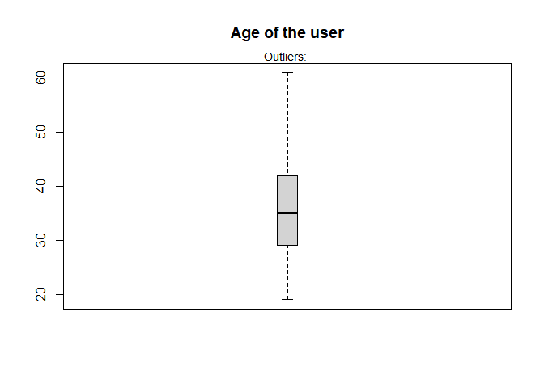

``` r
# Box plot for area income
boxplot(adverts$area.income, main="Area Income", boxwex=0.1)
mtext(paste("Outliers: "), cex=0.9)
```

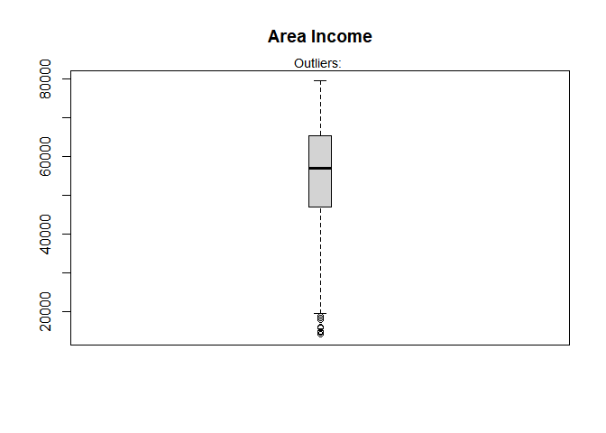

``` r
# Box plot for Daily Time Spent on Site
boxplot(adverts$daily.time.spent.on.site, main="Daily Time Spent on Site", boxwex=0.1)
mtext(paste("Outliers: "), cex=0.9)
```

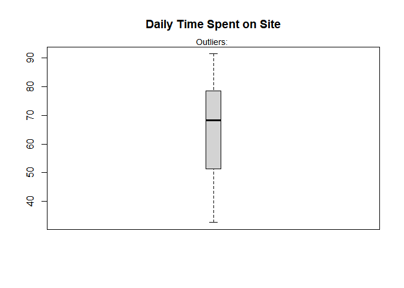

``` r
# Box plot for Daily.Internet.Usage
boxplot(adverts$daily.internet.usage, main="Daily Internet Usage", boxwex=0.1)
mtext(paste("Outliers: "), cex=0.9)
```

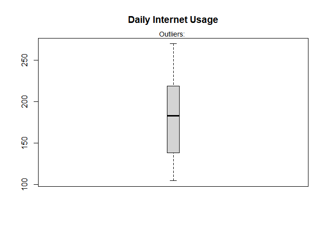

*Observation*: Area Income has outliers evidenced by the data points
that lie beyond the whisker.

``` r
# Finding outliers in the data set
print('Outlier values in Daily Time Spent on Site');boxplot.stats(adverts$daily.time.spent.on.site)$out
```

    ## [1] "Outlier values in Daily Time Spent on Site"

    ## numeric(0)

``` r
print('Outlier values in Age');boxplot.stats(adverts$age)$out
```

    ## [1] "Outlier values in Age"

    ## integer(0)

``` r
print('Outlier values in Area Income');boxplot.stats(adverts$area.income)$out 
```

    ## [1] "Outlier values in Area Income"

    ## [1] 17709.98 18819.34 15598.29 15879.10 14548.06 13996.50 14775.50 18368.57

``` r
print('Outlier values in Daily Internet Usage'); boxplot.stats(adverts$daily.internet.usage)$out
```

    ## [1] "Outlier values in Daily Internet Usage"

    ## numeric(0)

``` r
# Obtaining the value of outliers in area income
library(outliers)
outlier(adverts$area.income)
```

    ## [1] 13996.5

``` r
# Test for outliers
test <- grubbs.test(adverts$area.income)
test
```

    ## 
    ##  Grubbs test for one outlier
    ## 
    ## data:  adverts$area.income
    ## G = 3.05662, U = 0.99064, p-value = 1
    ## alternative hypothesis: lowest value 13996.5 is an outlier

*Observation*: From the result, reject the null hypothesis. There is
significant evidence to support the conclusion that the value 13996.5 is
indeed an outliers.

``` r
# confirming where the outliers in area incomes came from
adverts$country[adverts$`area.income` %in% c(17709.98, 18819.34, 15598.29, 15879.1, 14548.06, 13996.5, 14775.5, 18368.57)]
```

    ## [1] "Belize"      "Algeria"     "Azerbaijan"  "Tajikistan"  "Lebanon"    
    ## [6] "El Salvador" "Jersey"      "Luxembourg"

The low outliers are necessary for correct analysis and conclusion of
the data

``` r
# Checking for duplicates in the data set
duplicates <- adverts[duplicated(adverts),]
duplicates
```

    ##  [1] daily.time.spent.on.site age                      area.income             
    ##  [4] daily.internet.usage     ad.topic.line            city                    
    ##  [7] male                     country                  timestamp               
    ## [10] clicked.on.ad           
    ## <0 rows> (or 0-length row.names)

*Observation*; From the output it clearly indicates that there are no
duplicates.

Exploratory Data Analysis
-------------------------

``` r
# getting the mean for all numeric columns
print("The mean of the numeric attributes:")
```

    ## [1] "The mean of the numeric attributes:"

``` r
lapply(nums,FUN=mean)
```

    ## $daily.time.spent.on.site
    ## [1] 65.0002
    ## 
    ## $age
    ## [1] 36.009
    ## 
    ## $area.income
    ## [1] 55000
    ## 
    ## $daily.internet.usage
    ## [1] 180.0001

``` r
# getting the median for all numeric columns
print("The median of the numeric attributes:")
```

    ## [1] "The median of the numeric attributes:"

``` r
lapply(nums,FUN=median)
```

    ## $daily.time.spent.on.site
    ## [1] 68.215
    ## 
    ## $age
    ## [1] 35
    ## 
    ## $area.income
    ## [1] 57012.3
    ## 
    ## $daily.internet.usage
    ## [1] 183.13

``` r
# obtaining the mode for all numeric columns

getmode <- function(v) {
   uniqv <- unique(v)
   uniqv[which.max(tabulate(match(v, uniqv)))]
}
print("The mode of the numeric attributes:")
```

    ## [1] "The mode of the numeric attributes:"

``` r
lapply(nums,FUN=getmode)
```

    ## $daily.time.spent.on.site
    ## [1] 62.26
    ## 
    ## $age
    ## [1] 31
    ## 
    ## $area.income
    ## [1] 61833.9
    ## 
    ## $daily.internet.usage
    ## [1] 167.22

``` r
# Calculating the minimum value for all numeric columns
print("The minimum values of the numeric attributes:")
```

    ## [1] "The minimum values of the numeric attributes:"

``` r
lapply(nums,FUN=min)
```

    ## $daily.time.spent.on.site
    ## [1] 32.6
    ## 
    ## $age
    ## [1] 19
    ## 
    ## $area.income
    ## [1] 13996.5
    ## 
    ## $daily.internet.usage
    ## [1] 104.78

``` r
# Calculating the maximum value for all numeric columns
print("The maximum values of the numeric attributes:")
```

    ## [1] "The maximum values of the numeric attributes:"

``` r
lapply(nums,FUN=max)
```

    ## $daily.time.spent.on.site
    ## [1] 91.43
    ## 
    ## $age
    ## [1] 61
    ## 
    ## $area.income
    ## [1] 79484.8
    ## 
    ## $daily.internet.usage
    ## [1] 269.96

``` r
# Calculating the range for all numeric columns
print("The range of the numeric attributes:")
```

    ## [1] "The range of the numeric attributes:"

``` r
lapply(nums,FUN=range)
```

    ## $daily.time.spent.on.site
    ## [1] 32.60 91.43
    ## 
    ## $age
    ## [1] 19 61
    ## 
    ## $area.income
    ## [1] 13996.5 79484.8
    ## 
    ## $daily.internet.usage
    ## [1] 104.78 269.96

``` r
# getting the quantiles for all numeric columns
print("The quantile of the numeric attributes:")
```

    ## [1] "The quantile of the numeric attributes:"

``` r
lapply(nums,FUN=quantile)
```

    ## $daily.time.spent.on.site
    ##      0%     25%     50%     75%    100% 
    ## 32.6000 51.3600 68.2150 78.5475 91.4300 
    ## 
    ## $age
    ##   0%  25%  50%  75% 100% 
    ##   19   29   35   42   61 
    ## 
    ## $area.income
    ##       0%      25%      50%      75%     100% 
    ## 13996.50 47031.80 57012.30 65470.64 79484.80 
    ## 
    ## $daily.internet.usage
    ##       0%      25%      50%      75%     100% 
    ## 104.7800 138.8300 183.1300 218.7925 269.9600

``` r
# getting the variance for all numeric columns
print("The variance of the numeric attributes:")
```

    ## [1] "The variance of the numeric attributes:"

``` r
lapply(nums,FUN=var)
```

    ## $daily.time.spent.on.site
    ## [1] 251.3371
    ## 
    ## $age
    ## [1] 77.18611
    ## 
    ## $area.income
    ## [1] 179952406
    ## 
    ## $daily.internet.usage
    ## [1] 1927.415

``` r
# getting the standard deviation for all numeric columns
print("The standard deviation of the numeric attributes:")
```

    ## [1] "The standard deviation of the numeric attributes:"

``` r
lapply(nums,FUN=sd)
```

    ## $daily.time.spent.on.site
    ## [1] 15.85361
    ## 
    ## $age
    ## [1] 8.785562
    ## 
    ## $area.income
    ## [1] 13414.63
    ## 
    ## $daily.internet.usage
    ## [1] 43.90234

``` r
# Histogram of Age
ggplot(data = adverts, mapping = aes(x = age)) +
  geom_histogram(bins = 20, fill = "cyan") +
  labs(x = "Distribution of age of respondents") +
  ggtitle("Histogram of Age") +
  theme(plot.title = element_text(hjust = 0.5))
```

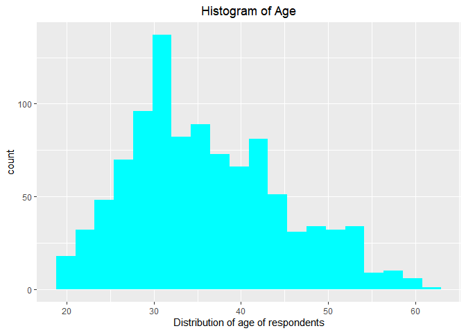
*Observation*:It is clear from the visual above that the Distribution of
the ages of the respondents is skewed to the left. Most of the users
frequenting the site are young.

``` r
# Histogram of Area Income 
ggplot(data = adverts, mapping = aes(x = area.income)) +
  geom_histogram(bins = 20, fill = "purple") +
  labs(x = "Distribution of Area income") +
  ggtitle("Histogram of Area Income") +
  theme(plot.title = element_text(hjust = 0.5))
```

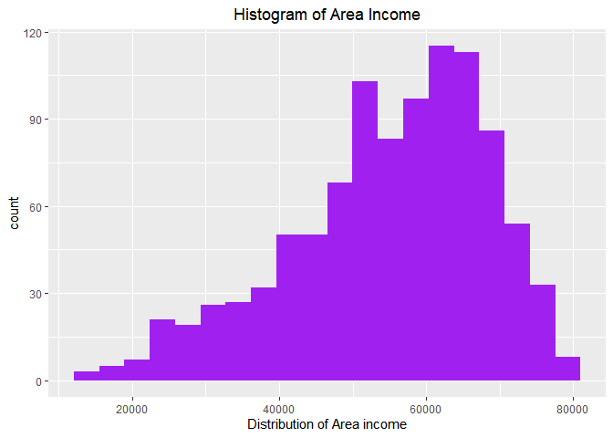
*Observation*: The Area Income is skewed to the right.

``` r
# Histogram of daily time spent on site
ggplot(data = adverts, mapping = aes(x = daily.time.spent.on.site)) +
  geom_histogram(bins = 20, fill = "pink") +
  labs(x = "Distribution of daily time spent on site") +
  ggtitle("Histogram of daily time spent on site") +
  theme(plot.title = element_text(hjust = 0.5))
```

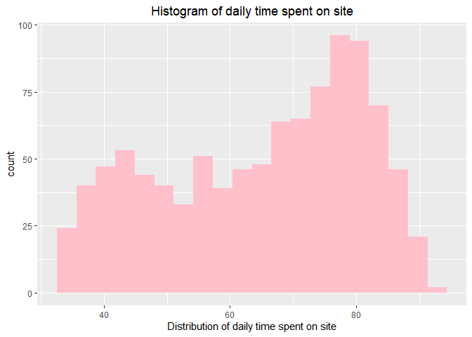

``` r
# Histogram of daily internet usage 
ggplot(data = adverts, mapping = aes(x = daily.internet.usage)) +
  geom_histogram(bins = 20, fill = "blue") +
  labs(x = "Distribution of daily internet usage") +
  ggtitle("Histogram of daily internet usage") +
  theme(plot.title = element_text(hjust = 0.5))
```

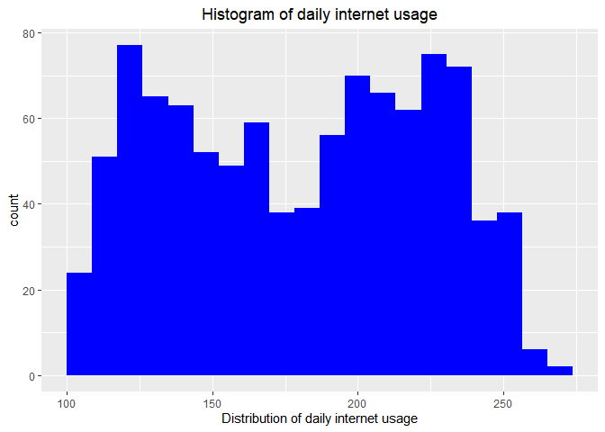

``` r
# visuals for illustrating the number of males and females
m <- ggplot(adverts, aes(x = male))
m + geom_bar()
```

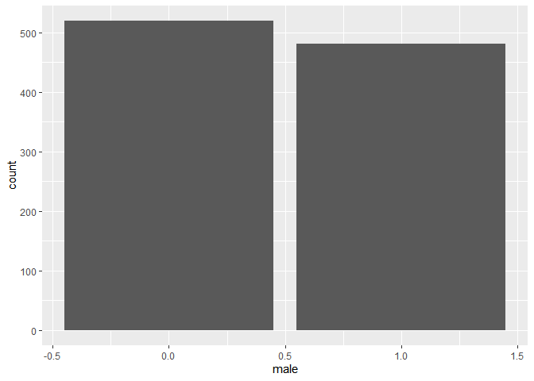

*Observation*: There are slightly more females than there are males who
visit the website. The value **1** represents the males and the value
**0** represents the females.

``` r
# barplot for clicked on ad
o <- ggplot(adverts, aes(x = clicked.on.ad))
o + geom_bar(fill = "yellow")
```

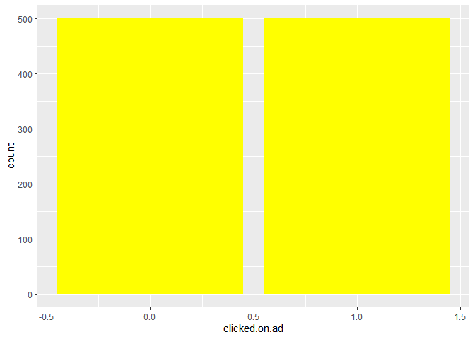
*Observation*: There are approximately equal number of individuals who
clicked on the Ad and those who did not. Where the value **1**
represents clicked on ad and the value **0** represents not clicked on
ad.

``` r
# Looking at the distribution of the site visit in a full week
table(format(adverts$timestamp,'%A'))
```

    ## 
    ##    Friday    Monday  Saturday    Sunday  Thursday   Tuesday Wednesday 
    ##       155       140       126       159       142       122       156

*Observation*: It is evident from the output above that the day of the
week is not a determining factor when it comes to how often the users
visited the site. There are days that were high relatively high and
other were low. It is stochastic in nature.

``` r
# Checking to see the year within which the data was collected or rather documented
table(format(adverts$timestamp,'%Y'))
```

    ## 
    ## 2016 
    ## 1000

*Observation*: The data was collected for the year 2016.

``` r
# Checking for the distribution throughout the months
table(format(adverts$timestamp,'%B'))
```

    ## 
    ##    April February  January     July     June    March      May 
    ##      147      160      147      101      142      156      147

*Observation*: The data contains information for the year 2016 running
from January to July.The distribution in the months is also random as
well. From January it kept increasing and suddenly decreased in July.

``` r
# getting the frequencies for males and females

table(adverts$male)
```

    ## 
    ##   0   1 
    ## 519 481

``` r
# getting the counts of those who clicked on ad and those who did not
table(adverts$clicked.on.ad)
```

    ## 
    ##   0   1 
    ## 500 500

``` r
# summary of counts of the countries from where the users came from
sort(table(adverts$country))
```

    ## 
    ##                                               Aruba 
    ##                                                   1 
    ##                                             Bermuda 
    ##                                                   1 
    ## British Indian Ocean Territory (Chagos Archipelago) 
    ##                                                   1 
    ##                                          Cape Verde 
    ##                                                   1 
    ##                                             Germany 
    ##                                                   1 
    ##                                              Jordan 
    ##                                                   1 
    ##                                            Kiribati 
    ##                                                   1 
    ##                                             Lesotho 
    ##                                                   1 
    ##                                    Marshall Islands 
    ##                                                   1 
    ##                                          Montserrat 
    ##                                                   1 
    ##                                          Mozambique 
    ##                                                   1 
    ##                                             Romania 
    ##                                                   1 
    ##                               Saint Kitts and Nevis 
    ##                                                   1 
    ##                                            Slovenia 
    ##                                                   1 
    ##                                             Andorra 
    ##                                                   2 
    ##                                           Argentina 
    ##                                                   2 
    ##                                               Benin 
    ##                                                   2 
    ##                                              Bhutan 
    ##                                                   2 
    ##                            Central African Republic 
    ##                                                   2 
    ##                                            Colombia 
    ##                                                   2 
    ##                                             Comoros 
    ##                                                   2 
    ##                                            Djibouti 
    ##                                                   2 
    ##                                              Gambia 
    ##                                                   2 
    ##                                          Guadeloupe 
    ##                                                   2 
    ##                                       Guinea-Bissau 
    ##                                                   2 
    ##                                               Haiti 
    ##                                                   2 
    ##                                               India 
    ##                                                   2 
    ##                                              Kuwait 
    ##                                                   2 
    ##                                           Macedonia 
    ##                                                   2 
    ##                                          Mauritania 
    ##                                                   2 
    ##                                          Montenegro 
    ##                                                   2 
    ##                                             Namibia 
    ##                                                   2 
    ##                                       New Caledonia 
    ##                                                   2 
    ##                                              Norway 
    ##                                                   2 
    ##                                              Panama 
    ##                                                   2 
    ##                                    Pitcairn Islands 
    ##                                                   2 
    ##                                             Reunion 
    ##                                                   2 
    ##                                    Saint Barthelemy 
    ##                                                   2 
    ##                                         Saint Lucia 
    ##                                                   2 
    ##                               Sao Tome and Principe 
    ##                                                   2 
    ##                                        Sierra Leone 
    ##                                                   2 
    ##                          Slovakia (Slovak Republic) 
    ##                                                   2 
    ##        South Georgia and the South Sandwich Islands 
    ##                                                   2 
    ##                                               Sudan 
    ##                                                   2 
    ##                                            Suriname 
    ##                                                   2 
    ##                                           Swaziland 
    ##                                                   2 
    ##                                          Uzbekistan 
    ##                                                   2 
    ##        Antarctica (the territory South of 60 deg S) 
    ##                                                   3 
    ##                                             Armenia 
    ##                                                   3 
    ##                                          Azerbaijan 
    ##                                                   3 
    ##                              British Virgin Islands 
    ##                                                   3 
    ##                                        Cook Islands 
    ##                                                   3 
    ##                                             Denmark 
    ##                                                   3 
    ##                                             Estonia 
    ##                                                   3 
    ##                                       Faroe Islands 
    ##                                                   3 
    ##                                           Gibraltar 
    ##                                                   3 
    ##                                            Guernsey 
    ##                                                   3 
    ##                                              Guinea 
    ##                                                   3 
    ##                   Heard Island and McDonald Islands 
    ##                                                   3 
    ##                       Holy See (Vatican City State) 
    ##                                                   3 
    ##                                             Iceland 
    ##                                                   3 
    ##                                             Ireland 
    ##                                                   3 
    ##                                         Isle of Man 
    ##                                                   3 
    ##                                           Lithuania 
    ##                                                   3 
    ##                                               Macao 
    ##                                                   3 
    ##                                            Malaysia 
    ##                                                   3 
    ##                                              Monaco 
    ##                                                   3 
    ##                                             Morocco 
    ##                                                   3 
    ##                                               Nauru 
    ##                                                   3 
    ##                                               Nepal 
    ##                                                   3 
    ##                                           Nicaragua 
    ##                                                   3 
    ##                                               Niger 
    ##                                                   3 
    ##                                                Niue 
    ##                                                   3 
    ##                            Northern Mariana Islands 
    ##                                                   3 
    ##                               Palestinian Territory 
    ##                                                   3 
    ##                                            Paraguay 
    ##                                                   3 
    ##                                            Portugal 
    ##                                                   3 
    ##                                  Russian Federation 
    ##                                                   3 
    ##                                          San Marino 
    ##                                                   3 
    ##                                          Seychelles 
    ##                                                   3 
    ##                                               Spain 
    ##                                                   3 
    ##                                Syrian Arab Republic 
    ##                                                   3 
    ##                                          Tajikistan 
    ##                                                   3 
    ##                                            Tanzania 
    ##                                                   3 
    ##                                                Togo 
    ##                                                   3 
    ##                                 Trinidad and Tobago 
    ##                                                   3 
    ##                                      United Kingdom 
    ##                                                   3 
    ##                                             Vietnam 
    ##                                                   3 
    ##                                               Yemen 
    ##                                                   3 
    ##                                              Angola 
    ##                                                   4 
    ##                                          Bangladesh 
    ##                                                   4 
    ##                                        Burkina Faso 
    ##                                                   4 
    ##                                                Chad 
    ##                                                   4 
    ##                                               Chile 
    ##                                                   4 
    ##                                               Congo 
    ##                                                   4 
    ##                                       Cote d'Ivoire 
    ##                                                   4 
    ##                                  Dominican Republic 
    ##                                                   4 
    ##                                   Equatorial Guinea 
    ##                                                   4 
    ##                         Falkland Islands (Malvinas) 
    ##                                                   4 
    ##                                       French Guiana 
    ##                                                   4 
    ##                                             Georgia 
    ##                                                   4 
    ##                                               Ghana 
    ##                                                   4 
    ##                                             Grenada 
    ##                                                   4 
    ##                                                Guam 
    ##                                                   4 
    ##                                           Guatemala 
    ##                                                   4 
    ##                                              Israel 
    ##                                                   4 
    ##                                               Japan 
    ##                                                   4 
    ##                                          Kazakhstan 
    ##                                                   4 
    ##                                               Kenya 
    ##                                                   4 
    ##                    Lao People's Democratic Republic 
    ##                                                   4 
    ##                                              Latvia 
    ##                                                   4 
    ##                              Libyan Arab Jamahiriya 
    ##                                                   4 
    ##                                              Malawi 
    ##                                                   4 
    ##                                            Maldives 
    ##                                                   4 
    ##                                                Mali 
    ##                                                   4 
    ##                                          Martinique 
    ##                                                   4 
    ##                                           Mauritius 
    ##                                                   4 
    ##                                         Netherlands 
    ##                                                   4 
    ##                                         New Zealand 
    ##                                                   4 
    ##                                               Palau 
    ##                                                   4 
    ##                                        Saint Martin 
    ##                                                   4 
    ##                                        Saudi Arabia 
    ##                                                   4 
    ##                                           Sri Lanka 
    ##                                                   4 
    ##                                              Sweden 
    ##                                                   4 
    ##                                         Switzerland 
    ##                                                   4 
    ##                                            Thailand 
    ##                                                   4 
    ##                                             Tokelau 
    ##                                                   4 
    ##                                             Tunisia 
    ##                                                   4 
    ##                                              Tuvalu 
    ##                                                   4 
    ##                                              Uganda 
    ##                                                   4 
    ##                United States Minor Outlying Islands 
    ##                                                   4 
    ##                        United States Virgin Islands 
    ##                                                   4 
    ##                                   Wallis and Futuna 
    ##                                                   4 
    ##                                              Zambia 
    ##                                                   4 
    ##                                      American Samoa 
    ##                                                   5 
    ##                                 Antigua and Barbuda 
    ##                                                   5 
    ##                                             Austria 
    ##                                                   5 
    ##                                             Bahrain 
    ##                                                   5 
    ##                                            Barbados 
    ##                                                   5 
    ##                                             Belgium 
    ##                                                   5 
    ##                                              Belize 
    ##                                                   5 
    ##                           Bouvet Island (Bouvetoya) 
    ##                                                   5 
    ##                                              Brazil 
    ##                                                   5 
    ##                                   Brunei Darussalam 
    ##                                                   5 
    ##                                            Cameroon 
    ##                                                   5 
    ##                                              Canada 
    ##                                                   5 
    ##                                      Cayman Islands 
    ##                                                   5 
    ##                                                Cuba 
    ##                                                   5 
    ##                                            Dominica 
    ##                                                   5 
    ##                                             Ecuador 
    ##                                                   5 
    ##                                               Egypt 
    ##                                                   5 
    ##                                             Finland 
    ##                                                   5 
    ##                                    French Polynesia 
    ##                                                   5 
    ##                         French Southern Territories 
    ##                                                   5 
    ##                                           Greenland 
    ##                                                   5 
    ##                                              Guyana 
    ##                                                   5 
    ##                                            Honduras 
    ##                                                   5 
    ##                                                Iran 
    ##                                                   5 
    ##                                               Italy 
    ##                                                   5 
    ##                                             Jamaica 
    ##                                                   5 
    ##                                               Korea 
    ##                                                   5 
    ##                                             Myanmar 
    ##                                                   5 
    ##                                      Norfolk Island 
    ##                                                   5 
    ##                                            Pakistan 
    ##                                                   5 
    ##                                    Papua New Guinea 
    ##                                                   5 
    ##                                              Rwanda 
    ##                                                   5 
    ##                                        Saint Helena 
    ##                                                   5 
    ##                           Saint Pierre and Miquelon 
    ##                                                   5 
    ##                                              Serbia 
    ##                                                   5 
    ##                                             Somalia 
    ##                                                   5 
    ##                                         Timor-Leste 
    ##                                                   5 
    ##                                               Tonga 
    ##                                                   5 
    ##                            Turks and Caicos Islands 
    ##                                                   5 
    ##                                             Ukraine 
    ##                                                   5 
    ##                            United States of America 
    ##                                                   5 
    ##                                             Uruguay 
    ##                                                   5 
    ##                                             Algeria 
    ##                                                   6 
    ##                                            Anguilla 
    ##                                                   6 
    ##                                             Belarus 
    ##                                                   6 
    ##                                             Bolivia 
    ##                                                   6 
    ##                                            Bulgaria 
    ##                                                   6 
    ##                                               China 
    ##                                                   6 
    ##                                    Christmas Island 
    ##                                                   6 
    ##                                          Costa Rica 
    ##                                                   6 
    ##                                             Croatia 
    ##                                                   6 
    ##                                         El Salvador 
    ##                                                   6 
    ##                                               Gabon 
    ##                                                   6 
    ##                                           Hong Kong 
    ##                                                   6 
    ##                                             Hungary 
    ##                                                   6 
    ##                                           Indonesia 
    ##                                                   6 
    ##                                              Jersey 
    ##                                                   6 
    ##                                     Kyrgyz Republic 
    ##                                                   6 
    ##                                             Lebanon 
    ##                                                   6 
    ##                                       Liechtenstein 
    ##                                                   6 
    ##                                          Madagascar 
    ##                                                   6 
    ##                                               Malta 
    ##                                                   6 
    ##                                             Mayotte 
    ##                                                   6 
    ##                                              Mexico 
    ##                                                   6 
    ##                                             Moldova 
    ##                                                   6 
    ##                                            Mongolia 
    ##                                                   6 
    ##                                Netherlands Antilles 
    ##                                                   6 
    ##                                         Philippines 
    ##                                                   6 
    ##                                              Poland 
    ##                                                   6 
    ##                                         Puerto Rico 
    ##                                                   6 
    ##                                               Qatar 
    ##                                                   6 
    ##                    Saint Vincent and the Grenadines 
    ##                                                   6 
    ##                                               Samoa 
    ##                                                   6 
    ##                                           Singapore 
    ##                                                   6 
    ##                        Svalbard & Jan Mayen Islands 
    ##                                                   6 
    ##                                        Turkmenistan 
    ##                                                   6 
    ##                                United Arab Emirates 
    ##                                                   6 
    ##                                             Vanuatu 
    ##                                                   6 
    ##                                            Zimbabwe 
    ##                                                   6 
    ##                                             Albania 
    ##                                                   7 
    ##                                             Bahamas 
    ##                                                   7 
    ##                              Bosnia and Herzegovina 
    ##                                                   7 
    ##                                             Burundi 
    ##                                                   7 
    ##                                            Cambodia 
    ##                                                   7 
    ##                                             Eritrea 
    ##                                                   7 
    ##                                            Ethiopia 
    ##                                                   7 
    ##                                                Fiji 
    ##                                                   7 
    ##                                          Luxembourg 
    ##                                                   7 
    ##                                              Taiwan 
    ##                                                   7 
    ##                                           Venezuela 
    ##                                                   7 
    ##                                      Western Sahara 
    ##                                                   7 
    ##                                         Afghanistan 
    ##                                                   8 
    ##                                           Australia 
    ##                                                   8 
    ##                                              Cyprus 
    ##                                                   8 
    ##                                              Greece 
    ##                                                   8 
    ##                                             Liberia 
    ##                                                   8 
    ##                                          Micronesia 
    ##                                                   8 
    ##                                                Peru 
    ##                                                   8 
    ##                                             Senegal 
    ##                                                   8 
    ##                                        South Africa 
    ##                                                   8 
    ##                                              Turkey 
    ##                                                   8 
    ##                                      Czech Republic 
    ##                                                   9 
    ##                                              France 
    ##                                                   9

\*Observation**: The country that had the most number of users was
**France** and **Czech Republic\*\*

``` r
# Dividing the age into groups
min(adverts$age); max(adverts$age)
```

    ## [1] 19

    ## [1] 61

``` r
ages <- floor(runif(9, min = 19 , max = 61))
ages
```

    ## [1] 27 40 55 53 25 60 37 28 59

``` r
sort(table(adverts$city))
```

    ## 
    ##               Adamsbury                Adamside               Adamsstad 
    ##                       1                       1                       1 
    ##                Alanview           Alexanderfurt           Alexanderview 
    ##                       1                       1                       1 
    ##           Alexandrafort              Alexisland              Aliciatown 
    ##                       1                       1                       1 
    ##            Alvaradoport             Alvarezland              Amandafort 
    ##                       1                       1                       1 
    ##             Amandahaven              Amandaland                 Amyfurt 
    ##                       1                       1                       1 
    ##                Amyhaven         Andersonchester            Andersonfurt 
    ##                       1                       1                       1 
    ##             Andersonton           Andrewborough             Andrewmouth 
    ##                       1                       1                       1 
    ##              Angelhaven             Anthonyfurt           Ashleychester 
    ##                       1                       1                       1 
    ##             Ashleymouth           Austinborough              Austinland 
    ##                       1                       1                       1 
    ##              Bakerhaven             Barbershire                 Beckton 
    ##                       1                       1                       1 
    ##              Bernardton               Bethburgh               Birdshire 
    ##                       1                       1                       1 
    ##            Blairborough              Blairville             Blevinstown 
    ##                       1                       1                       1 
    ##               Bowenview               Boyerberg          Bradleyborough 
    ##                       1                       1                       1 
    ##            Bradleyburgh             Bradleyside         Bradshawborough 
    ##                       1                       1                       1 
    ##               Bradyfurt              Brandiland             Brandonbury 
    ##                       1                       1                       1 
    ##             Brandonstad             Brandymouth             Brendaburgh 
    ##                       1                       1                       1 
    ##           Brendachester              Brianabury               Brianfurt 
    ##                       1                       1                       1 
    ##               Brianland         Brittanyborough               Brownbury 
    ##                       1                       1                       1 
    ##               Brownport                Brownton               Browntown 
    ##                       1                       1                       1 
    ##               Brownview              Bruceburgh             Burgessside 
    ##                       1                       1                       1 
    ##              Butlerfort               Calebberg             Cameronberg 
    ##                       1                       1                       1 
    ##            Campbellstad              Cannonbury             Carsonshire 
    ##                       1                       1                       1 
    ##             Carterburgh              Carterland              Carterport 
    ##                       1                       1                       1 
    ##               Carterton           Cassandratown           Catherinefort 
    ##                       1                       1                       1 
    ##          Cervantesshire             Chapmanland            Chapmanmouth 
    ##                       1                       1                       1 
    ##            Charlenetown             Charlesbury             Charlesport 
    ##                       1                       1                       1 
    ##           Charlottefort              Chaseshire              Chrismouth 
    ##                       1                       1                       1 
    ##          Christinehaven           Christinetown      Christopherchester 
    ##                       1                       1                       1 
    ##         Christopherport        Christopherville            Clarkborough 
    ##                       1                       1                       1 
    ##             Claytonside              Clineshire               Codyburgh 
    ##                       1                       1                       1 
    ##              Coffeytown                Colebury            Colemanshire 
    ##                       1                       1                       1 
    ##            Collinsburgh               Combsstad          Contrerasshire 
    ##                       1                       1                       1 
    ##              Costaburgh            Courtneyfort                Coxhaven 
    ##                       1                       1                       1 
    ##              Cranemouth            Crawfordfurt         Cunninghamhaven 
    ##                       1                       1                       1 
    ##              Curtisport              Curtisview             Cynthiaside 
    ##                       1                       1                       1 
    ##              Daisymouth              Danielview              Davidmouth 
    ##                       1                       1                       1 
    ##               Davidside               Davidstad                Davidton 
    ##                       1                       1                       1 
    ##               Davidview           Daviesborough             Davieshaven 
    ##                       1                       1                       1 
    ##           Davilachester               Davisfurt                  Dayton 
    ##                       1                       1                       1 
    ##             Deannaville              Debraburgh            Derrickhaven 
    ##                       1                       1                       1 
    ##             Destinyfurt              Dianashire              Dianaville 
    ##                       1                       1                       1 
    ##             Donaldshire             Douglasview               Duffystad 
    ##                       1                       1                       1 
    ##           Dustinborough           Dustinchester             Dustinmouth 
    ##                       1                       1                       1 
    ##              East Aaron            East Anthony            East Barbara 
    ##                       1                       1                       1 
    ##      East Benjaminville        East Breannafurt           East Brettton 
    ##                       1                       1                       1 
    ##          East Brianberg      East Brittanyville             East Carlos 
    ##                       1                       1                       1 
    ##        East Christopher    East Christopherbury             East Connie 
    ##                       1                       1                       1 
    ##               East Dana       East Deborahhaven       East Debraborough 
    ##                       1                       1                       1 
    ##              East Donna          East Donnatown               East Eric 
    ##                       1                       1                       1 
    ##           East Ericport         East Georgeside          East Graceland 
    ##                       1                       1                       1 
    ##        East Heatherside              East Heidi              East Henry 
    ##                       1                       1                       1 
    ##              East Jason           East Jennifer          East Jessefort 
    ##                       1                       1                       1 
    ##           East Johnport          East Kevinbury            East Lindsey 
    ##                       1                       1                       1 
    ##            East Maureen        East Michaelland       East Michaelmouth 
    ##                       1                       1                       1 
    ##        East Michaeltown            East Michele       East Michelleberg 
    ##                       1                       1                       1 
    ##               East Mike               East Paul        East Rachaelfurt 
    ##                       1                       1                       1 
    ##         East Rachelview             East Ronald      East Samanthashire 
    ##                       1                       1                       1 
    ##             East Sharon              East Shawn       East Shawnchester 
    ##                       1                       1                       1 
    ##         East Sheriville            East Stephen          East Susanland 
    ##                       1                       1                       1 
    ##             East Tammie       East Theresashire        East Tiffanyport 
    ##                       1                       1                       1 
    ##        East Timothyport           East Toddfort          East Troyhaven 
    ##                       1                       1                       1 
    ##         East Tylershire            East Valerie        East Vincentstad 
    ##                       1                       1                       1 
    ##      East Yvonnechester             Edwardmouth            Edwardsmouth 
    ##                       1                       1                       1 
    ##             Edwardsport           Elizabethbury          Elizabethmouth 
    ##                       1                       1                       1 
    ##           Elizabethport           Elizabethstad               Emilyfurt 
    ##                       1                       1                       1 
    ##           Ericksonmouth               Erikville               Erinmouth 
    ##                       1                       1                       1 
    ##                 Erinton               Estesfurt             Estradafurt 
    ##                       1                       1                       1 
    ##            Estradashire               Evansfurt              Evansville 
    ##                       1                       1                       1 
    ##               Faithview              Florestown              Fosterside 
    ##                       1                       1                       1 
    ##               Frankbury            Frankchester               Frankport 
    ##                       1                       1                       1 
    ##            Fraziershire             Garciamouth              Garciaside 
    ##                       1                       1                       1 
    ##              Garciatown              Garciaview              Garnerberg 
    ##                       1                       1                       1 
    ##          Garrettborough             Garychester            Gilbertville 
    ##                       1                       1                       1 
    ##               Gomezport           Gonzalezburgh              Grahamberg 
    ##                       1                       1                       1 
    ##              Gravesport           Greenechester               Greentown 
    ##                       1                       1                       1 
    ##               Greerport                Greerton               Greghaven 
    ##                       1                       1                       1 
    ##              Guzmanland                Haleberg                Haleview 
    ##                       1                       1                       1 
    ##                Hallfort            Hamiltonfort             Hammondport 
    ##                       1                       1                       1 
    ##              Hannahside               Hannaport              Hansenland 
    ##                       1                       1                       1 
    ##             Hansenmouth             Harmonhaven           Harperborough 
    ##                       1                       1                       1 
    ##             Harrishaven           Harrisonmouth          Hartmanchester 
    ##                       1                       1                       1 
    ##                Hartport              Harveyport           Hatfieldshire 
    ##                       1                       1                       1 
    ##             Hawkinsbury              Hayesmouth             Heatherberg 
    ##                       1                       1                       1 
    ##            Helenborough            Hendrixmouth               Henryfort 
    ##                       1                       1                       1 
    ##               Henryland        Hernandezchester           Hernandezfort 
    ##                       1                       1                       1 
    ##           Hernandezside          Hernandezville                Hessstad 
    ##                       1                       1                       1 
    ##              Hintonport               Hobbsbury             Holderville 
    ##                       1                       1                       1 
    ##             Hollandberg               Hollyfurt            Hubbardmouth 
    ##                       1                       1                       1 
    ##          Huffmanchester              Hughesport           Hurleyborough 
    ##                       1                       1                       1 
    ##                Ianmouth              Ingramberg            Isaacborough 
    ##                       1                       1                       1 
    ##            Jacksonburgh            Jacksonmouth             Jacksonstad 
    ##                       1                       1                       1 
    ##               Jacobstad         Jacquelineshire               Jamesberg 
    ##                       1                       1                       1 
    ##               Jamesfurt              Jamesmouth              Jamesville 
    ##                       1                       1                       1 
    ##               Jamieberg               Jamiefort              Janiceview 
    ##                       1                       1                       1 
    ##             Jasminefort                Jayville            Jeffreyburgh 
    ##                       1                       1                       1 
    ##            Jeffreymouth            Jeffreyshire           Jenniferhaven 
    ##                       1                       1                       1 
    ##            Jenniferstad           Jensenborough               Jensenton 
    ##                       1                       1                       1 
    ##              Jeremybury             Jeremyshire            Jessicahaven 
    ##                       1                       1                       1 
    ##            Jessicashire             Jessicastad               Joanntown 
    ##                       1                       1                       1 
    ##              Joechester                Johnport             Johnsonfort 
    ##                       1                       1                       1 
    ##             Johnsontown             Johnsonview               Johnsport 
    ##                       1                       1                       1 
    ##           Johnstonmouth           Johnstonshire            Jonathanland 
    ##                       1                       1                       1 
    ##            Jonathantown               Jonesland              Jonesmouth 
    ##                       1                       1                       1 
    ##              Jonesshire             Jordanmouth             Jordanshire 
    ##                       1                       1                       1 
    ##              Jordantown              Josephberg             Josephmouth 
    ##                       1                       1                       1 
    ##              Josephstad             Joshuaburgh             Joshuamouth 
    ##                       1                       1                       1 
    ##                Juanport               Juliaport               Julietown 
    ##                       1                       1                       1 
    ##              Karenmouth                Karenton               Katieport 
    ##                       1                       1                       1 
    ##              Kaylashire               Keithtown               Kellytown 
    ##                       1                       1                       1 
    ##             Kennedyfurt             Kennethview               Kentmouth 
    ##                       1                       1                       1 
    ##               Kevinberg            Kevinchester           Kimberlyhaven 
    ##                       1                       1                       1 
    ##           Kimberlymouth            Kimberlytown             Kingchester 
    ##                       1                       1                       1 
    ##               Kingshire               Klineside              Knappburgh 
    ##                       1                       1                       1 
    ##            Kristineberg             Kristinfurt             Kristintown 
    ##                       1                       1                       1 
    ##             Kyleborough               Kylieview             Lake Adrian 
    ##                       1                       1                       1 
    ##         Lake Allenville             Lake Amanda                Lake Amy 
    ##                       1                       1                       1 
    ##             Lake Angela          Lake Annashire         Lake Beckyburgh 
    ##                       1                       1                       1 
    ##        Lake Brandonview              Lake Brian      Lake Cassandraport 
    ##                       1                       1                       1 
    ##      Lake Charlottestad    Lake Christopherfurt         Lake Conniefurt 
    ##                       1                       1                       1 
    ##           Lake Courtney          Lake Craigview            Lake Cynthia 
    ##                       1                       1                       1 
    ##           Lake Danielle      Lake Deannaborough       Lake Deborahburgh 
    ##                       1                       1                       1 
    ##             Lake Dustin             Lake Edward      Lake Elizabethside 
    ##                       1                       1                       1 
    ##           Lake Evantown              Lake Faith             Lake Gerald 
    ##                       1                       1                       1 
    ##             Lake Hailey                Lake Ian              Lake Jacob 
    ##                       1                       1                       1 
    ##         Lake Jacqueline       Lake Jasonchester           Lake Jennifer 
    ##                       1                       1                       1 
    ##        Lake Jenniferton            Lake Jessica       Lake Jessicaville 
    ##                       1                       1                       1 
    ##              Lake Jesus          Lake Jillville               Lake John 
    ##                       1                       1                       1 
    ##           Lake Johnbury       Lake Jonathanview             Lake Joseph 
    ##                       1                       1                       1 
    ##           Lake Josetown         Lake Joshuafurt              Lake Kevin 
    ##                       1                       1                       1 
    ##          Lake Kurtmouth               Lake Lisa            Lake Matthew 
    ##                       1                       1                       1 
    ##        Lake Matthewland       Lake Melindamouth            Lake Michael 
    ##                       1                       1                       1 
    ##        Lake Michaelport           Lake Michelle       Lake Michellebury 
    ##                       1                       1                       1 
    ##             Lake Nicole        Lake Rhondaburgh     Lake Stephenborough 
    ##                       1                       1                       1 
    ##            Lake Timothy              Lake Tracy            Lake Vanessa 
    ##                       1                       1                       1 
    ##        Lake Zacharyfurt              Lauraburgh              Laurieside 
    ##                       1                       1                       1 
    ##         Lawrenceborough             Lawsonshire                Leahside 
    ##                       1                       1                       1 
    ##             Leonchester              Lesliebury              Lesliefort 
    ##                       1                       1                       1 
    ##              Lewismouth               Lindaside            Lindsaymouth 
    ##                       1                       1                       1 
    ##                Lisaberg                Lisafort               Lopezberg 
    ##                       1                       1                       1 
    ##              Lopezmouth               Loriville               Lovemouth 
    ##                       1                       1                       1 
    ##             Luischester                Luisfurt                Lukeport 
    ##                       1                       1                       1 
    ##          Mackenziemouth             Marcushaven              Mariahview 
    ##                       1                       1                       1 
    ##               Mariebury              Mariemouth               Markhaven 
    ##                       1                       1                       1 
    ##              Masonhaven             Masseyshire                Mataberg 
    ##                       1                       1                       1 
    ##             Matthewtown             Mauricefurt            Mauriceshire 
    ##                       1                       1                       1 
    ##            Mcdonaldfort          Mclaughlinbury              Meaganfort 
    ##                       1                       1                       1 
    ##           Meghanchester              Melanieton          Melissachester 
    ##                       1                       1                       1 
    ##             Melissafurt             Melissastad            Meyerchester 
    ##                       1                       1                       1 
    ##              Meyersstad                 Mezaton             Michaelland 
    ##                       1                       1                       1 
    ##            Michaelmouth            Michaelshire             Micheletown 
    ##                       1                       1                       1 
    ##            Michellefort           Millerchester              Millerfort 
    ##                       1                       1                       1 
    ##              Millerland              Millerside              Millerview 
    ##                       1                       1                       1 
    ##               Mollyport              Monicaview              Morganfort 
    ##                       1                       1                       1 
    ##              Morganport             Morrismouth             Mosleyburgh 
    ##                       1                       1                       1 
    ##              Mullenside               Munozberg             Murphymouth 
    ##                       1                       1                       1 
    ##              Nelsonfurt              New Amanda           New Angelview 
    ##                       1                       1                       1 
    ##              New Brandy          New Brendafurt      New Charleschester 
    ##                       1                       1                       1 
    ##       New Christinatown             New Cynthia        New Daniellefort 
    ##                       1                       1                       1 
    ##             New Darlene            New Dawnland          New Debbiestad 
    ##                       1                       1                       1 
    ##          New Denisebury          New Frankshire             New Gabriel 
    ##                       1                       1                       1 
    ##               New Henry           New Hollyberg               New James 
    ##                       1                       1                       1 
    ##           New Jamestown             New Jasmine                 New Jay 
    ##                       1                       1                       1 
    ##      New Jeffreychester            New Johnberg          New Joshuaport 
    ##                       1                       1                       1 
    ##                New Juan          New Julianberg               New Julie 
    ##                       1                       1                       1 
    ##           New Karenberg               New Kayla          New Keithburgh 
    ##                       1                       1                       1 
    ##           New Lindaberg          New Lucasburgh          New Marcusbury 
    ##                       1                       1                       1 
    ##               New Maria             New Matthew             New Michael 
    ##                       1                       1                       1 
    ##         New Michaeltown               New Nancy              New Nathan 
    ##                       1                       1                       1 
    ##       New Patriciashire             New Patrick                New Paul 
    ##                       1                       1                       1 
    ##              New Rachel             New Rebecca             New Sabrina 
    ##                       1                       1                       1 
    ##                New Sean               New Shane              New Sharon 
    ##                       1                       1                       1 
    ##           New Sonialand               New Steve               New Tammy 
    ##                       1                       1                       1 
    ##         New Taylorburgh              New Teresa             New Theresa 
    ##                       1                       1                       1 
    ##              New Thomas             New Timothy                New Tina 
    ##                       1                       1                       1 
    ##           New Tinamouth          New Traceystad              New Travis 
    ##                       1                       1                       1 
    ##          New Travistown               New Tyler               New Wanda 
    ##                       1                       1                       1 
    ##        New Williammouth        New Williamville              Newmanberg 
    ##                       1                       1                       1 
    ##            Nicholasland            Nicholasport        North Aaronburgh 
    ##                       1                       1                       1 
    ##      North Aaronchester         North Alexandra           North Anaport 
    ##                       1                       1                       1 
    ##            North Andrew        North Andrewstad        North Angelastad 
    ##                       1                       1                       1 
    ##        North Angelatown              North Anna             North April 
    ##                       1                       1                       1 
    ##           North Brandon     North Brittanyburgh            North Cassie 
    ##                       1                       1                       1 
    ##       North Charlesbury       North Christopher             North Debra 
    ##                       1                       1                       1 
    ##        North Debrashire        North Derekville           North Destiny 
    ##                       1                       1                       1 
    ##         North Elizabeth         North Frankstad         North Garyhaven 
    ##                       1                       1                       1 
    ##     North Isabellaville     North Jenniferburgh        North Jeremyport 
    ##                       1                       1                       1 
    ##      North Jessicaville          North Johnside          North Johntown 
    ##                       1                       1                       1 
    ##          North Jonathan            North Joshua             North Katie 
    ##                       1                       1                       1 
    ##       North Kennethside         North Kevinside          North Kimberly 
    ##                       1                       1                       1 
    ##          North Kristine         North Lauraland        North Laurenview 
    ##                       1                       1                       1 
    ##         North Leonmouth       North Lisachester         North Loriburgh 
    ##                       1                       1                       1 
    ##              North Mark          North Maryland          North Mercedes 
    ##                       1                       1                       1 
    ##           North Michael       North Monicaville             North Randy 
    ##                       1                       1                       1 
    ##           North Raymond            North Regina       North Ricardotown 
    ##                       1                       1                       1 
    ##      North Richardburgh       North Ronaldshire    North Russellborough 
    ##                       1                       1                       1 
    ##          North Samantha         North Sarashire           North Shannon 
    ##                       1                       1                       1 
    ##     North Stephanieberg              North Tara           North Tiffany 
    ##                       1                       1                       1 
    ##         North Tracyport         North Tylerland          North Virginia 
    ##                       1                       1                       1 
    ##     North Wesleychester               Novaktown               Odomville 
    ##                       1                       1                       1 
    ##               Olsonside               Olsonstad              Palmerside 
    ##                       1                       1                       1 
    ##             Parkerhaven           Patriciahaven            Patrickmouth 
    ##                       1                       1                       1 
    ##              Pattymouth               Paulhaven                Paulport 
    ##                       1                       1                       1 
    ##               Paulshire             Pearsonfort                Penatown 
    ##                       1                       1                       1 
    ##               Perezland              Perryburgh            Petersonfurt 
    ##                       1                       1                       1 
    ##           Phelpschester              Philipberg            Phillipsbury 
    ##                       1                       1                       1 
    ##         Port Aliciabury        Port Angelamouth            Port Anthony 
    ##                       1                       1                       1 
    ##         Port Aprilville               Port Beth              Port Blake 
    ##                       1                       1                       1 
    ##             Port Brenda              Port Brian          Port Brianfort 
    ##                       1                       1                       1 
    ##      Port Brittanyville         Port Brookeland         Port Calvintown 
    ##                       1                       1                       1 
    ##             Port Cassie         Port Chasemouth          Port Christina 
    ##                       1                       1                       1 
    ##     Port Christinemouth        Port Christopher Port Christopherborough 
    ##                       1                       1                       1 
    ##            Port Crystal             Port Daniel       Port Danielleberg 
    ##                       1                       1                       1 
    ##          Port Davidland             Port Dennis          Port Derekberg 
    ##                       1                       1                       1 
    ##            Port Destiny     Port Douglasborough             Port Elijah 
    ##                       1                       1                       1 
    ##               Port Eric          Port Erikhaven           Port Erinberg 
    ##                       1                       1                       1 
    ##         Port Eugeneport         Port Georgebury            Port Gregory 
    ##                       1                       1                       1 
    ##         Port Jacqueline     Port Jacquelinestad              Port James 
    ##                       1                       1                       1 
    ##            Port Jasmine        Port Jefferybury            Port Jeffrey 
    ##                       1                       1                       1 
    ##           Port Jennifer            Port Jessica       Port Jessicamouth 
    ##                       1                       1                       1 
    ##               Port Jodi         Port Joshuafort          Port Karenfurt 
    ##                       1                       1                       1 
    ##        Port Katelynview       Port Kathleenfort       Port Kevinborough 
    ##                       1                       1                       1 
    ##           Port Lawrence              Port Maria             Port Mathew 
    ##                       1                       1                       1 
    ##        Port Melissaberg        Port Melissastad       Port Michaelmouth 
    ##                       1                       1                       1 
    ##       Port Michealburgh           Port Mitchell         Port Patrickton 
    ##                       1                       1                       1 
    ##           Port Paultown             Port Rachel        Port Raymondfort 
    ##                       1                       1                       1 
    ##              Port Robin         Port Sarahhaven         Port Sarahshire 
    ##                       1                       1                       1 
    ##         Port Sherrystad             Port Stacey              Port Stacy 
    ##                       1                       1                       1 
    ##              Port Susan       Port Whitneyhaven             Portermouth 
    ##                       1                       1                       1 
    ##             Pottermouth              Princebury             Pruittmouth 
    ##                       1                       1                       1 
    ##             Rachelhaven            Ramirezhaven             Ramirezland 
    ##                       1                       1                       1 
    ##             Ramirezside              Ramirezton               Ramosstad 
    ##                       1                       1                       1 
    ##            Randolphport              Randyshire            Rebeccamouth 
    ##                       1                       1                       1 
    ##             Reginamouth            Reneechester               Reyesfurt 
    ##                       1                       1                       1 
    ##               Reyesland           Rhondaborough            Richardshire 
    ##                       1                       1                       1 
    ##            Richardsland          Richardsonland         Richardsonmouth 
    ##                       1                       1                       1 
    ##         Richardsonshire          Richardsontown              Rickymouth 
    ##                       1                       1                       1 
    ##               Riggsstad               Rivasland              Robertbury 
    ##                       1                       1                       1 
    ##             Robertmouth              Robertside          Robertsonburgh 
    ##                       1                       1                       1 
    ##             Robertstown              Roberttown            Robinsonland 
    ##                       1                       1                       1 
    ##            Robinsontown               Rochabury              Rogerburgh 
    ##                       1                       1                       1 
    ##               Rogerland              Ronaldport             Ronniemouth 
    ##                       1                       1                       1 
    ##            Russellville               Ryanhaven             Sabrinaview 
    ##                       1                       1                       1 
    ##             Salazarbury            Samanthaland           Samuelborough 
    ##                       1                       1                       1 
    ##             Sanchezland            Sanchezmouth             Sandersland 
    ##                       1                       1                       1 
    ##             Sanderstown              Sandraland             Sandrashire 
    ##                       1                       1                       1 
    ##             Sandraville                Sarafurt               Sarahland 
    ##                       1                       1                       1 
    ##                Sarahton             Sellerstown               Shaneland 
    ##                       1                       1                       1 
    ##               Sharpberg               Shawnside                Shawstad 
    ##                       1                       1                       1 
    ##             Sherrishire             Shirleyfort                Silvaton 
    ##                       1                       1                       1 
    ##              Smithburgh               Smithside               Smithtown 
    ##                       1                       1                       1 
    ##             South Aaron              South Adam         South Adamhaven 
    ##                       1                       1                       1 
    ##     South Alexisborough         South Blakestad             South Brian 
    ##                       1                       1                       1 
    ##         South Cathyfurt       South Christopher             South Corey 
    ##                       1                       1                       1 
    ##      South Cynthiashire            South Daniel      South Daniellefort 
    ##                       1                       1                       1 
    ##        South Davidhaven        South Davidmouth            South Denise 
    ##                       1                       1                       1 
    ##        South Denisefurt        South Dianeshire            South George 
    ##                       1                       1                       1 
    ##             South Henry        South Jackieberg              South Jade 
    ##                       1                       1                       1 
    ##         South Jaimeview       South Jasminebury        South Jeanneport 
    ##                       1                       1                       1 
    ##          South Jennifer           South Jessica              South John 
    ##                       1                       1                       1 
    ##       South Johnnymouth              South Kyle          South Lauraton 
    ##                       1                       1                       1 
    ##         South Lauratown            South Manuel          South Margaret 
    ##                       1                       1                       1 
    ##              South Mark            South Meghan     South Meredithmouth 
    ##                       1                       1                       1 
    ##            South Pamela       South Patrickfort             South Peter 
    ##                       1                       1                       1 
    ##           South Rebecca             South Renee            South Robert 
    ##                       1                       1                       1 
    ##            South Ronald     South Stephanieport        South Tiffanyton 
    ##                       1                       1                       1 
    ##           South Tomside              South Troy    South Vincentchester 
    ##                       1                       1                       1 
    ##            South Walter              Staceyfort          Stephenborough 
    ##                       1                       1                       1 
    ##             Stewartbury             Suzannetown              Sylviaview 
    ##                       1                       1                       1 
    ##              Tammymouth              Tammyshire              Taylorberg 
    ##                       1                       1                       1 
    ##             Taylorhaven             Taylormouth              Taylorport 
    ##                       1                       1                       1 
    ##             Teresahaven              Thomasstad              Thomasview 
    ##                       1                       1                       1 
    ##             Timothyfurt            Timothymouth             Timothyport 
    ##                       1                       1                       1 
    ##             Timothytown             Tinachester                 Tinaton 
    ##                       1                       1                       1 
    ##            Townsendfurt              Tracyhaven                Tranland 
    ##                       1                       1                       1 
    ##               Troyville           Turnerchester              Turnerview 
    ##                       1                       1                       1 
    ##             Turnerville               Tylerport             Valerieland 
    ##                       1                       1                       1 
    ##             Vanessastad             Vanessaview          Villanuevastad 
    ##                       1                       1                       1 
    ##           Villanuevaton               Wademouth                Wadestad 
    ##                       1                       1                       1 
    ##           Wagnerchester          Wallacechester              Walshhaven 
    ##                       1                       1                       1 
    ##              Waltertown              Watsonfort              Welchshire 
    ##                       1                       1                       1 
    ##                Wendyton              Wendyville              West Alice 
    ##                       1                       1                       1 
    ##             West Alyssa             West Andrew             West Angela 
    ##                       1                       1                       1 
    ##         West Angelabury           West Annefort          West Aprilport 
    ##                       1                       1                       1 
    ##          West Arielstad            West Barbara           West Benjamin 
    ##                       1                       1                       1 
    ##               West Brad         West Brandonton             West Brenda 
    ##                       1                       1                       1 
    ##         West Carmenfurt              West Casey       West Chloeborough 
    ##                       1                       1                       1 
    ##        West Christopher              West Colin             West Connor 
    ##                       1                       1                       1 
    ##           West Courtney        West Daleborough          West Dannyberg 
    ##                       1                       1                       1 
    ##              West David             West Dennis         West Derekmouth 
    ##                       1                       1                       1 
    ##          West Dylanberg        West Eduardotown          West Ericaport 
    ##                       1                       1                       1 
    ##           West Ericfurt     West Gabriellamouth          West Gregburgh 
    ##                       1                       1                       1 
    ##            West Guybury              West James               West Jane 
    ##                       1                       1                       1 
    ##         West Jeremyside       West Jessicahaven               West Jodi 
    ##                       1                       1                       1 
    ##             West Joseph              West Julia             West Justin 
    ##                       1                       1                       1 
    ##          West Katiefurt          West Kevinfurt              West Lacey 
    ##                       1                       1                       1 
    ##            West Leahton        West Lindseybury               West Lisa 
    ##                       1                       1                       1 
    ##              West Lucas          West Mariafort        West Melaniefurt 
    ##                       1                       1                       1 
    ##       West Melissashire       West Michaelhaven        West Michaelport 
    ##                       1                       1                       1 
    ##       West Michaelshire        West Michaelstad             West Pamela 
    ##                       1                       1                       1 
    ##              West Randy       West Raymondmouth        West Rhondamouth 
    ##                       1                       1                       1 
    ##            West Ricardo            West Richard         West Robertside 
    ##                       1                       1                       1 
    ##            West Roytown            West Russell               West Ryan 
    ##                       1                       1                       1 
    ##           West Samantha             West Sharon              West Shaun 
    ##                       1                       1                       1 
    ##             West Sydney             West Tanner              West Tanya 
    ##                       1                       1                       1 
    ##          West Terrifurt             West Thomas          West Tinashire 
    ##                       1                       1                       1 
    ##        West Travismouth          West Wendyland            West William 
    ##                       1                       1                       1 
    ##     West Zacharyborough               Westshire               Whiteport 
    ##                       1                       1                       1 
    ##             Whitneyfort              Wilcoxport            Williammouth 
    ##                       1                       1                       1 
    ##             Williamport         Williamsborough            Williamsfort 
    ##                       1                       1                       1 
    ##           Williamsmouth            Williamsside             Williamstad 
    ##                       1                       1                       1 
    ##             Wilsonburgh             Wintersfort                Wongland 
    ##                       1                       1                       1 
    ##              Wrightview                Yangside              Youngburgh 
    ##                       1                       1                       1 
    ##               Youngfort                   Yuton             Zacharystad 
    ##                       1                       1                       1 
    ##              Zacharyton         Benjaminchester               East John 
    ##                       1                       2                       2 
    ##            East Timothy                Johnstad                Joneston 
    ##                       2                       2                       2 
    ##              Lake David              Lake James               Lake Jose 
    ##                       2                       2                       2 
    ##            Lake Patrick              Lake Susan            Michelleside 
    ##                       2                       2                       2 
    ##              Millerbury              Millertown         New Jessicaport 
    ##                       2                       2                       2 
    ##              New Sheila            North Daniel             Pamelamouth 
    ##                       2                       2                       2 
    ##              Port Jason               Port Juan              Port Julie 
    ##                       2                       2                       2 
    ##              Robertfurt              Shelbyport              South Lisa 
    ##                       2                       2                       2 
    ##             West Amanda            West Shannon             West Steven 
    ##                       2                       2                       2 
    ##             Wrightburgh               Lisamouth            Williamsport 
    ##                       2                       3                       3

*Observation*: The city that had the most number of users are
\*\*Lisamouth\* and *Williamsport*

### Bivariate Exploratory Graphical Analysis

``` r
# loading the package for correlation
library(Hmisc)
```

    ## Loading required package: lattice

    ## Loading required package: survival

    ## Loading required package: Formula

    ## 
    ## Attaching package: 'Hmisc'

    ## The following objects are masked from 'package:dplyr':
    ## 
    ##     src, summarize

    ## The following objects are masked from 'package:base':
    ## 
    ##     format.pval, units

``` r
library(survival)
library(lattice)
```

``` r
# getting the covariance matrix
res1 <- cov(as.matrix(data_num))
res1
```

    ##                          daily.time.spent.on.site           age   area.income
    ## daily.time.spent.on.site              251.3370949 -4.617415e+01  6.613081e+04
    ## age                                   -46.1741459  7.718611e+01 -2.152093e+04
    ## area.income                         66130.8109082 -2.152093e+04  1.799524e+08
    ## daily.internet.usage                  360.9918827 -1.416348e+02  1.987625e+05
    ## male                                   -0.1501864 -9.242142e-02  8.867509e+00
    ## clicked.on.ad                          -5.9331431  2.164665e+00 -3.195989e+03
    ##                          daily.internet.usage        male clicked.on.ad
    ## daily.time.spent.on.site         3.609919e+02 -0.15018639 -5.933143e+00
    ## age                             -1.416348e+02 -0.09242142  2.164665e+00
    ## area.income                      1.987625e+05  8.86750903 -3.195989e+03
    ## daily.internet.usage             1.927415e+03  0.61476667 -1.727409e+01
    ## male                             6.147667e-01  0.24988889 -9.509510e-03
    ## clicked.on.ad                   -1.727409e+01 -0.00950951  2.502503e-01

``` r
# getting the pearson correlation
res2 <- cor(as.matrix(data_num))
res2
```

    ##                          daily.time.spent.on.site         age  area.income
    ## daily.time.spent.on.site               1.00000000 -0.33151334  0.310954413
    ## age                                   -0.33151334  1.00000000 -0.182604955
    ## area.income                            0.31095441 -0.18260496  1.000000000
    ## daily.internet.usage                   0.51865848 -0.36720856  0.337495533
    ## male                                  -0.01895085 -0.02104406  0.001322359
    ## clicked.on.ad                         -0.74811656  0.49253127 -0.476254628
    ##                          daily.internet.usage         male clicked.on.ad
    ## daily.time.spent.on.site           0.51865848 -0.018950855   -0.74811656
    ## age                               -0.36720856 -0.021044064    0.49253127
    ## area.income                        0.33749553  0.001322359   -0.47625463
    ## daily.internet.usage               1.00000000  0.028012326   -0.78653918
    ## male                               0.02801233  1.000000000   -0.03802747
    ## clicked.on.ad                     -0.78653918 -0.038027466    1.00000000

``` r
# getting the spearman's correlation
res3 <- cor(as.matrix(data_num), method = c("spearman"))
res3
```

    ##                          daily.time.spent.on.site         age area.income
    ## daily.time.spent.on.site               1.00000000 -0.31686155  0.28313439
    ## age                                   -0.31686155  1.00000000 -0.13595396
    ## area.income                            0.28313439 -0.13595396  1.00000000
    ## daily.internet.usage                   0.51410805 -0.37086395  0.33916021
    ## male                                  -0.01592213 -0.02315468 -0.01436909
    ## clicked.on.ad                         -0.74487253  0.48633733 -0.46722440
    ##                          daily.internet.usage        male clicked.on.ad
    ## daily.time.spent.on.site           0.51410805 -0.01592213   -0.74487253
    ## age                               -0.37086395 -0.02315468    0.48633733
    ## area.income                        0.33916021 -0.01436909   -0.46722440
    ## daily.internet.usage               1.00000000  0.02820432   -0.77660702
    ## male                               0.02820432  1.00000000   -0.03802747
    ## clicked.on.ad                     -0.77660702 -0.03802747    1.00000000

``` r
# obtaining correlation coefficients for numeric variables
library(dplyr) # loading the package to use select if 
library(ggcorrplot) # loading the visual plot for correlation
corr = round(cor(select_if(data_num, is.numeric)), 2)
ggcorrplot(corr, hc.order = T, ggtheme = ggplot2::theme_gray,
   colors = c("#65499D", "white", "#E71F63"), lab = T)
```

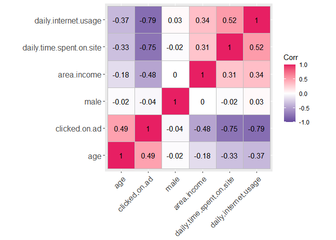

From the plot above, there is a positive correlation between:

-   Daily Time Spent on Site & Daily Internet Usage.
-   Area income and Daily Internet Usage.
-   Area income and Daily Time Spent on Site.
-   Age and Clicked on Ad.

``` r
# plotting a  simple scatter plot to illustrate the relationship between the age and area income
plot(adverts$area.income,adverts$age, xlab="Area income", ylab="Age", main="Age vs Area Income")
```

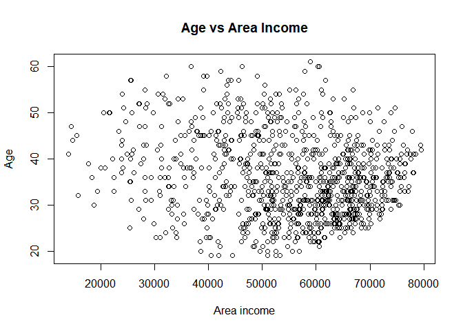

``` r
# plotting a  simple scatter plot to illustrate the relationship between the Daily Internet Usage and area income
plot(adverts$area.income,adverts$daily.internet.usage, xlab="Area income", ylab="Daily Internet Usage", main="Daily Internet Usage vs Area Income")
```

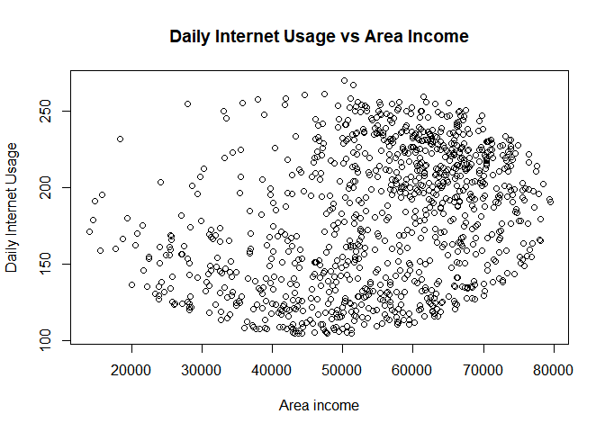

``` r
# plotting a  simple scatter plot to illustrate the relationship between the Daily Internet Usage and Daily  Time Spent on Site
plot(adverts$daily.time.spent.on.site,adverts$daily.internet.usage, xlab="Daily  Time Spent on Site", ylab="Daily Internet Usage", main="Daily Internet Usage vs Daily Time Spent on Site")
```

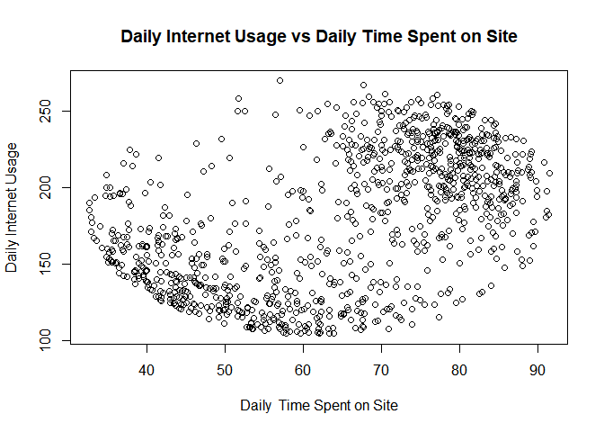

``` r
# plotting a  simple scatter plot to illustrate the relationship between the Area Income and Daily  Time Spent on Site
plot(adverts$daily.time.spent.on.site,adverts$area.income, xlab="Daily  Time Spent on Site", ylab="Area Income", main="Daily Time Spent on Site vs Area Income")
```

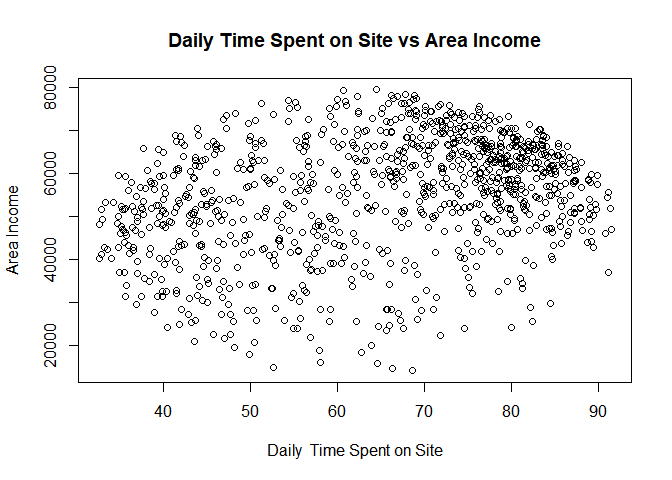

Implement the Solution
----------------------

``` r
# Categorizing the target variable

adverts[["clicked.on.ad"]] = factor(adverts[["clicked.on.ad"]])
```

``` r
# list types for each attribute
sapply(adverts, class)
```

    ## $daily.time.spent.on.site
    ## [1] "numeric"
    ## 
    ## $age
    ## [1] "integer"
    ## 
    ## $area.income
    ## [1] "numeric"
    ## 
    ## $daily.internet.usage
    ## [1] "numeric"
    ## 
    ## $ad.topic.line
    ## [1] "character"
    ## 
    ## $city
    ## [1] "character"
    ## 
    ## $male
    ## [1] "integer"
    ## 
    ## $country
    ## [1] "character"
    ## 
    ## $timestamp
    ## [1] "POSIXct" "POSIXt" 
    ## 
    ## $clicked.on.ad
    ## [1] "factor"

``` r
# dropping non numeric columns
library(dplyr)
adverts <-dplyr::select(adverts, -c(ad.topic.line, city,country,timestamp))
```

``` r
# confirming that the unnecessary columns were dropped
names(adverts)
```

    ## [1] "daily.time.spent.on.site" "age"                     
    ## [3] "area.income"              "daily.internet.usage"    
    ## [5] "male"                     "clicked.on.ad"

``` r
# creating a list of 80% of the rows in the  dataset to use for training
library(caret)
```

    ## 
    ## Attaching package: 'caret'

    ## The following object is masked from 'package:survival':
    ## 
    ##     cluster

    ## The following object is masked from 'package:purrr':
    ## 
    ##     lift

``` r
validation_index <- createDataPartition(y = adverts$clicked.on.ad, p= 0.8, list = FALSE)
# select 20% of the data for validation
test_set <- adverts[-validation_index,]
# use the remaining 80% of data to training and testing the models
train_set <- adverts[validation_index,]
```

``` r
# Running the  algorithms using 10-fold cross validation
control <- trainControl(method="cv", number=10)
metric <- "Accuracy"
```

``` r
# Logistic Regression
library(kernlab)
```

    ## 
    ## Attaching package: 'kernlab'

    ## The following object is masked from 'package:purrr':
    ## 
    ##     cross

    ## The following object is masked from 'package:ggplot2':
    ## 
    ##     alpha

``` r
set.seed(7)
fit.glm <- train(clicked.on.ad~., data=train_set, method="glm", metric=metric, trControl=control,  family=binomial(link='logit'))

# SVM Radial
set.seed(7)
fit.svmRadial <- train(clicked.on.ad~., data=train_set, method="svmRadial", metric=metric, preProc=c("center", "scale"), trControl=control, fit=FALSE)

# kNN
set.seed(7)
fit.knn <- train(clicked.on.ad~., data=train_set, method="knn", metric=metric, preProc=c("center", "scale"), trControl=control)

# Random Forest
set.seed(7)
library(randomForest)
```

    ## randomForest 4.6-14

    ## Type rfNews() to see new features/changes/bug fixes.

    ## 
    ## Attaching package: 'randomForest'

    ## The following object is masked from 'package:outliers':
    ## 
    ##     outlier

    ## The following object is masked from 'package:dplyr':
    ## 
    ##     combine

    ## The following object is masked from 'package:ggplot2':
    ## 
    ##     margin

``` r
fit.rf <- train(clicked.on.ad~., data=train_set, method="rf", metric=metric, trControl=control)

# Decision Tree
library(party)
```

    ## Loading required package: grid

    ## Loading required package: mvtnorm

    ## Loading required package: modeltools

    ## Loading required package: stats4

    ## 
    ## Attaching package: 'modeltools'

    ## The following object is masked from 'package:kernlab':
    ## 
    ##     prior

    ## Loading required package: strucchange

    ## Loading required package: zoo

    ## 
    ## Attaching package: 'zoo'

    ## The following objects are masked from 'package:base':
    ## 
    ##     as.Date, as.Date.numeric

    ## Loading required package: sandwich

    ## 
    ## Attaching package: 'strucchange'

    ## The following object is masked from 'package:stringr':
    ## 
    ##     boundary

``` r
set.seed(7)
fit.ctree <- train(clicked.on.ad~., data=train_set, method="ctree", metric=metric, trControl=control)
```

### Selecting the best model

``` r
# summarize accuracy of models
results <- resamples(list(logit=fit.glm, svm=fit.svmRadial, knn=fit.knn, rf=fit.rf, decision= fit.ctree))
summary(results)
```

    ## 
    ## Call:
    ## summary.resamples(object = results)
    ## 
    ## Models: logit, svm, knn, rf, decision 
    ## Number of resamples: 10 
    ## 
    ## Accuracy 
    ##            Min.  1st Qu. Median    Mean  3rd Qu.   Max. NA's
    ## logit    0.9375 0.953125 0.9625 0.96500 0.981250 1.0000    0
    ## svm      0.9375 0.962500 0.9625 0.96750 0.981250 1.0000    0
    ## knn      0.9375 0.940625 0.9625 0.96125 0.975000 0.9875    0
    ## rf       0.9250 0.962500 0.9625 0.96250 0.971875 0.9875    0
    ## decision 0.9000 0.925000 0.9500 0.94250 0.962500 0.9750    0
    ## 
    ## Kappa 
    ##           Min. 1st Qu. Median   Mean 3rd Qu.  Max. NA's
    ## logit    0.875 0.90625  0.925 0.9300 0.96250 1.000    0
    ## svm      0.875 0.92500  0.925 0.9350 0.96250 1.000    0
    ## knn      0.875 0.88125  0.925 0.9225 0.95000 0.975    0
    ## rf       0.850 0.92500  0.925 0.9250 0.94375 0.975    0
    ## decision 0.800 0.85000  0.900 0.8850 0.92500 0.950    0

``` r
# compare accuracy of models
dotplot(results)
```

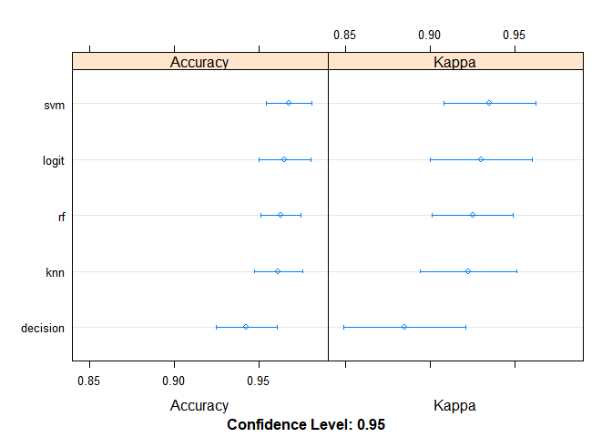

``` r
# boxplot comparison
bwplot(results)
```

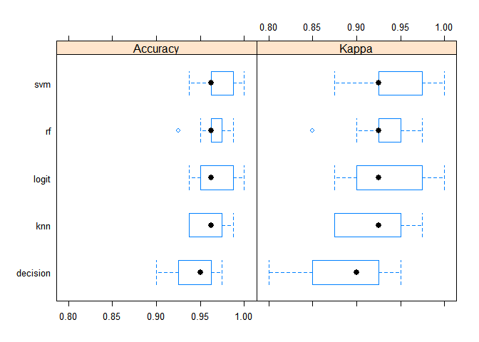

``` r
print(fit.glm); print(fit.svmRadial); print(fit.knn); print(fit.rf); print(fit.ctree)
```

    ## Generalized Linear Model 
    ## 
    ## 800 samples
    ##   5 predictor
    ##   2 classes: '0', '1' 
    ## 
    ## No pre-processing
    ## Resampling: Cross-Validated (10 fold) 
    ## Summary of sample sizes: 720, 720, 720, 720, 720, 720, ... 
    ## Resampling results:
    ## 
    ##   Accuracy  Kappa
    ##   0.965     0.93

    ## Support Vector Machines with Radial Basis Function Kernel 
    ## 
    ## 800 samples
    ##   5 predictor
    ##   2 classes: '0', '1' 
    ## 
    ## Pre-processing: centered (5), scaled (5) 
    ## Resampling: Cross-Validated (10 fold) 
    ## Summary of sample sizes: 720, 720, 720, 720, 720, 720, ... 
    ## Resampling results across tuning parameters:
    ## 
    ##   C     Accuracy  Kappa 
    ##   0.25  0.96750   0.9350
    ##   0.50  0.96750   0.9350
    ##   1.00  0.96625   0.9325
    ## 
    ## Tuning parameter 'sigma' was held constant at a value of 0.1770596
    ## Accuracy was used to select the optimal model using the largest value.
    ## The final values used for the model were sigma = 0.1770596 and C = 0.25.

    ## k-Nearest Neighbors 
    ## 
    ## 800 samples
    ##   5 predictor
    ##   2 classes: '0', '1' 
    ## 
    ## Pre-processing: centered (5), scaled (5) 
    ## Resampling: Cross-Validated (10 fold) 
    ## Summary of sample sizes: 720, 720, 720, 720, 720, 720, ... 
    ## Resampling results across tuning parameters:
    ## 
    ##   k  Accuracy  Kappa 
    ##   5  0.95875   0.9175
    ##   7  0.96125   0.9225
    ##   9  0.95875   0.9175
    ## 
    ## Accuracy was used to select the optimal model using the largest value.
    ## The final value used for the model was k = 7.

    ## Random Forest 
    ## 
    ## 800 samples
    ##   5 predictor
    ##   2 classes: '0', '1' 
    ## 
    ## No pre-processing
    ## Resampling: Cross-Validated (10 fold) 
    ## Summary of sample sizes: 720, 720, 720, 720, 720, 720, ... 
    ## Resampling results across tuning parameters:
    ## 
    ##   mtry  Accuracy  Kappa 
    ##   2     0.96125   0.9225
    ##   3     0.96250   0.9250
    ##   5     0.95375   0.9075
    ## 
    ## Accuracy was used to select the optimal model using the largest value.
    ## The final value used for the model was mtry = 3.

    ## Conditional Inference Tree 
    ## 
    ## 800 samples
    ##   5 predictor
    ##   2 classes: '0', '1' 
    ## 
    ## No pre-processing
    ## Resampling: Cross-Validated (10 fold) 
    ## Summary of sample sizes: 720, 720, 720, 720, 720, 720, ... 
    ## Resampling results across tuning parameters:
    ## 
    ##   mincriterion  Accuracy  Kappa 
    ##   0.01          0.93875   0.8775
    ##   0.50          0.93875   0.8775
    ##   0.99          0.94250   0.8850
    ## 
    ## Accuracy was used to select the optimal model using the largest value.
    ## The final value used for the model was mincriterion = 0.99.

*Observation*: All the models with the exception of the decision tree
performed quite well. Further investigation needs to be done to find out
which would be most reliable.

Challenge the Solution
----------------------

### Logistic regression

``` r
summary(fit.glm)
```

    ## 
    ## Call:
    ## NULL
    ## 
    ## Deviance Residuals: 
    ##      Min        1Q    Median        3Q       Max  
    ## -2.50769  -0.13475  -0.03132   0.01973   3.11810  
    ## 
    ## Coefficients:
    ##                            Estimate Std. Error z value Pr(>|z|)    
    ## (Intercept)               2.604e+01  2.937e+00   8.866  < 2e-16 ***
    ## daily.time.spent.on.site -1.833e-01  2.204e-02  -8.315  < 2e-16 ***
    ## age                       1.787e-01  2.992e-02   5.973 2.33e-09 ***
    ## area.income              -1.272e-04  2.079e-05  -6.119 9.39e-10 ***
    ## daily.internet.usage     -6.519e-02  7.849e-03  -8.306  < 2e-16 ***
    ## male                     -2.039e-01  4.602e-01  -0.443    0.658    
    ## ---
    ## Signif. codes:  0 '***' 0.001 '**' 0.01 '*' 0.05 '.' 0.1 ' ' 1
    ## 
    ## (Dispersion parameter for binomial family taken to be 1)
    ## 
    ##     Null deviance: 1109.04  on 799  degrees of freedom
    ## Residual deviance:  142.05  on 794  degrees of freedom
    ## AIC: 154.05
    ## 
    ## Number of Fisher Scoring iterations: 8

``` r
model2 <- glm(clicked.on.ad ~ daily.time.spent.on.site + daily.internet.usage + age + area.income, data = train_set,family = binomial(link="logit"))
summary(model2)
```

    ## 
    ## Call:
    ## glm(formula = clicked.on.ad ~ daily.time.spent.on.site + daily.internet.usage + 
    ##     age + area.income, family = binomial(link = "logit"), data = train_set)
    ## 
    ## Deviance Residuals: 
    ##      Min        1Q    Median        3Q       Max  
    ## -2.47573  -0.13278  -0.03242   0.01919   3.14151  
    ## 
    ## Coefficients:
    ##                            Estimate Std. Error z value Pr(>|z|)    
    ## (Intercept)               2.596e+01  2.920e+00   8.890  < 2e-16 ***
    ## daily.time.spent.on.site -1.833e-01  2.203e-02  -8.321  < 2e-16 ***
    ## daily.internet.usage     -6.546e-02  7.829e-03  -8.361  < 2e-16 ***
    ## age                       1.785e-01  2.988e-02   5.973 2.33e-09 ***
    ## area.income              -1.265e-04  2.066e-05  -6.125 9.07e-10 ***
    ## ---
    ## Signif. codes:  0 '***' 0.001 '**' 0.01 '*' 0.05 '.' 0.1 ' ' 1
    ## 
    ## (Dispersion parameter for binomial family taken to be 1)
    ## 
    ##     Null deviance: 1109.04  on 799  degrees of freedom
    ## Residual deviance:  142.25  on 795  degrees of freedom
    ## AIC: 152.25
    ## 
    ## Number of Fisher Scoring iterations: 8

*Observation*: model2 performed better than the previous model having a
lower AIC. In the second model the column attribute male was not
included.

### SVM

``` r
test_pred_grid1 <- predict(fit.svmRadial, newdata = test_set)
test_pred_grid1
```

    ##   [1] 0 0 1 1 1 1 0 0 0 0 1 0 1 1 1 1 0 0 0 0 0 0 0 1 1 1 0 0 0 1 1 1 0 1 0 0 1
    ##  [38] 0 1 1 0 1 1 1 0 1 1 1 1 1 0 0 1 1 0 1 1 0 0 0 1 0 0 0 0 0 0 1 0 0 0 0 0 0
    ##  [75] 0 0 1 1 0 1 0 1 1 1 0 0 1 1 1 0 1 0 1 0 1 1 0 0 0 0 1 0 1 1 1 1 0 0 0 0 0
    ## [112] 1 1 1 1 0 0 0 1 0 1 1 0 0 1 0 0 1 0 1 1 0 1 1 0 0 0 0 0 0 0 1 1 1 0 1 1 0
    ## [149] 0 0 0 1 0 0 0 1 1 1 1 1 0 1 0 0 1 1 1 0 0 0 0 0 1 1 1 0 0 1 1 1 1 0 0 0 0
    ## [186] 0 1 1 1 0 0 1 0 0 1 1 1 0 0 1
    ## Levels: 0 1

``` r
# checking for accuracy of the new model.
confusionMatrix(table(test_pred_grid1, test_set$clicked.on.ad))
```

    ## Confusion Matrix and Statistics
    ## 
    ##                
    ## test_pred_grid1  0  1
    ##               0 99  7
    ##               1  1 93
    ##                                           
    ##                Accuracy : 0.96            
    ##                  95% CI : (0.9227, 0.9826)
    ##     No Information Rate : 0.5             
    ##     P-Value [Acc > NIR] : <2e-16          
    ##                                           
    ##                   Kappa : 0.92            
    ##                                           
    ##  Mcnemar's Test P-Value : 0.0771          
    ##                                           
    ##             Sensitivity : 0.9900          
    ##             Specificity : 0.9300          
    ##          Pos Pred Value : 0.9340          
    ##          Neg Pred Value : 0.9894          
    ##              Prevalence : 0.5000          
    ##          Detection Rate : 0.4950          
    ##    Detection Prevalence : 0.5300          
    ##       Balanced Accuracy : 0.9600          
    ##                                           
    ##        'Positive' Class : 0               
    ## 

``` r
library(Hmisc)
library(e1071)
```

    ## 
    ## Attaching package: 'e1071'

    ## The following object is masked from 'package:Hmisc':
    ## 
    ##     impute

``` r
set.seed (1)
tune.out=tune(svm ,clicked.on.ad~daily.time.spent.on.site + daily.internet.usage + age + area.income, data=train_set ,kernel ="linear", ranges =list(cost=c(0.001,0.01,0.1, 0.25, 1,5,10,100)))
```

``` r
# getting the cross validation error rate
# the one with the least error rate gives the best model
summary(tune.out)
```

    ## 
    ## Parameter tuning of 'svm':
    ## 
    ## - sampling method: 10-fold cross validation 
    ## 
    ## - best parameters:
    ##  cost
    ##  0.01
    ## 
    ## - best performance: 0.03125 
    ## 
    ## - Detailed performance results:
    ##      cost   error dispersion
    ## 1   0.001 0.05125 0.01904855
    ## 2   0.010 0.03125 0.01473139
    ## 3   0.100 0.03375 0.01564582
    ## 4   0.250 0.03625 0.01712900
    ## 5   1.000 0.03375 0.01449377
    ## 6   5.000 0.03375 0.01564582
    ## 7  10.000 0.03375 0.01671867
    ## 8 100.000 0.03375 0.01671867

``` r
# obtaining the best model
bestmod =tune.out$best.model
bestmod
```

    ## 
    ## Call:
    ## best.tune(method = svm, train.x = clicked.on.ad ~ daily.time.spent.on.site + 
    ##     daily.internet.usage + age + area.income, data = train_set, ranges = list(cost = c(0.001, 
    ##     0.01, 0.1, 0.25, 1, 5, 10, 100)), kernel = "linear")
    ## 
    ## 
    ## Parameters:
    ##    SVM-Type:  C-classification 
    ##  SVM-Kernel:  linear 
    ##        cost:  0.01 
    ## 
    ## Number of Support Vectors:  202

``` r
# fitting the a new model
svmLinear <- train(clicked.on.ad~daily.time.spent.on.site + daily.internet.usage + age + area.income, data=train_set, method="svmLinear", metric=metric, preProc=c("center", "scale"), cost=0.1, trControl=control, fit=FALSE)
```

``` r
# predicting values on the test set
pred <- predict(svmLinear, newdata = test_set)
pred
```

    ##   [1] 0 0 1 1 1 1 0 0 0 0 1 0 1 1 1 1 0 0 0 0 0 0 0 1 1 1 0 0 0 1 1 1 0 1 0 0 1
    ##  [38] 0 1 1 0 1 1 1 0 1 1 1 1 1 0 0 1 1 0 1 1 0 0 0 1 0 0 0 0 0 0 1 0 0 0 0 0 0
    ##  [75] 0 0 1 1 0 1 0 1 1 1 0 0 1 1 1 0 1 0 1 0 1 1 0 0 0 0 1 0 1 1 1 1 0 0 0 0 1
    ## [112] 1 1 1 1 0 0 0 1 0 1 1 0 1 1 0 0 1 0 1 1 0 1 1 0 0 0 0 0 0 0 1 1 1 0 1 1 0
    ## [149] 0 0 0 1 0 0 0 1 1 1 1 1 0 1 0 0 1 1 1 0 0 0 0 0 1 1 1 0 0 1 1 1 1 0 0 0 0
    ## [186] 0 1 1 1 0 0 1 0 0 1 1 1 0 0 1
    ## Levels: 0 1

``` r
# checking for accuracy of the new model.
confusionMatrix(table(pred, test_set$clicked.on.ad))
```

    ## Confusion Matrix and Statistics
    ## 
    ##     
    ## pred  0  1
    ##    0 99  5
    ##    1  1 95
    ##                                           
    ##                Accuracy : 0.97            
    ##                  95% CI : (0.9358, 0.9889)
    ##     No Information Rate : 0.5             
    ##     P-Value [Acc > NIR] : <2e-16          
    ##                                           
    ##                   Kappa : 0.94            
    ##                                           
    ##  Mcnemar's Test P-Value : 0.2207          
    ##                                           
    ##             Sensitivity : 0.9900          
    ##             Specificity : 0.9500          
    ##          Pos Pred Value : 0.9519          
    ##          Neg Pred Value : 0.9896          
    ##              Prevalence : 0.5000          
    ##          Detection Rate : 0.4950          
    ##    Detection Prevalence : 0.5200          
    ##       Balanced Accuracy : 0.9700          
    ##                                           
    ##        'Positive' Class : 0               
    ## 

*Observation*: The first model performed slightly better than the second
parameter. The first model can be relied more to accurately predict the
users who clicked on the ad.

Follow up Questions
-------------------

-   Is there enough information to help in coming up with an accurate
    analysis? \*\*More information on the users would give more insight
    on the factor such as the level of education of the user as well as
    the years of experience in their particular profession

Conclusion
----------

The Logistic model and the SVM model performed better than the models
that were initially included to find the most suitable model for
predicting the user who is most likely to click on the ad.
